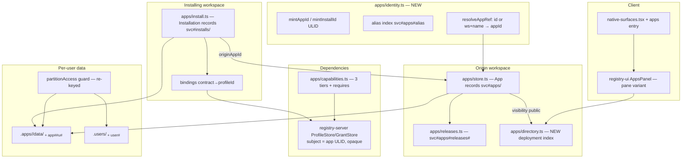

# Tech Plan — app-model-split (IW-1)

## Context

All server paths are `server/workspace/src/` in the aprovan repo (product plane post-WS-4).
Ground truth, audited 2026-08-02:

- **App today** (`apps/store.ts`): `AppManifest` stored at `svc#apps / <name>` in the owning
  workspace's record store; identity is the mutable `(workspaceId, name)` tuple; live routes
  (`routes/live-apps.ts`) serve `/apps/:workspaceId/:name`. Releases at
  `svc#apps#releases#<name>` (`apps/releases.ts`), per-user records at `app#<name>#u#<sub>`,
  per-user files at `<paths[0]>/data/<sub>` (`appDataDir`). `readApp` still rebinds legacy
  folder-shaped manifests in place.
- **Install today** (`apps/install.ts`): `svc#apps#installed / <owner>.<name>` in the
  installing workspace; only `dataScope: "workspace"` apps (`assertInstallable`); no deps,
  no config, no update; `installedScope` swaps `paths[0]` for the install prefix.
- **Capabilities** (`apps/capabilities.ts`): the strong three-tier model — auto-partitioned
  natives (`NATIVE_APP_NAMESPACES`), exact provider grants (never wildcards), exported
  workflows — validated at publish (`assertAllowedTools`) and call time
  (`providerGrantCallable`). Extend, never replace.
- **Personal** (`apps/personal.ts`): synthesized manifest over `.personal`; prefix literal
  triplicated (`personal.ts:36`, `store.ts:250`, `client/web/src/lib/private-partition.ts:17`);
  partition enforcement (`partitionAccess`/`assertPartitionAccess`, `apps/store.ts`) landed in
  `data-auth-model` and is the guard this change re-keys, not redesigns.
- **Profiles** (IW-0 dependency): `@aprovan/registry-server` `storage/types.ts` —
  `ProfileRow {name, targetKind: interface|provider, targetId, credentialId, options,
  limits}`, `GrantStore` with `GrantSubjectKind` including `"app"` (opaque subject ids),
  `grantedProfileIds` auth-time join. The workspace embeds it in-process
  (`registry-storage.ts`, `profile-grants.ts` gating).
- **Client**: `native-surfaces.tsx` has 12 surfaces, no `apps`; `SidebarApps.tsx` (344 LOC)
  owns split-pane geometry around `AppsExplorer` (`@aprovan/registry-ui/apps-panel`);
  `@aprovan/ui/apps-store` (`wire.ts`, `catalog.tsx`) synthesizes a client-side Personal
  fallback; `app-detail.tsx` special-cases `builtin`.
- **Settled** (do not reopen): ULID identity + mutable alias + ID-keyed storage +
  nuke-and-reseed; deployment directory, registry app-ignorant; Personal deleted in favor of
  opaque per-app partitions + a private per-user space (improve-findings "Settled decisions"
  1, 2, 5; refactor decision 7 for Profiles).

## Goals / Non-Goals

**Goals:**

- One identity module: ULID minting, alias index, `resolveAppRef` — every other module takes
  an `appId`/`installId` and never parses names.
- Installation as a first-class record with pin, bindings, config, lineage; the app session
  scope (`AppPaths`-shaped) derives from either an App or an Installation through one
  function.
- Dependency declaration and Profile binding ride existing seams: `assertAllowedTools` grows
  interface awareness; bindings are registry-server grants keyed by the install ULID.
- Partition guard and hidden-prefix machinery re-keyed to ID-derived roots with fewer moving
  parts than today (one root shape, no per-manifest path math).
- Client: surface registration is one entry; sidebar loses ~344 LOC; panel contract
  untouched (IW-4's baseline).

**Non-Goals:**

- No registry-server schema changes (profiles/grants consumed as published).
- No migration/dual-read of name-keyed data (nuke-and-reseed; reseed script only).
- No bundle export/import, no desktop host tiers, no panel redesign, no editor coupling.
- No change to release snapshot mechanics (content-hash pinning stays as-is).

## Architecture



Single responsibilities: **identity.ts** is the only ULID minter and the only alias reader;
**store.ts** persists Apps by id (manifest CRUD only); **install.ts** persists Installations
and computes the session scope for installed use; **capabilities.ts** stays the one place
tier rules and dependency declarations are validated and described; **directory.ts** owns the
deployment-wide index (write-through on publish/visibility change); **partition guard** stays
in `store.ts` per the data-auth-model repo convention, now over two fixed root shapes.

## Decisions

### D1: One identity module; aliases are records, resolution happens once at the edge

- **Choice**: New `apps/identity.ts`: `mintAppId()`/`mintInstallId()` (ULID — sortable,
  no coordination; add the `ulid` package), alias index records
  `svc#apps#alias / <name> → {appId}` in the owning workspace, and
  `resolveAppRef(workspaceId, ref)` accepting a ULID or a name and returning the `appId`
  (404 on miss). Service procedures and routes call `resolveAppRef` in their first line;
  every downstream signature takes ids. Rename = write new alias record + delete old, one
  manifest field update; collisions checked against the index (409).
- **Alternatives**:
  - *Keep name keys, add an id field* — rejected: storage stays rename-hostile, and every
    consumer must know which key to use; the settled decision is ID-keyed everywhere.
  - *UUIDv4* — rejected: ULIDs sort by creation time, which release listings and directory
    ordering get for free; the registry treats them as opaque either way.
  - *Alias as a manifest field scanned at resolve time* — rejected: name lookup becomes
    O(apps) per request on the hottest route (`/apps/:ws/:name`); the index record makes it
    one get.
- **Revisit if**: apps ever need deployment-global names (directory currently disambiguates
  by origin workspace) — then the alias index moves to the deployment scope.

### D2: Installation is a reference + pin, never a manifest copy

- **Choice**: `AppInstallation` stores `{installId, originAppId, originWorkspaceId, pin
  {channel} | {release}, bindings, config, editing, installedAt/By}` at
  `svc#installs / <installId>` in the installing workspace. The *effective manifest* for an
  installed session is resolved through the origin: pin → release → release's manifest/
  content hashes (releases already snapshot `manifestHash`, entry and workflow hashes —
  extend the release record to embed the manifest itself so resolution needs no live-manifest
  drift handling). Only `editing: true` copies bytes (D6).
- **Alternatives**:
  - *Copy the manifest into the install record* — rejected: the copy goes stale against the
    pinned release and creates a third source of truth; the release is already the immutable
    thing a pin means.
  - *Keep install records keyed `<owner>.<name>`* — rejected: rename-hostile and forbidden
    by settled decision 1; also prevents two sequential installs from having distinct
    identity/lineage.
- **Revisit if**: origin workspaces become deletable with installs expected to survive
  offline — then installs must snapshot release content at install time (the inert-bundle
  future would supply the mechanism).

### D3: Data partitions move to fixed ID-keyed roots (`.apps/<id>/…`), decoupled from source paths

- **Choice**: Per-user app data: file plane `.apps/<id>/data/<sub>/…`, records
  `app#<id>#u#<sub>`, where `<id>` is the app ULID (origin-hosted use) or install ULID
  (installed use). Private per-user space: `.users/<sub>/…` and `user#<sub>`. `appDataDir`
  and the hidden-prefix computation become path math over two fixed literals — no manifest
  read needed to know the partition roots (`hiddenDataPrefixes` no longer lists manifests;
  the guard matches `.apps/*/data/<sub>` and `.users/<sub>` structurally). Authored source
  stays at human paths (`entry`, `paths`), which no longer carry data.
- **Alternatives**:
  - *Keep `<paths[0]>/data/<sub>`* — rejected: partition root follows the authored folder, so
    moving `entry` (or forking) strands or re-homes user data; also keeps the
    manifest-listing dependency inside the partition guard (a cache with enforcement
    consequences, flagged in data-auth-model).
  - *Records-only (no file partitions)* — rejected: apps legitimately store per-user files
    (vfs tier exists); removing it is a capability regression out of scope.
  - *`.apps/<id>` holding source AND data* — rejected: authored source is user-facing and
    belongs at human paths with FS versioning/commits; mixing puts code under a hidden root.
- **Revisit if**: WS-5's store rework introduces true per-principal storage namespaces —
  then the path convention can collapse into the store's own partitioning.

### D4: Dependencies extend `allowedTools`' tier model with a `requires` manifest block

- **Choice**: Manifest gains `requires: [{contract, profileName?, optional?}]`. Validation
  extends the existing publish path: `assertAllowedTools` gains the declared-contract
  namespaces as a fourth acceptable form (exact `contract.procedure` entries, same
  no-wildcard rule as providers — an interface grant is a credential grant through whatever
  profile backs it). Call-time: app-session dispatch on a declared contract resolves the
  binding (D5) and dispatches through that profile; undeclared contracts stay denied.
  `apps.capabilities` gains a `dependencies` section (contract, optional, bound profile,
  fulfilled?). Provider requirements and the native tier are unchanged.
- **Alternatives**:
  - *A parallel dependency engine with its own grammar* — rejected: the three-tier model is
    the working blast-radius boundary; a second vocabulary is the "parallel system" the
    findings forbid (also breaks the Access pane's single source).
  - *Infer dependencies from `allowedTools`* — rejected: `requires` carries intent
    (optional/profileName) that an allow-list can't express, and installers need the
    requirement list *before* the app runs.
- **Revisit if**: contracts gain capability sub-sets (WS-2 catalog "optional capabilities") —
  then `requires` grows a `capabilities?: string[]` field, same shape.

### D5: Profile bindings are stored install-side and mirrored as registry-server grants

- **Choice**: `bindings: Record<contract, profileId>` lives on the Installation (and, for
  origin-hosted use, defaults resolve per call: contract → tenant `default` profile).
  Binding writes both the install record and a grant
  `grants.grant(tenant, profileId, {kind: "app", id: installId})`; unbinding revokes.
  Dispatch authorization checks the grant (the auth-time join), so revocation from the
  admin/profiles UI cuts execution without touching the install record — the binding then
  reports `fulfilled: false`. The registry-server never sees an app name or manifest.
- **Alternatives**:
  - *Bindings only as grants (no install-side record)* — rejected: grants say *may execute*,
    not *which of several granted profiles this contract uses*; the join has no slot for the
    contract key.
  - *Bindings only install-side (no grant)* — rejected: bypasses the one authorization
    surface (profiles/grants) that admins audit; "granting a profile IS the credential
    grant" is the settled framing.
- **Revisit if**: `profileGrantsAvailable()` remains 501 on a backend this must ship on —
  the interim dynamo gate; the binding then degrades to install-side-only with a loud
  capabilities warning (same pattern as `withExecutingProfiles`).

### D6: Editing off = serve from origin release; editing on = materialized fork

- **Choice**: Default installs copy nothing: the live surface and `__project__` for an
  installed app resolve the pinned release's content hashes from the *origin* workspace's FS
  (content-addressed reads already exist for release serving). `apps.configure {editing:
  true}` materializes the pinned release's files under `apps/<name>` (caller-overridable
  prefix) in the installing workspace, flips the install to serve locally, and keeps
  `originAppId`; update-from-origin thereafter requires `force: true` (overwrites local
  source) or fails 409.
- **Alternatives**:
  - *Always copy on install* — rejected: N copies of every app's source with no consumer;
    updates become file syncs instead of pointer moves; "editing off by default" would be
    cosmetic.
  - *Editable overlay over origin content* — rejected: an overlay FS is new machinery with
    merge semantics; the fork-on-first-edit copy is one write burst and reuses everything.
- **Revisit if**: origin workspaces need to revoke serving to installs (compliance) — then
  default installs must snapshot content (see D2 revisit).

### D7: The directory is a write-through index in a reserved deployment scope

- **Choice**: `apps/directory.ts` maintains `svc#directory / <appId> →
  {appId, name, workspaceId, title, description, requires, liveRelease, updatedAt}` in a
  reserved deployment tenant (`__deployment__`), written through on publish, visibility
  change, release cut, and remove. `apps.directory` (workspace service procedure) reads the
  index in one list call and merges the caller's own private apps. Registry untouched.
- **Alternatives**:
  - *Scan all tenants on read* — rejected: the record store is tenant-scoped by design; a
    cross-tenant scan per directory open is O(workspaces) and needs a tenant enumeration the
    product plane otherwise never does.
  - *Serve the directory from the registry catalog* — rejected outright by settled decision
    2 (the registry never learns about apps).
- **Revisit if**: deployments grow to where a single index scope needs pagination beyond the
  record store's list — add a cursor, not a new store.

### D8: Personal dies in one cut; workflows gain owner-scoped visibility

- **Choice**: Delete `apps/personal.ts`, every `isPersonalApp` branch in `apps/service.ts`,
  the client fallback (`@aprovan/ui/apps-store` `wire.ts`/`catalog.tsx` Personal synthesis,
  `app-detail.tsx` `builtin` branches), and the `.personal` literals. Private space:
  `.users/<sub>` + `user#<sub>` (D3) with the data-auth-model guard semantics (404, own
  visible, **no** admin override). Unbundled workflows: `workflows.list`/run visibility
  filters to `createdBy === caller` unless some app exports the workflow (registrations
  already record `createdBy`); the private space UI lists the caller's own unbundled flows.
- **Alternatives**:
  - *Keep a stored (real) Personal app per user* — rejected: manufactures N manifests to
    keep a brand the owner explicitly retired; publishing model stays confused.
  - *Workspace-visible unbundled workflows (status quo minus Personal)* — rejected: settled
    decision 5 says publishing requires an app; ambient sharing is the conflation being
    removed.
- **Revisit if**: teams need shared-but-unpublished drafts — the answer is a private app
  (visibility private is already workspace-shared), not a third visibility tier.

### D9: The apps surface is a registry entry; the sidebar keeps only rows

- **Choice**: Add `{id: "apps", title: "Apps", icon: LayoutGrid, Panel: AppsPanel}` to
  `NATIVE_SURFACES` (position: first, before Data). `AppsPanel` (registry-ui) gets a pane
  variant honoring `NativePanelProps` (transports injected as the other panels do), opening
  on list/directory with in-pane detail navigation. Delete `SidebarApps.tsx`; `ChatPage`
  renders the plain `WorkspaceSurfaces` rows (lifted into the sidebar component that hosts
  them) and drops the selection-mirroring props.
- **Alternatives**:
  - *Keep a slim sidebar apps list + the pane* — rejected: two projections of selection state
    is exactly the 344-LOC geometry being deleted; the file tree gets the space back.
  - *New bespoke AppsPanel in client/web* — rejected: `AppsExplorer`/`AppsPanel` and the
    apps-store data plane already exist and are shared with the catalog site.
- **Revisit if**: IW-4 finds select-app-on-open insufficient for deep linking — tab-key
  payloads (`native://apps/<appId>`) are the sanctioned extension, still one surface.

## Interfaces & Data

The seams below are the delegation boundaries for tasks.md streams.

**Identity** (`apps/identity.ts` — stream A owns; everyone consumes):

```ts
export type AppId = string;      // ULID
export type InstallId = string;  // ULID
export function mintAppId(): AppId;
export function mintInstallId(): InstallId;
/** ULID passthrough, or (workspaceId, name) alias lookup; throws 404 on miss. */
export function resolveAppRef(workspaceId: string, ref: string): Promise<AppId>;
export function setAlias(workspaceId: string, name: string, appId: AppId): Promise<void>; // 409 on collision
export function dropAlias(workspaceId: string, name: string): Promise<void>;
```

**App / Installation records**:

```ts
interface AppManifest {           // svc#apps / <appId>  (owning workspace)
  appId: AppId;
  name: string;                   // current alias (display; index is authoritative)
  originAppId?: AppId;            // set on forks
  title?: string; description?: string;
  entry: string; paths: string[]; // authored source only — carries no data (D3)
  visibility?: "public" | "private";    // public ⇒ directory-listed + installable
  workflows?: string[];
  requires?: AppRequirement[];    // NEW (D4)
  channels?: Record<string, string>;
  allowedTools: string[];
  roles?: AppRoles; rateLimit?: AppRateLimit;
  createdBy: string; createdAt: string; updatedAt: string;
  // dataScope: DELETED (PRD open question 1)
}
interface AppRequirement { contract: string; profileName?: string; optional?: boolean }

interface AppInstallation {       // svc#installs / <installId>  (installing workspace)
  installId: InstallId;
  originAppId: AppId; originWorkspaceId: string;
  pin: { channel: string } | { release: string };
  resolvedRelease: string | null; // last-resolved release id (update moves it)
  bindings: Record<string, string>; // contract → profileId (D5)
  config: Record<string, unknown>;
  editing: boolean;               // false ⇒ serve from origin release (D6)
  prefix?: string;                // set when editing materialized a fork
  installedBy: string; installedAt: string; updatedAt: string;
}
```

Releases: scope becomes `svc#apps#releases#<appId>`; `AppRelease` gains
`manifest: AppManifest` (embedded snapshot, D2). Session scope derivation (one function,
used by the app proxy for both modes):

```ts
/** origin-hosted: id = appId; installed: id = installId (caller workspace). */
export function appSessionScope(source: AppManifest | ResolvedInstall): AppScope;
// AppScope keeps today's AppPaths shape + { id: AppId | InstallId } for partition roots
```

**Partitions** (`apps/store.ts` guard, re-keyed — stream B):

```ts
export const APP_DATA_ROOT = ".apps";    // .apps/<id>/data/<sub>/…
export const USER_SPACE_ROOT = ".users"; // .users/<sub>/…
export function appDataDir(id: AppId | InstallId, userSub: string): string;
export function userSpaceDir(userSub: string): string;
// partitionAccess / assertPartitionAccess: same signatures & 404 semantics,
// hidden prefixes now structural (the two roots), no manifest listing involved.
```

Record scopes: `app#<id>#u#<sub>` (app tier), `user#<sub>` (private space; caller-scope
guard extends `assertCallerScope` to keep `user#` self-addressed only).

**Service surface** (`apps/service.ts` — stream C):

```
apps.publish      + requires; mints/reuses appId; writes alias + directory
apps.get/list/summary/capabilities   id-keyed; capabilities += dependencies section
apps.rename       { app, name }      alias move (409 on collision)
apps.install      { app, workspace?, pin?, bindings?, config?, prefix? }
apps.update       { install, release?, force? }   → { from, to }
apps.configure    { install, bindings?, config?, editing? }
apps.uninstall    { install, purgeData? }
apps.installed    → installations + availability
apps.directory    → deployment index + own apps
(removed: dataScope arg; personal special-cases; name-keyed install args)
```

Routes: `/apps/:workspaceId/:name` (alias-resolved) and `/apps/id/:appId` both serve the
live page; `__project__`/`__sdk__` follow the same resolution.

**Client** (stream D): `NATIVE_SURFACES` entry `{id: "apps"}`; `AppsPanel` pane variant
props stay within `NativePanelProps`; `private-partition.ts` prefix constant becomes
`USER_SPACE_ROOT`-based; apps-store `wire.ts` drops Personal synthesis and gains
`appId`/`installId` fields (id in `AppSummary`, lineage in detail).

## Risks / Trade-offs

- [Module cycle: `service-kernel` ⇄ apps modules already forced the `.personal` literal
  triplication] → `identity.ts` and the root constants import only `svc-records`/`ServiceError`;
  guard constants live beside the guard in `store.ts`; no new edges into `services.ts`.
- [Effective-manifest resolution for default installs reads the origin workspace on the hot
  path] → release records embed the manifest (D2) and are immutable → cache by
  `(originWorkspaceId, releaseId)` indefinitely.
- [Directory index drifts from truth (missed write-through)] → all writers funnel through
  `saveApp`/`removeApp`/`setChannel`, which call `directory.sync(appId)`; a reseed rebuilds
  the index from manifests.
- [Deleting `dataScope` breaks existing owner-hosted consumption assumptions in the proxy]
  → the app proxy's mode is now "has install record? installed : origin-hosted", decided by
  `appSessionScope`; tests cover both modes per namespace.
- [Workflow owner-visibility change surprises multi-member workspaces] → release-note the
  behavior (settled), and `workflows.list` gains an `exportedBy` annotation so the UI can
  explain why a flow is visible.
- [`profileGrantsAvailable()` 501 on interim dynamo backend] → D5 degrade path:
  install-side bindings only + capabilities `fulfilled: "ungated"` warning; the streams are
  ordered so everything else lands regardless.
- [IW-0 slippage (fork still in place)] → this change imports registry-server APIs already
  present in the fork with identical shapes; only `package.json` sources change under IW-0.
  Do not start stream C's binding tasks until IW-0's package swap merges.

## Rollout

1. **Reseed script first** (`scripts/bootstrap-local.ts` + a `reseed-apps` script): drop
   name-keyed app scopes, mint ids for any apps recreated by seed fixtures. Deployments are
   dev/preview scale; announce the wipe.
2. Land streams A+B (identity, records re-key, partitions, Personal deletion server-side) in
   one release — the model flip is atomic by design (no dual-read exists).
3. Land stream C (install lifecycle, dependencies, directory) — additive on the new model.
4. Land stream D (client surface + Personal-free client) — client tolerates a newer server
   (id fields are additive on the wire; the removed Personal entry renders as an empty list
   on old clients, acceptable within the same deploy train).
5. Rollback = revert + re-run reseed; no migrations exist to unwind.

## Open Questions

1. **Reserved deployment tenant id for the directory index** (`__deployment__` vs a config
   value). Recommendation: constant `__deployment__`, rejected as a caller workspace id at
   the auth layer — config adds a knob nobody turns.
2. **Should `apps.rename` be its own procedure or a `publish` side effect?** Recommendation:
   own procedure (spec'd) — renames are deliberate; `publish` matching by alias must not
   silently rename on typo.
3. **Fork editing prefix default** (`apps/<name>` vs `.apps/<installId>/src`).
   Recommendation: `apps/<name>` — materialized forks are authored source and belong at
   human paths (D3's own logic); collision prompts for a prefix.
4. **Directory pagination v1**: none (list call caps at record-store list size).
   Recommendation: accept; revisit per D7.
