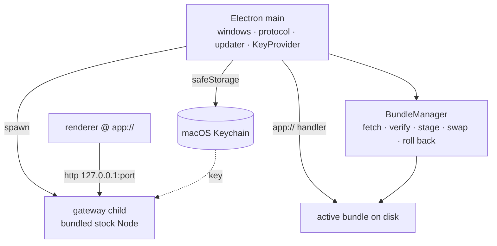

## Context

`server/workspace` builds to a `pnpm deploy` bundle that runs on stock Node 22; the Dockerfile already sets `WORKSPACE_MODE=local`, `WORKSPACE_DATA_DIR=/data`, `WORKSPACE_PORT=4000`. `client/web` is a Vite SPA using `vite-plugin-pwa` with `registerType: "autoUpdate"` and Workbox — it already fetches, caches, and self-updates.

`local-first-workspace` supplies `GatewayResolver`, the local-directory VFS provider, workspace locus, and `KeystoreCipher` with a `KeyProvider` seam awaiting a platform implementation.

Native dependency inventory for the gateway: `better-sqlite3` is a native addon; `quickjs-emscripten-core`, `@jitl/quickjs-wasmfile-debug-asyncify`, and `esbuild-wasm` are WASM; the AWS SDKs and `hono` are pure JS. `better-sqlite3` is the only ABI constraint.

## Goals / Non-Goals

**Goals:**
- Ship the container's gateway artifact unmodified inside the app.
- Atomic, verifiable, reversible renderer updates.
- Crash isolation between window and gateway.
- Supply the `KeyProvider` the credential envelope is waiting for.

**Non-Goals:**
- No native capability providers, no panel, no hotkeys, no voice.
- No App Store, no App Sandbox, no non-macOS platforms.

## Architecture



- **Electron main** — owns windows, the `app://` protocol handler, the shell updater, and the `KeyProvider` implementation. Single responsibility: host lifecycle.
- **`GatewaySupervisor`** — spawns the gateway on a free loopback port, watches health, restarts with backoff, and shuts down cleanly. Single responsibility: keep one gateway process alive and addressable.
- **`BundleManager`** — fetches, verifies, stages, activates, and rolls back renderer bundles. Single responsibility: which bundle is current.
- **`app://` handler** — serves files from the active bundle directory only. Single responsibility: map a URL to a file inside one directory.
- **Renderer** — the unmodified `client/web`, resolving its gateway at runtime.

## Decisions

### D1: Electron, not Tauri
- **Choice**: Electron.
- **Alternatives**: *Tauri* — lost because the gateway requires a Node runtime either way, so the shell-size advantage is largely cancelled by the sidecar, while WKWebView would render third-party widgets on a different engine than the website's Chromium. For a platform whose users author arbitrary JSX, "works on the site, breaks in the app" is a permanent bug class. *A native SwiftUI shell around a webview* — lost for the same engine reason, plus rewriting the client.
- **Revisit if**: widget rendering parity across engines is demonstrated to be a non-issue, and shell size or memory becomes a real complaint.

### D2: Gateway as a child process on bundled stock Node
- **Choice**: Bundle a stock Node runtime and spawn the gateway artifact the Dockerfile produces.
- **Alternatives**: *Electron `utilityProcess`* — lost because `better-sqlite3` would need rebuilding against Electron's ABI on every version bump, and the desktop gateway build would diverge from the container's. *Import gateway modules into main* — lost for the same ABI reason plus losing crash isolation. *A launchd-managed daemon* — lost because installing, updating, and uninstalling a background service is a large increase in ways a user's machine ends up broken, for a benefit (workflows running with the window closed) that inbound-deferral already removes.
- **Revisit if**: process supervision proves more costly than ABI management, or workflows need to run with the app closed.

### D3: `app://` origin with signed OTA bundles
- **Choice**: A bundle ships with the app; `BundleManager` fetches signed bundles, verifies the signature, stages, and swaps atomically, retaining the previous bundle for rollback. The renderer's origin is `app://`.
- **Alternatives**: *Load `https://aprovan.com` directly* — lost because a remote origin would be a cross-origin caller of a local gateway holding the user's API keys, the app would be dark on first run without network, and there is no rollback. *Full-app updates only* — lost because every renderer change becomes a download and a restart, which is not live hydration.
- **Revisit if**: bundle management proves more operationally costly than shipping app updates at the same cadence.

### D4: Not sandboxed; hardened, notarized, self-updating
- **Choice**: Hardened Runtime, notarized, distributed directly, with an auto-updater for the shell alongside OTA bundles for the renderer.
- **Alternatives**: *App Sandbox* — lost because arbitrary process spawning is heavily restricted, which guts the local agent execution that motivates the app. *Mac App Store* — lost because executing downloaded bundles is incompatible with it. *Two builds, sandboxed and not* — lost because it doubles the test matrix and puts a security decision in front of a user at download time.
- **Revisit if**: local agent execution moves entirely into WASM sandboxes, at which point App Sandbox becomes compatible.

### D5: Loopback port chosen at launch
- **Choice**: The supervisor binds an ephemeral loopback port and passes it to the renderer, rather than using a fixed one.
- **Alternatives**: *Fixed port 4000* — lost because it collides with a developer running the gateway by hand, which this team does constantly. *A unix domain socket* — lost because the renderer's `fetch` cannot address one without a custom protocol handler, adding a hop for no gain.
- **Revisit if**: a capability needs a stable, externally addressable endpoint.

### D6: A shell update channel is mandatory
- **Choice**: The shell auto-updates independently of bundles, and ships in v1 rather than being deferred.
- **Alternatives**: *Rely on OTA bundles and add the shell updater later* — lost because bundles cannot deliver a Chromium security patch, and this application renders third-party code in Chromium. That is the one update that cannot be slow.
- **Revisit if**: never, while third-party widgets render in the shell's engine.

## Interfaces & Data

```ts
// Main ↔ renderer, over contextBridge. Deliberately tiny: the renderer reaches
// every capability through the gateway, never through this surface.
export interface DesktopBridge {
  gatewayUrl(): Promise<string>;            // e.g. http://127.0.0.1:52431
  gatewayStatus(): Promise<GatewayStatus>;
  onGatewayStatus(cb: (s: GatewayStatus) => void): () => void;
  pickDirectory(purpose: "workspace-root"): Promise<string | undefined>;
  bundleInfo(): Promise<BundleInfo>;
}

export type GatewayStatus =
  | { state: "starting" }
  | { state: "ready"; url: string }
  | { state: "restarting"; attempt: number; lastError: string }
  | { state: "failed"; error: string };

export interface BundleInfo {
  active: { version: string; sha256: string; activatedAt: string };
  previous?: { version: string; sha256: string };
  pending?: { version: string; state: "downloading" | "verifying" | "staged" };
}
```

Bundle manifest, fetched from the update endpoint and signed detached:

```jsonc
{
  "version": "2026.08.14-1",
  "minShell": "1.4.0",          // shell refuses a bundle needing a newer host
  "url": "https://…/bundle-2026.08.14-1.tar.zst",
  "sha256": "…",
  "signature": "…"              // over the manifest, verified with a pinned public key
}
```

On-disk layout under Application Support:

```
bundles/
  active            -> 2026.08.14-1     (symlink; swap is a rename)
  previous          -> 2026.08.10-3
  2026.08.14-1/
  2026.08.10-3/
gateway-data/       (WORKSPACE_DATA_DIR)
```

Activation state machine: `downloading → verifying → staged → active`. Any failure before `active` discards the staging directory and leaves `active` untouched. A bundle that fails to boot twice consecutively triggers automatic rollback to `previous`.

## Risks / Trade-offs

- **A bundle that boots but is broken** → `minShell` gating, plus two consecutive failed boots auto-rolling back to `previous`; a boot is "successful" only once the renderer reports readiness over the bridge.
- **Signing key compromise lets an attacker push code to every install** → Key held in CI and never on a developer machine; the public key is pinned in the shell, so rotating it requires a shell update, which is the intended friction.
- **Gateway crash loop leaves a blank window** → Supervisor surfaces `restarting` and `failed` through `GatewayStatus`; the renderer renders an explicit state rather than an empty page, with the last error and a retry.
- **Stale gateway data directory after a downgrade** → Bundles are renderer-only; gateway schema travels with the shell, so a bundle rollback never rolls back schema.
- **Ephemeral port leaks to other local processes** → Bound to `127.0.0.1` only; the gateway continues to require its normal authorization, so the port is not itself an authentication boundary.
- **Bundled Node adds ~50MB** → Accepted; the alternative is ABI management and divergence from the container.

## Rollout

1. Land the Electron scaffold with a window loading the bundled renderer from `app://`, no updates, no supervision. Internal only.
2. Land `GatewaySupervisor` with ephemeral port, health, restart, and status surfacing.
3. Land the macOS `KeyProvider` over `safeStorage`, satisfying the seam `local-first-workspace` defined.
4. Land `BundleManager`: fetch, verify, stage, swap, roll back — with the update endpoint pointing at a staging channel.
5. Land signing, hardening, notarization, and the shell updater. First external build.

Rollback: steps 1–3 are pre-release. Step 4's failure mode is designed in (staging failures leave `active` untouched). Step 5 gates external distribution and can be held without affecting internal builds.

## Open Questions

None outstanding. D1–D6 were settled in the 2026-08-06 grilling session.
