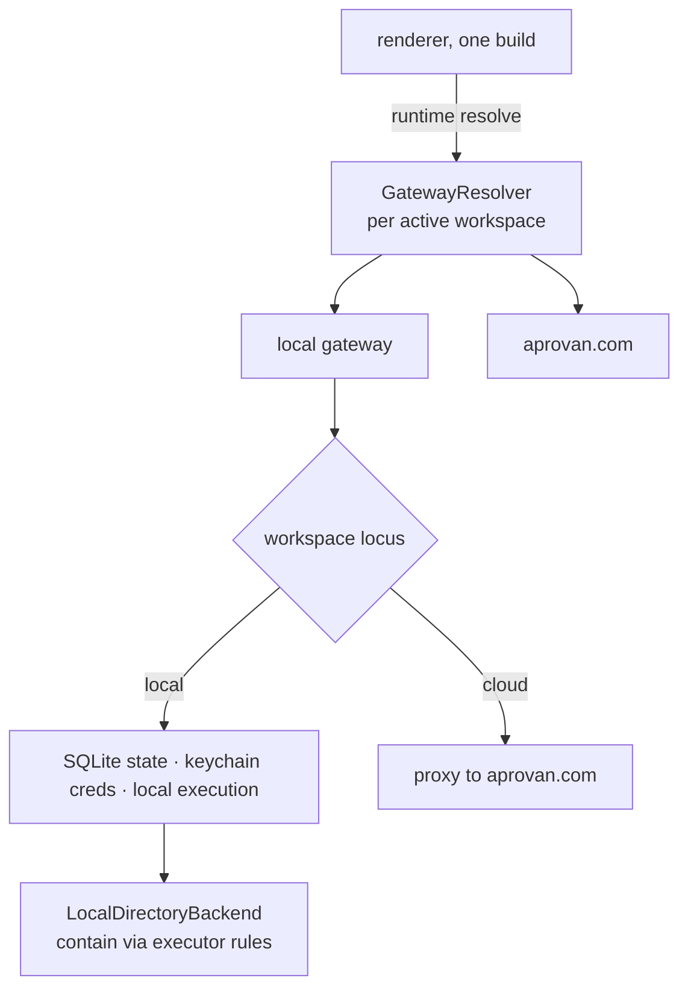

## Context

`client/web/src/lib/gateway.ts` builds a module-level `gateway` client from `GATEWAY_BASE`, itself derived from `import.meta.env["VITE_GATEWAY_URL"]` at build time. `createGatewayClient` from `@aprovan/ui/gateway` already takes `getToken` and `getWorkspaceId` as functions, so it is prepared for runtime variation everywhere except the base URL. `ACTIVE_WORKSPACE_KEY` in `features/tabs/useTabs` already tracks the active workspace in `localStorage`.

`runtime/config.ts` selects `local` or `aws` per process via `WORKSPACE_MODE`, and `storeBackend()` drives the record, credential, audit, and file stores from that one switch. `credentials/cipher.ts` in `@aprovan/registry-server` implements the `kms` / `local` / `none` envelope; `credentialCipher.ts` in the workspace re-exports it unchanged.

`packages/native/src/vfs.ts` exposes `createNativeVfs({ backend })` over a five-method `NativeVfsBackend`. `packages/native/src/host/executor.ts` holds the root-containment implementation: a lexical check rejecting `..` and absolute paths, plus a realpath check rejecting symlink escapes.

## Goals / Non-Goals

**Goals:**
- Runtime gateway resolution with no fork of `client/web`.
- Workspace locus as a first-class, persisted property that state, credential, and execution resolution all read.
- A disk-backed `NativeVfsBackend` reusing the executor's containment, not reimplementing it.
- A cipher backend seam that a host OS keystore can satisfy, testable without one.

**Non-Goals:**
- No packaging, no Electron, no platform keystore binding.
- No inbound relay, no cross-locus state movement, no cloud-workspace offline cache.

## Architecture



- **`GatewayResolver`** (new, `@aprovan/ui`) — maps the active workspace to a base URL and token source. Single responsibility: answer "which gateway, with which credentials, right now".
- **Workspace registry** (extended) — persists each workspace's locus and, for local ones, its data directory. Single responsibility: record what kind of workspace this is.
- **`LocalDirectoryBackend`** (new, `@aprovan/native`) — a `NativeVfsBackend` over a real directory. Single responsibility: map contract paths to contained disk paths.
- **`containPath`** (extracted, `@aprovan/native`) — the lexical-plus-realpath check, lifted out of `LocalExecutor` so both callers share one implementation.
- **`KeystoreCipher`** (new, `@aprovan/registry-server`) — a fourth envelope backend taking a key provider. Single responsibility: seal and unseal with a key it did not choose.

## Decisions

### D1: Gateway URL resolved at runtime, per active workspace
- **Choice**: `GATEWAY_BASE` becomes a resolver function reading the active workspace's record. Build-time `VITE_GATEWAY_URL` remains as the default for a workspace with no explicit URL, preserving today's web deployment untouched.
- **Alternatives**: *A second client build for desktop* — lost because it forks `client/web`, which is the outcome this change exists to prevent. *A global runtime toggle rather than per-workspace* — lost because a user holding a local and a cloud workspace simultaneously would have to flip a switch between tabs.
- **Revisit if**: a deployment needs more than one gateway per workspace.

### D2: Execution locus is a workspace property
- **Choice**: Every workspace carries `locus: "local" | "cloud"`, fixed at creation. State, credentials, bindings, and execution all resolve from it. A local workspace may still bind individual interfaces to cloud providers through the local gateway's outbound proxy.
- **Alternatives**:
  - *Cloud state with a local VFS binding in the same workspace* — lost because a cloud-executed workflow would resolve `vfs` to a disk it cannot reach, inbound access being deferred.
  - *A local overlay for credentials and bindings on top of a cloud workspace* — lost because a workflow's behavior would then depend on where it was started, which is not a property a user can reason about.
  - *Local replica of a cloud workspace with two-way sync* — lost because `sync` is ETL, not replication, so this is a project of its own and was ruled out of scope.
- **Revisit if**: the inbound relay is un-deferred; a cloud workspace could then legitimately reach local resources and the mixed case becomes coherent.

### D3: Local VFS reuses the executor's containment, extracted
- **Choice**: Lift the lexical-plus-realpath check out of `LocalExecutor` into a shared `containPath`, and use it from both. The registered root is the boundary, exactly as `aprovan sandbox host register --root` already documents.
- **Alternatives**: *A fresh path check in the VFS backend* — lost because two containment implementations diverge, and this one guards the filesystem. *Rely on OS sandboxing* — lost because the shell is not sandboxed, App Sandbox being incompatible with the process spawning the machine-host feature requires.
- **Revisit if**: the app ever ships sandboxed, at which point security-scoped bookmarks would supplement rather than replace this.

### D4: A fourth cipher backend, not a new credential store
- **Choice**: Add `KeystoreCipher` alongside `kms` / `local` / `none`, taking a `KeyProvider` interface. The store, schema, and every call site are untouched. This change ships an in-memory provider for tests; `desktop-shell` supplies the macOS one.
- **Alternatives**: *One keychain item per credential* — lost because the credential store would gain a backend unable to answer its existing queries (bulk list, filter by `createdBy`), and biometric prompts would land mid-workflow. *Generate a key file beside the database* — lost because the key sits next to what it protects.
- **Revisit if**: per-credential ACLs or per-credential biometric gating becomes a requirement.

### D5: No offline cache for cloud workspaces
- **Choice**: A cloud workspace requires connectivity. Local workspaces are the offline story.
- **Alternatives**: *Read-through cache of cloud platform state* — lost for now because it introduces staleness semantics before the access patterns are known; deferred rather than rejected.
- **Revisit if**: users report linked accounts being unusable offline often enough to justify designing invalidation.

## Interfaces & Data

```ts
// @aprovan/ui — the client-side seam.
export interface WorkspaceEndpoint {
  workspaceId: string;
  locus: "local" | "cloud";
  baseUrl: string;
  getToken(): string | undefined;
}
export interface GatewayResolver {
  active(): WorkspaceEndpoint | undefined;
  forWorkspace(id: string): WorkspaceEndpoint | undefined;
  list(): WorkspaceEndpoint[];
}
```

```ts
// @aprovan/native — the disk backend seam.
export interface LocalDirectoryOptions {
  /** The containment boundary. Nothing outside it is reachable. */
  root: string;
}
export function createLocalDirectoryBackend(o: LocalDirectoryOptions): NativeVfsBackend;

/** Extracted from LocalExecutor; the single containment implementation. */
export function containPath(root: string, relative: string): Promise<string>;
```

```ts
// @aprovan/registry-server — the cipher seam.
export interface KeyProvider {
  /** 32 bytes. May prompt the user; callers must tolerate latency. */
  getKey(): Promise<Buffer>;
  readonly id: string;
}
export class KeystoreCipher implements CredentialCipher {
  readonly backend: "keystore";
  constructor(provider: KeyProvider);
}
```

Workspace record gains: `locus: "local" | "cloud"`, and for local workspaces `dataDir: string` and `vfsRoot?: string`. Locus is write-once at creation.

`vfs` compat gains:

```json
{ "provider": "local-directory", "label": "Local directory",
  "module": "local-directory", "moduleSpecifier": "@aprovan/native",
  "credentialless": true }
```

## Risks / Trade-offs

- **Extracting `containPath` regresses executor containment** → Extract with the existing tests moved first and passing unchanged before either caller is rewired; add adversarial cases (`..` chains, absolute paths, symlink to parent, symlink created between check and use).
- **Runtime gateway resolution breaks the deployed website** → The build-time value remains the default for workspaces with no explicit URL, so the web path is unchanged; assert this with a test that resolves with no workspace record present.
- **A user points the VFS root at their home directory and an agent writes broadly** → Containment is honest about being the boundary the user chose; the picker defaults to a subdirectory and the root is displayed wherever the binding is shown.
- **Locus being write-once frustrates users who chose wrong** → Documented at creation; an export/import path is the future answer, deliberately not designed here.
- **`KeyProvider.getKey()` may prompt and therefore block** → The interface is async by construction, and the cipher caches the unsealed key for the process lifetime so a prompt happens at most once per launch.

## Rollout

1. Extract `containPath` with tests moved and green. No behavior change.
2. Land `createLocalDirectoryBackend` and its compat entry. Interface bindable; nothing binds it yet.
3. Land `KeystoreCipher` with the in-memory provider. Envelope selection unchanged unless a provider is supplied.
4. Land the workspace `locus` field, defaulting existing workspaces to `cloud`, so no current deployment changes behavior.
5. Land `GatewayResolver` and rewire `client/web/src/lib/gateway.ts`, keeping the build-time default.

Rollback: steps 1–3 are additive. Step 4 is an additive column with a safe default. Step 5 is the only client-visible change and reverts to the module-level constant.

## Open Questions

None outstanding. D1–D5 were settled in the 2026-08-06 grilling session.
