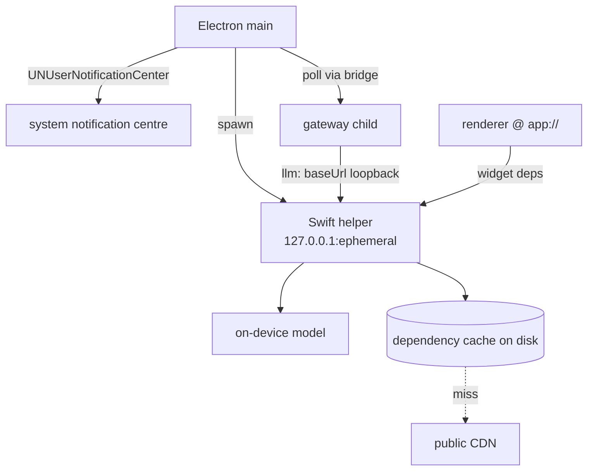

## Context

`registry-server/src/catalog/default.ts` holds `CHAT_PROVIDERS`, where every entry is `module: "openai"` distinguished by `baseUrl` and `defaultModel`, with `LLM_<ID>_BASE_URL` and `LLM_<ID>_DEFAULT_MODEL` environment overrides already honored. The `llm` contract's `compat.json` declares `compatSource: "chat-provider-registry"`, so that table *is* the compat list.

`compat.json` entries support `unavailable` (a string reason) — used today by the `agent` contract for unbuilt adapters — and `credentialless` for implementations needing no workspace credential.

`notifications/service.ts` is a platform plugin backed by the record store, with `category`, `choices[]` (each `{namespace, procedure, args}`, validated at emit time against the emitting app's callable surface), `widget`, and per-user `seenBy`. `client/web/src/lib/notifications.ts` polls; there is no push channel and no notification topic on the realtime broker.

`packages/compiler/src/cdn-config.ts` defines `DEFAULT_CDN_BASE = "https://esm.sh"` with a `setCdnBaseUrl()` seam consumed by image loading, CDN transforms, and embedded mounting.

`desktop-shell` supplies the process supervision pattern, the ephemeral-loopback-port convention, and Hardened Runtime entitlement handling.

## Goals / Non-Goals

**Goals:**
- One native surface, signed once, reached over loopback.
- On-device inference with zero contract change.
- Offline widget rendering.
- Notifications in the system centre with working actions.

**Non-Goals:**
- No streaming provider, no speech, no TTS.
- No notification delivery contract, no push channel.
- No modification of the `llm` contract or of notification emit-time validation.

## Architecture



- **Swift helper** — a signed binary hosting operating-system capability behind loopback HTTP. Single responsibility: expose native capability as HTTP. It holds no workspace state and makes no policy decisions.
- **OpenAI-compatible endpoint** in the helper — translates chat-completion requests to the on-device model. Single responsibility: speak the OpenAI chat surface over a native model.
- **Dependency cache** in the helper — serves widget dependencies from disk, fetching through on a miss. Single responsibility: resolve a package specifier to bytes.
- **Notification mirror** in Electron main — subscribes to the feed and raises system notifications, dispatching choices back through the gateway. Single responsibility: reflect the feed into the OS.
- **Availability reporter** — one endpoint the gateway reads to learn which native capabilities are present, and why any is not.

## Decisions

### D1: One Swift helper over loopback, not native addons in the gateway
- **Choice**: A single signed Swift binary exposing every native capability as loopback HTTP. The gateway reaches it as it reaches any remote provider.
- **Alternatives**: *Native addons loaded into the gateway* — lost because the gateway must stay the container's artifact; a macOS-only addon reintroduces exactly the divergence the gateway process model was chosen to avoid. *Spawning a CLI per call* — lost because there is no place to hold session state and per-call startup dominates. *A helper per capability* — lost because each would need separate signing, entitlements, and supervision for no isolation benefit, all being the same trust domain.
- **Revisit if**: a capability needs throughput where a loopback hop is measurably the constraint, or one capability needs an entitlement the others should not have.

### D2: On-device model as an OpenAI-compatible provider
- **Choice**: The helper serves `/v1/chat/completions` and `/v1/models`; the model is registered as one `CHAT_PROVIDERS` entry with a loopback `baseUrl` and `credentialless: true`.
- **Alternatives**: *Extend the `llm` contract with a native transport* — lost because the contract is explicitly for OpenAI-compatible chat providers and this needs nothing more. *A distinct `local-llm` interface* — lost because callers would have to choose between interfaces rather than binding one, and every widget calling `tools.llm` would miss it.
- **Revisit if**: on-device capability diverges from the OpenAI chat surface in a way translation cannot bridge — structured output or tool calling with materially different semantics.

### D3: Availability has three states, and the compat schema gains one field
- **Choice**: The helper reports each capability as `available`, `unsupported` (OS or hardware), or `disabled` (present but switched off by the user). `unavailable` in `compat.json` stays a static build-time reason; a new optional `availabilityProbe` marks entries whose availability is determined at runtime.
- **Alternatives**: *Reuse `unavailable` for all three* — lost because it is a static string and cannot distinguish "your Mac cannot" from "you turned it off", which are different user actions. *Hide the provider when unavailable* — lost because a user who enables the feature would have no way to discover the provider existed.
- **Revisit if**: a second runtime-probed provider needs richer state than three values.

### D4: Notifications are a rendering surface, not a contract
- **Choice**: Electron main mirrors the existing feed into `UNUserNotificationCenter`, mapping each `choice` to a notification action that dispatches the same call the in-app feed dispatches.
- **Alternatives**: *A bindable `notify` delivery interface* — deferred rather than rejected; attractive as a cheap second native contract, but conflating the durable inbox with a delivery channel on the first pass is not. *Delivery channels inside the notifications service* — lost because it offers no third-party fulfilment and proves nothing about the contract model.
- **Revisit if**: delivery is wanted to destinations other than this machine — a phone, a chat workspace — at which point the contract becomes the right shape.

### D5: Fetch-through dependency cache with a seed set
- **Choice**: `setCdnBaseUrl()` points at the helper, which serves from disk and fetches through on a miss. A seed set covering the default workspace's widget dependencies ships with the app.
- **Alternatives**: *A fixed curated set* — lost because adding a dependency would require an app release, constraining widget authors to the shipping cadence. *Compile dependencies into each widget* — lost because it is a real compiler change, inflates every artifact, and eliminates sharing. *Accept online-only widgets* — lost because it silently undoes the guaranteed-offline renderer.
- **Revisit if**: cache size becomes a complaint, or supply-chain control argues for a fixed set after all.

## Interfaces & Data

Helper HTTP surface, all on `127.0.0.1:<ephemeral>`:

| Method | Path | Purpose |
|---|---|---|
| GET | `/availability` | capability states, read by the gateway |
| POST | `/v1/chat/completions` | OpenAI-compatible, streaming and non-streaming |
| GET | `/v1/models` | OpenAI-compatible model list |
| GET | `/esm/*` | widget dependency resolution |
| GET | `/health` | liveness for the supervisor |

```ts
export type CapabilityState =
  | { state: "available" }
  | { state: "unsupported"; reason: string }   // OS or hardware
  | { state: "disabled";    reason: string; remedy: string }; // user can fix

export interface AvailabilityReport {
  helperVersion: string;
  capabilities: Record<string, CapabilityState>;  // e.g. { llm: …, esm: … }
}
```

`compat.json` gains one optional field, consumed by the catalog loader:

```jsonc
{ "provider": "apple", "label": "Apple on-device", "module": "openai",
  "credentialless": true, "availabilityProbe": "helper:llm" }
```

Notification mapping — no new server surface:

```
NotificationRecord.title        → UNMutableNotificationContent.title
NotificationRecord.body         → .body
NotificationChoice[i].label     → UNNotificationAction[i].title
NotificationChoice[i].call      → dispatched through the gateway on activation,
                                  by the same path the in-app feed uses
NotificationRecord.id           → notification identifier, so a seen item is withdrawn
```

Widget dependency resolution keeps the existing specifier grammar; the helper's `/esm/*` path mirrors the public CDN's, so `setCdnBaseUrl()` is the only change on the compiler side.

## Risks / Trade-offs

- **Helper crash silently removes capability** → Supervised like the gateway, with `/availability` re-read on restart; a bound provider whose capability is absent fails loudly rather than degrading.
- **A widget's first use of a novel dependency fails offline** → Named in the PRD as a known limit; the seed set covers the common case and the cache covers everything seen once. Not solvable without a fixed set.
- **Cache serving a stale or wrong version of a package** → Cache keyed by the fully resolved specifier including version, never by bare package name; a miss is a fetch, never a nearest-match.
- **System notification actions dispatching calls the user did not intend** → The emit-time validation against the app's callable surface is unchanged and remains the authority; the surface adds no new dispatch path.
- **Loopback endpoint reachable by other local processes** → Bound to loopback, ephemeral port, and the helper exposes no capability that is not already available to any process running as that user. Deliberately not treated as an authentication boundary.
- **`availabilityProbe` becomes a general plugin mechanism by accident** → Kept to a fixed enumerated set of probe identifiers rather than an open string executed by the loader.

## Rollout

1. Land the helper with `/health` and `/availability` only, supervised by the shell. No provider yet.
2. Land `/esm/*` and point `setCdnBaseUrl()` at it; ship the seed set. Widgets render offline.
3. Land `/v1/chat/completions` and `/v1/models`, plus the `CHAT_PROVIDERS` entry and `availabilityProbe`. The on-device model becomes bindable.
4. Land the notification mirror.

Rollback: each step is additive and independently revertible. Reverting step 2 restores the public CDN default; reverting step 3 removes one catalog entry; reverting step 4 leaves the in-app feed untouched.

## Open Questions

None outstanding. D1–D5 were settled in the 2026-08-06 grilling session.
