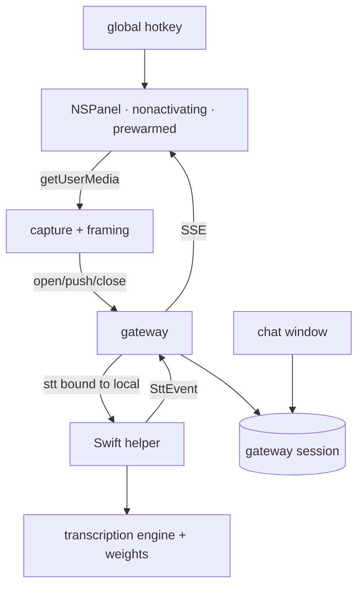

## Context

`utdk-streaming-sessions` provides `SessionManager`, `StreamingSessionDriver`, and the `open` / SSE / `push` / `close` wire surface. `stt-contract` provides `@utdk/stt` — `SttCapabilities`, `SttOpenArgs`, `SttPushMessage`, `SttEvent`, `SttResult`, the required `pcm_s16le_16k` encoding — and a remote provider proving the shape. `macos-native-providers` provides the supervised Swift helper on loopback, its availability reporting, and the signing and entitlement machinery. `desktop-shell` provides the application, its bundle channel, and its update channels.

The transcription library is a C library on a GGUF/ggml runtime with Swift bindings and Metal acceleration on Apple Silicon, supporting both streaming and batch, with pre-built weights published for many model families. It does not fetch weights itself.

`packages/compiler/src/mount/iframe.ts` mounts widgets in sandboxed iframes through a `ParentBridge`, held in a module-level `sharedBridge` — one per JavaScript realm.

## Goals / Non-Goals

**Goals:**
- On-device transcription behind the existing contract, with no contract change.
- Capture in the renderer, so local and remote providers stay symmetric.
- A floating surface that does not steal focus and does not spawn on demand.
- Continuity between panel and chat without unifying their realms.

**Non-Goals:**
- No TTS, no wake word, no always-on listening.
- No change to `stt`, to the session mechanism, or to the widget mount layer's realm model.

## Architecture



- **`NSPanel` host** — a non-activating floating window, created at launch and shown or hidden by the hotkey. Single responsibility: be instantly visible without taking focus.
- **Capture module** (renderer) — acquires the microphone, resamples to the contract's required format, frames into fixed chunks, and pushes. Single responsibility: turn a microphone into contract-shaped messages.
- **Local STT driver** (helper) — implements `StreamingSessionDriver` over the transcription engine. Single responsibility: adapt the engine to the contract.
- **Model store** (helper) — resolves a model identifier to weights on disk, fetching on request. Single responsibility: which weights, where.
- **Gateway session** — holds anything shared between panel and chat. Single responsibility: continuity across realms.

## Decisions

### D1: Capture in the renderer, never in the provider
- **Choice**: The renderer captures via `getUserMedia`, resamples to `pcm_s16le_16k`, frames at a fixed cadence, and pushes through the contract. The local provider receives audio exactly as the remote one does.
- **Alternatives**: *Capture natively in the helper* — lost because a remote vendor could not fulfil a contract that opens a microphone, making `stt` locally-implementable-only and forfeiting the third-party bar. *Capture in Electron main* — lost for the same reason plus discarding the browser's built-in echo cancellation and noise suppression.
- **Revisit if**: browser capture proves inadequate for a quality bar native capture would meet, in which case capture becomes its own contract rather than moving into this one.

### D2: A small default model bundled; the rest fetched
- **Choice**: One compact streaming model ships inside the application so voice works on first launch with no network and no account. Larger, multilingual, and diarization-capable models are fetched on request from an endpoint under our control. Default model id and licence: [ADR 0001](../../../docs/decisions/0001-bundle-whisper-tiny-en-stt.md) (`whisper-tiny.en`, MIT).
- **Alternatives**: *Fetch everything from the public model host on first use* — lost because a core feature would depend on a third party's uptime and rate limits, and local-only mode would not be genuinely offline. *Fetch everything from our own endpoint* — lost for the same offline-first-run reason. *Weights as workspace artifacts* — lost because it needs the most machinery and a first run would require a workspace before the application could listen.
- **Revisit if**: a future default changes family or licence (supersede ADR 0001), or installer size forces a quantized artifact.

### D3: Diarization is a model choice reported as a capability
- **Choice**: The provider's declared capabilities depend on which model is loaded. Diarization is reported true only when a diarization-capable model is present, and requesting it otherwise fails at session open.
- **Alternatives**: *Always report diarization and run a second model transparently* — lost because it silently doubles compute and latency, and hides a large behavioral difference. *Never support diarization locally* — lost because it is a stated interest and the engine supports it.
- **Revisit if**: running a diarizer alongside a transcriber proves cheap enough to be the default rather than a choice.

### D4: One persistent, pre-warmed, non-activating panel
- **Choice**: A single `NSPanel` created at launch, hidden until the hotkey shows it, hosting floating widgets as iframes. Non-activating, so summoning it does not take focus from the user's current application.
- **Alternatives**: *Spawn a window per invocation* — lost because spawn latency destroys the interaction; instant is the feature. *Make the panel a mode of the chat window* — lost because it cannot float convincingly over other applications and would die with the window. *A window per widget* — lost for the same latency reason, plus multiplying bridges.
- **Revisit if**: resident memory becomes a real complaint, at which case the panel could be released after a long idle and re-warmed in the background.

### D5: Continuity lives in gateway sessions, not in the bridge
- **Choice**: Panel and chat are separate realms with separate bridges. Anything shared — conversation context, the active session — lives in a gateway session addressed by id.
- **Alternatives**: *Unify the realms* — lost because separate windows are separate renderers; there is no realm to unify without abandoning a real floating panel. *Share via the bridge singleton* — lost because it is per-realm by construction. *Synchronise state across bridges over IPC* — lost because it makes a distributed-state problem out of something the gateway already models.
- **Revisit if**: a widget needs shared state too large or too chatty to round-trip.

### D6: Explicit start and end of capture
- **Choice**: Capture begins on the hotkey and ends on release, on an explicit stop, or on provider-signalled end of speech where the capability is declared. No wake word, no always-on listening.
- **Alternatives**: *Wake word* — lost because always-on listening is a substantial privacy commitment that should be its own decision with its own consent flow.
- **Revisit if**: users ask for hands-free operation and are willing to make that trade explicitly.

## Interfaces & Data

```ts
// Renderer capture module.
export interface CaptureOptions {
  /** Frame size pushed per message. Default 100ms. */
  frameMs?: number;
  /** Browser audio processing. Defaults on. */
  echoCancellation?: boolean;
  noiseSuppression?: boolean;
}
export interface CaptureHandle {
  readonly sessionId: string;
  stop(): Promise<SttResult>;
  cancel(): Promise<void>;
  onEvent(cb: (e: SttEvent) => void): () => void;
}
export function startCapture(o?: CaptureOptions): Promise<CaptureHandle>;
```

Helper model-store surface, alongside the endpoints `macos-native-providers` established:

| Method | Path | Purpose |
|---|---|---|
| GET | `/stt/models` | installed and available models, with capabilities and sizes |
| POST | `/stt/models/:id/install` | fetch and verify weights; progress over SSE |
| DELETE | `/stt/models/:id` | remove non-bundled weights |

```ts
export interface SttModelInfo {
  id: string;
  bundled: boolean;
  installed: boolean;
  sizeBytes: number;
  capabilities: Pick<SttCapabilities, "diarization" | "wordTimestamps" | "vad" | "languages">;
}
```

Main-to-renderer bridge additions, kept as narrow as the existing surface:

```ts
export interface PanelBridge {
  onSummon(cb: (context: { hotkey: string }) => void): () => void;
  hidePanel(): void;
  resizePanel(height: number): void;    // content-driven height, width fixed
}
```

Continuity: the panel opens or resumes a gateway session and stores its id in the workspace's session list, so chat can attach to the same session by id. No state crosses the bridge boundary.

## Risks / Trade-offs

- **Model licence forbids bundling** → Named as blocking in the PRD; licences must be checked before the default is fixed. Fallback is fetch-on-first-use with an explicit first-run download step.
- **Panel resident memory** → D4's revisit condition; measured before considering release-and-rewarm, since correctness of the instant-summon property matters more than the memory.
- **Microphone permission denied** → Capture reports it distinctly from a device error; the panel stays usable for typed input, so a denial degrades the feature rather than the surface.
- **First transcription slow while the model loads** → Load the bundled model at helper start rather than at first session, trading a little idle memory for the instant-response property the interaction depends on.
- **Audio silently leaving the machine when a remote provider is bound** → The panel displays which provider is bound during capture; the contract makes this a deliberate, visible configuration rather than a hidden one.
- **A widget assuming it is in the chat surface** → Widgets receive the same mount contract in both; anything surface-specific is a bug in the widget, and the mount tests cover both hosts.
- **Global hotkey conflicting with another application** → The binding is user-configurable, and a registration failure is reported at startup rather than silently producing a dead key.

## Rollout

1. Land the model store and the bundled default in the helper; `/stt/models` works, nothing binds it.
2. Land the local STT driver and its compat entry with `credentialless: true`. The interface becomes bindable to the local provider; capture does not exist yet, so it is exercised by tests only.
3. Land renderer capture and wire it into the existing chat surface. Voice works in chat, with no panel.
4. Land the panel, the hotkey, and session continuity.

Rollback: each step is additive. Step 3 delivers usable voice without the panel, so step 4 can be held without losing the feature.

## Open Questions

Resolved — see [ADR 0001](../../../docs/decisions/0001-bundle-whisper-tiny-en-stt.md): bundle `whisper-tiny.en` (MIT); no fetch-on-first-run fallback required for the default.
