# Tech Plan — contracts-and-catalog

## Context

All work is in the **registry repo** (`/Users/jacob/Documents/Code/AprovanLabs/registry`).

Current state (verified against source):

- Five contract packages live *inside* the generated catalogue at
  `packages/utdk/{sql,llm,sandbox,vcs,agent}/`, kept out of the catalogue build by four
  hand-aligned exclusion lists: `SKIP_TOP_DIRS` in `packages/utdk/build.mjs`,
  `skippedTopDirs` in `packages/utdk/copy-assets.mjs`, `exclude` in
  `packages/utdk/tsconfig.json`, and the skip-set in `providersOnDisk`
  (`packages/bundler/src/render.ts`). The skips are top-level-only because a contract name
  is also a legal suite segment (`github/vcs` is the GitHub adapter for `@utdk/vcs`).
- `sandbox`, `vcs`, `agent`, `llm` manifests carry `"utdk": { "contract": ... }`; `sql`
  does not. `sql` and `llm` lack `publishConfig`/license.
- The CI publish list (`.github/workflows/publish.yml`) covers `@utdk/common @utdk/sql
  @utdk/llm @utdk/mcp-core utdk` — `@utdk/sandbox`, `@utdk/agent`, `@utdk/vcs` are missing.
- `splitProviderName` (`packages/bundler/src/provider.ts`) splits names on `[./]`, so a
  provider named for the `synthetic.new` hostname would decompose into `synthetic/new`.
  `scripts/sources/apis-guru.ts` `domainToSlug` takes the first domain label and comments
  that segments "must avoid '.' and '/'" — naming policy is smeared across two files.
- The interface compat catalog is hardcoded in `apps/workspace/src/interfaces.ts`
  `listInterfaces()` (~190 lines of `InterfaceDef` literals; `llm`'s list is generated from
  `src/llm.ts`). WS-3 extracts the workspace; WS-4 moves it — the catalog must move to the
  keep-set first.
- The bundler webhook-intel phase writes per-provider `webhooks.json`
  (`packages/bundler/src/phases/webhookIntel.ts`); the catalog site already reads it and
  `auth.json` (`apps/registry/src/lib/registry.ts`). `authIntel.ts` hand-mirrors the
  gateway credential types ("Mirrors the gateway credential types").
- The catalog site (`apps/registry`, Astro, `@aprovan/registry-web`) walks `packages/utdk`
  off disk at build time and throws if missing. It has provider pages but no interface
  representation.
- `pnpm-workspace.yaml` globs `packages/**`, so any new `packages/contracts/<name>` is a
  workspace package with zero config.
- The credential-free generation flow `pnpm --filter @utdk/e2e test:generation`
  (280 assertions) is the CI merge gate.

Constraints: Decision record 6 (contracts v1) is settled. npm package names are stable;
only disk locations change. `@utdk/common` cannot move (the `utdk` root package's
`client.ts` imports `./common/telemetry.js` relatively). WS-3 consumes this change's
outputs; nothing here may depend on WS-3.

## Goals / Non-Goals

**Goals:**

- One physical home for contracts (`packages/contracts/`) with zero exclusion lists.
- Four new contract packages whose surfaces are fully specified here — an implementer
  builds from this document without asking.
- One naming-authority module; provider identity never contains dots.
- Compat catalog as validated data with a published loader; `listInterfaces()` becomes a
  consumer.
- Catalog site renders interfaces and provider-implements from the same data.
- Publish list complete; `authIntel` types imported, not mirrored.

**Non-Goals:**

- No dispatch/Profiles/credential work (WS-3). No workspace extraction (WS-3/WS-4). No new
  provider adapter implementations. No changes to the `utdk` root package's export-map
  strategy beyond removing contract skips.

## Architecture

```mermaid
graph TD
    subgraph contracts ["packages/contracts/ (new home)"]
        SQL["@utdk/sql"]
        LLM["@utdk/llm"]
        SBX["@utdk/sandbox"]
        VCS["@utdk/vcs + compat.json"]
        AGT["@utdk/agent + compat.json"]
        KV["@utdk/keyvalue (new)"]
        EV["@utdk/events (new)"]
        VFS["@utdk/vfs (new)"]
        TEL["@utdk/telemetry (new)"]
    end

    COMMON["@utdk/common<br/>(stays in packages/utdk/common)<br/>credential types · compat loader<br/>webhook-metadata types"]

    subgraph bundler ["packages/bundler"]
        NAMING["naming.ts (new)<br/>hostname→package authority"]
        PROV["provider.ts<br/>splitProviderName (slash-only)"]
        AUTHI["phases/authIntel.ts<br/>imports @utdk/common types"]
        WHI["phases/webhookIntel.ts<br/>→ webhooks.json (metadata)"]
        RENDER["render.ts<br/>providersOnDisk (no contract skips)"]
    end

    INGEST["scripts/sources/apis-guru.ts"] --> NAMING
    NAMING --> PROV
    AUTHI --> COMMON

    subgraph catalogue ["packages/utdk (generated catalogue only)"]
        GEN["49 generated providers<br/>+ suite adapters (github/vcs)"]
    end

    WS["apps/workspace<br/>interfaces.ts listInterfaces()"] -->|loads via| COMMON
    WS -->|reads| VCS
    SITE["apps/registry (Astro)<br/>interface pages · implements ·<br/>webhook metadata sections"] -->|reads off disk| contracts
    SITE -->|reads| GEN
    CI[".github/workflows/publish.yml<br/>all 9 contracts + common + utdk"] --> contracts
```



Component responsibilities:

- **`packages/contracts/<name>/`** — one contract each: types, error class, validation
  helpers, tool-entry factory, tests, `AUDIT.md`, optional `compat.json`.
- **`@utdk/common`** — cross-cutting published types: credential-type vocabulary
  (`./auth`), compat-catalog loader + schema (`./compat`, new), webhook-metadata types
  (`./webhooks`, new — types only, no LLM machinery).
- **`packages/bundler/src/naming.ts`** — the hostname→package authority (new; single
  source of naming truth, used by ingest and exposed for tests).
- **`packages/bundler/src/provider.ts`** — provider-name mechanics; splitting on `/` only.
- **`apps/registry`** — renders contracts/compat/webhook-metadata off disk; no data of its
  own.
- **`apps/workspace/src/interfaces.ts`** — becomes a thin consumer of the compat loader
  (full extraction deferred to WS-3).

## Decisions

### D1: Contracts move to `packages/contracts/<name>/`

- **Choice**: One flat sibling directory of `packages/utdk`, npm names unchanged.
- **Alternatives**:
  - *`packages/utdk-<name>/` flat in `packages/`* — no grouping; nine more top-level
    entries in an already-busy `packages/`; enumerating "all contracts" needs the manifest
    marker plus a glob over everything.
  - *Stay in `packages/utdk/<name>/` and keep the lists* — the lists are the disease
    (Decision 6 explicitly kills them); already nearly shipped a broken `./agent` subpath.
  - *A separate `contracts/` root next to `packages/`* — requires touching
    `pnpm-workspace.yaml` and every tool that assumes packages live under `packages/`.
- **Revisit if**: WS-4 moves contract ownership out of the registry repo (nothing in the
  decision record suggests it will).

### D2: Contract enumeration keys off the `utdk.contract` manifest marker

- **Choice**: Directory location is a convention; the marker is the machine-readable truth.
  The catalog site and the compat loader enumerate `packages/contracts/*/package.json` and
  require the marker; `sql` gains the marker it is missing.
- **Alternatives**: *Directory name as truth* — silently breaks when a non-contract helper
  package lands in the directory; *a central contracts manifest file* — a fifth list to
  drift, precisely what this change deletes.
- **Revisit if**: contracts ever need non-package metadata a manifest field can't carry.

### D3: Naming authority is a data-first map with a `.com` default rule

- **Choice**: `naming.ts` exports `HOSTNAME_PACKAGE_MAP: Record<hostname, providerName>`
  plus `resolveProviderNameFromHostname(hostname)`: explicit entry → its name; else if
  hostname is `x.com` → `x`; `s.v.com` → `v/s`; else full-domain dash slug as ONE segment
  (`synthetic.new → synthetic-new`). `splitProviderName` drops `.` from its split set.
- **Alternatives**:
  - *Keep dot-splitting and sanitize at ingest only* (status quo) — the invariant lives in
    a comment in `apis-guru.ts`; any future ingest source or hand-edit of `registry.json`
    reintroduces the bug.
  - *Full public-suffix-list parsing* — correct for `co.uk` etc., but a dependency and a
    data file for ~50 curated providers; explicit entries cover the exceptions we actually
    have.
  - *Encode dots as a distinct separator with escaping* — spreads escaping logic through
    every consumer (exports map, dispatch, catalog paths) for zero user benefit.
- **Revisit if**: ingest scales past hand-curation to bulk domains where `co.uk`-class
  suffixes appear often enough that the explicit map becomes a burden.

### D4: `compat.json` lives in the contract package; loader lives in `@utdk/common`

- **Choice**: Data travels with the contract it describes (published in the npm tarball);
  one schema-validating loader is shared by workspace and catalog site.
- **Alternatives**:
  - *Central `data/interfaces.json`* — one more registry-wide file whose entries and the
    contract packages can drift; per-contract ownership matches per-contract auditing.
  - *Keep TS literals, export them from each contract package* — code, not data: the
    catalog site (Astro build) and future non-TS consumers would need to execute contract
    packages to know what implements them; JSON is inert and diffable.
  - *Loader in each contract package* — nine copies of validation; `@utdk/common` already
    is the cross-cutting home.
- **Revisit if**: WS-3 needs runtime-mutable compat (e.g. tenant-installed adapters) —
  then `compat.json` becomes the seed, not the store.

### D5: `llm` compat stays generated, via `compatSource` indirection

- **Choice**: `packages/contracts/llm/compat.json` carries interface metadata plus
  `"compatSource": "chat-provider-registry"`; `listInterfaces()` keeps composing entries
  from `listLlmProviders()`. The other four externalize fully.
- **Alternatives**: *Snapshot the llm list into JSON* — the compat list IS the chat-provider
  registry by design ("stay in lockstep"); a snapshot breaks that invariant the first time
  a chat provider is added.
- **Revisit if**: WS-3 relocates the chat-provider registry itself into data.

### D6: `@utdk/vfs` is a file-plane driver contract only

- **Choice**: read/write/delete/list/stat over path strings, with etag-based conditional
  writes and base64 for binary. No sessions, overlays, mounts, versions, or watch — those
  are product semantics (Decision 6) built *on top of* whatever implements this contract.
- **Alternatives**: *Include watch/subscribe* — every candidate backend (S3-compatible,
  local FS, WebDAV) diverges wildly on change notification; it would be the first
  operation an implementer cannot build. *Model directories as first-class resources* —
  object stores have no directories; `list` with prefix + delimiter-derived `kind` covers
  the UI need without forcing a hierarchy the backend lacks.
- **Revisit if**: the shape audit (S3-compat, local FS, WebDAV) shows conditional writes
  (`ifMatch`) unimplementable on a target backend.

### D7: `@utdk/telemetry` adopts OTLP/HTTP JSON shapes verbatim

- **Choice**: One `export` operation taking `{ resourceSpans?, resourceLogs? }` in
  OTLP/HTTP JSON encoding (subset: the fields listed in Interfaces & Data). Attribution
  (`tenant`, `principal`, `source` — Decision 9) rides resource attributes under an
  `aprovan.*` key prefix. Query/read stays out of the contract (native, reads the
  workspace's own store — per `docs/interfaces.md`).
- **Alternatives**: *Bespoke span/log shapes* — every vendor backend already speaks OTLP;
  inventing a shape buys a translation layer at both ends. *Full OTLP proto including
  metrics v1* — metrics' seven data-point families triple the surface; Decision 9's planes
  need spans and logs first (metrics reserved as an optional field, rejected if present
  and unsupported).
- **Revisit if**: the first real exporter audit (OTLP collector, Datadog, Honeycomb)
  cannot round-trip the subset.

### D8: Shape audits are paper audits recorded as `AUDIT.md`, gating a 0.2.0 freeze

- **Choice**: Per contract, map each operation onto 2–3 named real vendor APIs
  (documentation-level), record findings and surface changes in
  `packages/contracts/<name>/AUDIT.md`, then bump to 0.2.0. Audit targets:
  `sql` → MySQL (PlanetScale HTTP), BigQuery, DuckDB(MotherDuck); `llm` → Anthropic
  native, Gemini, OpenRouter; `sandbox` → E2B, Modal, Daytona; `vcs` → GitLab, Bitbucket,
  Gitea; `agent` → OpenAI Assistants, Claude Agent SDK harness, relayed harness;
  `keyvalue` → Valkey/Redis, Cloudflare KV, DynamoDB; `events` → Redis Streams, SNS,
  Ably; `vfs` → S3-compatible, local FS driver, WebDAV; `telemetry` → OTLP collector,
  Datadog OTLP intake, Honeycomb OTLP intake.
- **Alternatives**: *Build one real adapter per contract as the audit* — an
  implementation per contract is most of WS-3's provider work smuggled into WS-2;
  Decision 6 asks for validation before freezing, not adapters. *No formal record* — the
  audit is the freeze criterion; unrecorded means unverifiable.
- **Revisit if**: a paper audit proves ambiguous for a specific contract — then that
  contract's audit escalates to a spike adapter.

### D9: Bundler imports credential types; no local mirror

- **Choice**: `@utdk/common/auth` exports `CREDENTIAL_TYPES` (readonly tuple) and
  `CredentialType`; `authIntel.ts` types `AuthIntelMethod = CredentialType` and builds its
  LLM schema enum from the runtime tuple.
- **Alternatives**: *Contract test asserting the mirror matches* — keeps two copies plus a
  test; the decision record names publishing shared types as the fix. *Move authIntel
  output types into common too* — the intel result shape is bundler-owned; only the
  credential vocabulary is shared with the gateway.
- **Revisit if**: WS-3's Profiles schema replaces the credential-type vocabulary.

## Interfaces & Data

These are the delegation seams. Everything an implementer needs is here.

### Contract package layout (all nine)

```
packages/contracts/<name>/
  package.json      # name @utdk/<name>, type module, utdk.contract marker,
                    # publishConfig.access public, license MIT,
                    # scripts: build/check-types/typecheck/clean/test (tsc + vitest)
  tsconfig.json     # extends ../../../tsconfig.json, outDir dist, declaration true
  index.ts          # the contract surface
  compat.json       # only when committed implementations exist (D4/D5)
  AUDIT.md          # shape-audit record (D8)
  __tests__/        # vitest unit tests
```

Every contract exports, following the established `@utdk/sql` pattern:
an error class `<Name>Error extends Error { readonly status: number }`;
`interface <Name>ClientOptions { headers?: Record<string,string>; baseUrl?: string; fetchImpl?: typeof fetch }`;
`secretFromHeaders(headers, provider, secretName)` (reuse semantics from sql/sandbox);
argument validators throwing `<Name>Error(status 400)`;
and `<name>ToolEntries(provider, …): Array<{ name; description; inputSchema }>`.

### `@utdk/keyvalue` surface (new)

Operations: `get`, `set`, `delete`, `list` (mirrors the workspace core service so the
native impl registers unchanged in WS-3/WS-4).

```ts
export const MAX_VALUE_BYTES = 262_144;        // 256 KiB, JSON-serialized
export const MAX_KEY_BYTES = 1_024;
export const DEFAULT_LIST_LIMIT = 100;
export const MAX_LIST_LIMIT = 1_000;

export class KeyValueError extends Error { readonly status: number }  // ctor(message, status=400)

export interface KeyValueGetArgs   { key: string }
export interface KeyValueGetResult { key: string; value: unknown; found: boolean;
                                     updatedAt?: string; expiresAt?: string }
// found:false ⇒ value is undefined; a missing key is NOT an error (status codes are
// for malformed requests and backend failures).

export interface KeyValueSetArgs   { key: string; value: unknown; ttl_seconds?: number }
export interface KeyValueSetResult { key: string; updatedAt: string; expiresAt?: string }
// value: any JSON-serializable; serialized size ≤ MAX_VALUE_BYTES else 400.
// ttl_seconds absent ⇒ no expiry. Backends without native TTL reject ttl_seconds
// with 501 KeyValueError("ttl not supported by <provider>").

export interface KeyValueDeleteArgs   { key: string }
export interface KeyValueDeleteResult { key: string; deleted: boolean }  // idempotent

export interface KeyValueListArgs   { prefix?: string; cursor?: string; limit?: number }
export interface KeyValueListResult { keys: Array<{ key: string; updatedAt?: string;
                                      expiresAt?: string }>; cursor?: string }
// Keys only, never values. cursor: opaque, absent ⇒ end. Order: lexicographic by key.

export interface KeyValueClient {
  get(args: KeyValueGetArgs): Promise<KeyValueGetResult>;
  set(args: KeyValueSetArgs): Promise<KeyValueSetResult>;
  delete(args: KeyValueDeleteArgs): Promise<KeyValueDeleteResult>;
  list(args?: KeyValueListArgs): Promise<KeyValueListResult>;
}

export function validateKey(raw: unknown): string;       // 400 on empty/oversize/non-string
export function validateSetArgs(args: KeyValueSetArgs): void;
export function keyvalueToolEntries(provider: string): ToolEntry[];  // 4 entries
```

Namespacing/tenancy is the host's job (the executor scopes keys per workspace/profile);
the contract sees flat keys.

### `@utdk/events` surface (new)

Operations: `emit`, `list` (mirrors the workspace core service). Append-only channels,
at-least-once, no delivery semantics in the contract (subscriptions/webhooks are
product-plane).

```ts
export const MAX_PAYLOAD_BYTES = 262_144;
export const DEFAULT_LIST_LIMIT = 100;
export const MAX_LIST_LIMIT = 1_000;
export const CHANNEL_RE = /^[a-z0-9][a-z0-9._-]{0,127}$/;   // dots fine here: not provider identity

export class EventsError extends Error { readonly status: number }

export interface EventRecord { id: string;          // provider-assigned, unique per channel,
                                                    // lexicographically ordered within the channel
                               channel: string;
                               type: string;        // caller-defined, e.g. "form.submitted"
                               payload?: unknown;   // JSON-serializable, ≤ MAX_PAYLOAD_BYTES
                               timestamp: string }  // ISO-8601, provider clock

export interface EventsEmitArgs   { channel: string; type: string; payload?: unknown }
export interface EventsEmitResult { id: string; channel: string; timestamp: string }

export interface EventsListArgs   { channel: string; after?: string;  // exclusive event id
                                    cursor?: string; limit?: number }
export interface EventsListResult { channel: string; events: EventRecord[];  // oldest first
                                    cursor?: string }
// after and cursor are mutually exclusive (400 if both). Unknown channel ⇒ empty list,
// not 404: emit-then-list must not race channel creation.

export interface EventsClient {
  emit(args: EventsEmitArgs): Promise<EventsEmitResult>;
  list(args: EventsListArgs): Promise<EventsListResult>;
}

export function validateChannel(raw: unknown): string;
export function validateEmitArgs(args: EventsEmitArgs): void;
export function eventsToolEntries(provider: string): ToolEntry[];  // 2 entries
```

### `@utdk/vfs` surface (new — minimal file contract, D6)

Operations: `read`, `write`, `delete`, `list`, `stat`. Paths are `/`-separated relative
strings, no leading `/`, no `.`/`..` segments (reject with 400 — reuse
`sandboxRelativePath` semantics from `@utdk/sandbox`).

```ts
export const MAX_FILE_BYTES = 8_000_000;   // aligned with @utdk/sandbox
export const DEFAULT_LIST_LIMIT = 1_000;

export class VfsError extends Error { readonly status: number }
// 404 read/stat on missing path; 409 on ifMatch mismatch; 400 on bad args.

export interface VfsStat { path: string; kind: "file" | "directory";
                           size?: number;        // files only
                           etag?: string;        // opaque version token, files only
                           modifiedAt?: string } // ISO-8601 when the backend has it

export interface VfsReadArgs   { path: string }
export interface VfsReadResult { path: string; encoding: "utf8" | "base64";
                                 content: string;  // per encoding; binary ⇒ base64
                                 size: number; etag?: string }

export interface VfsWriteArgs  { path: string; content: string;
                                 encoding?: "utf8" | "base64";   // default utf8
                                 ifMatch?: string }  // etag; "*" ⇒ must exist; absent ⇒ upsert
export type VfsWriteResult = VfsStat;   // kind "file"
// Parent "directories" are implicit — write creates any needed hierarchy.
// Backends without version tokens reject ifMatch with 501.

export interface VfsDeleteArgs   { path: string }
export interface VfsDeleteResult { path: string; deleted: boolean }  // idempotent; files only
// (no recursive directory delete in v1 — a product-plane concern)

export interface VfsListArgs   { prefix?: string;       // "" ⇒ root
                                 recursive?: boolean;   // default false ⇒ delimiter listing:
                                                        // immediate children, subtrees
                                                        // collapsed to kind "directory"
                                 cursor?: string; limit?: number }
export interface VfsListResult { entries: VfsStat[];    // lexicographic by path
                                 cursor?: string }

export interface VfsStatArgs { path: string }           // result: VfsStat, 404 if absent

export interface VfsClient {
  read(args: VfsReadArgs): Promise<VfsReadResult>;
  write(args: VfsWriteArgs): Promise<VfsWriteResult>;
  delete(args: VfsDeleteArgs): Promise<VfsDeleteResult>;
  list(args?: VfsListArgs): Promise<VfsListResult>;
  stat(args: VfsStatArgs): Promise<VfsStat>;
}

export function vfsRelativePath(raw: unknown, label?: string): string;
export function validateWriteArgs(args: VfsWriteArgs): void;   // size + encoding checks
export function vfsToolEntries(provider: string): ToolEntry[]; // 5 entries
```

Explicitly absent (product-side, Decision 6): sessions, overlays, mounts, version history,
watch/subscribe, ACLs, recursive delete, copy/move.

### `@utdk/telemetry` surface (new — OTLP-shaped, D7)

One operation: `export`. Shapes are the OTLP/HTTP JSON encoding subset — field names and
casing exactly as OTLP JSON (`traceId` hex, `timeUnixNano` as string), so a payload built
for this contract posts to any OTLP collector unmodified.

```ts
export const MAX_EXPORT_BYTES = 4_000_000;
export const ATTR_TENANT = "aprovan.tenant";        // Decision 9 attribution keys
export const ATTR_PRINCIPAL = "aprovan.principal";
export const ATTR_SOURCE = "aprovan.source";

export class TelemetryError extends Error { readonly status: number }

export interface OtlpKeyValue { key: string;
  value: { stringValue?: string; intValue?: string; doubleValue?: number;
           boolValue?: boolean; arrayValue?: { values: OtlpKeyValue["value"][] } } }

export interface OtlpResource { attributes: OtlpKeyValue[] }

export interface OtlpSpan {
  traceId: string; spanId: string; parentSpanId?: string;   // hex
  name: string; kind?: 1 | 2 | 3 | 4 | 5;                   // OTLP SpanKind
  startTimeUnixNano: string; endTimeUnixNano: string;
  attributes?: OtlpKeyValue[];
  status?: { code: 0 | 1 | 2; message?: string };
  events?: Array<{ timeUnixNano: string; name: string; attributes?: OtlpKeyValue[] }>;
}

export interface OtlpLogRecord {
  timeUnixNano: string; severityNumber?: number; severityText?: string;
  body?: OtlpKeyValue["value"]; attributes?: OtlpKeyValue[];
  traceId?: string; spanId?: string;
}

export interface OtlpResourceSpans { resource?: OtlpResource;
  scopeSpans: Array<{ scope?: { name: string; version?: string }; spans: OtlpSpan[] }> }
export interface OtlpResourceLogs  { resource?: OtlpResource;
  scopeLogs:  Array<{ scope?: { name: string; version?: string }; logRecords: OtlpLogRecord[] }> }

export interface TelemetryExportArgs   { resourceSpans?: OtlpResourceSpans[];
                                         resourceLogs?:  OtlpResourceLogs[] }
// At least one of the two, non-empty (400 otherwise). resourceMetrics is reserved:
// present ⇒ 501 unless a future version accepts it.
export interface TelemetryExportResult { accepted: { spans: number; logs: number };
                                         rejected?: { spans: number; logs: number;
                                                      message: string } }  // partial-success mirror

export interface TelemetryClient {
  export(args: TelemetryExportArgs): Promise<TelemetryExportResult>;
}

export function validateExportArgs(args: TelemetryExportArgs): void;
export function withAttribution(resource: OtlpResource | undefined,
  attribution: { tenant?: string; principal?: string; source?: string }): OtlpResource;
export function telemetryToolEntries(provider: string): ToolEntry[];  // 1 entry
```

### Naming authority (`packages/bundler/src/naming.ts`, new)

```ts
/** Explicit hostname → provider-name entries. Reviewed additions only. */
export const HOSTNAME_PACKAGE_MAP: Readonly<Record<string, string>> = {
  "github.com": "github",
  "drive.google.com": "google/drive",
  "synthetic.new": "synthetic-new",
  // ...seeded from current registry.json provenance originDomains
};

export interface ResolvedProviderName {
  name: string;              // "google/drive" | "synthetic-new" — NEVER contains "."
  packageName: string;       // "@utdk/google" (root of a suite) | "@utdk/synthetic-new"
  importSpecifier: string;   // "utdk/google/drive" | "@utdk/synthetic-new"
}

export function resolveProviderNameFromHostname(hostname: string): ResolvedProviderName;
// 1. exact HOSTNAME_PACKAGE_MAP hit → that name
// 2. /^([a-z0-9-]+)\.com$/            → "$1"
// 3. /^([a-z0-9-]+)\.([a-z0-9-]+)\.com$/ → "$2/$1"   (service under vendor)
// 4. otherwise → sanitizeSegment(full hostname with dots→dashes), ONE segment
// All outputs pass assertValidProviderName.

export function assertValidProviderName(name: string): void;
// throws unless /^[a-z0-9-]+(\/[a-z0-9-]+)*$/ — enforced at ingest AND by
// loadRegistryProviders, so a hand-edited dotted name fails at load, not at generation.
```

`provider.ts` change: `splitProviderName` splits on `/` only (delete `.` from the regex);
`getProviderToolPrefixes` keeps producing dotted *tool* prefixes from slash names —
unchanged behavior since names no longer contain dots. `apis-guru.ts` replaces
`domainToSlug`/`domainToFullSlug` with calls into the authority.

### `compat.json` schema + loader (`@utdk/common/compat`, new subpath)

```jsonc
// packages/contracts/vcs/compat.json  (schemaVersion 1)
{
  "schemaVersion": 1,
  "interface": {
    "id": "vcs",
    "label": "Git hosting",
    "description": "Git hosting for code review: ...",
    "timeoutMs": 60000,
    "defaultsFor": []
  },
  "compat": [
    { "provider": "github", "label": "GitHub", "module": "github/vcs" },
    { "provider": "bitbucket", "label": "Bitbucket", "module": "bitbucket/vcs",
      "unavailable": "The Bitbucket adapter module is not built yet. ..." }
  ]
}
// Entry fields: provider (required), label (required), module (required),
// moduleSpecifier?, baseUrl?, defaults?: object, credentialless?: boolean,
// unavailable?: string, capabilities?: string[]   // catalog badges, e.g. sandbox flags
// llm variant: "compatSource": "chat-provider-registry" replaces "compat" (D5).
```

```ts
// @utdk/common/compat
export interface CompatDocument { schemaVersion: 1; interface: InterfaceMeta;
                                  compat?: CompatEntry[]; compatSource?: string }
export function parseCompatDocument(json: unknown, sourcePath: string): CompatDocument;
  // throws Error naming sourcePath + field on any violation
export function loadCompatDocuments(contractsDir: string): Map<string, CompatDocument>;
  // enumerates packages with utdk.contract marker; skips packages w/o compat.json
```

`interfaces.ts` swap: `listInterfaces()` = `loadCompatDocuments(...)` mapped to
`InterfaceDef[]`, with the `llm` entry composed from `listLlmProviders()` when
`compatSource === "chat-provider-registry"`. Loaded once at module init (build-time data;
no hot reload needed).

### Webhook metadata types (`@utdk/common/webhooks`, new subpath — types only)

Re-export of the existing `webhookIntel.ts` result shape (`ProviderWebhookIntel`,
`WebhookIntelResult`, registration-model union, subscription-operation shape) from a
types-only module with no LLM/phase imports. `webhookIntel.ts` imports its result types
from here; `apps/registry/src/lib/registry.ts` replaces its local mirror with this import.

### Credential types (`@utdk/common/auth`, extended)

```ts
export const CREDENTIAL_TYPES = ["bearer_token", "api_key",
                                 "oauth2_client", "oauth2_authcode"] as const;
export type CredentialType = (typeof CREDENTIAL_TYPES)[number];
```

`authIntel.ts`: `export type AuthIntelMethod = CredentialType;` and
`AUTH_INTEL_SCHEMA.properties.methods.items.enum = [...CREDENTIAL_TYPES]`.

### Catalog site data access (`apps/registry/src/lib/`)

New `contracts.ts` lib module: locate workspace root (existing pattern), enumerate
`packages/contracts/*/package.json` with `utdk.contract`, parse each contract's
`compat.json` via `@utdk/common/compat`, read tool-entry metadata (operation names /
descriptions / required args) from each contract's built or statically-declared entries,
and invert compat into a `provider → CompatEntry[]` index for provider pages. Pages:
`src/pages/interfaces/index.astro`, `src/pages/interfaces/[id].astro`; provider page gains
Implements + Webhooks sections fed by the same libs.

### CI publish list (`.github/workflows/publish.yml`)

```
@utdk/common @utdk/sql @utdk/llm @utdk/sandbox @utdk/vcs @utdk/agent \
@utdk/keyvalue @utdk/events @utdk/vfs @utdk/telemetry @utdk/mcp-core utdk
```

Loop semantics unchanged (skip-if-published, independent failures, `prepublishOnly`
type-check on `utdk`).

## Risks / Trade-offs

- **[Move breaks hidden path assumptions]** — `apps/registry` throws on a missing
  `packages/utdk` root, and other code may resolve contract paths relatively. →
  Repo-wide grep for `packages/utdk/(sql|llm|sandbox|vcs|agent)` before and after the
  move; the generation e2e (280 assertions) plus full-repo typecheck+build are the gate;
  the catalog-site stream is sequenced after the move.
- **[Exports-map regression when skips are removed]** — `providersOnDisk` skips also
  protect the regenerated `utdk` exports map from advertising contract dirs. → After the
  move the dirs no longer exist inside `packages/utdk`, so the skip is dead weight, but
  the e2e's exports-map assertions run before merging; suite adapters (`github/vcs`) have
  an explicit assertion.
- **[registry.json normalization churn]** — renaming dotted provider names touches
  generated output paths. → Verified: current `registry.json` names are already
  slash-separated (`amazonaws/synthetics`); the normalization pass is expected to be a
  no-op assert plus the new load-time guard. Nuke-and-reseed posture (Decision 3) means
  no downstream rename migration is owed even if a dotted name appears.
- **[New contract surfaces wrong on first contact]** — designed here without running
  code. → Shape audits (D8) against 3 vendors each before the 0.2.0 freeze; surfaces stay
  0.1.x (unfrozen) until audited; WS-3 pins to 0.2.x.
- **[compat.json drifts from real modules]** — data can name a module that doesn't
  exist. → The loader is shared, and the catalog-site build cross-checks each available
  entry's `module` against providers on disk (build-time validation per the
  catalog-interface-representation spec).
- **[llm indirection surprises consumers]** — a `compatSource` doc has no inline
  entries. → Loader types make `compat` optional and consumers must handle both;
  interface index shows llm's count from the live registry at build time.

## Rollout

No deployed services change; this is repo + npm + static-site work. Order:

1. Land the promotion (packages move + exclusion-list removal + markers) and the naming
   authority in the registry repo behind the existing merge gate
   (`pnpm --filter @utdk/e2e test:generation` + full build/typecheck).
2. Land new contract packages, compat extraction, metadata/shared-type moves, publish-list
   change (inert until the next publish run).
3. Land catalog-site pages; `registry-deploy` workflow redeploys the static site.
4. Run shape audits; bump audited contracts to 0.2.0; first CI publish of the full list.
5. Rollback: revert commits — nothing here migrates data. Published npm versions are
   append-only (never unpublish; `npm deprecate` if a bad surface ships).

WS-3 starts consuming `packages/contracts/*` at 0.2.x after step 4.

## Open Questions

- **Seed set for `HOSTNAME_PACKAGE_MAP`**: seed only the three canonical examples plus
  hostnames observed in `registry.json` provenance, or exhaustively map all current ~49
  providers? Recommendation: map only exceptions (non-`.com`, multi-label, collisions);
  the `.com` default covers the rest and keeps the map reviewable.
- **Where tool-entry metadata for interface pages comes from**: execute the contract's
  `<name>ToolEntries("interface-id")` at site build (needs built contract dists in the
  site's build env) vs. a static `operations` block inside `compat.json`. Recommendation:
  execute the factory at build time — one source of truth, and the site already builds
  inside the monorepo where dists exist.
- **`AUDIT.md` template**: freeform per contract or a fixed section schema (Vendors,
  Per-operation mapping, Changes, Verdict)? Recommendation: fixed schema, checked by a
  lint task, so "audited" is machine-checkable for the freeze gate.
