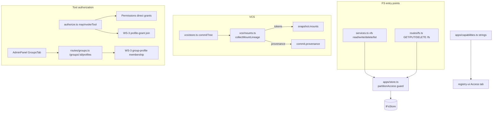

# Tech Plan — data-auth-model (WS-6)

## Context

All paths below are today's locations in `registry/apps/workspace/src/` (the product plane moves
to the aprovan repo in WS-4; edits are location-independent). Ground truth, audited:

- **Per-user data today.** The Personal app (`apps/personal.ts`) is synthesized:
  `PERSONAL_PREFIX = ".personal"`, keyvalue at record scope `app#personal#u#<sub>` (records.ts:
  `PK = t#<tenant>#s#<scope>`), files at `.personal/data/<sub>/…`. Apps partition files at
  `<paths[0]>/data/<sub>` (`appDataDir`, apps/store.ts). Hiding is **list-only**:
  `hiddenDataPrefixes()`/`isHiddenDataPath()` filter exactly three listing sites —
  `services.ts` vfs `list`, `routes/fs.ts` `GET /fs`, and `vcs/store.ts` `visibleEntries` — while
  the exact-path read/write/delete sites (`services.ts` vfs `read`/`write`/`delete`,
  `routes/fs.ts` `GET/PUT/DELETE /fs/*path`) check nothing. Any member can read, overwrite, or
  delete another member's partition at a known path, including version-pinned reads.
- **Groups today** (`groups.ts`, `routes/groups.ts`, `authorize.ts`): `GroupPrefixGrants` is
  written by admin API + AdminPanel UI and enforced by nothing (`listGrantedPrefixes` — zero
  callers). `GroupToolGrants` is enforced via `mayInvokeTool` → `checkToolGrant`, costing a
  per-request `UserGroups` query plus N+1 GetItem calls. Decision 8: delete the former, rebase
  the latter onto group→profile membership (schema + resolver from WS-3).
- **Mounts today** (`vcs/mounts.ts`, `vcs/store.ts`): snapshots exclude mounted prefixes;
  commits record nothing about them; `config.ref` defaults to the moving `main`; git blob shas /
  S3 ETags serve as per-entry version tokens on reads but are never persisted. The bundler's
  provenance manifest (`packages/bundler/src/phases/ship.ts`: `source: {type, url, hash,
  fetchedAt}`, `ingestSource`) is the shape to mirror.
- **Access pane** (`packages/registry-ui/src/apps/app-detail.tsx` Access tab) renders
  `apps.capabilities` (`apps/capabilities.ts` `NATIVE_SPECS` partition strings, tier-2 provider
  grants with `credential: provider`), with a manifest-derived fallback.
- **Dependency**: WS-3 delivers the Profile record (decision 7: `{name, target
  (interface|provider), credential ref, options, grants}` with a user dimension), group→profile
  membership storage, and a single auth-time join resolver. WS-6 consumes; it does not define.

## Goals / Non-Goals

**Goals:**

- One authorization guard for per-user partitions, hooked above `IFsStore`, covering every
  exact-path FS operation on both planes; 404 semantics.
- Excise `GroupPrefixGrants` completely; rewire `mayInvokeTool` and the admin API/UI to profile
  membership.
- Deterministic mount version tokens in snapshots, timestamped provenance on commits, captured in
  `commitTree` without new failure modes for committing.
- Capabilities strings and Access pane text updated in the same PRs that change the behavior they
  describe.

**Non-Goals:**

- No store-backend changes (WS-5 owns `IFsStore`/backends; the guard is backend-agnostic).
- No Profile schema, resolver, or credential work (WS-3).
- No mounted-content restore/diff, no readwrite-git, no CRDT provider, no lineage backfill.
- No change to agent path grants (`ctx.grants.paths`) or workspace/app roles.

## Architecture



Single responsibilities: the **guard** decides partition access from (path, caller, hidden
prefixes) and nothing else; **collectMountLineage** is the only code that talks to mount backends
for lineage; **commitTree** is the only writer of lineage; **mayInvokeTool** stays the single
tool-authorization choke point; capabilities strings live only in `apps/capabilities.ts`.

## Decisions

### D1: Partition authorization is one pure guard above the store, called from both planes

- **Choice**: Add to `apps/store.ts` (beside `hiddenDataPrefixes`) a pure function
  `partitionAccess(path, callerSub, hiddenPrefixes) → "open" | "own" | "foreign"` plus an async
  wrapper `assertPartitionAccess(workspaceId, callerSub, path)` that throws
  `ServiceError("Not found: <path>", 404)` on `"foreign"`. Call it in `services.ts` vfs
  `read`/`write`/`delete` (immediately after `resolveVfsPath`, before store access — app-scoped
  contexts skip it, their `appScope` confinement already applies) and in `routes/fs.ts`
  `GET/PUT/DELETE /fs/*path`. Owner is the path segment after the hidden prefix:
  `.personal/data/<sub>/…` and `<appRoot>/data/<sub>/…`.
- **Alternatives**:
  - *Enforce inside `IFsStore` backends* — rejected: the store has no principal, WS-5 is
    replacing the backends, and Dynamo/SQLite/DSQL would each reimplement policy.
  - *Per-route ad hoc checks* — rejected: that is exactly how "hiding" ended up list-only; three
    listing sites already drifted from five exact-path sites.
  - *Generic prefix-ACL engine (resurrect prefix grants as enforcement)* — rejected by decision 8;
    the only file-plane boundary this product needs now is the partition rule.
- **Revisit if**: a second file-plane policy (beyond partitions and agent path grants) appears —
  then fold both into a policy layer with its own module.

### D2: Foreign partitions answer 404, and your own partition is visible to you

- **Choice**: Deny with 404 (same shape as nonexistent), not 403 — a 403 confirms existence and
  invites probing; hiding already commits us to "not there". Symmetrically, listings *include*
  the caller's own partition (drop the caller's own sub-tree from the hidden filter in
  `services.ts` list, `routes/fs.ts` GET /fs), because "private" should be a place you can see,
  not a blind write target. Snapshots keep excluding **all** partitions including your own
  (`visibleEntries` unchanged) — commits are workspace-shared artifacts.
- **Alternatives**: *403 with reason* — honest but leaks existence and invites enumeration of
  `<sub>`s; *keep own partition hidden* — status quo oddity: users must know secret paths to use
  their own private storage.
- **Revisit if**: the product grows shared-with-me partitions (then 404 vs 403 needs a grant
  check first).

### D3: Personal stays synthesized; admin override is records-procedure-shaped, personal excluded

- **Choice**: No "real" Personal manifest is stored — generalization means the *partition rule*
  becomes enforced, not that Personal becomes a stored app. Admin access to app users' file
  partitions extends the existing audited `apps.data` procedure (app-admin-gated, audit entry per
  access); `apps.data` rejects `name: "personal"` — personal partitions have no admin override.
- **Alternatives**: *A parallel `apps.files` procedure* — more surface for the same gate; *admin
  ambient read of partitions* — "visible power instead of ambient browsability" (app-data.md) is
  the established rule; *admin override for personal too* — contradicts the privacy promise that
  motivates the change; the escape hatch for lockouts is the workspace owner deleting the user's
  membership data, not silent reads.
- **Revisit if**: compliance/offboarding requires personal-data export — then design an explicit,
  logged, user-notified export flow (never a quiet read).

### D4: Lineage lives in two places — deterministic tokens in the snapshot, timestamps on the commit

- **Choice**: Extend `VcsSnapshot` with `mounts?: MountLineageEntry[]` (`{prefix, type,
  configHash, versionToken}` — no timestamps, sorted by prefix, included in the canonical form so
  they participate in snapshot identity) and `VcsCommit` with `provenance?: MountProvenance[]`
  (`{prefix, source, originDomain, retrievedAt}`). `commitTree` calls a new
  `collectMountLineage(workspaceId)` in `vcs/mounts.ts` that resolves each mount once: git — one
  `GET /repos/:repo/commits/:ref` (SHA); s3 — reuse the listing walk, token = sha256 over sorted
  `<etag> <path>` lines. The "unchanged head" short-circuit in `commitTree` compares native
  entries **and** mount tokens.
- **Alternatives**:
  - *Everything on the snapshot* — `retrievedAt` breaks the byte-identical-dedupe property
    snapshots rely on ("identical trees produce identical files").
  - *Everything on the commit* — then two commits over a moved mount but identical native trees
    share a snapshot, and "snapshot = what the world looked like" quietly stops being true.
  - *Store the full S3 ETag manifest as a content-addressed file* — keeps per-object diffability
    but adds a write per commit and a GC question for a v1 that only needs "did it change / what
    token"; the manifest hash preserves change-detection at zero storage.
- **Revisit if**: mounted-view *restore* or per-file mounted diffs become requirements — then
  persist the manifest file behind the token.

### D5: Refs keep tracking; resolution is recorded per commit (no mount-time auto-pin)

- **Choice**: Reads keep following `config.ref` live (branch refs track upstream, matching user
  expectation of "vendor/charts tracks main"); every commit records the SHA the ref resolved to
  at that moment (D4). Users who want frozen views set `config.ref` to a tag or SHA —
  `addMount` already stores refs verbatim; document it.
- **Alternatives**: *Resolve ref → SHA at mount time and pin* — reproducible reads between
  commits, but silently freezes mounts users expect to track, and demands a refresh verb + UI +
  staleness indicator in v1: more machinery for the same lineage guarantee, since the commit
  record is what audit actually needs. *Both modes via a `pin: true` flag* — speculative
  flexibility; the tag/SHA ref already expresses intent.
- **Revisit if**: reproducible *reads between commits* become a requirement (e.g. builds run off
  mounted views) — then add explicit pin + refresh on top of the same recorded tokens.

### D6: Profiles wiring replaces both grant tables; direct Permissions stay

- **Choice**: `mayInvokeTool` becomes: admin → allow; direct `Permissions` check (unchanged,
  APR-320); else WS-3 `resolveProfileGrants(workspaceId, sub)` — one joined query over the
  caller's groups' attached profiles' grants (replacing `principal.groupIds` +
  `checkToolGrant`'s N+1). Admin API: `GET/POST/DELETE /groups/:id/profiles` on WS-3 storage;
  delete `/groups/:id/prefix-grants` and `/groups/:id/tool-grants` routes, the `groups.ts` grant
  functions, both grant tables from `db/schema.ts` and `infra/src/stack.ts`. No grant-data
  migration (nuke-and-reseed, decision 3) — admins re-attach profiles.
- **Alternatives**: *Keep `GroupToolGrants` alongside profiles during a transition* — dual
  authorization paths are exactly the ambiguity decision 8 kills, and no-compat is the repo
  convention; *migrate tool grants into synthesized profiles* — manufactures profiles nobody
  named or owns, polluting the new primitive from day one.
- **Revisit if**: never for prefix grants; for tool grants — RESOLVED against WS-3's tech
  plan (D12): `profile_grants` is subject-typed (`user|group|app|workflow|agent`) and grants
  a *profile*; a group granted a profile targeting a provider gets that provider's full
  surface through it (narrowing via the profile's own `grants` field). `provider:*` wildcard
  rows are subsumed structurally; no wildcard syntax needed.

## Interfaces & Data

The seams below let the work streams in tasks.md proceed independently.

**Partition guard** (`apps/store.ts`):

```ts
export type PartitionAccess = "open" | "own" | "foreign";
/** Pure: path vs hidden data prefixes; owner = first segment after `<prefix>/`. */
export function partitionAccess(
  path: string, callerSub: string, hiddenPrefixes: readonly string[],
): PartitionAccess;
/** Throws ServiceError(`Not found: ${path}`, 404) when access is "foreign". */
export function assertPartitionAccess(
  workspaceId: string, callerSub: string, path: string,
): Promise<void>;
```

Listing filter change (both listing sites): drop entries where
`partitionAccess(entry.path, callerSub, hidden) === "foreign"` instead of every hidden path.

**Mount lineage** (`vcs/mounts.ts` → consumed by `vcs/store.ts`):

```ts
export interface MountLineageEntry {           // snapshot side — deterministic
  prefix: string; type: "git" | "s3";
  configHash: string;                          // sha256 of canonical config JSON
  versionToken: string | null;                 // git: commit SHA; s3: sha256 of sorted "<etag> <path>" lines
}
export interface MountProvenance {             // commit side — timestamped
  prefix: string;
  source: { type: "git"; repo: string; ref: string; path?: string }
        | { type: "s3"; bucket: string; prefix?: string; region?: string };
  originDomain: string;                        // e.g. "api.github.com"
  retrievedAt: string;                         // ISO; set even when resolution failed
}
export function collectMountLineage(workspaceId: string):
  Promise<{ entries: MountLineageEntry[]; provenance: MountProvenance[] }>;
```

`VcsSnapshot` gains `mounts?: MountLineageEntry[]` (sorted by prefix, part of canonical identity);
`VcsCommit` gains `provenance?: MountProvenance[]`. Wire format is additive — old commits parse
unchanged.

**Groups/profiles admin API** (`routes/groups.ts`; storage + resolver are WS-3 imports):

```
GET    /groups/:id/profiles        → { profiles: [{ name, target, credentialLabel }] }
POST   /groups/:id/profiles        { profile: string }   → 201 (idempotent) | 404 unknown profile
DELETE /groups/:id/profiles        { profile: string }   → { removed: true } | 404
```

`authorize.ts`: `checkToolGrant(workspaceId, groupIds, provider, op)` is replaced by the WS-3
resolver call; `Principal.groupIds` remains for other consumers until WS-3's join subsumes it.

**Capabilities strings** (`apps/capabilities.ts`): `NATIVE_SPECS.vfs.partitionNote` and
`keyvalue.partitionNote` updated to owner-only + audited-admin language; tier-2
`ProviderGrantCapability` gains `profile?: string` (name of the executing profile) rendered by
the Access tab when present.

## Risks / Trade-offs

- [Guard misses an exact-path entry point (new route, future verb)] → the guard is one exported
  function; tests assert both planes and version-pinned reads; add a repo-convention note in
  `apps/store.ts` that any new FS entry point calls it.
- [404-on-foreign breaks a legitimate cross-user consumer nobody knew about] → pre-change grep
  found none; the audited `apps.data` extension is the sanctioned path; failure mode is loud
  (404), not silent corruption.
- [Mount lineage adds external calls to commit] → one call per mount, commit-frequency only;
  degraded capture (token null) keeps commits available under outage (spec'd).
- [S3 LIST per commit on huge buckets is slow] → the listing walk already runs for reads;
  if it becomes a problem, cap and record `versionToken: null` + note, per the degrade path.
- [Mount tokens change snapshot identity → "no-op" commits now create snapshots when upstream
  moved] → intended (the world did change); message it in the commit stats/UI as mount-only
  change.
- [WS-3 slippage blocks stream 3] → only the profiles streams block; partition guard, prefix-
  grant deletion, and lineage proceed (see tasks.md dependency lines).
- [WS-4 moves files mid-flight] → edits are module-local; coordinate by landing WS-6 streams
  either fully before or fully after the move of `apps/workspace`.

## Rollout

1. Land partition guard + tests (behavioral change: foreign access 404s; announce to the
   workspace's members — legacy cross-user reads, if any existed, stop).
2. Land `GroupPrefixGrants` deletion (API surface removal; AdminPanel section removed in the same
   release; infra table deleted after deploy — nuke-and-reseed, no data to keep).
3. Land mount lineage (additive wire format; old commits unaffected).
4. After WS-3 ships profiles + membership + resolver: land authorization rewire + admin API + UI,
   delete `GroupToolGrants` (admins re-attach capability as profiles — announce before deploy).
5. Capabilities/Access strings ship inside whichever of the above changes the described behavior
   (never ahead of it).

Rollback per step is a revert; no data migrations exist to unwind (deleted tables are
recreated empty by infra if reverted — acceptable under nuke-and-reseed).

## Open Questions

1. `apps.data` file extension shape: `{ name, user, key? }` gains `path?` (mutually exclusive
   with `key`) vs a `kind: "record" | "file"` discriminator. Recommendation: `path?` — smaller
   wire delta, obvious at call sites.
2. Should mount-only changes produce a distinct commit-stats marker (`stats.mounts: n`)?
   Recommendation: yes — cheap, and the history UI needs it to explain "0 files changed" commits
   (D4). Currently spec'd only as UI copy; confirm before implementing stats shape.
3. ~~Does WS-3's profile grant shape cover `provider:*` wildcards?~~ RESOLVED — WS-3 D12's
   subject-typed `profile_grants` subsumes wildcard rows structurally (granting a
   provider-target profile grants its full surface; the profile's own `grants` field
   narrows). No wildcard syntax exists or is needed.
