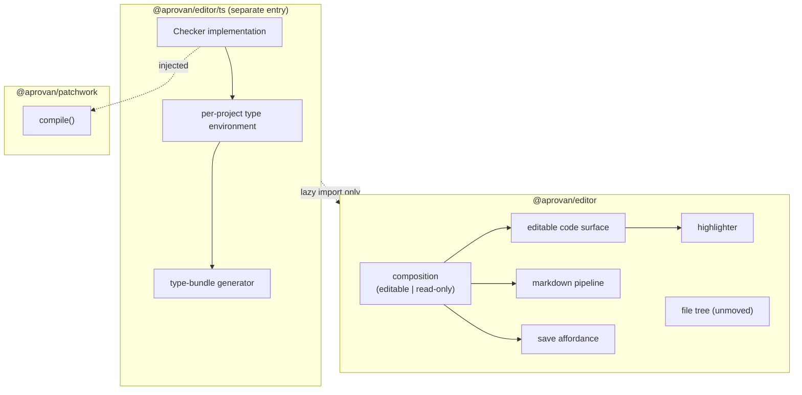

## Context

Six duplication classes, measured:

| concern | implementations | where |
|---|---|---|
| syntax highlighting | 4 | Shiki singleton in the code view; a second Shiki inside the file-tree dependency; CodeMirror Lezer in the TS editor; a ~120-line regex tokenizer in the registry site |
| editable code surface | 2 | transparent textarea over highlighted `<pre>`, twice — one has indentation handling and auto-resize but no scroll sync, the other has scroll sync but neither of the first two |
| markdown | 4 | rich-text editor, a React renderer used at two call sites with hand-copied class strings, a build-time renderer, and Astro components |
| editor composition | 2 | a 565-line composition with one consumer, and a 299-line re-implementation behind the editable path |
| save affordance | 3 | two in the editor package, one 248-line re-implementation in the client |
| type-bundle generator | 2 | the widget runtime's ambient generator and the registry site's declaration bundler, each with its own PascalCase derivation |

The product editor has no language service. The only one in either repository is in a package the registry site consumes **through npm, pinned by exact version**, with a service-worker rule keyed on its chunk filename — so it is a published cross-repo API, not dead code. Its type environment is a page-wide singleton whose virtual-file mounting is shared by every editor instance, and its root-file list is hardcoded to a single fallback declaration, so a *global* declaration cannot take effect at all.

`CompileOptions.typescript` is declared, passed on every compile by two call sites, and read nowhere.

The error path a typecheck should join already exists end to end: compile failure → telemetry hook → logs buffer → problem digest → self-heal prompt.

## Goals / Non-Goals

**Goals:** one implementation per concern; a real language service in the product; typechecking without a typechecker dependency; per-project environments.

**Non-Goals:** worker offloading (designed for, not built); the file tree; output schemas; anything owned by `tools-global`.

## Architecture



- **`@aprovan/editor`** — everything with no typechecker dependency. What the product and the registry site both always load.
- **`@aprovan/editor/ts`** — a separate entry so consumers that never render a typed editor do not pull the typechecker into their module graph. This mirrors what the current package already does for the same reason; preserve it.
- **`Checker`** — the injected interface. The runtime calls it; the editor implements it over the environment it already has.

## Decisions

### D1: The editor owns TypeScript; the runtime injects a `Checker`
- **Choice**: `compile()` accepts an optional checker. The editor supplies one backed by the environment it already maintains for IntelliSense.
- **Alternatives**: *Runtime depends on a typechecker* — lost because the app shell loads the runtime from a CDN on every published-app page, so every viewer would pay ~4 MB to typecheck nothing. *Editor-only checking with no runtime seam* — lost because headless verification then becomes impossible. *Worker* — deferred behind the same interface; no worker infrastructure exists today, so building it is a separate change, and the interface makes it a swap rather than a redesign.
- **Revisit if**: main-thread typechecking measurably degrades typing latency.

### D2: One environment per project
- **Choice**: replace the page-wide singleton with a per-project environment, and make the root-file list configurable.
- **Alternatives**: *Keep the singleton* — lost twice over: N open tabs on different namespace sets cross-contaminate, and a global declaration cannot apply at all without a configurable root list.
- **Revisit if**: per-project environments prove too costly to hold for many open tabs, in which case pool them by namespace set rather than reverting to one.

### D3: Provider declarations load on demand
- **Choice**: mount provider declarations lazily, driven by what the source references.
- **Alternatives**: *Ship them* — lost; the generated declaration trees total 28 MB. *Generate structurally* — lost; the real shapes already exist and an imprecise fallback is what the current generator produces and what this change is meant to improve on.
- **Revisit if**: on-demand fetching makes the editor unusable offline.

### D4: Coordinated release for the cross-repo editor
- **Choice**: publish the new package with the entry point, switch the consuming repository, then remove the old entry point.
- **Alternatives**: *Rename in place* — lost; the consumer pins by exact version and its service worker keys on the chunk filename.
- **Revisit if**: the repositories merge.

### D5: The file tree does not move
- **Choice**: leave it where it is; consolidate around it.
- **Alternatives**: *Move it with everything else* — lost on risk. Three separately-discovered workarounds are load-bearing — theming across a shadow boundary via inherited custom properties, a context menu portaled to the document body and re-identified so outside-click detection still works, and a stacking rule on the mobile drawer that exists because of the portal. None is unit-testable; all fail visually and only at certain viewports.
- **Revisit if**: the tree needs changes for another reason, at which point move it deliberately and alone.

## Interfaces & Data

```
interface Checker {
  check(project: VirtualProject, entry: string): Promise<Diagnostic[]>;
}
interface Diagnostic { file: string; line: number; column: number; message: string; severity: "error" | "warning" }
```
`compile(source, manifest, { checker?, ... })`. Diagnostics are formatted into the runtime's existing error-telemetry shape — the same one compile failures already use — so the logs panel, the problem digest, and the self-heal loop need no changes.

```
createTypeEnvironment({ rootFiles: string[], compilerOptions }): TypeEnvironment
env.mount(path: string, content: string): void
env.dispose(): void
```
`rootFiles` being a parameter rather than a constant is what allows a global declaration to apply.

The logs source keeps its current structural shape exactly; the host satisfies it without importing the type, and that decoupling is deliberate.

## Risks / Trade-offs

- **Breaking a published cross-repo API** → D4's coordinated release; verify the consuming site builds against the new package before removing the old entry point.
- **~4 MB arrives in the product bundle** → lazy entry, loaded only when a typed editor renders; assert in a bundle check that the app-shell path stays free of it.
- **Replacing the textarea changes text-entry behaviour** → keep the union of both existing implementations' behaviours (indentation, auto-sizing, scroll sync) rather than the intersection.
- **The markdown fidelity probe couples view selection to a heavyweight dependency** → preserve the probe as-is; changing which files open in rich view is a silent behaviour change users would notice before anyone else does.
- **Consolidating two compositions loses a behaviour present in only one** → enumerate both before merging, as with the two textareas.
- **Per-project environments multiply memory across open tabs** → measure with a realistic tab count; D2's fallback is pooling by namespace set.

## Rollout

1. Land the injected `Checker` interface in the widget runtime with no implementation. No behaviour change.
2. Consolidate the highlighter and the editable code surface, keeping the union of behaviours.
3. Consolidate the two compositions and the three save affordances.
4. Consolidate the markdown pipelines, preserving the frontmatter split, the fenced-block language field, and the fidelity probe.
5. Make the type environment per-project and its root-file list configurable.
6. Consolidate the two type-bundle generators into one, with one package-name derivation.
7. Publish the new editor package with the typed entry point; switch the registry site; remove the old entry point.
8. Implement `Checker` over the environment; wire it into the edit flow; make the compile option real.
9. Delete the registry site's hand-rolled tokenizer and its textarea editor.

## Open Questions

> Settled 2026-08-03 — accept recommendations.

- **Does the read-only composition survive, or is it re-derived from the editable one?** Re-derive from editable.
- **Should the typecheck run on every keystroke or only on the compile that precedes a preview?** Compile-only initially; record latency.
