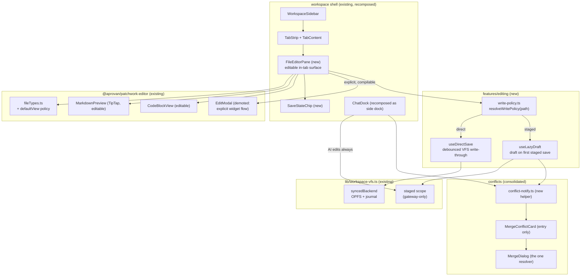

## Context

Everything this change composes already exists; the defects are three couplings:

1. **File-open mints a session**: `client/web/src/features/sessions/useEditDraft.ts:93`
   (`beginEditDraft`) creates a staged chat session server-side whenever a file is opened for
   editing, and `setActiveVfsSession` scopes all writes to that draft. This is the entire
   "ephemeral chat history" complaint.
2. **The only edit surface is fullscreen**: `packages/editor/src/components/edit/EditModal.tsx:253`
   is `fixed inset-0 z-50`; `TabContent.tsx` already mounts `CodePreview fill` per tab, but
   editing routes through `openSharedEditSession` → EditModal. The tree
   (`WorkspaceTree`/`WorkspaceSidebar`), tabs (`features/tabs/*`), editable editors
   (`MarkdownPreview editable` — TipTap; `CodeBlockView editable`), and the VFS
   (`lib/workspace-vfs.ts` `syncedBackend`: OPFS write-ahead + offline journal + staged-scope
   passthrough) all exist. Only the non-modal composition is missing.
3. **Markdown regression**: `EditModalHost.tsx:77` forces `initialState={{ showPreview: false }}`
   and EditModal's WYSIWYG branch (`EditModal.tsx:402`) requires `showPreview` — so `.md` opens
   as a raw code view. View policy belongs in `fileTypes.ts`.

Adjacent state: conflicts surface in three UIs (`components/MergeDialog.tsx`,
`notifications/MergeConflictCard.tsx` with its own one-click resolutions, and duplicated
`publishNotification` choice-blobs built inline in both `useDraftSync.ts` and
`useEditDraft.finishEditDraft`, plus ad-hoc `sessionNotice` strings). `SessionBar.tsx` packs
~10 controls + 2 drawers into a 24px strip. Renderer sizing: the `fill` contract exists on
`CodePreview`/`AppsPanel` but registry renderers (`packages/registry-ui/src/renderers.tsx`,
`RendererDef.Component` takes only `{ input }`) can't receive it, so components hardcode
viewport caps (`CodePreview.tsx:424` `min-h-[50vh] max-h-[75vh]`, `:514` `max-h-[60vh]`,
`MediaPreview.tsx:81`, `apps-panel.tsx:347/354`).

Server knowledge needed by the staging rule is already client-reachable: app declared prefixes
(the set `appPathAllowed` checks, `server/workspace/src/apps/store.ts:346`) via the apps
listing, and VCS mount prefixes via the `vfs.mounts` procedure
(`server/workspace/src/services.ts:532`). Mounts are read-only in v1 (writes 403).

Settled constraints (owner, 2026-08-02): staging by target path — plain files direct, app
source + mounted repos staged, chat edits always staged, **no mode toggle**. IW-2 is free of
other improve-wave dependencies and gates IW-6 (`presence-realtime`), which will add CRDT
co-editing to the direct-edit main area this change creates.

## Goals / Non-Goals

**Goals:**
- One client-side write-policy seam (`resolveWritePolicy(path)`) consumed by every editing
  surface; `beginEditDraft`-on-open deleted; drafts created lazily on first staged save.
- An in-tab editable pane composed from existing editors, defaulting per `fileTypes.ts` view
  policy; EditModal demoted to an explicit widget flow.
- Chat recomposed as a per-file opt-in dock; AI file edits ride staged sessions always.
- One conflict notification helper + one resolution dialog; SessionBar reduced to ≤5 visible
  controls plus an overflow menu; `keepEditDrafts` deleted.
- `RendererDef` components receive a host sizing mode; all hardcoded `vh` body floors/caps
  removed.
- Verifiable at each work-stream boundary by `pnpm --filter` builds, `@aprovan/registry-ui`
  vitest, and grep gates.

**Non-Goals:**
- No server-side session/VCS model changes; `sessions.*` procedures, overlays, and
  `sessions.resolve` are consumed as-is.
- No CRDT/presence/WebSocket work (IW-6); no app-model changes (IW-1); no new editor tech
  (TipTap/Shiki/CodeMirror stay).
- No change to transcript persistence for surviving sessions; no removal of EditModal's
  compile-preview internals.
- No writable-mount implementation — the staged path for mounts activates only when the server
  lifts read-only.

## Architecture



Component responsibilities (one each):
- **`write-policy.ts`** — pure path→policy resolution over cached prefix sets; the only place
  the staging rule lives client-side.
- **`FileEditorPane`** — replaces `CodePreview`'s read-mostly role inside `TabContent` for
  editable types: picks the editor per `fileTypes.ts` `defaultView`, owns the view toggle,
  external-change banner, and save wiring. `CodePreview` remains the inline-chat renderer.
- **`useDirectSave`** — debounce + Cmd/Ctrl+S + save-state machine over `syncedBackend.write`.
- **`useLazyDraft`** — creates the staged session on first save, scopes VFS to it, exposes
  review/apply/discard; replaces `useEditDraft`'s begin/finish lifecycle.
- **`SaveStateChip`** — renders the single save/draft/read-only state.
- **`ChatDock`** — existing chat feature hosted as a resizable side panel scoped to a file;
  proposal review + apply.
- **`conflict-notify.ts`** — the one constructor of `builtin:merge-conflict` notifications.
- **`renderers.tsx`** — `RendererDef.Component` gains `sizing` ("fill" | "inline") through
  `RenderedView`.

## Decisions

### D1: Write policy is resolved client-side from cached prefix sets
**Choice**: A pure client resolver over two cached lists — app declared source prefixes (apps
listing) and VCS mount prefixes (`vfs.mounts` procedure) — refreshed on workspace load and on
app/mount mutations, with a conservative fallback (unknown/uncached ⇒ treat app-partition-like
paths as staged only when the cache is present; block staged-target saves while the cache is
cold rather than writing through).
**Alternatives**:
- *Server-side policy endpoint per write* — rejected: adds a round-trip to every save, and the
  server already enforces the hard boundaries anyway (`appPathAllowed`, mount 403s); the client
  rule is UX routing, not security.
- *Policy annotation returned by `fs.list`* per entry — rejected: touches server fs routes for
  data that changes rarely and is available from two existing listings; more surface for IW-1
  to migrate later.
**Revisit if**: IW-1's app-model split changes how app prefixes are declared (then the resolver
swaps its apps-listing source), or prefix sets grow beyond trivial cache size.

### D2: Drafts are created lazily on first save, not on open
**Choice**: Opening any file is free. `useLazyDraft` creates the staged session inside the
first save of a staged-policy target, then scopes subsequent writes to it. Draft-creation
failure blocks the save (buffer kept, error surfaced) — never silent write-through to a staged
target.
**Alternatives**:
- *Draft on open (status quo shape, narrowed to staged targets)* — rejected: still litters
  history with zero-change husks for read-only browsing of app source, and keeps the
  open-path async/failure coupling this change exists to remove.
- *Fully local buffering, draft only at explicit "review"* — rejected: unsaved staged work
  would live only in memory/OPFS with no server visibility; loses the existing overlay
  semantics that apply/conflict flows depend on.
**Revisit if**: draft-creation latency on first save proves user-visible (then pre-warm on
first keystroke).

### D3: In-tab editing is a new composition (`FileEditorPane`), not a refactor of CodePreview or EditModal
**Choice**: Build the pane as a new component in `client/web` composing existing editor
primitives (`MarkdownPreview`, `CodeBlockView`, `MediaPreview`, `SaveStatusButton`), leaving
`CodePreview` (inline chat widget renderer) and `EditModal` (explicit widget flow) intact.
**Alternatives**:
- *Make EditModal dockable/non-fixed* — rejected: EditModal entangles compile preview, edit
  transport, and its own session lifecycle; parameterizing its layout multiplies states and
  keeps the modal as the center of gravity we're demoting.
- *Grow `CodePreview` an "editable in place" mode* — rejected: CodePreview is the *renderer*
  used inline in messages; giving it save/draft wiring couples chat rendering to workspace
  write policy.
**Revisit if**: the pane and EditModal converge to near-identical feature sets — then fold
EditModal's preview flow into the pane in a follow-up (PRD Open Question 1).

### D4: View defaults move into `fileTypes.ts` as data
**Choice**: Extend `FileTypeInfo` with `defaultView: "rich" | "code" | "preview" | "media"`
(md → `rich`; compilable → `code` with preview toggle available; text → `code`; media →
`media`). Surfaces read it; `EditModalHost` stops passing `initialState.showPreview`, and
`EditModal` derives its initial view the same way.
**Alternatives**:
- *Keep host `initialState` and just flip the value for md* — rejected: leaves per-host
  divergence (the exact bug class: `showPreview:false` regressed markdown), and IW-6/desktop
  hosts would each re-encode policy.
- *A separate renderer-registry entry per view* — rejected: `resolveRenderer` answers "how to
  render content", not "which editing view opens first"; overloading it mixes read and edit
  concerns.
**Revisit if**: per-user view preferences are wanted (then `fileTypes.ts` stays the default and
a preference layer overrides it — still not host initial-state).

### D5: Chat edits stage through the existing session overlay; direct typing bypasses it
**Choice**: The chat dock always operates in a staged session scope (as chat does today for
staged mode); user keystrokes in the pane follow write policy independently. The pane and dock
can be open simultaneously; proposals apply via the existing `sessions` apply/resolve
procedures.
**Alternatives**:
- *Chat writes direct, with an undo affordance* — rejected: contradicts the settled rule ("the
  AI proposes, the user applies") and makes conflict semantics ad hoc.
- *A new proposal/patch entity separate from sessions* — rejected: staged sessions already are
  proposals with overlays, diffs, apply, and conflict resolution; a second mechanism is
  speculative.
**Revisit if**: IW-6 CRDT co-editing needs AI edits as CRDT ops rather than overlay writes.

### D6: One conflict pipeline: shared notification helper → card (entry) → MergeDialog (resolver)
**Choice**: Extract `conflict-notify.ts` (single constructor of the `builtin:merge-conflict`
notification), strip the card's inline one-click resolutions down to a summary + `Review`
link, and move bulk keep-all actions into `MergeDialog`'s header. `MergeDialog` becomes the
only place resolutions execute.
**Alternatives**:
- *Keep one-click resolutions on the card* — rejected: it is a second resolution surface with
  drift risk (its copy/choices are already duplicated in two call sites) and encourages bulk
  decisions without seeing diffs.
- *New unified conflict center panel* — rejected: a fourth surface; MergeDialog already has the
  right per-file model and plain-language framing.
**Revisit if**: conflicts become frequent enough to need a queue across multiple sessions.

### D7: Renderer sizing rides an explicit `sizing` prop through `RenderedView`, hosts own bounds
**Choice**: `RendererDef.Component` props become `{ input, sizing }` with
`sizing: "fill" | "inline"` (default `"inline"`); `RenderedView` forwards it. Renderer bodies
drop `vh` floors/caps: in `fill` they `flex-1 min-h-0 overflow-auto`; in `inline` the *host*
wraps them in its own bounded container (chat supplies the max-height). `CodePreview`'s
non-fill card variant loses `min-h-[50vh] max-h-[75vh]` in favor of the chat host's bound.
**Alternatives**:
- *Context-based sizing (extend `RendererCapabilities`)* — rejected: sizing is per-mount
  layout, not a capability grant; context would make one provider per mount point anyway.
- *CSS-only fix (container queries)* — rejected: doesn't remove the floors/caps decision from
  renderers; the defect is ownership, not units.
**Revisit if**: renderers need finer negotiation (preferred aspect ratios) — then grow the prop
into a small sizing object, still host-owned.

## Interfaces & Data

```ts
// client/web/src/features/editing/write-policy.ts
export type WritePolicy = "direct" | "staged" | "readonly";

export interface StagedPrefixSets {
  /** Declared source prefixes of installed apps (appPathAllowed's set). */
  appPrefixes: string[];
  /** VCS mount prefixes with writability (all read-only in v1). */
  mounts: Array<{ prefix: string; writable: boolean }>;
  loadedAt: number;
}

/** Refresh from the apps listing + `vfs.mounts`; cached per workspace. */
export function loadStagedPrefixes(force?: boolean): Promise<StagedPrefixSets>;

/** Pure; normalizes the path; longest-prefix match. readonly ⇐ non-writable mount. */
export function resolveWritePolicy(path: string, sets: StagedPrefixSets): WritePolicy;
```

```ts
// client/web/src/features/editing/useDirectSave.ts
export type SaveState =
  | { kind: "saved" }
  | { kind: "edited" }            // debounce pending
  | { kind: "saving" }
  | { kind: "error"; message: string; retry: () => void }
  | { kind: "offline" };          // journaled, will flush
export function useDirectSave(path: string): {
  state: SaveState;
  onChange(content: string): void;  // debounced write (~1s idle)
  flush(): Promise<void>;           // Cmd/Ctrl+S
};
```

```ts
// client/web/src/features/editing/useLazyDraft.ts
export type DraftState =
  | { kind: "none" }                              // no saves yet
  | { kind: "active"; session: ChatSessionInfo; changedFiles: number }
  | { kind: "error"; message: string; retry: () => void };
export function useLazyDraft(target: { path: string; label: string }): {
  state: DraftState;
  /** Creates the draft on first call, scopes VFS to it, then writes. */
  save(path: string, content: string): Promise<void>;
  apply(): Promise<{ conflicts: string[] }>;      // [] ⇒ applied & closed
  discard(): Promise<void>;
};
```

```ts
// packages/editor/src/components/edit/fileTypes.ts (extension)
export type DefaultView = "rich" | "code" | "preview" | "media";
export interface FileTypeInfo {
  category: FileCategory;
  language: string | null;
  mimeType: string;
  defaultView: DefaultView;       // md → "rich"; compilable → "code"; text → "code"
  canToggleView: boolean;         // md (rich↔code), compilable (code↔preview)
}
```

```ts
// packages/registry-ui/src/renderers.tsx (breaking within the repo; all
// registered renderers updated in the same change)
export type RendererSizing = "fill" | "inline";
export interface RendererDef {
  id: string;
  label: string;
  match: (input: RenderInput) => number;
  Component: React.ComponentType<{ input: RenderInput; sizing: RendererSizing }>;
}
export function RenderedView(props: {
  input: RenderInput;
  sizing?: RendererSizing;        // default "inline"
}): React.ReactElement | null;
```

```ts
// client/web/src/features/sessions/conflict-notify.ts
export function publishConflictNotification(args: {
  sessionId: string;
  sessionTitle: string;
  conflicts: Array<{ path: string }>;
  /** Where the conflict arose — copy varies, structure does not. */
  origin: "draft-sync" | "draft-apply" | "chat-proposal";
}): void; // one card kind; link opens MergeDialog via the existing open-merge route
```

**Seam contract (two-agent split):** the editor-shell side (`FileEditorPane`, `SaveStateChip`,
`TabContent` wiring, dock layout) consumes `useDirectSave`/`useLazyDraft`/`resolveWritePolicy`
exactly as typed above and can be built against stubs; the sessions side implements those hooks
over `workspace-vfs`/`chat-sessions` without rendering anything. The renderer-sizing work is
independent of both (packages/registry-ui + packages/editor only).

**State machine — pane save wiring:**
`resolveWritePolicy(path)` → `direct` ⇒ `useDirectSave`; `staged` ⇒ `useLazyDraft`;
`readonly` ⇒ no save wiring, read-only chip. Policy is resolved at pane mount and re-resolved
on prefix-set refresh; a policy flip with unsaved edits keeps the buffer and re-routes the next
save.

## Risks / Trade-offs

- [Autosave to a live workspace makes accidental edits immediate] → debounce + visible save
  chip; destructive scale is one file at a time; VFS remains recoverable via OPFS cache; if it
  proves footgun-y, add per-pane undo (buffer history) — not a mode toggle.
- [Prefix cache staleness misroutes a write (app installed mid-session)] → server still
  enforces app-partition boundaries; refresh cache on app/mount mutations and on 403; staged
  targets fail closed (block save) rather than writing through.
- [TipTap markdown round-trip loses exotic syntax] → detect non-round-trippable content by
  serialize-compare on load; fall back to source view with notice (spec'd); never autosave a
  lossy rewrite.
- [Renderer prop change (`sizing`) is breaking for registered renderers] → all in-repo
  registrations updated in the same work stream; `sizing` defaults to `"inline"` in
  `RenderedView` so unmigrated call sites keep working.
- [Removing card one-click resolutions adds a click for bulk cases] → bulk actions relocate to
  MergeDialog header — one extra click, full diff visibility; acceptable per improve.md's
  "explicit for repos/apps".
- [ChatDock recomposition destabilizes chat flows that must not regress] → dock reuses
  `ChatDock` internals behind a layout change; transcript persistence, self-heal, and lazy
  session creation are untouched code paths, smoke-checked via ux.md flows.

## Rollout

Client-only (plus `packages/editor`/`packages/registry-ui` internal packages); no server
deploys, no data migration — session records, overlays, and notifications keep their shapes.
Order (matches tasks.md work streams):
1. Foundations that don't change behavior: `fileTypes.ts` defaultView; renderer `sizing` prop +
   vh removal; `write-policy.ts` + prefix loading (unused yet). Builds/tests green.
2. `useDirectSave`/`useLazyDraft` + `FileEditorPane` behind the tab pane — the new default path.
   `beginEditDraft`-on-open deleted in the same stream (the old and new paths must not coexist:
   the old one creates sessions on open).
3. Chat dock recomposition + EditModal demotion + `keepEditDrafts` removal.
4. Conflict consolidation + SessionBar declutter.
Rollback = git revert of the offending stream; no persisted-state cleanup needed beyond
orphaned `patchwork:edit-keep-draft` localStorage keys (harmless; removal code deleted with the
feature). Existing open drafts from the old editor flow remain ordinary staged sessions and
stay manageable from the chats list.

## Open Questions

1. **Where does the prefix cache refresh hook in?** Recommend: workspace boot + the existing
   workspace-change subscription (`subscribeToWorkspaceChanges`) + on any 403 write failure.
   Needs confirmation only if app-install events are invisible to those.
2. **Does `FileEditorPane` fully replace `CodePreview` inside `TabContent` for editable types,
   or wrap it?** Recommend replace for markdown/text/code and keep `CodePreview` for compilable
   files' preview mode (its widget-compile machinery), unified under the pane's toggle.
3. **Per-file-type view memory ("remembered for the session", ux.md)** — recommend in-memory
   only this change; a persisted preference layer is future work (D4 Revisit-if).
