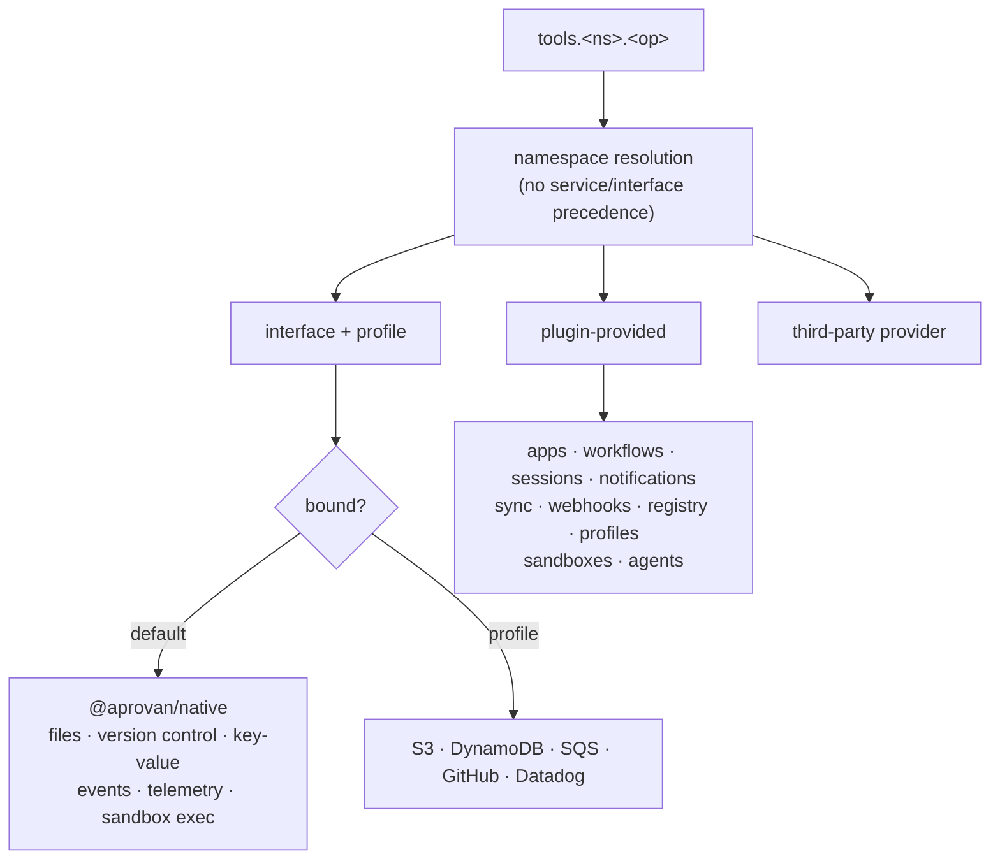

## Context

The gateway has 14 first-party service names and the registry has 9 contracts. Four names appear in both, and `routes/tools.ts:692` checks the service first — so `keyvalue.get` is always the service and the `keyvalue` interface binding is unreachable, except via `keyvalue:prod`, which returns a *different shape*. `profiles-unified` deletes that escape hatch, which turns a latent inconsistency into a closed door.

The two sides genuinely disagree. Selected rows from the divergence audit:

| operation | first-party returns | contract declares |
|---|---|---|
| key-value read | `{ key, value }` | `{ key, value, found, updatedAt?, expiresAt? }` — absence is signalled by a null value today, indistinguishable from a stored null |
| key-value write | `{ key, ok: true }` | `{ key, updatedAt, expiresAt? }` — no field in common beyond the key |
| key-value list | `{ keys: string[] }` | `{ keys: Array<{ key, updatedAt?, expiresAt? }>, cursor? }` |
| file read | `{ path, hash, mimeType, size, content, updatedAt }` | `{ path, encoding, content, size, etag? }` |
| file list entries | no entry kind | `kind: "file" \| "directory"` |
| file delete | `deleted` is a path string | `deleted` is a boolean |
| file stat | not implemented | declared |
| event record | `{ id, ts, userId, payload }` | `{ id, channel, type, payload?, timestamp }` |
| telemetry export | contract type | same — the only agreeing pair |

The file namespace also carries nine version-control operations, all gated by a workspace-only guard, all excluded from the application capability list, and none of which has ever appeared in a generated declaration. Its own contract states that sessions, overlays, mounts, and version history are product semantics built on top of the driver and deliberately absent from it.

All 117 platform operations declare an input schema; none declares an output schema. They cannot be derived: every service is one dispatch method typed as returning `unknown`, so per-branch inference is erased at the boundary.

The resolving pattern is already in the documentation for two namespaces: the driver is the interface, the workspace nouns built on it are the service. This change generalises that to every case.

## Goals / Non-Goals

**Goals:** one meaning per name; one routing model; contracts and first-party results agreeing; typed platform results.

**Non-Goals:** the `tools` root, plugins-as-mechanism, profile addressing, provider-side extraction — all owned by earlier changes in the wave.

## Architecture



- **namespace resolution** — three kinds, no precedence rule. The enumerated first-party list disappears.
- **`@aprovan/native`** — one package implementing five contracts plus sandbox execution, absorbing the three separate sandbox packages. Registered as a credentialless compat entry the gateway short-circuits in process.
- **platform plugins** — the workspace nouns, provided through the plugin registry that `tools-global` establishes.

## Decisions

### D1: Generalise the documented driver/service split
- **Choice**: every shadowed name becomes a clean interface; the workspace semantics built on it become a plugin-provided namespace.
- **Alternatives**: *Rename one side* — lost; two names for one concept, and every caller moves anyway, so the churn buys nothing. *Drop the interface for these five* — lost; it orphans the existing third-party implementations and removes user-selectable backends. *Leave the precedence rule* — lost; `profiles-unified` closes the only path to the interface.
- **Revisit if**: no user ever rebinds one of the five, in which case they could collapse to plugins.

### D2: Converge first-party results onto the contracts
- **Choice**: the contract is authoritative; the Aprovan provider changes to match.
- **Alternatives**: *Contract follows the implementation* — lost because several first-party shapes are defective independent of this change: absence is unrepresentable in the key-value read, and a deletion result carries a path where a boolean is declared. *Declare them separate surfaces* — lost; that is today's state, and it is what makes one name mean two shapes.
- **Revisit if**: a contract field proves unimplementable over workspace storage.

### D3: Version control is its own namespace; mounts are configuration
- **Choice**: driver operations stay on the file namespace; commit, history, comparison, references, and restoration move to version control; mount management becomes a path-keyed profile.
- **Alternatives**: *Mounts on the file namespace* — lost; the contract names mounts as product semantics, and a version-control operation on a mounted repository must honour the same table, so it is not the file namespace's to own. *Mounts on version control* — lost; an object-store mount has nothing to do with version control.
- **Revisit if**: mount semantics grow enough to need their own surface rather than a profile key.

### D4: Hand-write platform output schemas
- **Choice**: write all 117 by hand; mark passthrough operations; split the argument-dependent one.
- **Alternatives**: *Derive from handler types* — impossible without restructuring all 14 services from single-dispatch to per-operation typed functions, which is a larger change than writing the schemas. *Leave them unknown* — lost; it is the reason every platform call is untyped at the call site.
- **Revisit if**: the dispatch model is restructured for another reason, at which point derivation becomes cheap.

### D5: Consolidate the native implementations into one package
- **Choice**: one server-side package holding the five contract implementations and the sandbox execution implementations; the three separate sandbox packages are retired.
- **Alternatives**: *One package per contract* — lost; they share workspace storage and partitioning logic, so splitting them multiplies the seams without separating anything. *Leave the sandbox packages* — lost; they are the same category of thing and are already three packages for one job.
- **Revisit if**: a contract implementation needs to ship independently.

## Interfaces & Data

Compat registration for the Aprovan provider, one entry per contract, credentialless and short-circuited in process — matching the pattern two contracts already use for the same reason:
```
{ provider: "aprovan", label: "Aprovan", credentialless: true, moduleSpecifier: "@aprovan/native" }
```

Namespace resolution result:
```
{ kind: "interface", id, profile? } | { kind: "plugin", id } | { kind: "provider", id, profile? }
```

Tool entry, extended by `utdk-output-schemas`:
```
{ name, description, inputSchema, outputSchema?, streaming?, passthrough? }
```
`passthrough: true` marks an operation whose result belongs to a bound implementation; any `outputSchema` alongside it is advisory.

Namespace surfaces after the split:
```
files            list · read · write · delete · stat
version control  commit · log · show · diff · branches · restore
mounts           (path-keyed profiles — no operations)
```

## Risks / Trade-offs

- **Every consumer of the changed shapes breaks at once** → accepted; the wave has no back-compat and the reference snapshot preserves current content. Sequence the shape changes together so callers are updated once.
- **The Aprovan provider must implement a contract operation the first-party surface never had** → implement it before removing the old surface, so the gap is never live.
- **Hand-writing 117 schemas is the largest single labour item in the wave** → batch by service, hardest last, and add a check that a new operation cannot ship undeclared.
- **Marking a passthrough operation with an advisory shape makes a claim nothing enforces** → label it explicitly as advisory; do not present it as a guarantee.
- **Dissolving the enumerated first-party list removes a compile-time consistency check** — today a name in the list without an implementation fails the build → replace it with an equivalent check over the plugin registry, or the safety net is silently lost.
- **Two helper functions currently erase shapes the implementation already determines** → un-erase them first; several services' schemas are blocked behind those two signatures.

## Rollout

1. Un-erase the two helper return types. Small, unblocks a third of the schema work.
2. Create `@aprovan/native`; move the sandbox packages into it.
3. Implement the five contracts there, converged onto the contract shapes, including the previously missing operation.
4. Register the credentialless compat entries; verify default resolution reaches the native provider.
5. Split version control off the file namespace; remove the now-redundant workspace-only guard.
6. Convert platform namespaces to plugin-provided; delete the enumerated first-party list and the precedence rule; replace its build-time consistency check.
7. Write output schemas, batched by service; split the argument-dependent operation; mark passthroughs.
8. Add the regression check that every operation declares or is marked.
9. Update callers of every changed shape; reseed examples.

Steps 1-4 are additive and independently revertable. Step 5 onward is breaking and should land together.

## Open Questions

> Settled 2026-08-03 — accept recommendations.

- **Does the Aprovan provider register under one provider id across all five contracts, or one per contract?** One id.
- **Should the plugin registry enforce that a platform namespace declares an output schema for every operation?** Yes.
