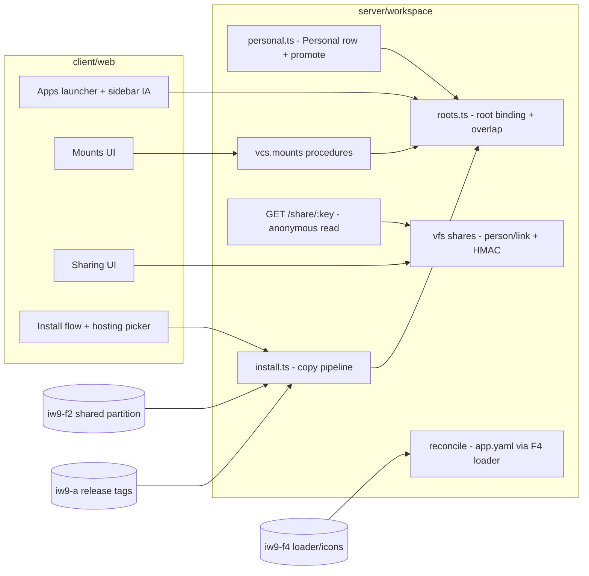

# iw9-b-app-model — Tech Plan

## Context

All work is in the **aprovan** repo (`Repo: aprovan` per the brief's
cross-repo table; grep gates still run in both repos). Current state,
verified 2026-08-09:

- **Binding**: `AppManifest` binds `entry` + `paths[]`
  (`server/workspace/src/apps/store.ts:95-100`); `paths` is derived as
  `[pathDir(entry), ...extras]` with Set-dedupe only — **no overlap
  validation anywhere** (`apps/service.ts:468-491`). `appPathAllowed`
  (`store.ts:328-330`) is the single prefix-authz choke point — good seam.
- **Install**: "reference + pin (never a manifest copy)"
  (`apps/install.ts:4-5`); `AppInstallation{originAppId, originWorkspaceId,
  pin, resolvedRelease, editing, prefix}` (`install.ts:33-50`); serving
  resolves the origin at request time (`routes/live-apps.ts:119-126`,
  `routes/apps.ts:115-120,169-171`, via `cachedOriginRelease`).
  `materializeFork` (`install.ts:262-285`) already copies release files —
  the seed of copy-install.
- **Sharing**: only workspace→app shares exist
  (`WorkspaceShare`/`shareAllows`, `apps/store.ts:154-165,473-487`); keyed
  on mutable `app.name` at `store.ts:499` — **iw9-f6 fixes to appId; we
  rebase on that**. Nothing person- or link-scoped exists.
- **Mounts**: `vcs/mounts.ts` (721 LOC) fully implements git/s3
  read-through, lineage, caching; `addMount`/`removeMount` have zero
  non-test callers (only `tests/auth-cache.test.ts`).
- **Sidebar**: `WorkspaceSidebar.tsx` renders the Files tree (title at
  :144) + all 14 `NATIVE_SURFACES` rows (:200-213;
  `client/web/src/lib/native-surfaces.tsx:70-184`).
- **Current model docs**: `openspec/changes/app-model-split/specs/` (ULID
  identity, ID-keyed partitions, per-user space, Personal *synthesis*
  deleted). We build on it.
- **External deps**: iw9-f4 (app.yaml loader/schema, slug rules, icon
  fallback, URL scheme), iw9-f2 (shared partition, metering, immutable-mode
  storage hooks). iw9-a owns `apps/releases.ts` + entry-version helpers
  (`apps/store.ts:422-451`) — we never touch them; our pin consumes A's
  release-as-tag, falling back to commit ids.

## Goals / Non-Goals

**Goals:**

- One path-binding shape (`root: string`) replacing `entry`+`paths[]`,
  overlap-validated server-side.
- Install pipeline that copies archives and never reads the origin at
  request time.
- Share store + link endpoint satisfying invariant 9 with HMAC-at-rest keys.
- Mount procedures/UI as a thin surface over the existing engine.
- One-shot migration scripts with grep-gated completion.

**Non-Goals:**

- app.yaml schema/loader (F4), shared-partition mechanics (F2), release
  machinery (A), grant enforcement/install cards (C), app→app calls,
  registry-repo changes.

## Architecture

Single responsibilities: **roots.ts** decides what an app's path binding is
and whether a proposed root is legal (the only overlap authority);
**reconcile** turns `app.yaml` edits into derived record state without
corrupting last-good; **personal.ts** owns lazy creation + promote-out
atomicity; **install.ts** owns archive copy, pin, hosting-mode recording;
**shares** owns the share records, HMAC verification, and the anonymous read
route; **mounts procedures** only validate + delegate to the engine.

## Decisions

### D1: Root is a stored string derived at publish, not a paths[] of length 1

- **Choice**: `AppManifest` (record side) carries `root: string`
  (`Apps/<slug>`); `AppPaths` collapses to `{id, slug, root}`;
  `appPathAllowed` checks one prefix. `paths[]`, `entry` fields deleted;
  the serving entrypoint is resolved from the root via the existing
  `ENTRY_CANDIDATES` logic at reconcile time and cached on the derived
  record.
- **Alternatives**: keep `paths: string[]` with a length-1 invariant —
  rejected: every consumer keeps looping and the grep gate for the old model
  can never pass; leave `entry` stored — rejected: two sources of truth for
  a derivable fact, and app.yaml (F4) has no entry field to reconcile it
  from.
- **Revisit if**: an app genuinely needs two disjoint served prefixes that
  mounts cannot express (none known — the audit found extras used only for
  shared libs).

### D2: Overlap validation is a store-level check on the roots index

- **Choice**: one function `assertRootAvailable(workspaceId, root)` backed
  by the app list (roots are few), called by publish, promote, install
  materialization, and root rename. Containment both directions:
  `a === b || a.startsWith(b + "/") || b.startsWith(a + "/")` → 409. Mount
  prefixes run through the same check against roots and other mounts.
- **Alternatives**: validate in each route handler — rejected: that is how
  the check failed to exist in the first place (four call sites, zero
  checks); a persistent prefix-trie index — rejected: premature for tens of
  roots.
- **Revisit if**: workspaces hold thousands of apps and the O(n) scan shows
  up in publish latency.

### D3: Personal is ordinary storage plus one lazy-create helper; promote is copy-verify-swap

- **Choice**: `ensurePersonalApp(workspaceId)` creates the row (slug
  `personal`, root `Apps/personal`) on first need; no flags on the manifest
  — Personal is recognized by slug only at the single creation site.
  Promote-out = (1) `assertRootAvailable`, (2) copy subtree to
  `Apps/<slug>`, (3) reconcile mints the new appId (F4 first-sight flow),
  (4) delete the source subtree; failure before (4) deletes the copy —
  the FS store has no rename, so copy-then-delete with the delete last is
  the atomicity strategy (source remains intact until the new app exists).
- **Alternatives**: eager Personal at workspace creation — rejected: every
  empty workspace grows a row users didn't make (the exact smell
  app-model-split killed); per-member Personal apps — rejected in PRD
  (recreates N-manifests; `.users/` already covers private files);
  VFS-level move primitive — rejected: bigger change owned by no stream.
- **Revisit if**: promote of very large subtrees makes copy-then-delete
  windows user-visible; then a VFS move primitive is worth an ADR.

### D4: Install copies the archive via the materialize path; pin = release tag with commit-id floor

- **Choice**: rebuild install on `materializeFork`'s copy loop: resolve the
  origin release (A's tag interface; the pin records
  `{tag?: string, commit: string}` — commit always present so B works even
  before A lands), copy `app.yaml` + root into `Apps/<slug>` (collision →
  400 with explicit slug choice per PRD Open Q2 pending), write the install
  record `{installId, originAppId, originWorkspaceId, pin, hostingMode,
  bindings, config}` — `editing`/`prefix`/`resolvedRelease` deleted. Serving
  reads only local state; `cachedOriginRelease` and both origin-read sites
  in routes are deleted (grep gate: `originWorkspaceId` appears only in
  install/update-check code, `cachedOriginRelease` nowhere).
- **Alternatives**: keep serve-from-origin with a copy option — rejected by
  D8 (settled; publisher push-to-all deliberately given up); snapshot the
  manifest but reference content — rejected: origin deletion still breaks
  serving, and invariant "copy" means the installer owns the bytes.
- **Revisit if**: never within IW-9 (D8 is settled authority).

### D5: Hosting mode reuses F2's landed `hosting` field; F4's 3-way declaration collapses to the 2-way user-facing pick

- **Choice**: F2 already shipped the field (TD4 of `iw9-f2-shared-partition`
  tech-plan, verified — F2 is complete): `hosting: "hosted" | "managed"` on
  `AppInstallation`, set once in `mintNewInstall`, immutability enforced by
  `saveInstall`'s read-before-write compare (409 on flip; no separate
  `recordHostingMode` function exists — an earlier draft of this plan assumed
  one). We consume that field and guard as-is; **do not** re-derive a
  differently-named field. `hostingWorkspaceId` is new (F2 does not carry
  it) and is ours to add alongside `hosting`, set only when `hosting ===
  "hosted"`.
  F4's frozen `AppYaml.hostModes` (verified in `iw9-f4-app-identity`
  tech-plan T7's schema) is a **3-way** enum — `managed | creator-hosted |
  publisher-hosted` — not the binary this decision originally assumed. We
  collapse it at install-pick time per invariant 5 ("who hosts — publisher
  or instance creator — is a displayed fact, not a mode"): `creator-hosted`
  and `publisher-hosted` both resolve to F2's `hosting: "hosted"`; the
  install-time pick offered to the user stays binary
  (managed/hosted — `app-data-hosting` spec's framing is correct as
  written), and which declared hosted-flavor was chosen determines
  `hostingWorkspaceId` (creator-hosted → the creating user's personal
  workspace per D1; publisher-hosted → the app's origin/publisher
  workspace) — the "displayed fact" invariant 5 requires. When an app
  declares *both* hosted flavors, the picker still asks
  managed-vs-hosted first; a second, clearly-secondary line names which
  hosted flavor (see ux.md's hosting picker).
  `apps.configure`/update paths reject any attempt to change `hosting` or
  `hostingWorkspaceId` (400).
- **Alternatives**: mode on the app record — rejected: it is a per-install
  fact (invariant 5/10); mutable-with-audit — rejected: invariant 10 says
  export/import, not a flag; surface all 3 F4 values as 3 user-facing
  choices — rejected: invariant 5 states hosted-vs-managed is the *only*
  user-facing data question; a 3-way picker would contradict it.
- **Revisit if**: F2 changes the field shape (would need to be F2's own
  follow-up) or invariant 5's "displayed fact, not a mode" framing is
  revisited at the IW-9 level.

### D6: Shares are svc records; link keys verified by HMAC recompute; one anonymous route

- **Choice**: share records under `svc#vfs#shares` keyed by share id:
  `{shareId, path, kind: "person" | "link", grantee?: sub, keyHmac?,
  expiresAt, createdBy, revokedAt?}`. Link key = 256-bit random, shown
  once; stored as `HMAC-SHA256(serverSecret, key)`; lookup recomputes and
  compares (constant-time). Anonymous access is exactly one route,
  `GET /share/<key>[/subpath]`, which resolves → checks expiry/revocation →
  serves file bytes read-only; it imports no record/workflow/tool modules,
  making invariant 9 structural. Person-share reads ride the existing
  authenticated vfs read path with a share check at the same choke point as
  partition access (deny-as-404).
- **Alternatives**: store plaintext keys — rejected: leaked store mints
  working links (D20 mandates hashing); capability-JWTs with no server
  state — rejected: revocation from day one requires server state anyway;
  reuse `WorkspaceShare` config — rejected: wrong axis (app-scoped, no
  person/link, no expiry).
- **Revisit if**: shares need write grants (out of scope now) — that is a
  new decision, not an extension of this one.

### D7: Mount procedures validate; the engine stays untouched

- **Choice**: new `vcs.mounts.list/add/remove` procedures registered like
  other vcs verbs, calling `readMounts`/`addMount`/`removeMount`
  unmodified; validation added procedure-side: prefix shape, overlap vs
  roots + mounts (D2's check), `crdt` rejected, app-root backends rejected.
  App-scoped mounts are workspace mounts whose prefix lies under the app
  root — no second mount store.
- **Alternatives**: fold mount CRUD into `apps.*` — rejected: mounts are a
  VFS concern usable outside apps; rewrite mounts.ts for write support —
  rejected: v1 read-only is engine policy, revival not rewrite.
- **Revisit if**: readwrite s3 lights up (`mode` already stored) — UI gains
  an edit affordance then.

## Interfaces & Data

Delegation seams (each side buildable independently):

**Consumed (external, pinned here):**

- F4 loader: `loadAppYaml(workspaceId, root) → {slug, title, icon?,
  description?, capabilities?, requires?, hostModes?}` + validation errors;
  `mintAppId()` on first sight; `iconFallback(slug) → {letter, color}`.
  Until F4 lands, a local `f4-stub.ts` with this exact signature.
- F2 partition: `AppInstallation.hosting: "hosted" | "managed"` field +
  `saveInstall`'s immutability guard (F2 TD4 — corrected from an earlier
  draft's invented `recordHostingMode` function; verified against F2's
  landed tech-plan) + shared-scope record shapes (`app#<id>#shared#<instanceId>`,
  consumed opaquely via `apps/instances.ts`, F2 TD1/TD3).
- A releases: `resolveReleaseTag(workspaceId, appId, tag?) → {tag?, commit}`;
  fallback: `vcs` head commit id of the app root.

**Owned (new/changed contracts):**

- Manifest record (svc#apps/<appId>): `{appId, slug, root, originAppId?,
  derived: {entry, icon, title, ...}, reconcile: {status: "ok" | "error",
  error?}, createdBy, createdAt, updatedAt}` — authored fields live in
  app.yaml only.
- Install record (svc#installs/<installId>): `{installId, originAppId,
  originWorkspaceId, pin: {tag?, commit}, hosting, hostingWorkspaceId?,
  bindings, config, installedBy, installedAt, updatedAt}` — `hosting` is
  F2's field name (D5), not a locally-invented one.
- Share record (svc#vfs#shares/<shareId>): shape in D6.
- Procedures: `apps.promote {source, slug}` → `{appId, root}`;
  `apps.install {appId | directoryRef, mode?, slug?, bindings?, config?}` →
  install record; `apps.updateCheck {installId}` → `{current, available?}`;
  `apps.applyUpdate {installId, confirmOverwrite?}`;
  `vfs.share {path, person? | link?, expiresAt}` → person: share record,
  link: `{shareId, key}` (once); `vfs.shares.list/revoke`;
  `vcs.mounts.list/add/remove`.
- Route: `GET /share/<key>[/subpath]` (anonymous, read-only).
- Client: launcher consumes `apps.list` (rows carry icon or fallback
  inputs); install flow consumes the 400-with-options handshake for the
  mode pick.

## Risks / Trade-offs

- [F4/F2 slip past B's start] → stubs with pinned signatures above; tasks
  isolate stub deletion; nothing here blocks their landing order.
- [Copy-install collides with an existing root] → explicit-slug 400 path +
  overlap validation; no auto-suffix until PRD Open Q2 is answered.
- [Promote's copy-then-delete leaves duplicates on crash] → delete-last
  ordering means worst case is a duplicate copy with no app row; reconcile
  flags an unowned `Apps/<slug>` tree; a re-run of promote cleans it.
- [Anonymous route becomes a leak vector] → single route, no module imports
  from records/workflows, subtree scoping, deny-as-404 everywhere; the spec
  scenario "read succeeds, everything else fails" is a test.
- [Migration converts a live workspace mid-request] → one-shot script at
  deploy (nuke-and-reseed posture is established for this store family);
  script is idempotent and reports per-app/per-install outcomes.
- [`shareAllows` name-keying re-enters via rebase] → grep gate on
  `shareAllows(config, app.name` in tasks; rebase on iw9-f6's appId keying.
- [Deviation, corrected 2026-08-09: earlier D5 draft invented a
  `hostingMode` field and a `recordHostingMode` function neither of which
  F2 shipped, and assumed F4's `hostModes` was binary when it is a 3-way
  enum] → D5 above now consumes F2's actual `hosting` field/guard verbatim
  and states the 3-way→2-way collapse explicitly; tasks reference `hosting`,
  never `hostingMode`.

## Rollout

1. Land server model (roots + reconcile + overlap) behind the migration
   script; run migration: (a) every manifest → root = `paths[0]`, extras →
   mounts, `app.yaml` written at root if absent; (b) every install →
   materialized copy, pin from `resolvedRelease` → commit id, hostingMode
   `managed`; broken origins flagged.
2. Land install/serving cutover (origin-read deletion) in the same deploy
   as (1)'s migration — serve-from-origin and copy-install cannot coexist.
3. Land shares + anonymous route (independent).
4. Land mounts procedures/UI (independent).
5. Land client IA (launcher, install flow, sharing UI) last — server
   contracts already live.
   Rollback: steps 3-5 revert cleanly; steps 1-2 roll back by restoring the
   pre-migration store snapshot (script writes one before mutating).

## Open Questions

1. Pin shape when A lands mid-stream: keep `{tag?, commit}` dual (recommended
   — commit is the invariant floor) or re-key to tag-only after A?
2. Does `GET /share/<key>` live on the workspace server or the edge? —
   recommended: workspace server now; edge caching is a later concern and
   URLs don't change.
