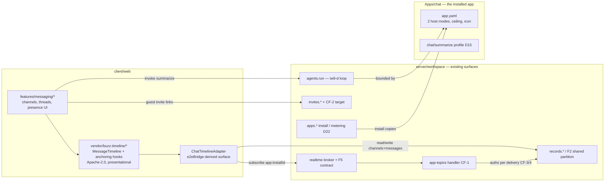

# Tech Plan — iw9-chat-flagship

## Context

Chat is Wave 2's flagship **app** — it validates that the Wave-0/1 platform
primitives compose. What exists when this change starts:

- **iw9-f2** (dep): shared partition with participant-list ACL, per-instance
  storage metering + cap + audited delete, immutable hosting mode on the
  install record. Enforcement lives above `IRecordStore`.
- **iw9-f5** (dep): hardened broker spec — async `onSubscribe`, stateless
  namespace handlers, bounded outbound queues, priority control channel,
  slow-client disconnect; invariant 7 codified (topics route, never
  authorize). Broker code: `server/workspace/src/realtime/broker.ts`
  (per-workspace conn/subscription maps, `NamespaceHandler` registration);
  presence pattern: `realtime/presence.ts` (socket-memory rosters, cleared
  on disconnect, never persisted).
- **iw9-b** (dep): `Apps/` tree, `app.yaml` manifest (via F4 grammar),
  install-as-copy, host-mode pick at install (D2), capability ceiling.
- **iw9-d** (dep): server-side agent loop (`agents.run`,
  `agents/runner.ts`), app agent profiles' execution substrate.
- **invites** (verified surface): `server/workspace/src/invites.ts` facade —
  `createInvite(workspaceId, email, role, groupIds, invitedBy)`, `get`,
  `listByWorkspace`, `revoke`, `consume`; `InviteRecord` with 7-day TTL;
  consume → workspace membership mint. Routes: `routes/invites.ts`.
- **buzz** (lift source, Apache-2.0, github.com/block/buzz): presentational
  `desktop/src/features/messages/MessageTimeline.tsx` (~50 props), hook
  cluster `useAnchoredScroll` / `useLoadOlderOnScroll` /
  `useVirtualizedBottomSettle` / `useTimelineRetention`, patched `virtua`
  (`patches/virtua@0.49.3.patch`, stable upward prepend), and
  `desktop/src/testing/e2eBridge.ts` — read as the **reference spec** for
  the adapter surface, never lifted as code (it is Nostr-shaped internally).
- **iw9-c** is parallel: Chat must not depend on approval cards; if they
  land they render through the platform, not through Chat code.

Chat's code is aprovan-only (brief's cross-repo table: "app code + client";
no registry work, no publishes).

## Goals / Non-Goals

**Goals:**

- Exercise every consumed primitive through its public surface — the app is
  the integration test; gaps become **findings** (below), never silent core
  code.
- One authorization function per concern, shared between the read path and
  the fan-out path, so invariant 7 holds by construction, not by discipline.
- A backend-agnostic timeline adapter (from the e2eBridge reference) so the
  lifted timeline stays presentational and iw9-doc can reuse the pattern.
- Bootstrap the repo's first Playwright E2E harness (tech-stack.md mandates
  Playwright; none exists — verified), scoped to Chat's flows.

**Non-Goals:**

- No broker sharding / scoped-topic bus migration (F5/D16 own the Wave-2
  destination); Chat targets the in-memory broker's public contract only.
- No Nostr concepts, no buzz composer or relay code.
- No generic "apps can register realtime namespaces" framework — Chat's
  namespace handler is one deliberate, minimal core touch, recorded as
  finding CF-1 with the generalization deferred to its owner.
- No message search, no per-message encryption, no offline queue.

## Findings — platform gaps (explicit, per the app-first rule)

Every place Chat NEEDS a platform primitive that does not exist. Each names
the owning stream; Chat builds the narrowest interim inside the boundaries
stated here. Implementers MUST append new findings here rather than adding
core endpoints silently.

- **CF-1 — App-scoped realtime topics.** Broker namespaces are registered
  by core code at boot; there is no surface for an app to receive fan-out
  for its instance's events. *Interim:* one generic core handler,
  `realtime/app-topics.ts`, namespace `app`, topic `app:<installId>`, whose
  per-connection delivery filter is a callback resolved from the install —
  generic over instances, zero chat-specific logic in core. *Owner:*
  F5-follow-up / runtime-interface deferral (actor-per-topic). *Exit:* when
  apps can declare topics in `app.yaml`, delete the interim registration.
- **CF-2 — Instance-targeted invites.** `invites.consume` mints a
  *workspace membership*; hosted-by-creator guests must NOT become members
  of the creator's personal workspace. Needed: an invite whose consumption
  target is an F2 **instance participant entry** (role `guest`) instead of
  a membership. *Interim:* extend `InviteRecord` with an optional
  `target: { kind: "app-instance"; installId: string }` handled in the
  consume path; absent target keeps today's behavior byte-identical.
  *Owner:* platform identity (post-IW-9 hardening owns generalization).
- **CF-3 — Guest principal authorization.** The authz path assumes a
  workspace member as principal; a guest touching a hosted instance in
  someone else's personal workspace needs authority derived from instance
  participation (intersecting, never unioning — invariant 2). *Interim:*
  guest authority is granted ONLY through F2's `partitionAccess`
  participant check plus Chat's channel ACL; guests get no workspace-level
  route access beyond the app surface. *Owner:* iw9-c's derived-authority
  work is the natural home; Chat states the required predicate.
- **CF-4 — Sub-partition read boundaries (restricted channels).** F2's ACL
  is per-instance; restricted channels and per-guest channel grants need a
  finer read boundary *within* one shared partition. *Interim:* channel
  membership is data (a `channel` record's member list); a single
  `canReadChannel(principal, channel)` helper is enforced at Chat's read
  surface AND at CF-1's delivery filter. Raw `records.*` reads by
  participants can see restricted-channel rows in the interim — accepted
  and documented for Wave 2 (guests are still excluded at the partition
  edge by CF-3; the invariant-7 E2E gate tests guests). *Owner:* F2
  extension ("prefix-scoped participant sub-lists") — proposed shape
  recorded here for its owner; Chat migrates when it lands.
- **CF-5 — App-shipped agent profiles. RESOLVED BY ASSIGNMENT (2026-08-09):
  owner is `iw9-d-agent-loop-server` stream 10.** D15 says apps may ship
  `<app>/<agent>` profiles bounded by app grants; the declaration,
  registration, and execution halves are now owned together by iw9-d (its
  tech-plan D7, `specs/app-scoped-agent-profiles/spec.md`), so there is no
  residual iw9-b dependency for Chat. *Interim:* none — still a hard
  dependency; Chat's stream 5 gate (tasks.md 5.1) now names iw9-d stream 10
  as the thing to verify has landed.

### Findings close-out (stream 12, 2026-08-12)

Re-checked against `origin/main` after streams 1–11:

| Finding | Status on main |
|---|---|
| CF-1 | Landed — `realtime/app-topics.ts` + boot register (#233, #234) |
| CF-2 | Landed — instance-targeted invites (#231) |
| CF-3 | Interim held — guest authority via F2 participant + `canReadChannel`; invariant-7 E2E (stream 12) gates delivery |
| CF-4 | Interim held — restricted-channel members list + delivery filter; raw `records.*` participant reads still accepted for Wave 2 |
| CF-5 | Landed by owner — iw9-d stream 10 (#220); Chat summarize profile (#236) |

No unanticipated platform gap discovered in stream 12 beyond already-documented
auth-none dual-principal limits (streams 10–11 reports: in-process broker fake
Conns + invite facade). Attribution: `client/web/NOTICE` +
`src/vendor/buzz-timeline/LICENSE` present (stream 6). Stream 12 itself adds
**zero** files under `server/workspace/src/` (core-touch claim unchanged:
only CF-1 `app-topics.ts` and CF-2 invite/identity paths).

(Playwright harness absence is an infra gap, not a platform primitive; Chat
bootstraps it — see T6.)

## Architecture



Component responsibilities (one each):

- **`Apps/chat` app definition** — `app.yaml` (slug `chat`, icon, two host
  modes, capability ceiling: `records.*` on own partition, `realtime`
  subscribe/publish on own topic, `invites` issue-for-instance, `agents.run`
  for its profile) + the `chat/summarize` profile. This is what installs
  copy (D8).
- **`client/web/src/features/messaging/`** — Chat's UI: channel list,
  thread pane, composer (ours, thin), presence/typing indicators, install
  flow surfaces (mode pick rendering is iw9-b's; Chat provides disclosure
  copy), host admin surface (metering/cap/delete via `apps.*`).
- **`client/web/src/vendor/buzz-timeline/`** — lifted presentational
  timeline + 4 hooks, headers retained, no local edits beyond import paths
  (divergences require a dated note in the vendor README).
- **`ChatTimelineAdapter`** (`features/messaging/adapter.ts`) — the only
  code that talks to the platform; implements the e2eBridge-derived
  interface below; reconciles realtime hints against canonical records.
- **`server/workspace/src/realtime/app-topics.ts`** (CF-1 interim, only
  core touch) — generic instance-topic namespace: async authz on subscribe
  (participant?), per-event delivery filter callback (channel-readable?),
  ephemeral presence/typing sub-protocol modeled on `presence.ts` (memory
  only, cleared on disconnect).
- **Playwright harness** (`client/web/e2e/`) — multi-browser-context flows
  (one context per user), tagged `@chat`.

## Decisions

### T1: Chat UI ships as a first-party client feature, app-shaped in authority

- **Choice**: Chat's UI lives in `client/web/src/features/messaging/` but
  is written against ONLY app-visible surfaces (its partition, its topic,
  its grants). The `Apps/chat` definition is the installable artifact; the
  client feature routes by installId.
- **Alternatives**: (a) Fully sandboxed app-widget UI — loses: no app
  runtime interface exists yet (explicitly deferred in IW-9); building one
  is not Chat's job. (b) `packages/ui` — loses: nothing else consumes it
  yet; premature extraction, iw9-doc can lift later when a second consumer
  is real.
- **Revisit if**: the runtime interface (deferred register) lands — Chat is
  then the first migration candidate.

### T2: Lifted buzz code is vendored, not npm-forked

- **Choice**: copy `MessageTimeline.tsx` + the four hooks into
  `client/web/src/vendor/buzz-timeline/` with Apache-2.0 headers retained,
  a `LICENSE` copy, and a top-level `NOTICE` entry ("Portions derived from
  block/buzz, Apache-2.0"). `virtua@0.49.3` pinned with buzz's patch via
  `pnpm patch` (`patches/virtua@0.49.3.patch` at aprovan root,
  `patchedDependencies` in root package.json).
- **Alternatives**: (a) publish a fork package — loses: one consumer, adds
  a publish pipeline for no isolation gain. (b) reimplement scroll
  anchoring — loses: the hook cluster + virtua patch is measured, subtle
  (upward prepend stability), and exactly why D24 chose the lift. (c) use
  unpatched virtua — loses: the patch is the point; upstream 0.49.3 jumps
  on prepend.
- **Revisit if**: virtua upstreams the fix (then drop the patch, keep the
  hooks) or iw9-doc needs the timeline (then extract to `packages/ui`).

### T3: One authz helper shared by read path and fan-out

- **Choice**: `canReadChannel(principal, instance, channel)` implemented
  once in the app's server-visible helper and referenced by (a) Chat's
  message read surface and (b) CF-1's delivery filter. Invariant 7 then
  cannot drift: there is no second implementation to diverge.
- **Alternatives**: separate subscribe-time ACL check — loses: that IS the
  anti-pattern invariant 7 exists to kill (revocation would not apply until
  reconnect). Per-topic-per-channel subscriptions
  (`app:<install>:ch:<id>`) with authz at subscribe — loses: same
  staleness problem, plus topic-explosion against the current broker's
  refcounting.
- **Revisit if**: F5's Wave-2 scoped-topic bus lands with dynamic
  refcounted subscribe AND run-time revocation hooks — then topic-per-
  channel becomes viable as routing (authz still re-applied at fan-out).

### T4: Realtime payloads are hints; the record store is truth

- **Choice**: fan-out events carry `{kind, channelId, recordId, seq}` plus
  a display hint; the adapter reconciles any gap (reconnect, drop, batch)
  by re-fetching the canonical window from `records.*`. No ordering or
  exactly-once assumptions (F5 contract).
- **Alternatives**: full message bodies as source of truth over the socket
  — loses: violates F5's delivery non-guarantees and invariant 8's posture
  (canonical rows behind access checks), and makes the slow-client
  disconnect lossy.
- **Revisit if**: never within IW-9; this is the F5 contract restated.

### T5: Presence/typing ride an ephemeral sub-protocol on the app topic

- **Choice**: presence (instance roster) and typing (channel-scoped,
  ~4s TTL client-side) are broker-memory state in the CF-1 handler,
  modeled on `realtime/presence.ts` (`ConnFocus`-style maps behind the
  handler, cleared on disconnect). Typing events are non-priority class
  (droppable under backpressure); membership/authority changes use the
  priority control channel.
- **Alternatives**: records-backed presence — loses: violates the brief
  ("never stored") and D22 (hosts would pay storage for liveness noise).
  Client-to-client gossip — loses: no fan-out authz point (invariant 7).
- **Revisit if**: F5 moves presence behind a broker-owned store — Chat
  follows the broker's surface, no app change expected.

### T6: Playwright bootstrap is Chat-scoped, two-context, real server

- **Choice**: `client/web/e2e/` + `playwright.config.ts` (webServer:
  local-locus workspace server + vite); flows drive TWO browser contexts
  (distinct users) against one server; invariant-7 assertions capture the
  guest context's raw WebSocket frames (Playwright `page.on("websocket")`)
  and assert zero restricted-channel events.
- **Alternatives**: vitest + mocked socket — loses: the change's whole
  point is E2E validation of real primitives; mocks validate nothing.
  Repo-wide E2E infra project — loses: scope creep; other streams can
  adopt the harness later.
- **Revisit if**: CI wall-time makes two-context flows flaky — shard per
  flow before weakening assertions.

### T7: Own composer, minimal

- **Choice**: plain textarea-based composer (send, shift-enter newline,
  typing signal emission) written fresh; no rich text in Wave 2.
- **Alternatives**: lift buzz composer — loses: D24 rejects it
  (Nostr-shaped). Adopt an editor package — loses: iw9-doc owns the
  editor-grade surface; premature here.
- **Revisit if**: iw9-doc lands a reusable CM6 inline editor.

## Interfaces & Data

Record shapes (zod, in `features/messaging/schema.ts`; stored in the F2
shared partition of the instance):

```ts
// key: ch#<channelId>
Channel = {
  id: Ulid, name: string, kind: "public" | "restricted",
  members?: UserSub[],          // restricted only; public ⇒ all participants
  createdBy: UserSub, createdAt: Iso,
}
// key: msg#<channelId>#<messageId>   (ULID ⇒ sortable window reads)
Message = {
  id: Ulid, channelId: Ulid,
  parentId?: Ulid,              // set ⇒ thread reply; server rejects replies-to-replies
  author: UserSub,
  agent?: { profile: "chat/summarize"; invoker: UserSub }, // agent-produced marker
  body: string,                 // markdown-lite, sanitized at render
  createdAt: Iso,
}
```

`ChatTimelineAdapter` — the delegation seam (shape derived from buzz's
`e2eBridge.ts` reference: window fetch + older-page fetch + live tail +
send + connection state; Nostr specifics dropped):

```ts
interface ChatTimelineAdapter {
  fetchWindow(channelId: string, opts: { before?: string; limit: number }): Promise<Message[]>;
  fetchOlder(channelId: string, beforeId: string, limit: number): Promise<Message[]>; // drives useLoadOlderOnScroll
  send(channelId: string, body: string, parentId?: string): Promise<Message>;
  onEvent(cb: (e: ChatRealtimeEvent) => void): Unsubscribe;   // hints; adapter reconciles
  connectionState(): "live" | "reconnecting" | "reconciling";
  presence(): InstancePresence;                                // ephemeral roster
  signalTyping(channelId: string): void;                      // fire-and-forget, droppable
}
```

Realtime wire (topic `app:<installId>`, CF-1 handler):

```ts
ChatRealtimeEvent =
  | { kind: "message"; channelId: Ulid; recordId: Ulid; seq: number; hint?: {author: UserSub; preview: string} }
  | { kind: "channel-membership"; channelId: Ulid }             // priority class
  | { kind: "presence"; roster: {sub: UserSub; lastActive: Iso}[] }  // ephemeral, never stored
  | { kind: "typing"; channelId: Ulid; sub: UserSub }           // droppable class
```

Delivery filter contract (CF-1 ⇄ Chat): the handler resolves
`deliveryFilter(conn, event) → boolean` per event per connection; Chat's
registration supplies `canReadChannel(conn.userId, installId, event.channelId)`
— the same helper the read path calls (T3).

Guest invite (CF-2 shape): `InviteRecord` + optional
`target: { kind: "app-instance"; installId: string; channelIds?: Ulid[] }`;
consume with target present mints an F2 participant entry
`{ sub, role: "guest", channelIds? }` and NO workspace membership.

`app.yaml` (iw9-b/F4 grammar; illustrative fields Chat declares): slug
`chat`, icon, `hostModes: [workspace-managed, hosted-by-creator]`,
capability ceiling (own-partition records, own-topic realtime,
instance-invites, `agents.run` for `chat/summarize`), agent profile
declaration `agents: [{ name: summarize, ... }]` (CF-5).

## Risks / Trade-offs

- [CF-4 interim lets non-guest participants read restricted-channel rows
  via raw `records.*`] → documented loudly in the app's admin surface copy
  and tech-plan; guests (the threat model's outsider) are excluded at the
  partition edge; F2 sub-list extension is the owned fix.
- [CF-2 touches the invite consume path — a core surface] → change is
  additive with `target` optional; absent-target behavior covered by
  existing tests plus a new regression test; grep-gate in both repos for
  any behavioral fork.
- [Buzz lift drifts from upstream / patch breaks on virtua bump] → pin
  virtua exactly at 0.49.3 with the patch; vendor README records upstream
  commit SHA; renovate/dependabot excluded for virtua.
- [Playwright multi-context realtime flows are flaky in CI] → per-flow
  isolation (fresh workspace per test), websocket-frame assertions bounded
  by explicit quiesce waits, retries=0 for the invariant-7 test (a flaky
  security assertion is worse than a slow one).
- [iw9-c lands mid-stream and changes grant UX under Chat] → Chat codes to
  B's install ceiling only; a nightly no-op check that Chat's E2E passes
  with and without C's flag if C introduces one.
- [Summarize reads long channels → cost blowup billed to invoker] →
  profile declares a context window budget (iw9-d's cost-ceilinged turn);
  summary scoped to a channel window, not full history.

## Rollout

1. Land after iw9-f2/f5/b/d are merged (hard deps); verify CF-5 is
   satisfied by their landed shapes before stream 6.
2. Core touches first (CF-1 handler, CF-2 invite target) behind no flag —
   both are inert without a Chat install.
3. App definition + adapter + UI; vendor lift with attribution in the same
   PR as first use (never ship lifted code without NOTICE).
4. Playwright harness + flows last; the two install-mode flows and the
   invariant-7 gate become required CI checks for the change's completion.
5. Rollback: uninstalling the app removes user-facing surface; CF-1/CF-2
   core touches are additive and can revert independently (no data
   migration in either direction; instance data lives in F2 partitions and
   is deleted by the existing audited instance-delete path).

## Open Questions

None requiring user input. Product decisions are settled in
IW-9-APP-FIRST.md; the judgment calls above (T1–T7) are recorded with
alternatives, and platform gaps are findings CF-1..CF-5 with named owners
rather than questions.
