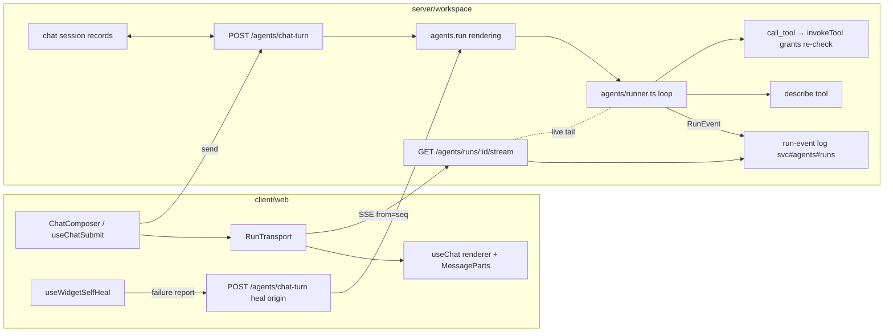

# Tech Plan — iw9-d `agent-loop-server`

## Context

Two loops exist today and D14 keeps exactly one:

- **Surviving loop** — `server/workspace/src/agents/runner.ts`: the native
  `@utdk/agent` runtime (contract source:
  registry/packages/contracts/agent/index.ts, consumed as the published
  `@utdk/agent` npm package). One generic `call_tool` whose description
  carries the grant-projection pattern list (runner.ts:209-230); the pattern
  list bounds the loop and `invokeTool` re-checks `ctx.grants` at dispatch
  (runner.ts:436-441) — invariant 3. Runs persist under `svc#agents#runs`
  (runner.ts:101-148) with turns, usage, stop reason. Declares
  `streaming: false` today (runner.ts:91); the contract's `streaming`
  capability is declared-but-unconsumed (registry/docs/agent-interface.md,
  "Deliberately deferred").
- **Dissolving loop** — the client: `DefaultChatTransport` against
  `POST /llm/:provider/chat`
  (client/web/src/features/chat/chat-transport.ts:81-116) with
  `formatToolSignatures` pasting up to `TOOL_PROMPT_CAP_PER_NAMESPACE = 40`
  signatures per namespace into the prompt; `resilientChatFetch`
  (client/web/src/lib/chat-transport.ts) splicing dropped streams from
  `llm-jobs` records (server/workspace/src/llm-jobs.ts — a text-only mirror,
  header: "mobile browsers kill the fetch the moment the screen locks");
  self-heal as an untracked client `sendMessage`
  (client/web/src/features/self-heal/useWidgetSelfHeal.ts).

Cross-repo rule (IW-9 "Cross-repo coordination"): stream D is
**aprovan-only** — no registry work, no publish. Anything that would touch
`@utdk/agent` sources is deferred (D3 below).

## Goals / Non-Goals

**Goals:**

- Run-event stream protocol + run-record shape published as typed interfaces
  early — iw9-c builds `pending_action` into the same stream; iw9-chat's
  `chat/summarize` profile rides `agents.run` unchanged.
- Runner emits events without changing its security shape: same pattern-list
  bound, same dispatch re-check.
- Chat client becomes a pure renderer of run events; resumability is
  structural (record-backed replay), not a fetch-splicing patch.
- `describe(namespace)` replaces prompt-pasting; system prompts carry
  patterns only.
- Self-heal turns traced and cost-ceilinged server-side.
- `llm-jobs.ts` deleted, grep-gated in both repos.
- App-scoped agent profiles unblocked end to end (CF-5): declaration
  grammar, manifest-derived resolution, and a narrowed `ctx.appScope` gate,
  so `chat/summarize` and `doc/fix-typos` have a surface to land on.

**Non-Goals:**

- Approval/queue semantics (iw9-c); vendor/harness runtimes; multi-task
  fan-out of the event stream (single gateway task assumed); changes to
  credential resolution (iw9-f3) or the realtime broker (F5/D16).

## Architecture



Components, one responsibility each:

- **`@aprovan/agent-protocol`** (new workspace package,
  `packages/agent-protocol`): zod schemas for `RunEvent`, the stream wire
  frames, and the chat-turn request/response — the seam server and client
  build against independently.
- **Runner event sink** (`agents/runner.ts`): the loop calls an injected
  `emit(event)`; it never knows who is listening.
- **Run-event log** (`agents/run-events.ts`, new): appends events to the run
  record (batched), serves replay-by-seq, fans out to live SSE subscribers.
- **Chat-turn route** (`routes/agent-chat.ts`, new): session lookup/lazy
  create, message persistence, run start, run-id-on-session bookkeeping,
  self-heal gating.
- **Stream route** (`routes/agent-chat.ts`): SSE endpoint, replay + tail.
- **RunTransport** (client `features/chat/run-transport.ts`, new): AI SDK
  `ChatTransport` implementation mapping RunEvents → UI message stream parts;
  owns reconnect-with-`from`.
- **MessageParts** (existing): renders parts; tool parts now sourced from
  `tool_call_*` events; widget fences unchanged (widget-fences.ts operates on
  streamed text exactly as today).

## Decisions

### D1: Transport = run-record event log + SSE replay endpoint

- **Choice**: Persist RunEvents on the run record; `GET
  /agents/runs/:id/stream?from=<seq>` (SSE) replays `seq >= from` then tails
  live emission. Durability and streaming are one mechanism — the llm-jobs
  idea (persist independent of the client) generalized from text to events.
- **Alternatives**:
  - *Ride `streaming-sessions`* (openspec/specs/streaming-sessions,
    routes/sessions-streaming.ts): rejected — sessions are process-local and
    expiring by design (its D5), with push/close lifecycle for tool sessions
    like STT; a run must outlive any session object and answer replays after
    it is terminal. We reuse its SSE frame discipline (`{type, seq, data}`)
    but not its lifecycle.
  - *Keep the AI-SDK UI message stream + job splicing*: rejected — jobs
    mirror text only (llm-jobs.ts `text: string`); tool calls, turns, and
    approvals (iw9-c) have no representation, which is the special-casing
    D14 dissolves.
  - *WebSocket via the realtime broker*: rejected — broker hardening is F5
    and invariant 7 makes topics routing-only; an SSE GET with a `from`
    param is resumable-by-construction and needs no broker semantics.
- **Revisit if**: the gateway becomes multi-task (fan-out needs a shared
  bus — the D16 scoped-topic bus is the named successor for the *live tail*;
  replay stays record-backed).

### D2: Client keeps AI SDK rendering; transport is replaced underneath

- **Choice**: Keep `useChat`/`UIMessage` and MessageParts.tsx; implement the
  AI SDK `ChatTransport` interface over the run protocol (start run → attach
  stream → translate RunEvents to UI stream parts). Tool parts map
  `tool_call_started/finished` onto the existing `tool-*`/`dynamic-tool`
  part shapes MessageParts already renders (MessageParts.tsx:192-213).
- **Alternatives**:
  - *Drop the AI SDK entirely*: rejected — MessageParts, widget-fence
    extraction, and reasoning rendering are UIMessage-shaped and work; the
    problem is the loop, not the rendering.
  - *Keep `DefaultChatTransport` pointed at a server shim that emits the
    UI message stream*: rejected — freezes the wire at the AI SDK's format,
    leaving `pending_action` (iw9-c) nowhere to live; the run protocol must
    be ours.
- **Revisit if**: the AI SDK's transport interface changes incompatibly —
  the RunTransport is the only file that knows both vocabularies.

### D3: Protocol types live in a new aprovan workspace package

- **Choice**: `packages/agent-protocol` (`@aprovan/agent-protocol`,
  `workspace:*` dependency of `@aprovan/workspace` and
  `@aprovan/patchwork-web`), zod schemas, depending on the published
  `@utdk/agent` for `AgentRunStatus`/`AgentStopReason`/`AgentUsage`.
- **Alternatives**:
  - *Extend `@utdk/agent` in registry*: rejected for this change — the
    cross-repo table gives stream D no registry work and no publish, and
    publish-before-pin would serialize D behind a registry release.
    Upstreaming `RunEvent` into the contract is the named follow-up once a
    second runtime streams.
  - *Duplicate types in client and server*: rejected — drift is how this
    codebase acquired duplicate implementations twice (IW-9 serialization
    preamble).
- **Revisit if**: a second consumer outside this monorepo needs the
  protocol → upstream to `@utdk/agent` (registry publish, separate change).

### D4: Chat turns go through `agents.run` rendering with an ephemeral profile

- **Choice**: A dedicated route (`POST /agents/chat-turn`) builds
  `AgentRunArgs` through the same rendering used by `agents.run`
  (agents/service.ts:381-487): the workspace's chat defaults (provider/model
  from the request, tool patterns from the caller's grants) form an
  ephemeral profile when the session names no agent; when iw9-chat ships
  `chat/summarize`, the session's agent name selects that stored profile and
  nothing else changes. Grants projection → pattern list → `call_tool` +
  `describe` exactly as any run.
- **Alternatives**:
  - *Client calls `agents.run` via the generic tools surface*: rejected —
    session bookkeeping (lazy create, message persistence, run-id-on-session,
    heal gating) is chat-specific and would smear into the client, which is
    the shape being deleted.
  - *A separate chat loop beside the runner*: rejected outright — two loops
    is the D14 disease.
- **Revisit if**: never for the two-loop question; the ephemeral-profile
  shape folds away naturally when profiles become mandatory.

### D5: Self-heal = heal-origin chat turn with server-enforced budget

- **Choice**: The client keeps `useWidgetSelfHeal`'s arming logic but its
  action becomes `POST /agents/chat-turn { origin: "self-heal", failure }`.
  The server re-validates the per-message and consecutive caps against the
  session record, then starts a run with tight limits
  (`limits: { maxTurns, maxToolCalls, wallClockMs }` + token ceiling) and a
  `meta.origin = "self-heal"` marker.
- **Alternatives**:
  - *Fully server-side detection*: rejected — only the client knows a widget
    failed to compile/mount (iframe + compiler live there).
  - *Keep client `sendMessage` self-heal*: rejected — untracked spend and
    unenforceable bounds; the spec's misbehaving-client scenario is real.
- **Revisit if**: widget compilation moves server-side.

### D6: llm-jobs deletion order

- **Choice**: Chat first (transport swap makes `x-llm-job` unread), then the
  widget-edit path (`useEditTransport`/`runChatCompletionJob` →
  run-record-backed single-turn run or plain resumable run stream), then a
  one-release deprecation of `GET /llm/jobs/:id`, then delete
  `llm-jobs.ts` + job writes in routes/llm.ts, grep-gated in both repos.
- **Alternatives**: delete immediately with chat (rejected: widget edits
  still poll jobs; in-flight mobile clients hold job ids across deploys).
- **Revisit if**: telemetry shows zero `GET /llm/jobs/:id` hits earlier —
  delete earlier.
- **Amendment (execution-time)**: the "one-release deprecation" step is
  replaced by an evidence gate with the same safety intent — no in-repo
  callers in either checkout, parity/E2E green without the job path, and a
  written compatibility assessment for clients holding a job id across the
  deploy. A calendar window cannot be executed or honestly checked inside
  this change; the evidence can. Failing evidence produces a recorded
  blocker and no deletion (tasks.md 9.3-9.5).

### D7: App-scoped agent profiles are manifest-declared and runtime-derived (CF-5)

- **Choice**: this change owns the whole app-profile seam. (1) *Declaration*:
  an optional `agents` block in `app.yaml`, added additively to iw9-f4's
  `AppYamlSchema` (`apps/manifest.ts`), whose per-agent `tools` patterns must
  fall inside the app's own declared capability ceiling. (2) *Registration*:
  there is none — the declaration **is** the registration. A new
  `agents/app-profiles.ts` renders an in-memory `AgentProfile` from the app's
  last-reconciled manifest snapshot (F4's `AppRecord.declared`) on each
  resolve. (3) *Execution*: the `ctx.appScope` gate in `agents/service.ts`
  narrows so `run` is permitted for `<own-slug>/<agent>` resolving through
  (2), while every other `run` and all `create`/`update`/`delete` keep their
  existing 403. Effective authority is the declared patterns ∩ app grants ∩
  invoker grants, computed at run render; the runner's dispatch re-check is
  untouched.
- **Why here**: CF-5 was recorded UNASSIGNED in
  `IW-9-EXECUTION-OVERVIEW.md` (finding 1) with the recommendation to fold it
  into iw9-d, which owns the agents service and the loop. Both flagships
  (`chat/summarize`, `doc/fix-typos`) hard-block on it with no interim, and
  neither may fix core code.
- **Alternatives**:
  - *Persist a registered profile record at install time*: rejected —
    violates invariant 3 (authority derived at run time, never snapshotted)
    and would need a write path inside iw9-b's install code, splitting the
    seam across two changes and leaving both flagships waiting on the slower
    half.
  - *Let apps call `agents.create` for their own namespace*: rejected —
    invariant 11 (agents propose; people instantiate) and the original
    comment's reasoning (an app could otherwise mint itself a wide grant).
  - *Leave the grammar to iw9-b*: rejected — no iw9-b stream mentions agents
    or profiles, so "B owns the manifest half" is unowned in practice; the
    file itself (`apps/manifest.ts`) is iw9-f4's, Wave 0, landed, and touched
    by no B stream, so a single additive edit from here is the coherent
    assignment.
- **Revisit if**: a second, non-manifest declaration source appears (e.g.
  profiles shipped by a registry package) — then the resolver grows a source
  dimension, not the gate.

## Interfaces & Data

The seams. iw9-c and iw9-chat consume these shapes; two agents can build
either side independently.

### RunEvent (in `@aprovan/agent-protocol`)

```ts
type RunEvent =
  | { type: "run_started"; seq: number; runId: string; at: string;
      agent?: string; model?: string; sessionId?: string }
  | { type: "turn_started"; seq: number; turn: number; at: string }
  | { type: "assistant_delta"; seq: number; turn: number; text: string }
      // fenced widget content passes through verbatim, in order
  | { type: "tool_call_started"; seq: number; turn: number; callId: string;
      namespace: string; operation: string; args: Record<string, unknown> }
  | { type: "tool_call_finished"; seq: number; turn: number; callId: string;
      ok: boolean; resultPreview?: string; error?: string; durationMs: number }
  | { type: "turn_finished"; seq: number; turn: number }
  | { type: "run_finished"; seq: number; status: AgentRunStatus;
      stopReason: AgentStopReason; usage: AgentUsage; output?: string }
  | { type: "error"; seq: number; message: string }
  // RESERVED for iw9-c — registered in the union, never emitted here.
  // Shell-decision (invariant 6): the payload identifies the queued action;
  // the client shell renders who/what/credential from it.
  | { type: "pending_action"; seq: number; turn: number; actionId: string;
      capability: string; resource?: string; payload?: unknown };
```

Rules: `seq` starts at 0, gapless, per run. Unknown types MUST be skipped by
consumers (forward compatibility — this is what lets iw9-c add
`pending_action` producers without a client flag day).

Persistence is a property of the runner, not of a caller: **every** native
run appends its events to its record, whatever started it (`agents.run`,
the chat-turn route, self-heal, a test). The injected `emit` is an
additional live sink, overridable in tests; it never decides whether events
are recorded. Otherwise an `origin: "api"` run would answer replay
differently from a chat run, which the agent-run-stream spec does not
permit.

### Run record extension (`StoredAgentRun`, agents/runner.ts)

```ts
interface StoredAgentRun extends AgentRun {
  agent?: string;
  sandboxId?: string;
  // NEW
  events?: RunEvent[];        // the persisted log (delta-batched appends)
  lastSeq?: number;           // == events.at(-1).seq; cheap resume answer
  origin?: "chat" | "self-heal" | "api";
  sessionId?: string;         // chat session this run belongs to, if any
}
```

Retention: existing `RUNS_MAX_RETAINED` pruning applies; `events` on pruned
runs go with the record.

### HTTP surface (gateway)

```
POST /agents/chat-turn
  { sessionId?: string,            // absent → lazy-create (staged, seed title)
    text: string,
    provider?: string, model?: string,
    contextFiles?: string[],
    origin?: "user" | "self-heal",
    failure?: { messageId: string; path?: string; error: string } }
  → 200 { runId, sessionId, streamUrl }
  → 409 read-only session; 429 self-heal cap exceeded

GET /agents/runs/:id/stream?from=<seq>     (SSE)
  frames: `data: <RunEvent JSON>\n\n`, replay then live tail,
  closes after run_finished/error replayed or emitted.
```

`agents.get/cancel/runs` are unchanged (runner.ts dispatch, agents.cancel is
the only cancellation path).

The mount prefix and both paths are **frozen contract**, not an
implementation choice: `@aprovan/agent-protocol` exports
`AGENTS_ROUTE_PREFIX = "/agents"`, `chatTurnPath()` and
`runStreamPath(runId, from)`; the gateway mounts the router at that prefix
and the `streamUrl` returned by `POST /agents/chat-turn` is
`runStreamPath(runId, 0)`. Server and client build every URL from those
helpers so the two sides cannot drift. (The `agents.*` tools namespace is
served under `/tools`, so `/agents` does not collide.)

### App agent declaration (`app.yaml`, additive to iw9-f4's `AppYamlSchema`)

```yaml
agents:
  - name: summarize            # slug rules; addressed as <app-slug>/<name>
    description: ...
    prompt: ...                # or a manifest-relative path, per app conventions
    llm: { interface: llm, profile: fast }   # optional pin
    tools: ["chat.messages.*"] # MUST be inside the app's capability ceiling
```

```ts
// server/workspace/src/agents/app-profiles.ts (new)
resolveAppProfile(workspaceId, appId, name): Promise<AgentProfile | undefined>
// rendered from AppRecord.declared each call — no stored profile record.

// AgentProfile gains provenance, set only by the resolver:
app?: { appId: string; slug: string }
```

Effective run authority = declared `tools` ∩ app installed grants ∩ invoker
grants, computed inside `renderAgentRun`'s existing path. Refusals keep the
current shape: `ServiceError("Apps cannot manage or run agent profiles", 403)`.

### Chat session record extension

```ts
interface ChatSessionInfo {
  /* existing fields unchanged */
  activeRunId?: string;   // set at run start, cleared at terminal event
}
```

Messages (user + completed assistant transcript) persist on the session as
today's history mechanism; a reloading client renders history, then attaches
to `activeRunId` if set.

### describe tool (runner built-in, beside call_tool)

```ts
// request (model-visible function schema)
describe: { namespace: string; query?: string; cursor?: string }
// result
{ namespace: string,
  operations: Array<{ operation: string; params: string;   // "a, b?, c?"
                      description?: string }>,
  cursor?: string, remaining?: number }
// refusal (ungranted namespace): { error, allowed: string[] } — recoverable
```

Backed by the same catalog `describeNamespaces` uses
(routes/tools.ts:755-829), filtered through the run's pattern list. Page cap
~40 operations per response; `registry.search` remains the cross-namespace
tail.

### Agent-profile pass-through (iw9-chat's seam)

`POST /agents/chat-turn` resolves the run's profile as: session's `agent`
name (stored profile, D15 grants intersection) → else ephemeral chat profile
from the request's provider/model + caller grants. iw9-chat ships a profile
and sets the session field; no transport change.

## Risks / Trade-offs

- [Event log bloats run records] → delta-batched appends,
  `resultPreview` truncation reusing `MAX_RECORDED_RESULT_BYTES` discipline,
  existing retention pruning; assistant text stored once (deltas compacted
  into the turn transcript at terminal write).
- [Process restart mid-run kills the loop] → unchanged from today (runner
  header documents orphan settling); the record's last events make the
  partial transcript visible instead of lost — an improvement, not a
  regression.
- [SSE through CloudFront stalls silently] → keepalive comments on the
  stream (the routes/llm.ts first-byte lesson, routes/llm.ts:338-344);
  client reattaches with `from` on stall, which is cheap because replay is
  record-backed.
- [Parity regressions while swapping the transport] → dedicated parity work
  stream in tasks.md with per-behavior validation tasks; legacy path deleted
  only after parity tasks pass.
- [iw9-c ships against a protocol that then changes] → `pending_action` is
  in the union from day one and unknown-type tolerance is a spec scenario;
  protocol package is the single source.
- [Narrowing the app-scope gate widens authority by accident] → the
  permitted case is exactly "the calling app's own manifest-declared
  profile"; authority is an intersection computed at render, the runner's
  dispatch re-check is untouched, and the spec's "Declaration does not widen
  authority" scenario is the regression test. Reviewed as a security change
  (Opus tier per the execution overview's escalation criterion).
- [Two writers of the chat transcript during the flag window] → the
  server-owned append is idempotent per `(sessionId, messageId)` and the
  client-side writer is deleted at flip time (tasks 5.2, 8.10), so the
  overlap cannot double-write and the post-flip state has exactly one
  writer.

## Rollout

1. Protocol package + runner event emission + stream endpoint land first
   (no client change; `streaming: true` flips with the endpoint).
2. Chat-turn route + session bookkeeping.
3. Client RunTransport behind a dev flag; parity checklist runs against it.
4. Flag flips; legacy transport, prompt-pasting, and self-heal client loop
   deleted (grep gates).
5. Widget-edit path off llm-jobs; deprecation notice on
   `GET /llm/jobs/:id`; delete llm-jobs.ts once the evidence gate passes
   (grep gates, both repos) or record the blocker.
6. App-scoped agent profiles (D7/CF-5), ordered right after step 2 (it
   shares `agents/service.ts` with the chat-turn route and must not run
   concurrently with it); independent of steps 3-5, and the exit condition
   for both flagship gates.

Rollback per step is a revert; the legacy path exists until step 4, and step
5 starts only after step 4 has soaked one release.

## Open Questions

None blocking (D14/D15 settled). The `GET /llm/jobs/:id` deprecation is no
longer an open question: D6's amendment above converts it into the
executable evidence gate in tasks.md 9.4-9.5.

## Verification addendum (pre-tasks file:line audit)

Every file:line claim above was re-checked against the working tree before
writing tasks.md. No deviations found — `runner.ts` streaming:false (~L91),
`StoredAgentRun`/`RUNS_MAX_RETAINED` (~L101-105), `callToolSchema` (~L208),
the grant re-check in the tool-call loop (~L435-441), `renderAgentRun` in
`agents/service.ts` (~L391-483), `describeNamespaces` in `routes/tools.ts`
(L756, `GET /tools` handler L830), `vcs.restore` schema (`routes/tools.ts`
L362), `chat-transport.ts`'s `TOOL_PROMPT_CAP_PER_NAMESPACE`/
`formatToolSignatures`/`DefaultChatTransport`, `lib/chat-transport.ts`'s
`resilientChatFetch`, `llm-jobs.ts` in full, `routes/llm.ts`'s job creation
(~L338-363, the "job-backed, first-byte-immediately" comment), `x-llm-job`
header (L404, echoed at L399 in `chat-transport.ts`), `GET /llm/jobs/:id`
(~L847-865), `useWidgetSelfHeal.ts` in full (`MAX_WIDGET_AUTOFIXES = 2` at
`client/web/src/contexts/widget-error-reporter-context.tsx:19`),
`MessageParts.tsx` tool-part rendering (~L192-213), and the registry
contract's `streaming: boolean` capability field
(`registry/packages/contracts/agent/index.ts:128,145`, deferred note in
`registry/docs/agent-interface.md:594-595`) all match as described.

Two client-side integration points exist that the Architecture section
named generically ("Composer / useChatSubmit → RunTransport") — recorded
here so tasks.md can cite them precisely:

- **`client/web/src/pages/ChatPage.tsx:74-108`**: `useChatTransport(...)`
  builds the transport object; `useSessionOrchestration` (new file:
  `client/web/src/features/sessions/useSessionOrchestration.ts`) wraps it
  into the AI SDK `Chat` instances (`session.sessionChat` /
  `session.bootChat`) that `useChat({ chat })` reads. RunTransport replaces
  the object `useChatTransport` returns; `useSessionOrchestration` and the
  `useChat({ chat })` call are unchanged.
- **`client/web/src/features/sessions/useSessionChatSync.ts`**: already
  persists the AI SDK `messages` array onto the session record
  (`lastPersistedCountRef`-gated) — this is the "both the user message and
  the completed run's transcript SHALL be persisted on the session" plumbing
  the chat-agent-transport spec requires; the chat-turn route's message
  persistence must not double-write against it (tasks.md stream 5 decides
  where the write happens).

Session/message storage ground truth (not previously cited by file:line):
`server/workspace/src/vcs/chat-sessions.ts` — record scopes
`svc#chat#sessions/<id>` (session) and `svc#chat#session#<id>/<seq10>#<messageId>`
(one transcript message per record, append-only per `specs/record-store`
"Transcripts append as per-message records"); exposed to the client as the
`sessions` tool namespace (`client/web/src/lib/chat-sessions.ts`,
`invokeNamespaceTool("sessions")`: `create`/`get`/`list`/`messages`/`append`/
`update`/`sync`/`close`/`delete`/`discard`). Lazy creation is
`useChatSubmit.ts:154-167` (`createChatSession({ mode: "staged", title:
seedTitle })`, guarded by `pendingCreateRef`). `ChatSessionInfo` (the
"session record" the PRD/specs reference) is defined at
`client/web/src/lib/chat-sessions.ts:25-39` and currently has no
`activeRunId`-shaped field — confirming the chat-agent-transport spec's
session-record extension is new, not a rename.

### Second audit (pre-delegation, 2026-08-09)

Re-verified before briefs were cut; full results in `briefs/deviations.md`.
Two things that change task text rather than just line numbers:

- **A second client lazy-create call site exists**:
  `client/web/src/features/sessions/useSessionOrchestration.ts:128`
  (`createChatSession({ mode })`) alongside the cited
  `useChatSubmit.ts:157`. It is outside the send path and stays client-side;
  the chat-turn route must accept an already-created `sessionId` from either
  origin (tasks.md 5.1).
- **`GET /llm/jobs/:id` has drifted**: the handler is at
  `routes/llm.ts:841-848`, not `~847-865` (tasks.md 9.3 updated). The
  `x-llm-job` header at `routes/llm.ts:404` and the job-backed comment at
  `~L344` are unchanged.

Spot-checked and still exact: `runner.ts:91` (`streaming: false`),
`runner.ts:102` (`RUNS_MAX_RETAINED`), `runner.ts:105` (`StoredAgentRun`),
`runner.ts:209` (`callToolSchema`), `runner.ts:436` (`toolGranted`
re-check), `routes/tools.ts:756` (`describeNamespaces`),
`vcs/chat-sessions.ts:60`, `lib/chat-sessions.ts:25`,
`useChatSubmit.ts:149` (read-only gate), `MessageParts.tsx:192`,
`widget-error-reporter-context.tsx:19` (`MAX_WIDGET_AUTOFIXES = 2`),
`useWidgetSelfHeal.ts:53-55/63/75`, `chat-transport.ts:16`, and
`agents/service.ts:648-658` (the CF-5 `ctx.appScope` gate).
`renderAgentRun` is at `agents/service.ts:394` (cited as ~L391).
