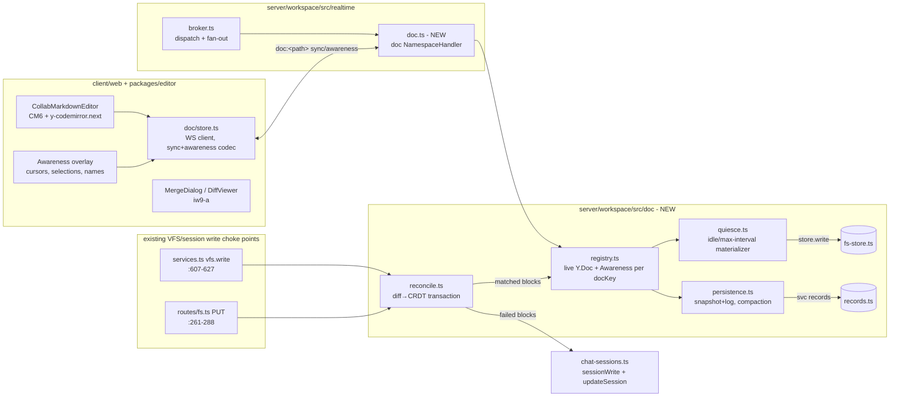

## Context

Editing a workspace `.md` is single-writer today: `vfs.write` always replaces
the whole file. Three concrete choke points on that path, all verified:

- **Tool/agent writes** — `services.ts`'s `vfs` `CoreService`, `write` case
  (`server/workspace/src/services.ts:607-627`): resolves the path, checks
  grants/partition/mount, then either `sessionWrite(...)` when the caller
  passed a `staged` session id in `args["session"]` (`stagedSession`,
  `services.ts:385-400`) or `store.write(...)` straight to main. This is the
  path `agents.run`'s `call_tool` reaches (`invokeTool` →
  `CORE_SERVICES = PLATFORM_PLUGINS`, `services.ts:944-947`) — the choke
  point for the `doc/fix-typos` profile's `vfs.write`.
- **Direct HTTP file edit** — `routes/fs.ts` `PUT /:path` (`routes/fs.ts:261-288`):
  same staged/main branch, called by the plain file-editor UI's manual save.
- **Isolate-hosted native provider** — `native-dispatch.ts`'s `vfsBackend.write`
  (`native-dispatch.ts:69-102`): the credentialless in-process short-circuit
  for workflow/app code; calls `store.write` directly with no session
  awareness at all.

None of the three knows a live CRDT document can exist at a path. Humans
never go through any of them while collaborating — that traffic is entirely
new: a live Yjs doc synced over the realtime broker.

**Sessions and drafts already exist** (`vcs/chat-sessions.ts`): a
`ChatSessionRecord` has `mode: "auto" | "staged"` (`chat-sessions.ts:57`).
`auto` writes straight through main (today's default, unchanged); `staged`
keeps edits in a per-session overlay (`sessionWrite`, `chat-sessions.ts:335-353`)
resolved later. `updateSession` (`chat-sessions.ts:158-182`) flips
`auto → staged` for any open session with no precondition beyond "session is
open" — this is the exact primitive D11's "conflict flips the session to a
draft" needs; nothing new to build there. Today's `resolveSessionMerge`
(`chat-sessions.ts:500-524`) takes one `strategy` for the whole session, not
per-file choices — iw9-a's tech-plan (`Interfaces & Data`) freezes the target
shape (`sessions.resolve` with per-file `{path, choice, content?}`) that this
change builds against; the doc conflict path is designed for iw9-a's target
interface, not today's single-strategy code.

**Diff/merge machinery already exists**: `packages/editor/src/lib/diff.ts`
exports `parseDiffs`/`applyDiffs` (`diff.ts:220-251,321-363`) with
whitespace/indent-tolerant fuzzy matching (`applyFuzzyDiff`, `diff.ts:261-319`).
It operates on plain strings — no DOM/CM6 dependency — so it is reusable
server-side as-is.

**Realtime broker already reserves the seam this change fills**:
`realtime/protocol.ts:15,24-27` —
`RESERVED_NAMESPACE_DOC = "doc"` with the comment "future Yjs/Loro CRDT
document sync (path-keyed like presence). Not implemented in v1." —
`broker.ts:84-91` rejects it with `reserved-namespace` until a handler
registers. `presence.ts` (`createPresenceHandler`, `presence.ts:69-195`) is
the namespace-handler pattern to model the `doc` handler after: same
path-keyed topic grammar (`presence:<path>` → `doc:<path>`), same
`registerNamespace` call site (`socket.ts:154-157`, right next to presence's
registration).

**CM6 is present, Yjs is not**: `packages/editor/package.json` carries
`@codemirror/state@^6.7.1`, `@codemirror/view@^6.43.6`, `codemirror@^6.0.2` —
no `yjs`, `y-protocols`, or `y-codemirror.next` anywhere in either repo
(verified by grep). `packages/editor/src/ts/index.tsx:9,24-25` is the
existing CM6 host pattern (`basicSetup`/`EditorView` from `"codemirror"`,
`Compartment`/`EditorState` from `"@codemirror/state"`) — the template for a
new live-editing host, not `MarkdownEditor.tsx` (TipTap/ProseMirror, no CM6
import) and not `CodeBlockView.tsx` (Shiki, read-only preview).

**Durable storage substrate already solves the size problem**: `records.ts:28-36`
documents the record store's two backends — SQLite locally (no practical
limit), DynamoDB in AWS with JSON items spilling to the `FS_BUCKET` S3
prefix above `SPILL_THRESHOLD_BYTES = 350 * 1024` (`records.ts:105`). This is
the substrate for Yjs snapshot + update-log storage; no new storage
subsystem is needed.

External dependencies (consumed, not modified, per IW-9's serialization
rules):

- **iw9-f5** `realtime-broker`: `doc` MUST wait for the async
  `NamespaceHandler` contract (`onSubscribe(): Promise<{body?}>`) — a doc
  join needs an async durable-state load, which today's *synchronous*
  `onSubscribe` (`broker.ts:24`, pre-F5) cannot do. `storeFor`/`authorize`
  from the same contract are also consumed (see Decisions).
- **iw9-a** `app-vcs-consolidation`: `DiffViewer`/`ChangeList`
  (`packages/editor`), the target per-file `sessions.resolve` shape, and
  two-parent merge commits — the merge surface a draft resolves through.
- **iw9-b** `app-model-app-centric`: `Apps/` tree + `app.yaml` reconcile,
  install-as-copy + managed-only host mode, and `vfs` person/link sharing
  (`svc#vfs#shares`, `GET /share/<key>[/subpath]`) — Document's anonymous
  read path is entirely iw9-b's structural invariant-9 route; this change
  adds no anonymous-facing code.
- **iw9-d** `agent-loop-server`: `agents.run` rendering, `RunEvent` stream,
  `StoredAgentRun.sessionId?` (optional — a run may have no owning chat
  session, see Decision D3).
- **iw9-f4** `app-identity`: `AppYaml` schema/loader, `reconcileApp`.

## Goals / Non-Goals

**Goals:**

- One live Yjs doc per `(workspaceId, path)`, server-authoritative, synced
  over the broker's new `doc` namespace with y-protocols sync + awareness.
- A new CM6 + `y-codemirror.next` editing host in `packages/editor`
  (Markdown-first, per D17/D18 — not a retrofit of TipTap or Shiki preview).
- Quiesce materialization to plain `.md` via the existing VFS write path,
  with no CRDT metadata on disk, ever.
- Agent whole-file writes reconciled via `diff.ts`'s SEARCH/REPLACE
  machinery into one Yjs transaction; unresolvable regions escalate to a
  staged session using the *existing* session/overlay primitives — zero new
  draft machinery.
- Durable snapshot + update-log persistence on the existing record-store
  substrate, with required compaction.
- Document ships as a real `app.yaml` app (managed-only) with a bundled
  `doc/fix-typos` profile — contingent on the shared CF-5 finding below.

**Non-Goals:**

- No new CRDT storage subsystem, no new HTTP endpoint for doc sync (the
  broker `doc` topic carries everything — see Findings), no binary WS
  framing (base64-in-JSON, see D1).
- No slides/sheets, no offline-first local Yjs persistence, no block editor
  (IW-9 Deferred / PRD Non-Goals).
- No changes to `packages/editor/src/lib/diff.ts`'s matching algorithm — it
  is consumed as-is.
- No new anonymous-read code path — iw9-b's share route is reused unmodified.

## Architecture



Single responsibilities:

- **`server/workspace/src/doc/registry.ts`** (new): owns the in-memory
  `Map<docKey, LiveDoc>` — `{ doc: Y.Doc, awareness: Awareness,
  participants: Set<connId> }` — load-on-first-join,
  release-after-last-leave-and-persist. **Not** layered on iw9-f5's
  `broker.storeFor()` (see Decision D-registry).
- **`server/workspace/src/doc/doc-namespace.ts`** (new): the `NamespaceHandler`
  for topic `doc:<path>`, modeled on `presence.ts`; owns wire framing only
  (base64 sync/awareness frames in/out), delegates all Yjs state to
  `registry.ts`.
- **`server/workspace/src/doc/quiesce.ts`** (new): idle/max-interval timers
  per live doc; on fire, serializes `Y.Text` and calls the plain VFS write
  path (`store.write`, no session).
- **`server/workspace/src/doc/persistence.ts`** (new): durable snapshot +
  update-log read/write on `svc-records.ts`, plus the compaction pass.
- **`server/workspace/src/doc/reconcile.ts`** (new): the diff→CRDT
  transaction function, called from both write choke points before they
  fall through to `store.write`/`sessionWrite`.
- **`packages/editor/src/components/CollabMarkdownEditor.tsx`** (new): CM6 +
  `y-codemirror.next` binding, modeled on `ts/index.tsx`'s host pattern.
- **`client/web/src/features/document/store.ts`** (new): WS client for the
  `doc` topic, modeled on `features/presence/store.ts`.

## Findings — platform gaps (explicit, per the app-first rule)

Following the convention established in `iw9-chat-flagship/tech-plan.md`
("Findings — platform gaps"): every place this change needs a platform
primitive that does not exist yet. Document needs exactly one, and it is
**shared with Chat**:

- **Shared with CF-5 — App-shipped agent profiles.** D15 says apps may ship
  `<app>/<agent>` profiles bounded by the app's grants. Verified blocker:
  `agents/service.ts:642-660` — any call with `ctx.appScope` set to
  `agents.create`/`agents.update`/`agents.run` throws `"Apps cannot manage
  or run agent profiles"` (403), by design ("an app could otherwise mint
  itself a wide grant"). `AgentProfile` (`agents/service.ts:67-104`) has no
  app-provenance field and no declaration surface in `app.yaml`. This
  blocks `doc/fix-typos` identically to how it blocks `chat/summarize`
  (`iw9-chat-flagship/tech-plan.md` CF-5). *Interim:* none — hard
  dependency, not worked around locally. *Owner:* **assigned 2026-08-09 to
  `iw9-d-agent-loop-server` stream 10**, which takes declaration
  (`app.yaml` `agents:` grammar), registration (manifest-derived resolution
  — declaration *is* registration), and execution (narrowed `ctx.appScope`
  gate) as one seam, so neither flagship waits on a split owner; this
  change's app-profile stream does not start until that stream lands.
  *Exit:* `doc/fix-typos` is declared in `Apps/document/app.yaml`'s
  `agents:` block and runs through `agents.run`, per iw9-d's
  `specs/app-scoped-agent-profiles/spec.md`.

No other new core primitive is needed: the `doc` realtime namespace was
reserved specifically for this (`protocol.ts:15,24-27`) and the async
`NamespaceHandler` contract it needs is iw9-f5's stated Wave-0 deliverable
(external dependency, not a gap this change discovers); the durable
snapshot/log storage need is met by the existing record store
(`records.ts:28-36`); the anonymous read path is entirely iw9-b's existing
share route.

## Decisions

### D1: Yjs sync + awareness ride the broker's `doc` namespace as base64-in-JSON frames

- **Choice**: Un-reserve `RESERVED_NAMESPACE_DOC` (delete it from
  `RESERVED_NAMESPACES`, `protocol.ts:24-27`) and register a `doc`
  `NamespaceHandler` (`socket.ts:154-157`, beside presence's registration).
  Wire body shape: `{ kind: "sync" | "awareness"; data: string /* base64 of
  the y-protocols binary encoder output */ }` inside the existing
  `ServerMessage`/`ClientMessage` envelopes (`protocol.ts:40-51`, `body:
  unknown`) — no protocol-level change, just a namespace-specific payload
  shape, exactly how presence's `PresenceDelta` (`presence.ts:19-22`) is a
  namespace-specific JSON shape inside the same envelope.
- **Alternatives**: (a) A dedicated binary WebSocket endpoint for doc sync —
  rejected: duplicates the connection lifecycle, auth, keepalive, and
  backpressure work iw9-f5 just hardened (`socket.ts`); every doc-open would
  need a second handshake. (b) Native binary WS frames on the *existing*
  connection (switch the socket to mixed text/binary framing) — rejected:
  `protocol.ts`'s envelope is the single source of truth for wire shape
  (`clientMessageSchema`/`ServerMessage`) and every other namespace is JSON;
  splitting framing by namespace doubles the parsing surface in
  `socket.ts`/`broker.ts` for a payload-size win that base64's ~33% overhead
  does not justify at Markdown-doc scale (updates are KBs, not MBs).
- **Revisit if**: doc updates regularly exceed tens of KB (large embedded
  content) and base64 overhead becomes measurable — then binary framing is
  worth an F5 follow-up (affects every namespace, not just `doc`).

### D2: Live-doc registry is its own module, not layered on iw9-f5's `NamespaceStore`

- **Choice**: `doc/registry.ts` owns a private `Map<docKey, LiveDoc>` (one
  process, one Fargate task, matches D17/D18's "single task now"). It uses
  iw9-f5's `broker.storeFor()` for nothing — `LiveDoc.doc`/`awareness` are
  live `Y.Doc`/`Awareness` object references, not JSON-serializable KV
  values, and the registry's lifecycle (load on first join; release only
  after the *specific document's* last participant leaves **and** quiesce
  materialization **and** durable persistence complete) is per-document and
  ordered — finer-grained and stricter than F5's `NamespaceStore` contract,
  which is dropped in bulk when the *whole workspace* goes connectionless
  (`broker.ts:68-72` `dropEmptyWorkspace`) with no ordering guarantee.
- **Alternatives**: (a) Store `Y.Doc` instances inside `broker.storeFor()`
  — rejected: type-mismatched with the `get<T>/set<T>` KV contract
  (`realtime-broker` spec target), and workspace-level bulk-drop would
  either release documents that still have other-namespace connections
  keeping the workspace alive (never releasing) or drop a doc mid-quiesce
  (losing the ordering guarantee `document-collab`'s "Last leave releases
  the doc" scenario requires). (b) One global registry with no per-workspace
  scoping — rejected: `docKey` already namespaces by `workspaceId` (matches
  `presence.ts`'s `topicKey`, `presence.ts:41-43`), no reason to lose that.
- **Revisit if**: the runtime-interface future (IW-9 Deferred) lands —
  `registry.ts`'s map becomes actor-per-doc state, same convergence noted
  for the broker (D16).

### D3: Reconciliation escalates by creating an ad-hoc staged session, not by threading a session id through `ServiceContext`

- **Choice**: `doc/reconcile.ts` accepts the writer's submitted content, the
  writer's base (materialized content they read), and the `ServiceContext`.
  If the caller's write args already named a staged session
  (`stagedSession`, `services.ts:385-400`), failed blocks stage into *that*
  session via `sessionWrite`. Otherwise reconcile creates a fresh session
  (`createSession(workspaceId, ctx.userId, {mode: "staged"})`,
  `chat-sessions.ts:118-145`) scoped to the conflicting write, stages the
  failed content there, and returns its id so the caller (chat UI, agent-run
  surface) can render "pending draft." Matched blocks apply to the live
  `Y.Doc` regardless.
- **Alternatives**: (a) Thread a `sessionId`/`runId` through
  `ServiceContext` from `agents/runner.ts` so every write already knows its
  owning session — rejected: verified `ServiceContext`
  (`service-kernel.ts:35-105`) carries no such field today, and adding one
  touches `invokeTool`/`dispatchInterface`
  (`workflows/invoke.ts`), every core service, and the native-dispatch path
  for a narrow need; a headless `agents.run` (no chat session,
  `StoredAgentRun.sessionId` is optional per iw9-d's tech-plan) would still
  need the ad-hoc fallback anyway. (b) Refuse the write outright and require
  human intervention before any part lands — rejected: contradicts PRD Goal
  2 (matched blocks must land live even when other blocks conflict) and
  D11's "no approve-before-everything."
- **Revisit if**: iw9-d's protocol grows a first-class `sessionId` on every
  tool call (would subsume this) — not planned within IW-9.

### D4: Durable CRDT state lives in the record store, not the VFS or a new table

- **Choice**: `doc/persistence.ts` stores `{workspaceId, path}`-keyed
  snapshot (`Y.encodeStateAsUpdate` bytes, base64) and an appended update
  log (one `svc-record` per update batch, `seqKey`-ordered like chat
  transcript messages, `chat-sessions.ts:204-237`'s pattern) under a new
  `svc#doc#snapshot` / `svc#doc#updates#<docKey>` scope
  (`svcScope`/`writeSvcRecord`/`listSvcRecords`, `svc-records.ts:34,82,111`).
  Backend selection (SQLite local / DynamoDB+S3-spill aws) is free —
  `records.ts` already solved it.
- **Alternatives**: (a) Store the snapshot as a VFS file under
  `.services/doc/<hash>.bin` — rejected: the FS write path is
  content-addressed and session/commit-aware (every write is a new file
  version, visible to `vfs.list`/mount lineage machinery meant for authored
  content); CRDT internals are not authored content and must stay outside
  `.services/**`'s existing "hidden from listings" contract without abusing
  it for something it wasn't built for. (b) A dedicated new table/store
  (Dynamo table or SQLite file) — rejected: duplicates the backend-selection
  problem `records.ts` already solved once (exactly the "duplicate
  implementations twice" pattern the IW-9 serialization rules exist to
  prevent).
- **Revisit if**: a single doc's accumulated state regularly exceeds what
  S3-spill JSON records comfortably hold (multi-MB) — then a dedicated blob
  path is worth an ADR, not expected for Markdown documents.

### D5: Quiesce materialization writes straight to main with no session and no VCS commit; only manual save commits

- **Choice**: `doc/quiesce.ts`'s idle/max-interval timer calls the plain VFS
  write (`getFsStore().write(workspaceId, path, text)` — the same function
  `store.write` calls at `services.ts:620-625` and
  `native-dispatch.ts:94`), bypassing sessions entirely and creating no VCS
  commit (ordinary `vfs.write` never does — only `chat-sessions.ts`'s
  `createSession`/`syncSession`/`closeSession` call `commitTree` explicitly,
  verified: no automatic per-write commit exists anywhere in the write
  path). A manual save additionally calls `commitTree`
  (`vcs/store.ts`) once, attributed to the saving user, satisfying
  `document-materialization`'s "Manual save commits" scenario.
- **Alternatives**: (a) Wrap every quiesce tick in a chat session
  (create+close per idle fire) — rejected: sessions model chat/agent units
  of work; a background timer firing every 5-30s would spam
  `svc#chat#sessions` records and, if `closeSession`'s `stage: true` commits
  main each time, spam VCS history far beyond the "commit-worthy moments"
  the VCS model is designed around (iw9-a's tech-plan explicitly treats
  every commit as a legible, user-facing "version"). (b) Commit on every
  quiesce — rejected for the same reason; `document-persistence`'s
  snapshot+log is the *durable* record between manual saves, so nothing is
  lost by not committing.
- **Revisit if**: users want quiesce-interval history entries (product
  decision, not raised in the PRD's validation bar).

### D6: Compaction runs on a background timer independent of participation, thresholds as configurable constants

- **Choice**: `doc/persistence.ts` runs a periodic compaction pass per live
  (and, on a slower sweep, per recently-touched durable-but-unloaded) doc:
  when accumulated update-log bytes exceed `DOC_COMPACT_SIZE_BYTES`
  (default 256 KiB — comfortably under the 350 KiB record-store inline
  threshold so a fresh snapshot usually stays inline) or the oldest
  uncompacted update exceeds `DOC_COMPACT_AGE_MS` (default 24h), write a new
  `Y.encodeStateAsUpdate` snapshot and delete the covered log entries in one
  batch, readers always observing either the old or the new pair (never
  torn — same discipline iw9-f5's tech-plan states for its own store).
  Constants live beside `doc/persistence.ts`, overridable in tests (pattern:
  `AttachRealtimeOptions`'s backpressure defaults, iw9-f5 tech-plan D5).
- **Alternatives**: (a) Compact only on last-participant-leave — rejected:
  a document that stays continuously open (never fully idle) would never
  compact, which is exactly the "Yjs history grows unboundedly otherwise"
  failure ADR 0003 names as the reason compaction is required, not optional.
  (b) Compact on every quiesce materialization — rejected: quiesce fires
  every 5-30s under continuous typing; compaction (snapshot serialize +
  atomic swap) is unnecessary work at that cadence when the log is nowhere
  near threshold.
- **Revisit if**: measured compaction latency on large docs interferes with
  live edit latency — then move compaction off the doc's hot path onto a
  separate worker tick (still in-process; no new infra).

### D7: The reconciliation hook lives at both whole-file-write choke points, gated on live-doc existence

- **Choice**: `doc/reconcile.ts`'s entry point (`reconcileOrPassThrough`) is
  called from `services.ts`'s `vfs` write case
  (`services.ts:607-627`, before the `staged`/`store.write` branch) and from
  `routes/fs.ts`'s `PUT` handler (`routes/fs.ts:261-288`, same position). If
  `doc/registry.ts` has no live doc for the path, it returns "pass through"
  immediately (zero behavior change — verified both current call sites
  fall through to exactly today's code when the check is negative). The
  `native-dispatch.ts` `vfsBackend.write` path (used by isolate-hosted
  workflow/app code) is **not** hooked: it is the credentialless in-process
  short-circuit for a different caller population (native provider bindings,
  not agents/humans), and its writes still land through the same underlying
  `store.write` the other two paths use for their pass-through case — a doc
  opened for live collab and then written by workflow code hits ordinary
  last-write-wins on that one path, documented as a known gap in Risks.
- **Alternatives**: (a) Hook only `native-dispatch.ts` — rejected: verified
  it is not the path `agents.run`'s `call_tool` reaches (`invokeTool` →
  `CORE_SERVICES`, i.e. `services.ts`), so the PRD's primary scenario (agent
  `vfs.write` reconciled) would silently not go through reconciliation at
  all. (b) Hook only `services.ts` — rejected: the plain file-editor UI's
  manual "Save" (`routes/fs.ts` PUT) is a second, equally real whole-file
  clobber risk against an open live doc (a stale editor tab open beside a
  live-collab tab); the PRD's "never lose a keystroke" goal covers this
  case too.
- **Revisit if**: workflow/app code (native-dispatch path) is confirmed as
  a real Document-editing caller — then a third hook point is added; not
  observed as a live use case today.

## Interfaces & Data

### Realtime wire (extends `realtime/protocol.ts`, no schema change)

```ts
// server/workspace/src/doc/doc-namespace.ts — body shapes inside the
// existing ServerMessage{type:"event"|"subscribed"}/ClientMessage{type:"publish"}.

type DocSyncFrame = { kind: "sync"; data: string };       // base64(y-protocols sync-protocol bytes)
type DocAwarenessFrame = { kind: "awareness"; data: string }; // base64(encodeAwarenessUpdate(...))
type DocBody = DocSyncFrame | DocAwarenessFrame;

// Topic: `doc:<vfs path>` (workspace-scoped by the broker's per-connection
// state, matching presence's `presence:<path>` — protocol.ts:53-57).

// onSubscribe(conn, topic) → Promise<{ body: DocSyncFrame }>
//   body.data = base64(syncProtocol.writeSyncStep1(new encoding.Encoder(), doc))
//   — the joiner replies with its own sync-step-2/step-1 as a publish.
// Awareness snapshot for the joiner rides a second immediate `event` frame
// (encodeAwarenessUpdate over all known clientIDs) right after `subscribed`
// — mirrors presence's join-then-roster pattern (presence.ts:172-175) but
// as two messages since awareness state can be large.
```

### Live-doc registry (`server/workspace/src/doc/registry.ts`)

```ts
interface LiveDoc {
  key: string;                 // docKey(workspaceId, path)
  doc: Y.Doc;                  // body lives in doc.getText("content")
  awareness: awarenessProtocol.Awareness;
  participants: Set<string>;   // conn ids
  lastActivityAt: number;
  quiesceTimer?: NodeJS.Timeout;
  maxIntervalTimer?: NodeJS.Timeout;
}

function docKey(workspaceId: string, path: string): string; // `${workspaceId}\0${path}`, mirrors presence.ts:41-43
function getOrLoadDoc(workspaceId: string, path: string): Promise<LiveDoc>;
function releaseDoc(key: string): Promise<void>; // quiesce-materialize + persist, then drop from the Map
function hasLiveDoc(workspaceId: string, path: string): boolean; // reconcile.ts's gate (D7)
```

### Reconciliation (`server/workspace/src/doc/reconcile.ts`) — consumed by D7's two call sites

```ts
interface ReconcileWriteArgs {
  workspaceId: string;
  path: string;
  content: string;             // writer's submitted whole-file content
  base?: string;                // writer's known base (etag/hash or content); required for a clean diff
  actor: { userId: string; agentProfile?: string; app?: string };
  explicitSessionId?: string;  // caller already named a staged session (D3)
}
type ReconcileResult =
  | { kind: "not-live" }                                 // pass through unchanged (D7)
  | { kind: "applied"; appliedBlocks: number }            // all SEARCH blocks matched, transaction applied
  | { kind: "conflict"; sessionId: string; appliedBlocks: number; failed: string[] }; // D3

function reconcileOrPassThrough(args: ReconcileWriteArgs): Promise<ReconcileResult>;
// Internals: parseDiffs/applyDiffs against `base`→`content` is NOT how this
// works (those two are the writer's own before/after) — reconcile instead
// derives SEARCH/REPLACE blocks between `base` and `content` using the same
// diff.ts primitives' block *shape*, applies matched blocks to the live
// Y.Text as one Y.Doc.transact(..., origin: actor) call (attribution —
// document-agent-reconciliation "Audit names the agent"), and routes
// unmatched blocks to chat-sessions.ts's sessionWrite under a session
// resolved per D3.
```

### Quiesce + persistence (`server/workspace/src/doc/quiesce.ts`, `persistence.ts`)

```ts
const DOC_QUIESCE_IDLE_MS = 5_000;        // idle threshold (document-materialization)
const DOC_QUIESCE_MAX_INTERVAL_MS = 30_000; // staleness ceiling under continuous edits
const DOC_COMPACT_SIZE_BYTES = 256 * 1024;  // update-log bytes before compaction (D6)
const DOC_COMPACT_AGE_MS = 24 * 60 * 60 * 1000; // oldest-update age before compaction (D6)

function materialize(workspaceId: string, path: string, doc: Y.Doc): Promise<void>;
// getFsStore().write(workspaceId, path, doc.getText("content").toString())
// — no session, no commit (D5).

function forceMaterializeAndCommit(
  workspaceId: string, path: string, doc: Y.Doc, userId: string,
): Promise<{ commit: VcsCommit }>;
// materialize() then commitTree(workspaceId, {message: `Save: ${path}`, author: userId}) — manual save.

// svc-records scopes (D4):
//   svc#doc#snapshot  key = docKey            → { data: string /* base64 Y update */, updatedAt }
//   svc#doc#updates#<docKey>  key = seqKey(seq, updateId) → { data: string /* base64 Y update */ }
function loadDurable(workspaceId: string, path: string): Promise<Y.Doc>; // snapshot then replay log, in order
function appendUpdate(workspaceId: string, path: string, update: Uint8Array): Promise<void>;
function compactIfDue(workspaceId: string, path: string): Promise<void>; // D6
```

### Client (`client/web/src/features/document/store.ts`, modeled on `features/presence/store.ts`)

```ts
// One WS connection (existing realtime client), subscribe topic `doc:<path>`.
// On `subscribed` with a DocSyncFrame body: seed a client Y.Doc via
// syncProtocol.readSyncMessage; on the follow-up awareness `event`:
// awarenessProtocol.applyAwarenessUpdate. Publish local Y.Doc updates and
// local awareness changes as DocSyncFrame/DocAwarenessFrame `publish`
// messages. y-codemirror.next's `yCollab` extension binds doc.getText("content")
// + awareness directly to the CM6 EditorView (packages/editor's new
// CollabMarkdownEditor.tsx) — no manual text-diffing on the client.
```

### App manifest (`document-app`, per iw9-f4's `AppYamlSchema`)

```yaml
# Apps/document/app.yaml
title: Document
description: Markdown-first live documents
icon: document.svg
capabilities: ["vfs.*", "sessions.*", "agents.run"]
hostModes: ["managed"]   # single mode → iw9-b skips the hosting prompt (D2)
```

The `doc/fix-typos` profile itself is NOT declared here — its
declaration/registration mechanism is the open CF-5 finding above; this
manifest is written against whatever shape CF-5 resolves to.

## Risks / Trade-offs

- [`native-dispatch.ts` write path bypasses reconciliation (D7)] → documented
  gap, not silently accepted: `document-agent-reconciliation`'s scope is
  explicitly `vfs.write` from the tool/HTTP paths; workflow/app code writing
  a live-collab doc through the native provider is last-write-wins, same as
  today. No known caller does this yet (verified: Document's own agent
  profile runs through `agents.run` → `services.ts`, not native-dispatch).
- [Ad-hoc staged sessions (D3) accumulate for abandoned drafts] → they are
  ordinary open `staged` sessions, visible and manageable through existing
  `sessions.list`/`sessions.discard` surfaces; no new cleanup mechanism
  needed, existing session lifecycle applies.
- [Compaction races a live edit] → readers see either pre- or
  post-compaction state, never torn (D6); the in-memory `Y.Doc` is never
  rebuilt from the snapshot while live — only a fresh load (join with no
  existing `LiveDoc`) reads snapshot+log, so compaction cannot corrupt an
  active session.
- [Awareness fan-out volume on cursor-move] → matches presence's existing
  accepted cost model (iw9-f5 tech-plan Risks: "presence hot path gains
  promise overhead... orders below any measurable cost"); doc awareness
  reuses the identical broker fan-out path.
- [F5 slips and blocks `doc` namespace registration] → this change's server
  tasks are gated on F5 exactly as iw9-a's are gated on F1; client tasks
  (`CollabMarkdownEditor`, diff/reconcile unit tests against `diff.ts`) have
  no F5 dependency and can start immediately.
- [CF-5 (shared finding) blocks the bundled agent-profile stream] →
  documented, not worked around; that stream starts only after CF-5
  resolves (tasks.md states this explicitly, mirroring Chat's stream-6
  gating).

## Rollout

1. Server-side doc plane behind the reserved-then-registered namespace:
   `doc/registry.ts` + `doc/persistence.ts` (durable load/save, no live
   traffic yet) → `doc/doc-namespace.ts` registered on the broker (F5-gated)
   → `doc/quiesce.ts` → `doc/reconcile.ts` wired into both write choke
   points (D7).
2. Client: `CollabMarkdownEditor` (CM6 + y-codemirror.next) + `features/document/store.ts`,
   parallel-safe with step 1's server work once the wire shapes (Interfaces
   & Data) are frozen.
3. App surface: `Apps/document/app.yaml` (iw9-f4/iw9-b dependent), bundled
   profile gated on CF-5.
4. Rollback: steps 1-2 are additive (no existing write path's default
   behavior changes when no live doc exists — verified pass-through is a
   no-op); rollback is redeploy-previous-image, no data migration (durable
   doc state and materialized `.md` are independent — the file is always
   readable even if doc state is discarded).

## Open Questions

None blocking — D17/D18, invariants 8/9, and D11 are settled by IW-9. The
one real open item is the CF-5 finding above, which is a cross-stream
dependency (shared with Chat), not a question needing user input.
