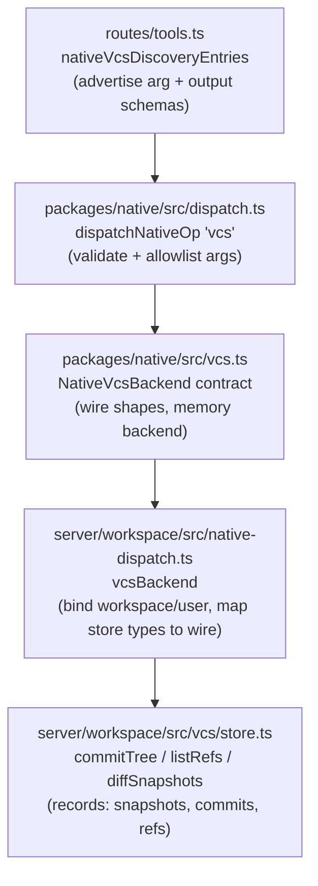

# Tech Plan — iw9-f1-vcs-scoping-params

## Context

Verified against source 2026-08-09 (every brief claim re-checked):

- `server/workspace/src/vcs/store.ts:358-383` — `commitTree` hardcodes
  `buildSnapshot(await visibleEntries(workspaceId), "", lineage.entries)` and
  reads/advances `MAIN_REF`. Notably `visibleEntries(workspaceId, prefix)`
  (:131) and `buildSnapshot(entries, prefix, mounts)` (:157) **already accept
  a prefix** — only `commitTree` fails to thread it.
- `store.ts:149-155` — `snapshotId` hashes sorted `<hash> <path>` lines plus
  `mount …` lines; the `prefix` field on `VcsSnapshot` is *not* part of the
  id, so identical subtrees under different scopes collide on one snapshot
  record (last writer's `prefix` field wins — data corruption once scoped
  commits exist).
- `server/workspace/src/native-dispatch.ts:297` (`log`) and `:357`
  (`branches`) — `readRef(workspaceId, "main")` hardcoded. `:339-355`
  (`diff`) maps `VcsDiff` entries down to bare path strings. `show`'s
  `changes` (:332-336) strips hashes the same way.
- `store.ts:315-318` — `listRefs` exists, sorted by name, zero callers (dead).
- `server/workspace/src/routes/tools.ts:278-341` — discovery schemas for
  `commit`/`log`/`diff` carry no scope args; `restore` (:360-380) already has
  the `commit`/`path?`/`prefix?` shape to copy.
- **Discovery beyond the brief #1**: `packages/native/src/dispatch.ts:69-83`
  allowlists args per operation (`commit` forwards only `message`/`author`,
  `log` only `limit`, `diff` only `from`/`to`) — new args must be threaded
  here or they are silently dropped before reaching the backend.
- **Discovery beyond the brief #2**: the hash-stripping is enforced by the
  shared contract type `NativeVcsDiff` (`packages/native/src/vcs.ts:31-35`,
  `string[]` fields), used by both `diff` and `show.changes`, and exercised
  by `packages/native/__tests__/conformance.test.ts:181,185`.

Constraint from the wave plan: 22 legacy VCS suites in
`server/workspace/tests/` fail on main (`vfs/*` → `vcs/*` verb drift);
repairing them is owned by `iw9-f6-cleanup-rename`. This change does not edit
those files; new coverage goes in a new file.

## Goals / Non-Goals

**Goals:**

- Thread `prefix`/`ref` through `commitTree` and the `vcs.commit`/`vcs.log`
  tool surface end-to-end (schema → dispatch allowlist → backend → store).
- Make snapshot identity prefix-aware without perturbing any existing id.
- Wire `listRefs` into `vcs.branches`; parameterize `vcs.log`'s ref.
- Ship hash-bearing diff/show wire output and a `prefix` filter on `vcs.diff`.
- Publish the exact signatures below as the interface contract for
  `iw9-a-vcs-consolidation` (`app/<id>` refs).

**Non-Goals:**

- `app/<id>` conventions, ref seeding policy, tags/releases, mount-lineage
  scope filtering, any client work — all stream A (per IW-9 serialization
  rules).
- Fixing the 22 failing legacy suites (F6).
- CAS on ref advances (existing single-writer stance stands, store.ts:18-20).

## Architecture

No new components; one parameter threads through the existing five-layer
stack. Each layer's single responsibility:



`chat-sessions.ts:126,467,560` and `sandboxes/service.ts:853` keep calling
`commitTree` with defaults — untouched, behavior-identical.

## Decisions

### D1: Prefix hash line is additive (emitted only when non-empty)

- **Choice**: `snapshotId` appends one `prefix <prefix>` line after the mount
  lines iff `prefix !== ""`. Empty-prefix snapshots hash byte-identically to
  today.
- **Alternatives**: (a) Always include the prefix line — breaks every
  existing snapshot/commit id, breaks the unchanged-head short-circuit across
  the deploy boundary, and forces a history discontinuity for zero benefit.
  (b) Salt the id with the `prefix` record field via JSON canonicalization —
  same breakage plus a format rewrite. The additive pattern is exactly how
  mount lines were introduced (store.ts:141-148 comment).
- **Revisit if**: a snapshot-format v2 is ever introduced for other reasons;
  fold the prefix into the canonical form then.

### D2: First commit on a fresh ref is a root commit (no implicit parent)

- **Choice**: missing ref → `parents: []`. Seeding a new ref from an existing
  commit (e.g. branching `app/<id>` off `main`) is the caller's explicit job.
- **Alternatives**: implicitly parent from `main`'s head — surprising for app
  scopes (an app subtree's first commit would claim the whole-workspace
  snapshot as ancestor, making `diff(parent, child)` nonsense across
  different prefixes); also embeds policy F1 doesn't own — stream A decides
  `app/<id>` seeding.
- **Revisit if**: stream A finds it needs server-side seeding; add an
  explicit `seedFrom?: commitish` option then rather than a magic default.

### D3: `NativeVcsDiff` becomes hash-bearing objects (breaking wire change)

- **Choice**: change the shared type to
  `added/removed: Array<{path, hash}>`, `modified: Array<{path, from, to}>`
  — the store's `VcsDiff` shape — applying to both `vcs.diff` and
  `vcs.show.changes`. Update the memory backend and the two assertion lines
  in `packages/native/__tests__/conformance.test.ts` accordingly.
- **Alternatives**: additive parallel fields (keep `string[]`, add an
  `entries` object with hashes) — preserves the conformance test untouched
  but ships two permanent representations of the same data on every diff,
  which stream A's viewer then has to pick between; rejected because the
  breaking change is contained: the six `vcs.*` verbs have zero client
  callers today (IW-9 Wave-1 A: "five have zero callers"; the sixth,
  `commit`, doesn't return a diff), and the only in-repo consumer of the
  shape is that conformance test. Note: the wave-plan "do not touch existing
  test files" rule targets the 22 *failing F6-owned server suites*;
  `packages/native/__tests__/conformance.test.ts` passes today, is in a
  package no other Wave-0 stream touches, and its two-line update is the
  honest cost of the contract change. Fallback if this is overruled at
  review: the additive-fields alternative.
- **Revisit if**: a client caller of `vcs.diff` ships before this lands —
  then take the additive path and schedule the removal with stream A.

### D4: Diff `prefix` filters the computed diff, not the snapshots

- **Choice**: compute `diffSnapshots(from, to)` as today, then filter entries
  by the same containment rule `restoreCommit` uses (`path === prefix ||
  path.startsWith(prefix + "/")`).
- **Alternatives**: pre-filter each snapshot's entries before diffing —
  identical output, more code paths; or resolve prefix-scoped snapshot
  records — wrong, because `from`/`to` are arbitrary commitishes whose
  snapshots may be whole-workspace.
- **Revisit if**: snapshot manifests grow large enough that filtering before
  diffing measurably matters (record-store S3 spill threshold territory).

### D5: Mount lineage passes through unfiltered on scoped commits

- **Choice**: `commitTree` keeps calling `collectMountLineage(workspaceId)`
  and attaches full lineage regardless of prefix.
- **Alternatives**: filter lineage to mounts under the prefix — that is
  explicitly stream A's scope ("mount lineage filtered to scope", IW-9 Wave
  1 A); doing it here creates a merge conflict with A's design and risks
  disagreeing with its filtering rule.
- **Revisit if**: never within F1; A owns the follow-up.

## Interfaces & Data

These signatures are the **published contract consumed by
`iw9-a-vcs-consolidation`** for `app/<id>` refs. Changing them after F1 lands
requires updating A's plan.

### Store layer (`server/workspace/src/vcs/store.ts`)

```ts
export async function commitTree(
  workspaceId: string,
  options: {
    message: string;
    author: string;
    sessionId?: string;
    /** Subtree scope; "" (default) = whole visible workspace. */
    prefix?: string;
    /** Ref to read and advance; default MAIN_REF. Validated via refName(). */
    ref?: string;
  },
): Promise<{ commit: VcsCommit; created: boolean }>;
```

Semantics: `entries = visibleEntries(workspaceId, prefix)`;
`snapshot = buildSnapshot(entries, prefix, lineage.entries)`; head = the
named ref's commit; unchanged-head short-circuit keys on `snapshot.id` alone
(sufficient — the id now encodes the prefix); missing ref → root commit
(D2); ref advance writes the named ref only. `snapshotId` gains an optional
`prefix` argument and emits `prefix <prefix>` as the final canonical line iff
non-empty (D1). `listRefs` is unchanged (already correct, becomes live).

### Wire contract (`packages/native/src/vcs.ts`)

```ts
export interface NativeVcsDiff {
  added: Array<{ path: string; hash: string }>;
  modified: Array<{ path: string; from: string; to: string }>;
  removed: Array<{ path: string; hash: string }>;
}

export interface NativeVcsBackend {
  stage?(path: string, contentHash: string): void;
  commit(args: { message?: string; author?: string; prefix?: string; ref?: string }):
    Promise<{ commit: NativeVcsCommit; created: boolean }>;
  log(args: { limit?: number; ref?: string }): Promise<{ commits: NativeVcsCommit[] }>;
  show(args: { commit: string }): Promise<{ commit: NativeVcsCommit; files: string[]; changes: NativeVcsDiff }>;
  diff(args: { from: string; to: string; prefix?: string }): Promise<NativeVcsDiff & { from: string; to: string }>;
  branches(): Promise<{ branches: Array<{ name: string; commit: string }> }>;
  restore(args: { commit: string; path?: string; prefix?: string }): Promise<{ commit: string; restored: string[] }>;
}
```

`dispatchNativeOp` threads the new args with the existing
typeof-string-guard pattern (dispatch.ts:69-83). The memory backend gains a
refs map and prefix filtering, minimally, to keep the conformance suite
meaningful.

### Backend + discovery (`native-dispatch.ts`, `routes/tools.ts`)

- `vcsBackend.commit` forwards `prefix`/`ref`; `log` resolves
  `refName(args.ref)` via `readRef` (unknown ref → `{commits: []}`);
  `branches` maps `listRefs(workspaceId)` to `{name, commit}`; `diff`
  returns `VcsDiff` entries as-is (objects), filtered by `prefix` (D4);
  `show` passes `changes` through unmapped.
- `nativeVcsDiscoveryEntries`: `commit` input gains
  `prefix: {type: "string"}`, `ref: {type: "string"}`; `log` input gains
  `ref`; `diff` input gains `prefix` and its output schema's
  `added`/`modified`/`removed` become arrays of objects
  (`{path, hash}` / `{path, from, to}`); `show`'s `changes` schema likewise.

## Risks / Trade-offs

- [Full `server/workspace` test run stays red until F6 lands (22 pre-broken
  suites)] → new coverage lives in `tests/vcs-scoping.test.ts` and is run by
  path; **soft ordering: rebase this change after `iw9-f6-cleanup-rename`'s
  test repair lands** so the suite-wide gate is meaningful at merge time.
- [Wire-shape break in `NativeVcsDiff` surprises an unseen consumer] →
  zero-caller status verified by grep (only `packages/native` internals and
  the conformance test reference the shape); grep gate in tasks re-verifies
  at implementation time.
- [Ref writes remain read-modify-write without CAS; more refs = more chances
  to race] → unchanged risk profile, documented in store.ts:18-20 (worst
  case is a lost pointer, never lost content); scoped refs are per-app and
  effectively single-writer like `main`.
- [Snapshot records for scoped commits interleave with whole-workspace ones
  in the same records scope] → ids cannot collide across scopes after D1;
  `VcsSnapshot.prefix` already exists on the record shape, so old readers
  tolerate scoped records.

## Rollout

1. Land `packages/native` contract change + memory backend + conformance
   assertion update (one PR with the rest — the monorepo builds atomically;
   `@aprovan/workspace` consumes the workspace-local package, not a published
   version).
2. Land store + backend + discovery schema changes and the new test file in
   the same change (single deploy; server-only, no client deploy needed).
3. No data migration: empty-prefix ids are byte-stable (D1) and scoped
   records are additive. Rollback = redeploy previous build; scoped snapshot
   records written in the interim are inert (unreferenced by `main`).
4. Soft ordering: merge after F6's test repair where feasible; if F1 merges
   first, F6 rebases trivially (disjoint files — F6 owns
   `server/workspace/tests/{vcs,vcs-mount-lineage,vfs-mounts,vcs-interface,chat-sessions}.test.ts`,
   F1 adds only `tests/vcs-scoping.test.ts`).

## Open Questions

None — all semantics fixed by IW-9 (D10 for scoped refs, F1 checklist for
surface area); the fresh-ref default is decided in D2 above.
