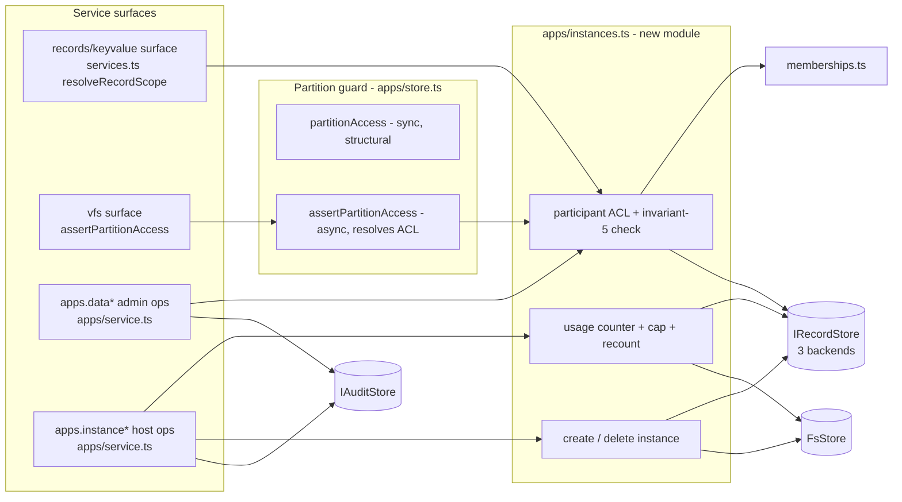

# Tech plan — iw9-f2-shared-partition

Decision IDs here are `TD<n>` (tech decisions of this change) to avoid
colliding with the IW-9 register's `D<n>`, which is cited as `IW-9 D<n>`.

## Context

Current state (all refs verified against source, 2026-08-09):

- **One caller scope shape per app.** The record store partitions by
  `PK = t#<tenant>#s#<scope>` (`server/workspace/src/records.ts:107-109`);
  app sessions get scope `app#<id>#u#<sub>` built at
  `server/workspace/src/native-dispatch.ts:49` and
  `server/workspace/src/services.ts:104`. Three backends implement
  `IRecordStore` (Dynamo, SQLite, DSQL; `records.ts:74-98`); values over
  ~350KB spill to S3 (`records.ts:104-105`).
- **Partition guard is structural and synchronous.**
  `partitionAccess(path, callerSub)` at
  `server/workspace/src/apps/store.ts:279-298` classifies
  `.apps/<id>/data/<sub>/…` and `.users/<sub>/…` as `own`/`foreign` by string
  shape alone; `assertPartitionAccess` (store.ts:304-313) turns `foreign`
  into deny-as-404. Hidden roots are the structural pair
  `[".apps", ".users"]` (`STRUCTURAL_HIDDEN_ROOTS`, store.ts:60;
  `hiddenDataPrefixes`, store.ts:250-252).
- **Admin visibility exists and is audited.** `apps.dataUsers/dataKeys/
  dataGet/dataRead` (`server/workspace/src/apps/service.ts:612-668`, handler
  at 1113-1218) gate on `manifest.roles.admins`, enumerate per-user scopes
  via `listScopes(tenant, "app#<appId>#u#")` (service.ts:1165), and append an
  audit row (service.ts:1210-1217; `IAuditStore`,
  `server/workspace/src/audit.ts`).
- **Install records** are `AppInstallation` under `svc#installs`
  (`server/workspace/src/apps/install.ts:33-50`), minted by `mintNewInstall`
  (install.ts:231-256), persisted by `saveInstall` (install.ts:86-91).
  `purgeInstallData` removes the whole `.apps/<installId>` prefix
  (install.ts:298-303).
- **Caller-scope confinement** is `assertCallerScope`
  (`server/workspace/src/svc-records.ts:51-65`): `svc#` unreachable,
  `user#` self-only.
- **Prior art / cautionary tale:** the `dataScope:"workspace"` model stored
  shared data as one unattributed file per key; its migration
  (`server/workspace/scripts/migrate-app-records.ts`, CAVEAT block) could not
  recover attribution. IW-9 invariant 10 makes hosting mode immutable at
  creation precisely so this never recurs.

Deviations from the orchestrator brief (verified against source):

1. Brief cites `records.ts:16-18` for the scope doc; the block is lines
   14-19 and (stale) writes `app#<name>#u#<sub>`. Live code uses the **id**
   (native-dispatch.ts:49, services.ts:104, apps/service.ts:1165). The stale
   `<name>` comment is iw9-f6 residue (`dataScope` purge task); we do not
   edit records.ts's doc block here beyond appending the new shape.
2. Brief lists "snapshot-hiding rules (`hiddenDataPrefixes`)" as work. No
   change is needed there: the structural root `.apps` (store.ts:60,250-252)
   already hides everything under `.apps/<id>/shared/…`. The residual work is
   defense-in-depth in `appPathServable` (store.ts:336-338), which today
   excludes only `.apps/<id>/data`; we widen the exclusion to the whole
   `.apps/<id>` container, plus tests proving shared paths are hidden.
3. `apps.data*` already exists as an audited admin mode for per-user
   partitions; F2 **extends** it to shared partitions rather than creating
   it.
4. `install.ts` imports `releases.ts` (install.ts:20) — owned by iw9-a. Our
   edits are confined to the `AppInstallation` type, `mintNewInstall`,
   `saveInstall`, and install routes' input parsing; `releases.ts` and every
   pin/release function are untouched.

## Goals / Non-Goals

**Goals (technical):**

- One new scope discriminator and file-plane shape, enforced above
  `IRecordStore` so all three backends behave identically.
- A frozen, interface-stated contract (scope grammar, `PartitionAccess`,
  instance record, install `hosting` field) that iw9-b codes against without
  reading F2 internals.
- ACL, membership (invariant 5), cap, and immutability checks derived at
  request time (invariant 3) — no snapshotting, no caches beyond a request.
- New test files only; legacy failing suites (iw9-f6's) untouched.

**Non-Goals:** install-time mode picker (iw9-b), realtime fan-out (F5),
cross-workspace guest mechanics (Chat), queryable collections, any change to
`apps/releases.ts` (iw9-a) or `apps/identity.ts` / manifest code (iw9-f4).

## Architecture



Single responsibilities:

- **`apps/instances.ts` (new):** the only module that reads/writes instance
  records (`svc#app-instances`); owns ACL resolution, invariant-5 membership
  re-check, usage counter, cap enforcement, recount, create/delete.
- **`apps/store.ts` (extended):** stays pure/structural — classifies shared
  paths and parses `(id, instanceId)` out of them; `assertPartitionAccess`
  is the one async choke point that consults `instances.ts`.
- **`services.ts` (extended):** `resolveRecordScope` grows an optional
  instance address so an app session can target its instance's shared scope;
  ACL asserted before any store call.
- **`apps/service.ts` (extended):** admin (`apps.data*`) and host
  (`apps.instance*`) procedures; every one audited via the existing
  `getAuditStore().append` pattern.
- **`install.ts` (extended):** carries `hosting`, rejects mutation.

## Decisions

### TD1: Scope shape `app#<id>#shared#<instanceId>`

- **Choice:** reuse the `app#<id>#` prefix and switch the discriminator
  segment: `u` → per-user, `shared` → per-instance. File plane mirrors it:
  `.apps/<id>/shared/<instanceId>/…` beside `.apps/<id>/data/<sub>/…`.
- **Alternatives:**
  - *New top-level prefix `shared#<instanceId>`* — loses the `app#<id>#`
    grouping that `apps.data*` and `listScopes(tenant, "app#<id>#")` rely on
    (service.ts:1165); admin enumeration would need a second scan shape.
  - *Sentinel sub (`app#<id>#u#__shared__`)* — exactly the
    `dataScope:"workspace"` mistake re-shaped: one pseudo-user partition,
    colliding with the real-sub namespace and invisible to ACL logic.
- **Revisit if:** an instance ever spans multiple apps (app→app calls,
  explicitly deferred in IW-9).

### TD2: Enforcement above `IRecordStore`; `partitionAccess` stays sync

- **Choice:** keep `partitionAccess` a pure sync classifier — it gains the
  return value `"shared"` plus a `parseSharedPartition(path)` helper — and
  make `assertPartitionAccess` (already async, store.ts:304) resolve the
  participant ACL via `instances.ts`. Record-plane surfaces call a new
  `assertSharedScopeAccess` before touching the store. `IRecordStore` and its
  three backends are unchanged except metering metadata (TD5).
- **Alternatives:**
  - *Make `partitionAccess` async* — churns every pure call site and test
    for no gain; classification needs no I/O.
  - *Enforce per-backend inside `IRecordStore`* — three copies of the ACL,
    guaranteed drift; also backends lack caller identity by design.
- **Revisit if:** a backend gains row-level security worth delegating to.

### TD3: Instance records live under `svc#app-instances`

- **Choice:** one record per instance, key = instanceId, scope
  `svcScope("app-instances")` — caller-unreachable by the existing
  `assertCallerScope` guard (svc-records.ts:51-65), tenant = hosting
  workspace. Participant list embedded in the record (flat subs).
- **Alternatives:**
  - *Identity-store table (like memberships)* — instances are app-plane
    accumulated state, not identity; would drag schema migrations across
    sqlite/dsql identity stores for a Wave-0 primitive.
  - *File-plane manifest under `.apps/<id>/shared/<instanceId>.json`* —
    "files are authored; records are accumulated"; also puts the ACL inside
    the partition it protects.
- **Revisit if:** participant lists outgrow a single record value (~350KB
  spill threshold ≈ tens of thousands of subs) — then split participants
  into per-sub rows under the same svc scope.

### TD4: `hosting` on `AppInstallation`, absent = `managed`, guarded in `saveInstall`

- **Choice:** add `hosting: "hosted" | "managed"` to `AppInstallation`
  (install.ts:33-50), set in `mintNewInstall`, immutability enforced in
  `saveInstall` (read-before-write compare; reject flip with 409). Existing
  records lacking the field read as `managed`: today an install's data lives
  in the installer's own workspace, which the installer belongs to — the
  definition of managed (IW-9 invariant 5). No migration script exists or
  will (IW-9 invariant 10; prd Non-Goals; `migrate-app-records.ts` CAVEAT is
  the cited precedent).
- **Alternatives:**
  - *Default absent → `hosted`* — would label every existing install with
    the weaker promise-only mode and loudly mis-render them (IW-9 D2 "
    publisher-hosted is rendered loudly") for no reason.
  - *Enforce immutability only in routes* — `saveInstall` is the single
    persistence choke point; route-only guards leave internal callers free
    to flip the field silently.
- **Revisit if:** iw9-b's install-as-copy (IW-9 D8) restructures
  `AppInstallation` — the field and guard carry over; only the reader moves.

### TD5: Counter-based metering with a `bytes` stamp and recount

- **Choice:** shared-partition writes stamp the serialized value size on the
  row (new optional `bytes` attribute/column; spilled values included); the
  write path computes `delta = newBytes - oldBytes` (Dynamo: `ReturnValues:
  ALL_OLD` on the Put; SQL backends: read prior row) and applies it to
  `storageBytes` on the instance record, best-effort. File-plane writes under
  the shared dir do the same with file sizes. `recountInstanceUsage` walks
  both planes and rewrites the counter. Cap check compares
  `storageBytes + delta > storageCapBytes` before the write; over-cap → 413.
- **Alternatives:**
  - *Recompute on every usage read* — full scope list + per-key get (and S3
    HEADs for spills) on a host dashboard hot path; D22 only needs "host
    sees size", not free reads.
  - *Transactionally exact ledger* — Dynamo transactions + DSQL OCC across
    two tables for a quota that tolerates eventual consistency; complexity
    without a requirement behind it.
- **Revisit if:** billing (not just capping) hangs off these numbers — then
  exactness matters and the ledger returns.

### TD6: Admin surface extends `apps.data*`; host surface is `apps.instance*`

- **Choice:** add `apps.dataInstances` (list instances + participants,
  admin-gated) and an `instance` argument (mutually exclusive with `user`)
  to `apps.dataKeys`/`dataGet`/`dataRead`, reusing the existing admin gate
  and audit append (service.ts:1120-1126, 1210-1217). Host lifecycle is a
  separate small family — `apps.instanceUsage`, `apps.instanceCap`,
  `apps.instanceDelete` — gated on host (hosting-workspace admin or creator
  per IW-9 D1/D22), all audited.
- **Alternatives:**
  - *One merged mega-procedure* — the legacy `apps.data` overload
    (service.ts:1131-1147) is exactly the mode-sniffing shape the split ops
    were introduced to escape; extending the sniff would regress it.
  - *New `instances` namespace* — a fourth capability namespace for three
    procedures; `apps.*` already carries app-admin semantics and audit
    plumbing.
- **Revisit if:** iw9-c's grant-visibility work (Wave 2) reshapes tool
  surfaces; these are additive procedures and move cheaply.

## Interfaces & Data

The seams iw9-b (and Wave-2 Chat) build against. These are frozen by this
change; everything else in F2 is internal.

### Scope-key grammar (canonical, exhaustive)

```
scope        := "ws"
              | "user#" <sub>                          ; self-addressed only
              | "app#" <id> "#u#" <sub>                ; per-app-per-user
              | "app#" <id> "#shared#" <instanceId>    ; NEW — per-app-per-instance
              | "svc#" ...                             ; reserved, caller-unreachable
<id>         := ULID of the app (origin-hosted) or install (installed)
<sub>        := caller's user sub
<instanceId> := ULID minted by createInstance
```

File plane: `.apps/<id>/data/<sub>/…` (per-user) and
`.apps/<id>/shared/<instanceId>/…` (shared). Both hidden by the structural
root `.apps`; neither is ever servable over HTTP.

### `apps/store.ts` — partition guard contract

```ts
export type PartitionAccess = "open" | "own" | "foreign" | "shared";

/** Pure and synchronous. "shared" means: ACL required, resolve via
 *  assertPartitionAccess / instances.ts before granting anything. */
export function partitionAccess(
  path: string,
  callerSub: string,
  hiddenPrefixes?: readonly string[], // retained for call-site compat, ignored
): PartitionAccess;

/** `.apps/<id>/shared/<instanceId>[/...]` → ids; undefined otherwise. */
export function parseSharedPartition(
  path: string,
): { id: string; instanceId: string } | undefined;

export function sharedDataDir(id: string, instanceId: string): string;
// `.apps/${id}/shared/${instanceId}`

/** Now also resolves the participant ACL (and invariant-5 membership for
 *  managed installs) when classification is "shared".
 *  Throws ServiceError 404 on any denial — deny-as-404, no oracle. */
export function assertPartitionAccess(
  workspaceId: string,
  callerSub: string,
  path: string,
): Promise<void>;
```

### `apps/instances.ts` — new module (record + ACL + metering authority)

```ts
export type HostingMode = "hosted" | "managed";

export interface AppInstanceRecord {
  instanceId: string;        // ULID, record key under svc#app-instances
  appId: string;             // app or install ULID (the scope's <id>)
  hostWorkspaceId: string;   // tenant the rows live in
  createdBy: string;         // user sub
  createdAt: string;         // ISO
  updatedAt: string;         // ISO
  participants: string[];    // user subs — THE ACL (invariant 4)
  storageCapBytes?: number;  // host-set; absent = uncapped (D22)
  storageBytes: number;      // metered, eventually consistent (TD5)
}

export function sharedRecordScope(appId: string, instanceId: string): string;
// `app#${appId}#shared#${instanceId}`

export function createInstance(input: {
  workspaceId: string; appId: string; createdBy: string;
  participants: string[];
}): Promise<AppInstanceRecord>;              // invariant-11 note: callers are
                                             // user-invoked procedures; agents
                                             // propose, people instantiate.
export function getInstance(workspaceId: string, instanceId: string):
  Promise<AppInstanceRecord | undefined>;
export function listInstances(workspaceId: string, appId: string):
  Promise<AppInstanceRecord[]>;

/** Throws 404 (deny-as-404) unless callerSub ∈ participants AND, when the
 *  owning install's hosting mode is "managed", callerSub is currently a
 *  member of hostWorkspaceId (invariants 3 + 5). Fails closed when the
 *  instance record is missing. */
export function assertInstanceAccess(
  workspaceId: string, appId: string, instanceId: string, callerSub: string,
): Promise<AppInstanceRecord>;

/** 4xx when a sub is not a hosting-workspace member and mode is managed. */
export function addParticipant(workspaceId: string, instanceId: string,
  sub: string, actor: string): Promise<AppInstanceRecord>;
export function removeParticipant(workspaceId: string, instanceId: string,
  sub: string, actor: string): Promise<AppInstanceRecord>;

export function setInstanceCap(workspaceId: string, instanceId: string,
  capBytes: number | undefined, actor: string): Promise<AppInstanceRecord>;
/** Pre-write check + post-write counter delta (TD5). Throws 413 over cap. */
export function reserveInstanceBytes(workspaceId: string, instanceId: string,
  deltaBytes: number): Promise<void>;
export function recountInstanceUsage(workspaceId: string, instanceId: string):
  Promise<number>;
/** Records (incl. spilled blobs) + shared files + instance record. Audited
 *  by the calling procedure. */
export function deleteInstance(workspaceId: string, instanceId: string,
  actor: string): Promise<void>;
```

Host = hosting-workspace admin: `(await getMembership(hostWorkspaceId,
callerSub))?.role === "admin"`. This single check also satisfies "or creator
when hosting in their personal space" (IW-9 D1/D22) with no separate branch —
**resolved by source inspection, 2026-08-09**: the only workspace+membership
creation path in this codebase is the Cognito post-confirmation trigger
(`infra/aws/src/lambdas/post-confirmation/index.ts:59-85`, live-wired at
`infra/aws/src/stacks/main.ts:122-124`). For an uninvited signup it mints a
solo workspace (`name: \`${email}'s workspace\``, line 65) and writes that
same user's membership row with
`role: typeof invite?.["role"] === "string" ? invite["role"] : "admin"`
(lines 80-81) — i.e. `"admin"` whenever there is no invite. A personal-space
creator is therefore always that workspace's admin already; there is no
`createdBy`-vs-membership-role split to implement, and no "is this a personal
workspace" detection to invent (none exists in `identity/types.ts` /
`workspaces.ts` — checked). Host-gating lives in the `apps.instance*`
procedures, not in this module.

### `services.ts` — record-surface addressing (the iw9-b seam)

```ts
/** Existing behavior unchanged when `instance` is absent (services.ts:104).
 *  With `instance`: returns `app#<id>#shared#<instanceId>` after
 *  assertInstanceAccess(ctx.workspaceId, id, instance, ctx.userId). */
export function resolveRecordScope(
  ctx: ServiceContext,
  opts?: { instance?: string },
): Promise<string>;
```

Record/keyvalue tool procedures accept an optional `instance` string
argument; `assertCallerScope` semantics are unchanged (`svc#` unreachable,
`user#` self-only).

### `install.ts` — hosting mode

```ts
export type HostingMode = "hosted" | "managed";      // re-exported from instances.ts

export interface AppInstallation {
  // ...existing fields (install.ts:33-50) unchanged...
  /** IMMUTABLE at creation (IW-9 invariant 10). Absent on pre-F2 records
   *  ⇒ read as "managed" (TD4). No mode-flip migration exists or will. */
  hosting: HostingMode;
}
// mintNewInstall(input) gains `hosting: HostingMode` (default "managed").
// saveInstall(workspaceId, install) throws ServiceError 409 when a stored
// record exists and stored.hosting !== install.hosting.
```

### `apps/service.ts` — procedures (all audited via getAuditStore().append)

| Procedure | Gate | Behavior |
|---|---|---|
| `apps.dataInstances` | app admin | list `AppInstanceRecord`s for the app (id, participants, storageBytes, cap) |
| `apps.dataKeys` / `dataGet` / `dataRead` | app admin | existing `user` arg OR new `instance` arg (mutually exclusive, 400 if both); `instance` addresses shared scope / shared dir |
| `apps.instanceUsage` | host | `{ instanceId, storageBytes, storageCapBytes? }`; `recount: true` triggers recount |
| `apps.instanceCap` | host | set/clear `storageCapBytes` |
| `apps.instanceDelete` | host | `deleteInstance`; audit row names caller + instance |

Audit `operation` strings follow the existing shape
(service.ts:1215): `data:<appId>:instance:<instanceId>[:key|:path]`,
`instance:<op>:<instanceId>`.

### Record-row metering metadata (all three backends)

Rows written under a `#shared#` scope carry serialized-value byte size:
Dynamo item attribute `bytes`, SQLite/DSQL column `bytes INTEGER` (nullable;
null on legacy/per-user rows). Not part of `RecordEntry`; internal to
metering.

## Risks / Trade-offs

- [Counter drift under concurrent writes (best-effort deltas)] → recount
  procedure is authoritative and host-invokable; cap check tolerates small
  drift (cap is a budget, not billing — TD5 "Revisit if").
- [ACL lookup adds a record read per shared operation] → single `get` by key
  on the instance record per request; per-request memoization only (no
  cross-request cache, invariant 3).
- [`purgeInstallData` (install.ts:298-303) removes `.apps/<installId>`
  including shared files, but would orphan instance records and spilled
  record blobs] → uninstall path also calls `deleteInstance` for each
  instance of the install; orphan-scope rule (fail closed, 404) covers any
  crash window.
- [Race: participant removed / membership revoked mid-request] → checks are
  per-request and fail closed; a request that already passed its check
  completes — same window every membership check in the codebase has.
- [iw9-b lands install-as-copy (IW-9 D8) and reshapes `AppInstallation`] →
  the frozen seam is the field + guard semantics, not the struct layout;
  contract stated above survives a reshape.
- [Wave-0 sibling overlap] → F2 touches `records.ts` (backend `bytes` only),
  `apps/store.ts` (guard block), `services.ts`, `apps/service.ts`,
  `install.ts`, new `apps/instances.ts`. Disjoint from F1 (`vcs/`), F3
  (`credentials.ts`), F4 (`identity.ts`), F5 (`realtime/`), F6 (tests/docs).
  `releases.ts` untouched (iw9-a).

## Rollout

1. Land guard + grammar (`store.ts`, `instances.ts`) with tests — inert
   until a scope is minted.
2. Land record-surface addressing + metering + `install.ts` hosting field.
   Absent-field reads as `managed`; no data migration of any kind (invariant
   10 — and none will follow).
3. Land admin/host procedures + audit.
4. Rollback at any step is a plain revert: no schema migration is
   destructive (new nullable column/attribute only), no existing scope shape
   changes, and no record is rewritten.

Deploy order within Wave 0 is unconstrained (disjoint files); iw9-b (Wave 1)
must not start against this contract until tasks 1-2 land.

## Open Questions

None — settled by IW-9 (D1, D2, D22; invariants 3, 4, 5, 10) plus TD1-TD6
above.
