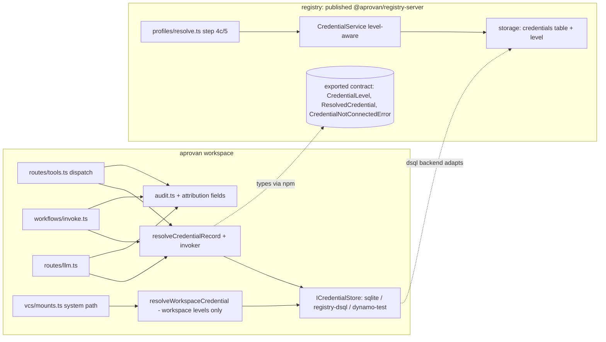

# Tech Plan — iw9-f3-credential-levels

## Context

Authority: `openspec/changes/IW-9-APP-FIRST.md` — invariant 1 ("Identity
follows the credential"), D12/D15 (approval routing consumes the level),
D22 (payment follows the credential; out of scope here).

Verified current state (both repos):

- **Record shape.** `CredentialRecord` (aprovan
  `server/workspace/src/credentials.ts:82-92`) and `CredentialRow`
  (registry `packages/registry-server/src/storage/types.ts:24-35`) carry
  `createdBy?` — provenance only, optional, "undefined = legacy/
  tenant-shared row". **No level field exists anywhere.** The brief's F3
  line "owner/user dimension (currently none)" is stale in the letter but
  right in spirit: provenance exists, ownership *semantics* do not.
- **Resolution ignores the invoker.** Workspace entry point
  `resolveCredentialRecord(workspaceId, provider, credentialId?, profile?)`
  (`credentials.ts:732-764`) has no invoker parameter; provider-default
  resolution is "first credential for provider" (`credentials.ts:497-509`
  sqlite `ORDER BY created_at LIMIT 1`; Dynamo `Limit: 1` at :280-304).
  Registry's normative `resolveProfile()`
  (`packages/registry-server/src/profiles/resolve.ts:148`) resolves a
  pinned credential by id (step 4c) or falls back to "first tenant
  credential" (step 5) — `CallContext` carries `principal` and
  `actor` (`packages/registry-server/src/config/types.ts:22-45`) but the
  credential step never reads them.
- **Dispatch call sites** (aprovan): `routes/tools.ts:1248`
  (`interfaceCredentialId` pin or provider default), `workflows/invoke.ts:366`,
  `routes/llm.ts:116`, and a system path `vcs/mounts.ts:207`
  (`resolveRecordForProvider(workspaceId, "github")` — no user in scope).
- **Audit.** `AuditEntry` (`server/workspace/src/audit.ts:18-33`) records
  `callerId` (= `principal.sub`, `routes/tools.ts:858`) but nothing about
  the credential or via-path. Backends: sqlite (DDL in `audit.ts:186-201`),
  DSQL (`db/dsql-schema.sql` `audit_log`), Dynamo (contract tests only).
- **Repo boundary.** The workspace consumes registry code **only** as the
  published npm package `@aprovan/registry-server` (`server/workspace/
  package.json` pins `^0.2.10`); `credentials.ts` re-exports its payload
  types, `credential-store-adapter.ts` adapts `ICredentialStore` onto its
  `CredentialStore`, and the dsql backend (`CredentialStoreRegistry`) makes
  the package's `credentials` table (`storage/schema.ts:19-30`,
  `created_by TEXT`) the store of record.
- **Migration precedent.** Both repos already do additive column + tolerant
  read for `created_by` (sqlite `ALTER TABLE ... ADD COLUMN` in a
  try/catch, `credentials.ts:402-408`).

Sibling coordination (IW-9 serialization rules): F3 owns `credentials.ts`,
`credential-store-adapter.ts`, `audit.ts`, and registry `credentials/*`,
`profiles/resolve.ts`, `storage/*` credential pieces. F1 also edits
`routes/tools.ts` but only the VCS tool schemas (:278-380); F3's edits
there are the dispatch/audit region (:850-1340) — disjoint, coordinate at
merge. Grants/approval enforcement is iw9-c and is **not** touched.

## Goals / Non-Goals

**Goals:**

- One stored `level` dimension, consistent across both repos' schemas and
  all three workspace store backends, with read-time backfill.
- Invoker-aware resolution with a published, typed resolution-order
  contract in `@aprovan/registry-server` (the iw9-c seam).
- Fail-closed, machine-distinguishable "not connected" error.
- Audit attribution (credential id + level + source, actor, profile) on the
  dispatch audit rows, additive on every backend.

**Non-Goals:**

- Approval routing, grant checks, connect-flow UI (iw9-c and later).
- Payload/cipher changes (`protected-credential-envelope` untouched).
- Billing attribution (D22), app manifests (iw9-f4/b), partitions (iw9-f2).

## Architecture



Component responsibilities:

- **`@aprovan/registry-server` (owns the contract):** level vocabulary,
  row schema, level/type validation in `CredentialService.create`,
  invoker-aware selection in `resolveProfile` step 4c/5, and the exported
  resolution-contract types. Nothing workspace-side redeclares these
  (the pre-0.2.5 drift lesson in `credentials.ts:53-63` stands).
- **aprovan `credentials.ts`:** `ICredentialStore` grows level/owner
  columns per backend; `resolveCredentialRecord` gains the invoker and
  applies the same contract (it re-exports the package types); a separate
  `resolveWorkspaceCredential` serves invoker-less system paths and is
  structurally unable to return `user-oauth` rows.
- **aprovan `audit.ts`:** additive attribution fields, three backends.
- **Dispatch routes:** thread the already-present principal into
  resolution and the resolved credential metadata into audit appends.

### Repo split & publish sequence

F3 is one of the two genuinely cross-repo IW-9 streams (IW-9 "Cross-repo
coordination", hard rules 1–4). The split:

- **registry** (`/Users/jacob/Documents/Code/AprovanLabs/registry`):
  `packages/registry-server/src/credentials/*` (types, service validation,
  level vocabulary, `effectiveLevel`, `CredentialNotConnectedError`),
  `src/storage/*` (schema + `CredentialRow.level`), `src/profiles/resolve.ts`
  (invoker-aware step 4c/5), `src/index.ts` (contract exports). Must build
  standalone from a fresh clone; it never imports aprovan sources.
- **aprovan** (`/Users/jacob/Documents/Code/AprovanLabs/aprovan`):
  `server/workspace/src/credentials.ts`, `credential-store-adapter.ts`,
  `audit.ts`, plus the dispatch call sites (`routes/tools.ts`,
  `workflows/invoke.ts`, `routes/llm.ts`, `vcs/mounts.ts`). It consumes
  registry code **only** via the published `@aprovan/registry-server` npm
  package.

Publish sequence (never in one step, never reversed):

1. Registry work lands; `@aprovan/registry-server` version bumps (minor —
   all changes additive/widening) and **publishes to npm**.
2. aprovan bumps its pin in a **separate commit** — the pin must remain
   `^0.2.7` or later (0.2.4–0.2.6 are deprecated-broken on npm; current
   pin `^0.2.10` already satisfies this).
3. Only then does aprovan-side F3 work begin compiling against the new
   types.

Grep-gates for definition-of-done run in **both** repos regardless of
where the change landed (e.g. no remaining invoker-less resolution entry
point in either repo).

## Decisions

### D1: `level` is a stored column with read-time backfill

- **Choice**: Add nullable `level` (TEXT) to both credential schemas.
  Every read path maps `NULL` through one shared pure function
  `effectiveLevel(type, storedLevel)` (type-derived backfill). No bulk
  UPDATE migration.
- **Alternatives**: (a) Derive level purely from payload type, no column —
  loses the explicit `oauth2_authcode`-as-`workspace-oauth` bot case and
  makes the level unqueryable in SQL. (b) Bulk backfill migration at
  deploy — DSQL has no transactional DDL+DML convenience here, the
  `created_by` precedent is read-tolerant, and read-time mapping makes
  rollback trivial. Rejected for risk with no benefit.
- **Revisit if**: audit/approval queries need to index on level in SQL at
  scale; then a one-off backfill UPDATE materializes the derived values.

### D2: Legacy backfill is type-derived, never `user-oauth`

- **Choice**: `bearer_token`/`api_key` → `workspace-token`;
  `oauth2_client`/`oauth2_authcode` → `workspace-oauth`.
- **Alternatives**: (a) All legacy → `workspace-token` (the brief's
  "likely") — mislabels OAuth rows and would let iw9-c route their
  approvals as static-secret credentials. (b) Legacy `oauth2_authcode`
  with `createdBy` set → `user-oauth` — silently cuts off every other
  member who used that shared connection yesterday; a behavior change the
  brief does not order. Preserving observed behavior wins.
- **Revisit if**: a workspace explicitly re-classifies a legacy connection
  (that is an update path, not a backfill rule).

### D3: The owner of a `user-oauth` row is `createdBy`

- **Choice**: No new column. `createdBy` is required and load-bearing when
  `level = "user-oauth"` (creation rejects its absence; resolution matches
  invoker against it); it stays provenance-only for workspace levels.
  Uniqueness `(workspace, provider, owner)` for user-level rows is
  enforced at create in `CredentialService` / `ICredentialStore.create`.
- **Alternatives**: A distinct `owner_sub` column — duplicates `createdBy`
  in every realistic flow (the connector is the owner), invites drift, and
  widens three schemas for nothing. Rejected.
- **Revisit if**: credential transfer/re-assignment between users becomes
  a feature (then owner must be mutable independently of provenance).

### D3a: Uniqueness is a DB constraint, never check-then-insert

Verified in source: every backend already has a race-safe idiom for
"create, tolerate the concurrent duplicate" — registry's `SqlClient.run()`
(`storage/sql-client.ts:55-68`) wraps every driver's unique-violation error
into `UniqueConstraintError` *before* the caller sees it (sqlite/libsql
regex on `UNIQUE constraint failed`, postgres/dsql on `duplicate key value
violates unique constraint`); `SqlTenantStore.ensure` and
`SqlGrantStore.grant` (`storage/sql-storage.ts:62-70`, `:397-405`) already
catch it. Dynamo's equivalent is a conditional `Put` on a synthetic
pointer item inside a `TransactWriteCommand`, caught via
`isConditionalFailure` (`storage/dynamo-storage.ts:507-514`) —
`DynamoProfileStore.create` (`:183-207`) and `provisionDefaultProfile`
(`:617-637`) both already write 2-3 such conditional items atomically.
D3's "enforced at create" is underspecified without naming which of these
two idioms applies where — this closes that gap per storage layer:

- **Choice — registry SQL (dsql/sqlite/libsql, `storage/schema.ts`)**: add
  a partial unique index, portable across both dialects (SQLite and
  Postgres both support `CREATE UNIQUE INDEX ... WHERE`):
  `CREATE UNIQUE INDEX IF NOT EXISTS credentials_user_oauth_owner ON credentials(tenant_id, provider, created_by) WHERE level = 'user-oauth';`.
  `SqlCredentialStore.create`'s existing `db.run(INSERT ...)` already
  raises `UniqueConstraintError` on violation with zero new code in
  `sql-storage.ts` beyond adding `level` to the column list (task 1.2).
  `CredentialService.create` (`credentials/service.ts`) catches
  `UniqueConstraintError` (import from `../storage/index.js`, alongside
  its existing `OAuthClientResolutionError` catch at :93-98) and rethrows
  a `CredentialResolutionError` naming the provider and "already
  connected" — no re-query needed; the caller already has `input.provider`
  and `createdBy` in scope.
- **Choice — aprovan sqlite (`credentials.ts`, `CredentialStoreSqlite`)**:
  same partial-unique-index shape, added next to the existing
  `created_by` `ALTER` (constructor, :402-408 today):
  `CREATE UNIQUE INDEX IF NOT EXISTS credentials_user_oauth_owner ON credentials(workspace_id, provider, created_by) WHERE level = 'user-oauth';`
  (idempotent `IF NOT EXISTS`, no try/catch needed for the index itself).
  `create()` catches better-sqlite3's `SqliteError` with
  `code === "SQLITE_CONSTRAINT_UNIQUE"` and rethrows the same friendly
  duplicate-connection error used on the registry SQL path.
- **Choice — aprovan Dynamo (`credentials.ts`, `CredentialStoreDynamodb`)**:
  `create()` currently issues the `CRED#<provider>#<id>` record and the
  `CREDID#<id>` pointer as two *sequential* `PutCommand`s (:184-200).
  When `input.level === "user-oauth"` (which requires `createdBy` per the
  level/type matrix), combine all writes into **one**
  `TransactWriteCommand` with a third conditional item —
  `SK: USEROAUTH#<provider>#<createdBy>`,
  `ConditionExpression: "attribute_not_exists(PK)"` — mirroring
  `DynamoProfileStore.create`'s two-conditional-item transact exactly.
  Catch `ConditionalCheckFailedException` with the same
  `isConditionalFailure`-shaped check already precedented in
  `dynamo-storage.ts:507-514` (add the helper locally; aprovan's
  `credentials.ts` does not yet have it) and rethrow the friendly
  duplicate-connection error. `delete()` removes the `USEROAUTH#...`
  pointer symmetrically (in the same `TransactWriteCommand` as the record
  + `CREDID#` deletes) so a disconnected user can reconnect.
- **Choice — aprovan dsql backend (`CredentialStoreRegistry`)**: gets the
  registry SQL enforcement above **for free, once it stops bypassing it**
  — see the `CredentialStoreRegistry.create` finding under D3b.
- **Alternatives**: App-level "list existing rows, then insert" in
  `CredentialService.create`/`ICredentialStore.create` (tasks 1.3/5.2's
  literal wording) — a TOCTOU race between two concurrent connects from
  the same user; the DB already has the tools to make this atomic, per
  above. Rejected.
- **Revisit if**: never — this is strictly a correctness fix over the
  original wording, not a new decision axis.

### D3b: `CredentialStoreRegistry.create` must route through `CredentialService`

Verified in source: aprovan's dsql-backend credential creation has **two
parallel paths** today. `routes/profiles.ts:97` constructs
`new CredentialService(storage.credentials, storage.provisionCredential)`
and creates through it (so it already gets `provisionCredential`'s
grant-enforcement transaction). `credentials.ts`'s
`CredentialStoreRegistry.create` (:612-623) instead calls
`storage.credentials.create(...)` **directly** — the raw storage
primitive, bypassing `CredentialService` (and therefore every level
validation/default-derivation/uniqueness rule task 1.3 adds to it)
entirely. Task 5.2's assumption that "creation-time validation ... applies
identically on the sqlite/dynamo backends" implicitly requires the dsql
backend to already get it from stream 1 — false as the code stands today.

- **Choice**: `CredentialStoreRegistry.create` constructs a
  `CredentialService` the same way `routes/profiles.ts:97` already does
  (`new CredentialService(storage.credentials, storage.provisionCredential)`,
  memoized alongside the existing `store()` accessor) and creates through
  it instead of calling `storage.credentials.create` directly. This is the
  minimal fix: one already-precedented construction, no new abstraction,
  and the dsql backend inherits stream 1's validation without duplicating
  it — matching what task 5.2 assumed.
- **Alternatives**: Duplicate the matrix/default/uniqueness checks a third
  time inside `credentials.ts` for the dsql path specifically — the exact
  "behavior depends on `storeBackend()`" drift task 5.2 already exists to
  prevent. Rejected.
- **Revisit if**: never — this is a correctness fix, not a new decision.

### D4: Resolution order — pin, then invoker's own, then workspace

- **Choice**: Normative order: (1) explicit `credentialId` pin resolves
  exactly that row, loudly (today's contract, kept); a pinned
  `user-oauth` row whose owner ≠ invoker fails closed. (2) No pin: the
  invoker's own `user-oauth` row for the provider, if any. (3) Otherwise
  workspace-level rows in the existing `created_at` order. Other users'
  `user-oauth` rows are invisible to steps 2–3. If the selection lands on
  user level and the invoker has no connection → `CredentialNotConnectedError`.
- **Alternatives**: (a) Workspace-level first — violates invariant 1 (a
  person who connected their identity expects to act as themselves).
  (b) Fail whenever both levels exist (force a profile pin) — hostile
  default; profiles already exist for the deliberate case.
  (c) Fall back from an unconnected user-level *pin* to a workspace
  credential — the exact silent identity swap the brief forbids.
- **Revisit if**: iw9-c introduces per-profile level policy ("this profile
  is always the bot") — that composes as a pin, not an order change.

### D4a: `resolveProfile`'s three `firstForProvider` call sites need an invoker-aware sibling method

Verified in source: `deps.credentials.firstForProvider(tenantId, provider)`
(`CredentialService`/`CredentialStore`) takes no invoker parameter — it is
purely "first row for this provider, creation order" (`storage/types.ts`
docstring). `resolveProfile` calls it three times
(`profiles/resolve.ts:263, :350, :378`) and task 2.2 requires all three
sites to implement D4's order ("invoker's own `user-oauth` row first, then
workspace-level rows"), which is not expressible through a method that
never sees the invoker. Widening `firstForProvider` itself would be a
breaking behavior change for every existing caller of the "additive/
widening only" minor bump (D1 of the Repo split section).

- **Choice**: Add `CredentialService.resolveForInvoker(tenantId, provider, invoker): Promise<ResolvedCredential | undefined>`
  — additive, sits beside `firstForProvider` rather than replacing it.
  Implements D4's order by following the exact `list()`-then-filter idiom
  `resolveProfile`'s own step-5 fallback already uses at
  `profiles/resolve.ts:323-325` (`deps.credentials.list(tenantId)`, then a
  filter pass) rather than inventing a new storage-layer query shape: list
  the tenant's credentials for `provider`, prefer the row where
  `effectiveLevel(...) === "user-oauth" && row.createdBy === invoker.sub`,
  else fall back to the first `workspace-token`/`workspace-oauth` row in
  creation order (delegating the tie-break to the existing
  `firstForProvider` primitive is fine internally — only the *selection*
  logic is new). All three call sites in `resolveProfile` (:263 stored-row
  no-pin default, :350 and :378 ungoverned-mode fallback) switch to this
  method; `firstForProvider` remains on the interface for any caller that
  is genuinely invoker-agnostic by contract (there are none left after
  this change, but removing it is a breaking change the minor bump must
  not make).
- **Alternatives**: Add an optional `invoker?` parameter to
  `firstForProvider` itself — same method, same name, different meaning
  depending on whether the caller remembered to pass it; exactly the
  "invoker-less call site typechecks" hole D6 rejects for
  `resolveCredentialRecord`. Rejected for the same reason.
- **Revisit if**: never — this is required to make task 2.2 as literally
  written implementable, not a new decision axis.

### D5: Fail-closed error is a typed, coded error

- **Choice**: `CredentialNotConnectedError` exported from
  `@aprovan/registry-server` (mirrored by re-export in workspace
  `credentials.ts`), with `code: "credential_not_connected"`, `status:
  403`, and `provider` + `requiredLevel` fields. Distinct from
  `CredentialResolutionError` (`status: 400`, config bug).
- **Alternatives**: Reuse `CredentialResolutionError` with message text —
  spec requires machine distinction (iw9-c reacts to it with a per-user
  connect prompt); string matching is not a contract. Rejected.
- **Revisit if**: never — a coded error is strictly more information.

### D6: System paths get a workspace-only resolver

- **Choice**: Add
  `resolveWorkspaceCredential(workspaceId: string, provider: string): Promise<ResolvedCredential | undefined>`
  beside `resolveCredentialRecord` — same return shape (`ResolvedCredential`:
  `{ id, level, owner?, payload }`) as the invoker-aware resolver, so
  callers get level/id for free without a type-shaped tell that "this path
  is somehow lesser." The **guarantee**, not just the happy-path behavior:
  the row selection itself is restricted to candidates whose
  `effectiveLevel(type, storedLevel)` is `"workspace-token"` or
  `"workspace-oauth"` — a `user-oauth` row is filtered out of consideration
  before ranking, never merely "not the one picked." `owner` is therefore
  always `undefined` on its result by construction, not by convention.
  It is the only resolver invoker-less code may call; `vcs/mounts.ts:207`
  moves to it. `resolveCredentialRecord` makes `invoker` **required**.
  `credential-store-adapter.ts`'s `firstForProvider` (:42-51) — currently
  the one other invoker-less call to the raw `resolveRecordForProvider`
  primitive, and currently dead code with zero call sites anywhere in
  `server/workspace/src` (verified) — migrates to
  `resolveWorkspaceCredential` in the same stream that defines it (moved
  from stream 5 to stream 6; see task 6.2/6.5 and D6a below), closing the
  gap before anything ever wires the adapter up live.
- **Alternatives**: Optional invoker on one function — every future call
  site silently compiles without attribution, recreating today's hole.
  Rejected; the type system should force the choice.
- **Revisit if**: a system path legitimately needs user identity (it then
  has an owner by definition — invariant 3 — and uses the main resolver).

### D6a: The invoker grep-gate scans by exclusion, not by directory allowlist

Task 6.5's original verify command (`! grep -rn "resolveRecordForProvider" server/workspace/src/routes server/workspace/src/workflows server/workspace/src/vcs`) allowlists three directories — it does not cover `credential-store-adapter.ts` (lives directly under `server/workspace/src/`), which calls the same invoker-less primitive at line 43. It is not exempt by design; it is dead code today (zero call sites, verified) that the D6 migration above brings into compliance preemptively, and the gate is widened so a *future* re-wiring of the adapter (or any new file) cannot silently regress past it.

- **Choice**: `! grep -rln "resolveRecordForProvider" server/workspace/src --include="*.ts" | grep -v "^server/workspace/src/credentials\.ts$"` —
  scan everything under `src`, exclude only `credentials.ts` (the file
  that legitimately implements the primitive), rather than allowlisting
  the three directories that happened to be dispatch call sites. This
  automatically covers `credential-store-adapter.ts`, the existing three
  directories, and any file added later. Registry's mirrored gate (`no
  resolution entry point in registry/packages/registry-server/src that
  reaches a user-oauth row without ctx.principal`) is likewise made
  concrete: `! grep -n "deps\.credentials\.firstForProvider" packages/registry-server/src/profiles/resolve.ts`
  — after D4a, `resolve.ts` must have zero direct `firstForProvider` calls
  left; all three route through `resolveForInvoker`.
- **Alternatives**: Keep the directory allowlist and add
  `credential-store-adapter.ts` as a fourth explicit path — works today,
  silently stops working the next time a file moves or a new invoker-less
  call site appears elsewhere in `src`. Rejected; exclusion-based scanning
  degrades safely (a new violation anywhere is caught by default).
- **Revisit if**: never — this is a gate-accuracy fix, not a new decision.

### D7: Audit attribution is additive nullable columns

- **Choice**: Extend `AuditEntry` with `credentialId?`, `credentialLevel?`,
  `credentialSource?: "stored" | "ephemeral"`, `actorKind?`, `actorId?`,
  `profileName?`. Additive DDL on sqlite (try/catch `ALTER`, the
  `created_by` pattern) and `db/dsql-schema.sql`; Dynamo store passes the
  fields through (test-only). Fire-and-forget write contract unchanged.
- **Alternatives**: A separate attribution table joined by request id —
  audit writes are fire-and-forget and the join would race; over-normalized
  for a 30-day-TTL log. Rejected.
- **Revisit if**: audit grows an analytical store; then normalize there.

## Interfaces & Data

Published from `@aprovan/registry-server` (the delegation seam; iw9-c and
the workspace build against these without reading resolution internals):

```ts
export type CredentialLevel = "workspace-token" | "workspace-oauth" | "user-oauth";

/** NULL-tolerant backfill: the ONLY place a missing stored level is interpreted. */
export function effectiveLevel(type: CredentialType, stored?: CredentialLevel): CredentialLevel;

export interface CredentialInvoker {
  sub: string;                                            // authenticated user
  actor?: { kind: "app" | "workflow" | "agent"; id: string }; // via-path (CallContext.actor)
}

export interface CredentialResolutionRequest {
  tenantId: string;
  provider: string;
  invoker: CredentialInvoker;
  credentialId?: string;   // explicit pin (profile/interface); loud on mismatch
  profileName?: string;    // display/audit only at this layer
}

export interface ResolvedCredential {
  id: string;
  level: CredentialLevel;
  owner?: string;          // present iff level === "user-oauth"
  payload: CredentialPayload;
}

export class CredentialNotConnectedError extends Error {
  readonly code: "credential_not_connected";
  readonly status: 403;
  readonly provider: string;
  readonly requiredLevel: "user-oauth";
}

/** D4a — additive sibling of `firstForProvider`; the only invoker-aware
 *  selection primitive `resolveProfile` may call after this change. */
declare class CredentialService {
  resolveForInvoker(
    tenantId: string,
    provider: string,
    invoker: CredentialInvoker,
  ): Promise<ResolvedCredential | undefined>;
}

/** D6 — workspace-only sibling of `resolveCredentialRecord`; the only
 *  resolver invoker-less aprovan code may call. Never returns a
 *  `user-oauth` row: filtered out of selection, not merely unpicked. */
declare function resolveWorkspaceCredential(
  workspaceId: string,
  provider: string,
): Promise<ResolvedCredential | undefined>; // owner always undefined
```

Row/schema deltas:

- registry `credentials` table: `level TEXT` (nullable);
  `CredentialRow.level?: CredentialLevel`. `CredentialProvisionInput`
  (`storage/types.ts`) and `CredentialStore.create()`'s input both gain
  `level?: CredentialLevel` — threaded through `provisionCredential()` in
  BOTH `sql-storage.ts` (:591-597 `credentialStore.create()` call) and
  `dynamo-storage.ts` (:664-670 `credentials.create()` call); without this
  the level a `CredentialService.create` computed never reaches the row.
  Create-time validation matrix (level ⟷ payload type),
  `(tenant, provider, created_by)` uniqueness for `user-oauth` (D3a: a DB
  constraint, caught and rethrown — not a check-then-insert), and default
  derivation live in `CredentialService.create`.
- aprovan `CredentialRecord.level?: CredentialLevel` (+ sqlite column via
  try/catch ALTER, plus the D3a partial unique index; Dynamo item
  attribute, plus the D3a `USEROAUTH#` conditional pointer; dsql backend
  inherits the registry table **and now actually reaches
  `CredentialService.create`**, per D3b — `CredentialStoreRegistry.create`
  no longer calls `storage.credentials.create()` directly).
  `credential-store-adapter.ts` maps `level` both ways for
  `get`/`list`/`getWithPayload`, and its `firstForProvider` (:42-51)
  resolves through `resolveWorkspaceCredential` (D6) instead of the raw
  `resolveRecordForProvider` primitive.
- `resolveProfile` step 4c/5 and workspace `resolveCredentialRecord`
  return `ResolvedCredential` (superset of today's `{ id, payload }`), so
  audit appends can read `level`/`owner` without a second fetch. Step 4c/5
  select through the new `CredentialService.resolveForInvoker` (D4a), not
  `firstForProvider` directly.
- `AuditEntry` delta: six optional fields per D7; `recent()` returns them
  on sqlite and dsql.

Approval-routing seam (consumed by iw9-c, per D12/D15): the level on
`ResolvedCredential` is the routing key — `workspace-*` → admin approves
once for the space; `user-oauth` → the invoker's own queue; a
`CredentialNotConnectedError` is the trigger for a per-user connect
prompt. Nothing else in this change encodes approval behavior.

## Risks / Trade-offs

- [Signature change on `resolveCredentialRecord` ripples through dispatch
  call sites (`tools.ts`, `invoke.ts`, `llm.ts`)] → invoker is already in
  scope at all three (`principal.sub` at `tools.ts:858`; `ServiceContext`
  in invoke; llm routes authenticate the same way); the compiler enumerates
  the sites, and D6 keeps invoker-less paths honest.
- [Two-repo lockstep: workspace cannot compile against unpublished
  registry types] → strict phase ordering in Rollout; registry changes are
  backward-compatible (new optional column, widened return type) so the
  workspace upgrade is a normal version bump, not a coordinated cutover.
- [Backfill mislabels an `oauth2_authcode` row someone intended as
  personal] → it behaves exactly as it did yesterday (shared); the fix is
  an explicit level update on that row, and iw9-c's approval surface will
  expose the level loudly.
- [Behavior change: a user's own `user-oauth` credential now outranks a
  workspace credential (D4 step 2)] → only reachable once a `user-oauth`
  row exists, which no current row backfills to; net-new surface, not a
  regression.
- [F1 touches `routes/tools.ts` in the same wave] → disjoint line ranges
  (F1: tool schemas :278-380; F3: dispatch/audit :850-1340); rebase, don't
  serialize.
- [Audit fire-and-forget writes must not start failing on old schemas] →
  additive nullable columns + the existing try/catch append contract;
  tested per backend.
- [`CredentialStoreRegistry.create` bypassed `CredentialService` before
  this change (D3b) — level validation would silently not apply on the
  dsql backend] → fixed by routing it through the same
  `CredentialService` construction `routes/profiles.ts:97` already uses;
  verified via a dsql-backend case in
  `server/workspace/tests/credential-levels.test.ts` (stream 5) alongside
  the sqlite cases.
- [`credential-store-adapter.ts`'s `firstForProvider` is dead code today
  (zero call sites) but implements the invoker-less primitive directly] →
  migrated to `resolveWorkspaceCredential` in stream 6 (D6/D6a) before any
  future caller can wire it up unsafely; the widened grep-gate
  (exclusion-based, not directory-allowlisted) catches a regression here
  or anywhere else in `src`.
- [Registry's `resolveProfile` calls `firstForProvider` directly at three
  sites, which has no invoker parameter — task 2.2's D4 order is not
  expressible through it] → D4a adds the additive
  `CredentialService.resolveForInvoker`; `firstForProvider` itself is
  untouched (no breaking change to the minor bump) but `resolve.ts` stops
  calling it directly, gated by
  `! grep -n "deps\.credentials\.firstForProvider" profiles/resolve.ts`.

## Rollout

1. **Registry phase** (`/Users/jacob/Documents/Code/AprovanLabs/registry`):
   schema + `CredentialRow.level` + `effectiveLevel` + create-time
   validation + invoker-aware `resolveProfile` + contract exports; publish
   `@aprovan/registry-server` (minor bump; all changes additive/widening).
2. **Workspace phase** (`aprovan`): bump the dependency pin; store
   backends + adapter carry `level`; `resolveCredentialRecord(invoker)` +
   `resolveWorkspaceCredential`; dispatch call sites threaded; audit
   schema + appends.
3. **Rollback**: each phase reverts independently — the level column is
   nullable and unread by prior code; read-time backfill means no data
   migration to unwind. Audit columns likewise additive.
4. **Definition of done** (IW-9 MIGRATION-DEBT rule): no dispatch-path
   resolution without an invoker or an explicit workspace-only call —
   grep-gated in tasks.

## Open Questions

None. PRD assumptions A1–A3 are **confirmed** (D2, D3) — the instruction to
elaborate this change per its recommended defaults is the orchestrator
decision; implementers treat A1–A3 as settled, not as pending review.
D3a/D3b/D4a/D6a (added 2026-08-09, delegation-readiness pass) are
correctness/gap fixes over the original text, not new open questions —
see `briefs/deviations.md` for why they were needed and what they change.
