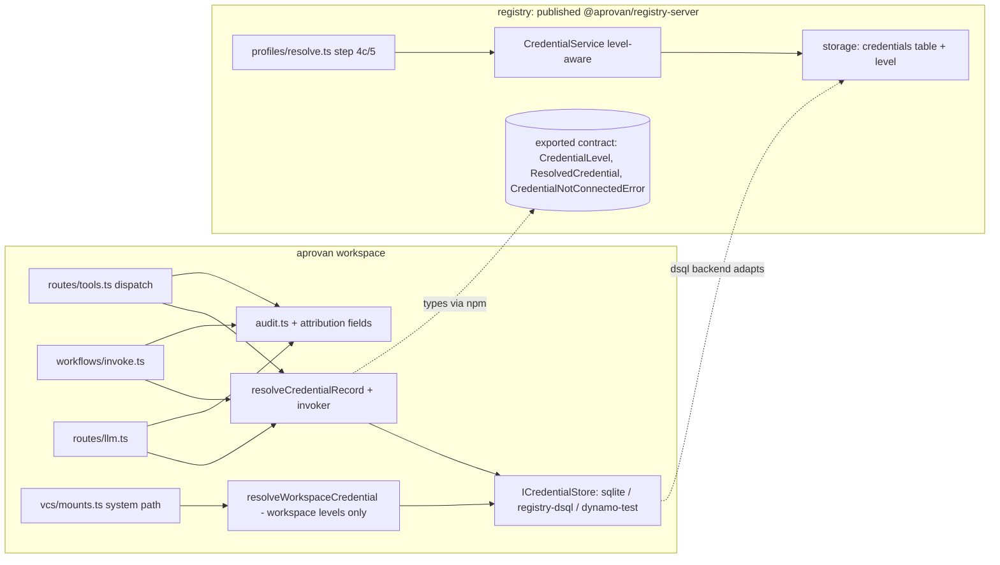

# Tech Plan — iw9-f3-credential-levels

## Context

Authority: `openspec/changes/IW-9-APP-FIRST.md` — invariant 1 ("Identity
follows the credential"), D12/D15 (approval routing consumes the level),
D22 (payment follows the credential; out of scope here).

Verified current state (both repos):

- **Record shape.** `CredentialRecord` (aprovan
  `server/workspace/src/credentials.ts:82-92`) and `CredentialRow`
  (registry `packages/registry-server/src/storage/types.ts:24-35`) carry
  `createdBy?` — provenance only, optional, "undefined = legacy/
  tenant-shared row". **No level field exists anywhere.** The brief's F3
  line "owner/user dimension (currently none)" is stale in the letter but
  right in spirit: provenance exists, ownership *semantics* do not.
- **Resolution ignores the invoker.** Workspace entry point
  `resolveCredentialRecord(workspaceId, provider, credentialId?, profile?)`
  (`credentials.ts:732-764`) has no invoker parameter; provider-default
  resolution is "first credential for provider" (`credentials.ts:497-509`
  sqlite `ORDER BY created_at LIMIT 1`; Dynamo `Limit: 1` at :280-304).
  Registry's normative `resolveProfile()`
  (`packages/registry-server/src/profiles/resolve.ts:148`) resolves a
  pinned credential by id (step 4c) or falls back to "first tenant
  credential" (step 5) — `CallContext` carries `principal` and
  `actor` (`packages/registry-server/src/config/types.ts:22-45`) but the
  credential step never reads them.
- **Dispatch call sites** (aprovan): `routes/tools.ts:1248`
  (`interfaceCredentialId` pin or provider default), `workflows/invoke.ts:366`,
  `routes/llm.ts:116`, and a system path `vcs/mounts.ts:207`
  (`resolveRecordForProvider(workspaceId, "github")` — no user in scope).
- **Audit.** `AuditEntry` (`server/workspace/src/audit.ts:18-33`) records
  `callerId` (= `principal.sub`, `routes/tools.ts:858`) but nothing about
  the credential or via-path. Backends: sqlite (DDL in `audit.ts:186-201`),
  DSQL (`db/dsql-schema.sql` `audit_log`), Dynamo (contract tests only).
- **Repo boundary.** The workspace consumes registry code **only** as the
  published npm package `@aprovan/registry-server` (`server/workspace/
  package.json` pins `^0.2.10`); `credentials.ts` re-exports its payload
  types, `credential-store-adapter.ts` adapts `ICredentialStore` onto its
  `CredentialStore`, and the dsql backend (`CredentialStoreRegistry`) makes
  the package's `credentials` table (`storage/schema.ts:19-30`,
  `created_by TEXT`) the store of record.
- **Migration precedent.** Both repos already do additive column + tolerant
  read for `created_by` (sqlite `ALTER TABLE ... ADD COLUMN` in a
  try/catch, `credentials.ts:402-408`).

Sibling coordination (IW-9 serialization rules): F3 owns `credentials.ts`,
`credential-store-adapter.ts`, `audit.ts`, and registry `credentials/*`,
`profiles/resolve.ts`, `storage/*` credential pieces. F1 also edits
`routes/tools.ts` but only the VCS tool schemas (:278-380); F3's edits
there are the dispatch/audit region (:850-1340) — disjoint, coordinate at
merge. Grants/approval enforcement is iw9-c and is **not** touched.

## Goals / Non-Goals

**Goals:**

- One stored `level` dimension, consistent across both repos' schemas and
  all three workspace store backends, with read-time backfill.
- Invoker-aware resolution with a published, typed resolution-order
  contract in `@aprovan/registry-server` (the iw9-c seam).
- Fail-closed, machine-distinguishable "not connected" error.
- Audit attribution (credential id + level + source, actor, profile) on the
  dispatch audit rows, additive on every backend.

**Non-Goals:**

- Approval routing, grant checks, connect-flow UI (iw9-c and later).
- Payload/cipher changes (`protected-credential-envelope` untouched).
- Billing attribution (D22), app manifests (iw9-f4/b), partitions (iw9-f2).

## Architecture



Component responsibilities:

- **`@aprovan/registry-server` (owns the contract):** level vocabulary,
  row schema, level/type validation in `CredentialService.create`,
  invoker-aware selection in `resolveProfile` step 4c/5, and the exported
  resolution-contract types. Nothing workspace-side redeclares these
  (the pre-0.2.5 drift lesson in `credentials.ts:53-63` stands).
- **aprovan `credentials.ts`:** `ICredentialStore` grows level/owner
  columns per backend; `resolveCredentialRecord` gains the invoker and
  applies the same contract (it re-exports the package types); a separate
  `resolveWorkspaceCredential` serves invoker-less system paths and is
  structurally unable to return `user-oauth` rows.
- **aprovan `audit.ts`:** additive attribution fields, three backends.
- **Dispatch routes:** thread the already-present principal into
  resolution and the resolved credential metadata into audit appends.

### Repo split & publish sequence

F3 is one of the two genuinely cross-repo IW-9 streams (IW-9 "Cross-repo
coordination", hard rules 1–4). The split:

- **registry** (`/Users/jacob/Documents/Code/AprovanLabs/registry`):
  `packages/registry-server/src/credentials/*` (types, service validation,
  level vocabulary, `effectiveLevel`, `CredentialNotConnectedError`),
  `src/storage/*` (schema + `CredentialRow.level`), `src/profiles/resolve.ts`
  (invoker-aware step 4c/5), `src/index.ts` (contract exports). Must build
  standalone from a fresh clone; it never imports aprovan sources.
- **aprovan** (`/Users/jacob/Documents/Code/AprovanLabs/aprovan`):
  `server/workspace/src/credentials.ts`, `credential-store-adapter.ts`,
  `audit.ts`, plus the dispatch call sites (`routes/tools.ts`,
  `workflows/invoke.ts`, `routes/llm.ts`, `vcs/mounts.ts`). It consumes
  registry code **only** via the published `@aprovan/registry-server` npm
  package.

Publish sequence (never in one step, never reversed):

1. Registry work lands; `@aprovan/registry-server` version bumps (minor —
   all changes additive/widening) and **publishes to npm**.
2. aprovan bumps its pin in a **separate commit** — the pin must remain
   `^0.2.7` or later (0.2.4–0.2.6 are deprecated-broken on npm; current
   pin `^0.2.10` already satisfies this).
3. Only then does aprovan-side F3 work begin compiling against the new
   types.

Grep-gates for definition-of-done run in **both** repos regardless of
where the change landed (e.g. no remaining invoker-less resolution entry
point in either repo).

## Decisions

### D1: `level` is a stored column with read-time backfill

- **Choice**: Add nullable `level` (TEXT) to both credential schemas.
  Every read path maps `NULL` through one shared pure function
  `effectiveLevel(type, storedLevel)` (type-derived backfill). No bulk
  UPDATE migration.
- **Alternatives**: (a) Derive level purely from payload type, no column —
  loses the explicit `oauth2_authcode`-as-`workspace-oauth` bot case and
  makes the level unqueryable in SQL. (b) Bulk backfill migration at
  deploy — DSQL has no transactional DDL+DML convenience here, the
  `created_by` precedent is read-tolerant, and read-time mapping makes
  rollback trivial. Rejected for risk with no benefit.
- **Revisit if**: audit/approval queries need to index on level in SQL at
  scale; then a one-off backfill UPDATE materializes the derived values.

### D2: Legacy backfill is type-derived, never `user-oauth`

- **Choice**: `bearer_token`/`api_key` → `workspace-token`;
  `oauth2_client`/`oauth2_authcode` → `workspace-oauth`.
- **Alternatives**: (a) All legacy → `workspace-token` (the brief's
  "likely") — mislabels OAuth rows and would let iw9-c route their
  approvals as static-secret credentials. (b) Legacy `oauth2_authcode`
  with `createdBy` set → `user-oauth` — silently cuts off every other
  member who used that shared connection yesterday; a behavior change the
  brief does not order. Preserving observed behavior wins.
- **Revisit if**: a workspace explicitly re-classifies a legacy connection
  (that is an update path, not a backfill rule).

### D3: The owner of a `user-oauth` row is `createdBy`

- **Choice**: No new column. `createdBy` is required and load-bearing when
  `level = "user-oauth"` (creation rejects its absence; resolution matches
  invoker against it); it stays provenance-only for workspace levels.
  Uniqueness `(workspace, provider, owner)` for user-level rows is
  enforced at create in `CredentialService` / `ICredentialStore.create`.
- **Alternatives**: A distinct `owner_sub` column — duplicates `createdBy`
  in every realistic flow (the connector is the owner), invites drift, and
  widens three schemas for nothing. Rejected.
- **Revisit if**: credential transfer/re-assignment between users becomes
  a feature (then owner must be mutable independently of provenance).

### D4: Resolution order — pin, then invoker's own, then workspace

- **Choice**: Normative order: (1) explicit `credentialId` pin resolves
  exactly that row, loudly (today's contract, kept); a pinned
  `user-oauth` row whose owner ≠ invoker fails closed. (2) No pin: the
  invoker's own `user-oauth` row for the provider, if any. (3) Otherwise
  workspace-level rows in the existing `created_at` order. Other users'
  `user-oauth` rows are invisible to steps 2–3. If the selection lands on
  user level and the invoker has no connection → `CredentialNotConnectedError`.
- **Alternatives**: (a) Workspace-level first — violates invariant 1 (a
  person who connected their identity expects to act as themselves).
  (b) Fail whenever both levels exist (force a profile pin) — hostile
  default; profiles already exist for the deliberate case.
  (c) Fall back from an unconnected user-level *pin* to a workspace
  credential — the exact silent identity swap the brief forbids.
- **Revisit if**: iw9-c introduces per-profile level policy ("this profile
  is always the bot") — that composes as a pin, not an order change.

### D5: Fail-closed error is a typed, coded error

- **Choice**: `CredentialNotConnectedError` exported from
  `@aprovan/registry-server` (mirrored by re-export in workspace
  `credentials.ts`), with `code: "credential_not_connected"`, `status:
  403`, and `provider` + `requiredLevel` fields. Distinct from
  `CredentialResolutionError` (`status: 400`, config bug).
- **Alternatives**: Reuse `CredentialResolutionError` with message text —
  spec requires machine distinction (iw9-c reacts to it with a per-user
  connect prompt); string matching is not a contract. Rejected.
- **Revisit if**: never — a coded error is strictly more information.

### D6: System paths get a workspace-only resolver

- **Choice**: Add `resolveWorkspaceCredential(workspaceId, provider)`
  beside `resolveCredentialRecord`; it filters to workspace levels and is
  the only resolver invoker-less code may call. `vcs/mounts.ts:207` moves
  to it. `resolveCredentialRecord` makes `invoker` **required**.
- **Alternatives**: Optional invoker on one function — every future call
  site silently compiles without attribution, recreating today's hole.
  Rejected; the type system should force the choice.
- **Revisit if**: a system path legitimately needs user identity (it then
  has an owner by definition — invariant 3 — and uses the main resolver).

### D7: Audit attribution is additive nullable columns

- **Choice**: Extend `AuditEntry` with `credentialId?`, `credentialLevel?`,
  `credentialSource?: "stored" | "ephemeral"`, `actorKind?`, `actorId?`,
  `profileName?`. Additive DDL on sqlite (try/catch `ALTER`, the
  `created_by` pattern) and `db/dsql-schema.sql`; Dynamo store passes the
  fields through (test-only). Fire-and-forget write contract unchanged.
- **Alternatives**: A separate attribution table joined by request id —
  audit writes are fire-and-forget and the join would race; over-normalized
  for a 30-day-TTL log. Rejected.
- **Revisit if**: audit grows an analytical store; then normalize there.

## Interfaces & Data

Published from `@aprovan/registry-server` (the delegation seam; iw9-c and
the workspace build against these without reading resolution internals):

```ts
export type CredentialLevel = "workspace-token" | "workspace-oauth" | "user-oauth";

/** NULL-tolerant backfill: the ONLY place a missing stored level is interpreted. */
export function effectiveLevel(type: CredentialType, stored?: CredentialLevel): CredentialLevel;

export interface CredentialInvoker {
  sub: string;                                            // authenticated user
  actor?: { kind: "app" | "workflow" | "agent"; id: string }; // via-path (CallContext.actor)
}

export interface CredentialResolutionRequest {
  tenantId: string;
  provider: string;
  invoker: CredentialInvoker;
  credentialId?: string;   // explicit pin (profile/interface); loud on mismatch
  profileName?: string;    // display/audit only at this layer
}

export interface ResolvedCredential {
  id: string;
  level: CredentialLevel;
  owner?: string;          // present iff level === "user-oauth"
  payload: CredentialPayload;
}

export class CredentialNotConnectedError extends Error {
  readonly code: "credential_not_connected";
  readonly status: 403;
  readonly provider: string;
  readonly requiredLevel: "user-oauth";
}
```

Row/schema deltas:

- registry `credentials` table: `level TEXT` (nullable);
  `CredentialRow.level?: CredentialLevel`. Create-time validation matrix
  (level ⟷ payload type) and `(tenant, provider, created_by)` uniqueness
  for `user-oauth` live in `CredentialService.create`.
- aprovan `CredentialRecord.level?: CredentialLevel` (+ sqlite column via
  try/catch ALTER; Dynamo item attribute; dsql backend inherits the
  registry table). `credential-store-adapter.ts` maps it both ways.
- `resolveProfile` step 4c/5 and workspace `resolveCredentialRecord`
  return `ResolvedCredential` (superset of today's `{ id, payload }`), so
  audit appends can read `level`/`owner` without a second fetch.
- `AuditEntry` delta: six optional fields per D7; `recent()` returns them
  on sqlite and dsql.

Approval-routing seam (consumed by iw9-c, per D12/D15): the level on
`ResolvedCredential` is the routing key — `workspace-*` → admin approves
once for the space; `user-oauth` → the invoker's own queue; a
`CredentialNotConnectedError` is the trigger for a per-user connect
prompt. Nothing else in this change encodes approval behavior.

## Risks / Trade-offs

- [Signature change on `resolveCredentialRecord` ripples through dispatch
  call sites (`tools.ts`, `invoke.ts`, `llm.ts`)] → invoker is already in
  scope at all three (`principal.sub` at `tools.ts:858`; `ServiceContext`
  in invoke; llm routes authenticate the same way); the compiler enumerates
  the sites, and D6 keeps invoker-less paths honest.
- [Two-repo lockstep: workspace cannot compile against unpublished
  registry types] → strict phase ordering in Rollout; registry changes are
  backward-compatible (new optional column, widened return type) so the
  workspace upgrade is a normal version bump, not a coordinated cutover.
- [Backfill mislabels an `oauth2_authcode` row someone intended as
  personal] → it behaves exactly as it did yesterday (shared); the fix is
  an explicit level update on that row, and iw9-c's approval surface will
  expose the level loudly.
- [Behavior change: a user's own `user-oauth` credential now outranks a
  workspace credential (D4 step 2)] → only reachable once a `user-oauth`
  row exists, which no current row backfills to; net-new surface, not a
  regression.
- [F1 touches `routes/tools.ts` in the same wave] → disjoint line ranges
  (F1: tool schemas :278-380; F3: dispatch/audit :850-1340); rebase, don't
  serialize.
- [Audit fire-and-forget writes must not start failing on old schemas] →
  additive nullable columns + the existing try/catch append contract;
  tested per backend.

## Rollout

1. **Registry phase** (`/Users/jacob/Documents/Code/AprovanLabs/registry`):
   schema + `CredentialRow.level` + `effectiveLevel` + create-time
   validation + invoker-aware `resolveProfile` + contract exports; publish
   `@aprovan/registry-server` (minor bump; all changes additive/widening).
2. **Workspace phase** (`aprovan`): bump the dependency pin; store
   backends + adapter carry `level`; `resolveCredentialRecord(invoker)` +
   `resolveWorkspaceCredential`; dispatch call sites threaded; audit
   schema + appends.
3. **Rollback**: each phase reverts independently — the level column is
   nullable and unread by prior code; read-time backfill means no data
   migration to unwind. Audit columns likewise additive.
4. **Definition of done** (IW-9 MIGRATION-DEBT rule): no dispatch-path
   resolution without an invoker or an explicit workspace-only call —
   grep-gated in tasks.

## Open Questions

None. PRD assumptions A1–A3 are decided above (D2, D3); the orchestrator
may veto at review.
