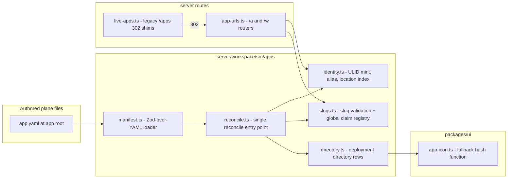

# Tech Plan — iw9-f4-app-identity

_Implements IW-9 decisions D3 (app.yaml + platform record), D4 (slugs), D5 (URLs), D6 (icons). Those product decisions are settled; the decisions below are implementation-level only. Wave-1 `iw9-b-app-model` consumes the **AppYaml schema** and the **reconcile contract** defined under Interfaces & Data as frozen seams._

## Context

- The manifest is a platform record today, not a file: `AppManifest` (`server/workspace/src/apps/store.ts:82-139`) mixes authored fields (title, description, requires, allowedTools) with platform state (`appId`, `createdAt/updatedAt`, `createdBy`, `channels`). There is no `app.yaml`, no YAML anywhere in the apps plane.
- `saveApp` fans out four writes — manifest record, name alias, deployment location index, directory row (`apps/store.ts:371-377`, calling `setAlias`/`indexAppLocation` in `apps/identity.ts:65-79,98-121` and `syncDirectoryEntry` in `apps/directory.ts:59`). This fan-out is the de-facto reconcile; it just has no file input and no identity guards.
- ULID identity already exists: `mintAppId`/`isAppId`/`resolveAppRef` (`apps/identity.ts`), alias scope `svc#apps/alias`, deployment reverse index `svc#apps/byId` under `DEPLOYMENT_TENANT`.
- Slug shape exists as `NAME_RE = /^[a-z0-9][a-z0-9-]{0,63}$/u` (`apps/store.ts:167`); nothing rejects ULID-shaped names, so `resolveAppRef`'s "ULID passthrough else alias" branch is only accidentally unambiguous.
- Public URLs leak workspace ids: `routes/live-apps.ts` serves `/apps/:workspaceId/:name` (mounted at domain root, `server.ts:44`) and bakes `liveBase`/`appBase` = `/apps/<wsId>/<name>` into the page shell (`buildAppShell`, live-apps.ts:416-417). A durable permalink `/apps/id/:appId` exists but is secondary.
- No icon field exists on manifests or directory rows (only service metadata icons, `apps/service.ts:498`).
- No workspace slug concept exists (verified by grep across both repos).
- Off-limits: `apps/releases.ts` (iw9-a), partitions/records (iw9-f2), tree layout / install / promote-out / sharing (iw9-b), capability enforcement (iw9-c).

## Goals / Non-Goals

**Goals:**
- One Zod-over-YAML loader for `app.yaml` with a strict authored-field whitelist and fail-closed rejection of platform-owned fields.
- One reconcile entry point that subsumes today's four-write fan-out and adds identity guards (first-sight mint, duplicate/foreign-id rejection, slug-collision 409) — stated precisely enough that iw9-b can build trees against it without talking to us.
- Slug validation at a single choke point, reusing `isAppId` for ULID-shape rejection.
- New `/a` and `/w` routers; legacy `/apps/*` app addressing becomes 302s; shell config stops embedding workspace ids for public apps.
- Deterministic icon fallback specified normatively (algorithm, palette) with one canonical shared implementation.

**Non-Goals:**
- Migrating existing manifests to files on disk (B owns the tree; the record schema here is forward-compatible).
- Workspace-slug management UI/procedures (resolver interface + storage scope only).
- Any change to release/channel machinery, partition guards, or capability enforcement.

## Architecture



Responsibilities: `manifest.ts` parses+validates only (no IO beyond the given bytes); `reconcile.ts` is the only writer of app identity state; `slugs.ts` owns slug shape rules and the global claim registry; `app-urls.ts` resolves ids/slugs and serves the live surface under canonical/vanity prefixes; `live-apps.ts` retains only redirect shims; `app-icon.ts` is a pure function with no dependencies.

## Decisions

### T1: `yaml` parse piped into a strict Zod schema
- **Choice**: Parse with the `yaml` package (position-carrying errors, comment-preserving round-trip available later), then `AppYamlSchema.strict().safeParse` — unknown keys and platform-owned keys rejected by the schema, with platform-owned keys called out via a superRefine producing "identity is platform-assigned" messages.
- **Alternatives**: `js-yaml` — no comment-preserving document model, weaker error positions; JSON-Schema/ajv — breaks the repo-wide "zod schemas in a shared package" contract style and duplicates type derivation.
- **Revisit if**: agents need programmatic comment-preserving edits at scale and `yaml`'s document API proves insufficient.

### T2: Directory basename is the authoritative slug; `slug` field optional-but-must-match
- **Choice**: The app-root directory basename is the slug (D4: rename = `mv`). `app.yaml` MAY carry `slug` (D3 lists it) purely as self-description; reconcile rejects a mismatch. This resolves the D3/D4 overlap without reopening either.
- **Alternatives**: `slug` field authoritative — breaks rename-as-`mv` (D4) and invites drift between file and tree; forbid the field entirely — makes `app.yaml` non-self-describing when copied out of context, and contradicts D3's field list.
- **Revisit if**: iw9-b's tree layout ends up not encoding the slug in the path (then the field becomes authoritative and this decision flips).

### T3: One `reconcileApp` entry point; record binds identity to `root`
- **Choice**: `reconcile.ts` exports a single `reconcileApp(input)` that performs read→guard→write: resolve existing binding by `root` path, mint via `mintAppId()` only when no binding exists, then execute today's four writes atomically-in-order (record, alias, location index, directory). The platform record gains a `root` field (the app-root path) as the binding key. Guards: foreign/duplicate id → 400 (never re-mint, never adopt); slug held by another app → 409 naming the holder (matching `setAlias` semantics, `identity.ts:65-79`); unchanged input → no writes (idempotence, compared against the stored record).
- **Alternatives**: keep `saveApp` and bolt guards onto callers — the audit showed exactly this pattern producing duplicate implementations; bind identity by content hash of `app.yaml` — renames and edits would re-mint, violating D3's "first sight of a new app **root**".
- **Revisit if**: iw9-b needs multi-root apps (contradicts D7/D8 as planned; would need a new binding key).

### T4: ULID-shape slug rejection delegates to `isAppId`
- **Choice**: `slugs.ts` validates shape as `NAME_RE.test(slug) && !isAppId(slug)` — one source of truth for "what is a ULID" (the `ulid` package's `isValid`, already wrapped by `apps/identity.ts:36-38`), so slug/id disjointness and `resolveAppRef`'s passthrough branch can never drift apart.
- **Alternatives**: a second regex in slug code — two definitions of ULID-shape that drift; rejecting all 26-char slugs — over-broad, bans legitimate names containing non-base32 chars.
- **Revisit if**: identity ever moves off ULIDs (would be a new IW-level decision).

### T5: New `/a` + `/w` routers; legacy `/apps` handlers become 302 shims
- **Choice**: New `routes/app-urls.ts` mounted at domain root beside the existing mounts (`server.ts`), owning resolution (ULID → id path, else slug path via global claims / workspace alias) and the live surface (page, `__project__`, `__sdk__.*`, static). This is a **move**, not an import-and-reuse: today's serving logic (`resolveLiveApp`, `viewerSub`, `requireViewer`, `resolvePin`, `readPinned`, `servableTargets`, `handleLive*`, `buildAppShell` — `live-apps.ts:79-538`) relocates into `app-urls.ts` verbatim (port, don't reimplement, per task 5.5); `routes/live-apps.ts` ends the change containing **only** resolve-then-302 shims, per the architecture diagram's "`live-apps.ts` retains only redirect shims." A shim resolves the legacy segment to a canonical path and returns `c.redirect(canonical, 302)` — it does not call into `app-urls.ts`'s handlers at all.
- **`/w/<wsRef>/a/<ref>` resolution at F4 stage (no over-building of iw9-b's install-as-copy model)**: `<ref>` is resolved by porting `resolveLiveApp`'s existing two-branch logic unchanged (`live-apps.ts:103-155`), which already disambiguates by trying an install first: (1) if `isAppId(ref)`, try `readInstall(wsId, ref)` (`apps/install.ts`, existing pre-IW9 origin-pinned install record — **not** D8's install-as-copy, which iw9-b has not built yet); a hit serves the origin's pinned release (or the local fork when `editing`), exactly as today. (2) On a miss (no install with that id) or when `ref` is not a ULID, fall through to `resolveAppRef(wsId, ref)` — ULID passthrough (the workspace's own app by appId) or alias lookup (the workspace's own app by slug/name). This means `/w/<wsId>/a/<installId>` and `/w/<wsId>/a/<slug-or-own-appId>` are the **same route handler** with the same dual resolution `resolveLiveApp` already performs — F4 does not add a new install concept, it only moves the existing one under the canonical prefix. `<wsRef>` resolves via `resolveWorkspaceSlug` (Stream 2) when not a raw workspace id, else passthrough.
- **`/w/<wsSlug>/a/<slug>` never resolves an install**: installs have no name/slug field anywhere in `apps/install.ts` (verified by grep — installs are addressed by `installId` only, everywhere in `apps/service.ts`). The vanity form can therefore only ever resolve a workspace's own directly-authored app via `resolveAppRef`'s alias branch; document this explicitly so the implementer doesn't invent install aliasing that has no backing data model.
- **Alternatives**: CloudFront/edge rewrite rules — resolution needs the slug indexes, which live behind svc-records, not at the edge; mutating live-apps.ts in place to speak both grammars — leaves the leaking URL grammar alive and grep-unverifiable; keeping `live-apps.ts` as the server-logic owner and having `app-urls.ts` import its internals — rejected because the architecture's end state (`live-apps.ts` = shims only) requires the logic to not still live in the file the shims live in, and dead exports left behind fail the MIGRATION-DEBT grep-gate the same way an un-deleted duplicate would.
- **Revisit if**: D21's edge ws→region lookup lands and wants resolution at the edge; iw9-b's real install-as-copy model changes what `readInstall` returns (F4 only moves the existing lookup, it does not change its contract).

### T6: Global slug claims and workspace-slug resolution as deployment-tenant scopes
- **Choice**: `svc#slugs/<globalSlug>` → `{ appId, workspaceId, claimedAt }` and `svc#wsSlugs/<wsSlug>` → `{ workspaceId }`, both under the existing reserved `DEPLOYMENT_TENANT` (pattern of `svc#apps/byId` and `svc#directory`). Claim/release wired to publish/unpublish/remove; `wsSlugs` gets a resolver only (population is out of F4's scope — vanity `/w/<wsSlug>` 404s until a later change writes entries).
- **Alternatives**: keying the directory itself by slug — rename races could orphan uniqueness, and the directory is a projection, not an authority; a new storage table — needless second substrate beside svc-records.
- **Revisit if**: global claims need contention semantics svc-records cannot give (compare-and-swap across regions).

### T7: Icon fallback = first grapheme + FNV-1a(slug) over a fixed 12-color palette
- **Choice**: `appIconFallback(slug)` → `{ letter, color }`: letter = first grapheme of the slug, uppercased; color = `PALETTE[fnv1a32(utf8(slug)) % 12]` with the palette values fixed in the shared module. Canonical implementation in `packages/ui/src/apps/app-icon.ts` (dependency-free leaf module); the algorithm is normative so any second implementation is test-verifiable against fixtures. Hash input is the **slug** (D6), so rename re-colors — accepted, matches D6's wording. **Pinned FNV-1a-32 constants** (standard, non-negotiable so two implementations can't drift): offset basis `0x811c9dc5`, prime `0x01000193`, computed over the UTF-8 bytes of the slug, 32-bit unsigned arithmetic throughout (`>>> 0` after each multiply in JS). Slugs are `NAME_RE`-constrained to `[a-z0-9-]`, i.e. ASCII-only, so "first grapheme" reduces to `slug[0]` — no Unicode grapheme-cluster segmentation is required or expected.
- **Alternatives**: hash the appId — stable across rename, but D6 says slug and pre-reconcile surfaces (create dialogs) have no appId yet; persist a random color on the record — not pure, breaks "same slug, same color, everywhere".
- **Revisit if**: user feedback shows rename re-coloring is disorienting (would need a D6 amendment).

### T8: `root → appId` binding is a new workspace-scoped svc-record index, not a list scan
- **Choice**: Reconcile's "resolve existing binding by `root`" (T3) needs a forward lookup that does not exist in `apps/identity.ts` today (verified by reading the file: `ALIAS_SCOPE` is keyed by name/slug, `BY_ID_SCOPE` is keyed by appId — neither is keyed by `root`). Add one more scope in `identity.ts`, following the exact shape of the existing `AppLocationRecord`/`indexAppLocation`/`dropAppLocation` trio (unconditional overwrite, no self-check — the caller, `reconcileApp`, owns all guard logic before calling): `ROOT_SCOPE = svcScope("apps", "root")`, workspace-scoped (a `root` path is only meaningful inside the workspace that owns it, same tenancy as `ALIAS_SCOPE`). `AppRootBinding = { appId: AppId }`. Three functions: `readRootBinding(workspaceId, root)`, `bindRoot(workspaceId, root, appId)`, `dropRootBinding(workspaceId, root)` — see Interfaces & Data. The reverse direction (given an `appId`, which `root` is it bound to, needed for the foreign/duplicate-id guard) does **not** need a second new index: `resolveAppLocation(appId)` (existing, deployment-wide) gives the owning `workspaceId`, and the `AppRecord` itself carries `root` (T3) — one `readApp` after `resolveAppLocation` answers "what root does this appId already own" with two point reads, both already existing primitives.
- **Alternatives**: scan `listApps(workspaceId)` and match `root` client-side — explicitly rejected per the instruction that produced this decision: a list scan over every app in a workspace on every reconcile call is both slower and racier (two concurrent reconciles of different new roots could both see "no match" and both mint) than a single keyed read; a dedicated index makes "no binding at this root" a single point-read with the same consistency guarantees every other identity lookup in this file already relies on. A second deployment-wide reverse index (`appId → root`) was also considered and rejected as redundant — `AppRecord.root` already carries that fact, so a second index would be a second source of truth for information the record already owns.
- **Revisit if**: iw9-b's tree model needs cross-workspace root uniqueness (a root binding readable across workspaces) — out of scope here; `root` bindings are per-workspace, same as `ALIAS_SCOPE`.

## Interfaces & Data

These are the frozen seams. `AppYaml` and `reconcileApp` are the contract iw9-b builds trees, promote-out, and install on top of.

### AppYaml (authored file — `server/workspace/src/apps/manifest.ts`, schema exported for reuse)

```ts
const AppYamlSchema = z.object({
  slug: z.string().optional(),        // T2: must equal root basename when present
  title: z.string().min(1).optional(),
  description: z.string().optional(),
  icon: z.string().optional(),        // named icon OR app-root-relative path; traversal rejected
                                       // by STRING PATTERN ONLY (reject a leading "/" and any ".."
                                       // path segment) — manifest.ts has no filesystem access (no IO
                                       // beyond the given bytes, per Architecture); this is not a
                                       // real path resolution against the app root.
  capabilities: z.array(z.string()).optional(), // ceiling; F4 accepts ANY string array and does not
                                       // validate the "ns.proc" | "ns.*" grammar — that grammar is
                                       // iw9-c's enforcement concern (Wave 2). Do not add a regex
                                       // for it here; a stricter check now could conflict with
                                       // iw9-c's eventual design.
  requires: z.array(z.object({        // existing AppRequirement shape (store.ts:142-146)
    contract: z.string(),
    profileName: z.string().optional(),
    optional: z.boolean().optional(),
  })).optional(),
  hostModes: z.array(z.enum(["managed", "creator-hosted", "publisher-hosted"]))
    .nonempty().default(["managed"]), // D2 semantics; install-time pick is iw9-b
}).strict();
// superRefine: reject appId/createdAt/updatedAt/createdBy/channels/paths/entry
// with "platform-assigned; never appears in app.yaml".
export type AppYaml = z.infer<typeof AppYamlSchema>;
export function loadAppYaml(content: string):
  { ok: true; value: AppYaml } | { ok: false; issues: { path: string; message: string }[] };
```

### AppRecord (platform-owned `svc#apps/<appId>` — never hand-written)

```ts
interface AppRecord {           // successor shape of AppManifest for identity fields
  appId: AppId;                 // ULID, minted by reconcile only
  name: string;                 // EXISTING field (AppManifest.name); reconcile sets this equal
                                 // to `slug` so every name-keyed caller that iw9-b hasn't
                                 // migrated yet (aliasing, live-apps resolution, allowedTools
                                 // namespace-derivation) keeps working unchanged.
  slug?: string;                // current binding; present on every record reconcileApp writes,
                                 // ABSENT on records still written by the pre-F4 saveApp() fan-out
                                 // (apps/service.ts's create/publish flow is not rewired to
                                 // reconcileApp by F4 — PRD non-goal "no app tree layout" — so
                                 // both record shapes coexist until iw9-b migrates callers).
                                 // Optional, not required: T3/task 3.1 is additive-only.
  root?: string;                // app-root workspace path — the reconcile binding key (T3);
                                 // same optionality rule as `slug` (undefined for pre-F4 records).
  originAppId?: AppId;
  declared?: AppYaml;           // last-reconciled authored snapshot (projection, not authority);
                                 // undefined for pre-F4 records, same rule as `slug`/`root`.
  createdBy: string; createdAt: string; updatedAt: string;
  // existing operational fields (entry/paths/allowedTools/roles/rateLimit/visibility/
  // workflows/channels) remain until iw9-b migrates them; F4 does not delete them.
}
```

**`name` vs `slug` projection (resolves the ambiguity in the original draft, which showed `slug` as required)**: `AppManifest.name` is the pre-existing mutable-alias field every current caller reads/writes; `slug` is F4's new field with the same *meaning* (D4's vanity slug) but a narrower *writer* (only `reconcileApp`, never hand-written, never written by the legacy `saveApp` path). Reconcile always keeps `name === slug` on the records it writes — there is exactly one value, exposed under two field names during the migration window. Consumers added by F4 (the directory projection, the URL routers) read `manifest.slug ?? manifest.name` so they work identically whether a record went through `reconcileApp` or the legacy path; nothing in F4 reads `slug` without this fallback. `iw9-b` retiring the `name` field (already called out below, "renaming the `name` field is deferred to B") is the point at which the fallback is deleted.

### Reconcile contract (`server/workspace/src/apps/reconcile.ts`)

```ts
interface ReconcileInput {
  workspaceId: string;
  root: string;                 // app-root workspace path (basename = slug)
  yaml: AppYaml;                // already loaded/validated
  expectedAppId?: AppId;        // callers that think they know; mismatch = 400, never adopt
  actor: string;                // sub for createdBy/audit
}
interface ReconcileResult { appId: AppId; created: boolean; changed: boolean; }
function reconcileApp(input: ReconcileInput): Promise<ReconcileResult>;
// Algorithm (uses the T8 root-binding index — readRootBinding/bindRoot/dropRootBinding
// in apps/identity.ts — plus existing resolveAppLocation/readApp/setAlias/dropAlias):
//
// 1. binding = readRootBinding(workspaceId, root)
// 2. IF binding is undefined (no record bound to this root):
//    a. IF expectedAppId is set: this is a RENAME/MOVE, not a fresh app. Resolve
//       loc = resolveAppLocation(expectedAppId) (throws 404 -> becomes 400 foreign id
//       if unknown); require loc.workspaceId === input.workspaceId (cross-workspace
//       moves are out of scope for F4 -> 400 foreign id, names root + id). Read the
//       existing record at (workspaceId, expectedAppId); its stored `root` is the OLD
//       root. Rebind: bindRoot(workspaceId, newRoot, appId), dropRootBinding(workspaceId,
//       oldRoot), setAlias(workspaceId, newSlug, appId), dropAlias(workspaceId, oldSlug)
//       — appId/createdAt unchanged, updatedAt bumped, declared/slug/root updated to the
//       new values. Result: { appId, created: false, changed: true }.
//    b. ELSE (no expectedAppId): first-sight. mintAppId() + create record (with slug/root/
//       declared populated, name = slug) + setAlias + indexAppLocation + bindRoot +
//       syncDirectoryEntry. Result: { appId, created: true, changed: true }.
// 3. IF binding exists (appId = binding.appId):
//    a. expectedAppId set and !== appId -> 400 foreign-or-duplicate id, no writes.
//    b. yaml.slug present and !== basename(root) -> 400 slug/basename mismatch (T2).
//    c. assertValidSlug(basename(root)) fails -> 400 ULID-shaped or malformed slug.
//    d. new slug (=basename(root)) held by a different appId in this workspace
//       (setAlias's existing 409) -> 409 slug collision, names holder, no writes to
//       either app's binding.
//    e. declared yaml deep-equals the stored record's `declared` AND slug unchanged ->
//       { appId, created: false, changed: false }, zero writes (idempotence).
//    f. otherwise (an authored-field edit, same root/slug) -> update record.declared
//       (+ any projected fields: title/icon/etc.), bump updatedAt, re-sync directory
//       row -> { appId, created: false, changed: true }.
//
// Errors: 400 yaml-identity-claim | 400 foreign-or-duplicate id (names root + id)
//   | 400 slug/basename mismatch | 400 ULID-shaped slug | 409 slug held by other
//   appId in workspace (names holder). Idempotent: unchanged input => changed=false, no writes.
```

### Root binding index (`server/workspace/src/apps/identity.ts`, addition — T8)

```ts
// Workspace-scoped, following the AppLocationRecord/indexAppLocation/dropAppLocation
// pattern exactly: unconditional read/write/delete, no self-guard — reconcile.ts is
// the sole caller and performs all guard checks (foreign id, slug collision, etc.)
// before calling these. Not exported for use outside apps/reconcile.ts.
export interface AppRootBinding { appId: AppId; }
export async function readRootBinding(workspaceId: string, root: string): Promise<AppRootBinding | undefined>;
export async function bindRoot(workspaceId: string, root: string, appId: AppId): Promise<void>;
export async function dropRootBinding(workspaceId: string, root: string): Promise<void>;
```

### Slug + claims (`server/workspace/src/apps/slugs.ts`)

```ts
function assertValidSlug(slug: string): void;         // NAME_RE && !isAppId (T4)
function claimGlobalSlug(slug: string, appId: AppId, workspaceId: string): Promise<void>; // 409 if held
function releaseGlobalSlug(slug: string, appId: AppId): Promise<void>;   // holder-only
function resolveGlobalSlug(slug: string): Promise<{ appId: AppId; workspaceId: string } | undefined>;
function resolveWorkspaceSlug(wsSlug: string): Promise<{ workspaceId: string } | undefined>; // svc#wsSlugs
```

### URL grammar (routes/app-urls.ts; segment is id iff `isAppId(segment)`)

| Path | Meaning | Behavior |
|---|---|---|
| `/a/<appId>` | canonical public app | serve (rename-stable) |
| `/a/<globalSlug>` | vanity public app | resolve claim → serve |
| `/w/<wsId>/a/<installId>` | canonical install | serve, ws/install mismatch = 404 |
| `/w/<wsSlug>/a/<slug>` | vanity install/app | resolve wsSlug + alias → serve |
| `/apps/<slug>`, `/apps/<wsId>/<name>`, `/apps/id/<appId>` | convenience/legacy | **302** to canonical, always |

No region segment anywhere. Public shell config (`buildAppShell`) emits only canonical bases; the API base for public apps becomes appId-keyed (same resolution, gateway side).

### Icon fallback (`packages/ui/src/apps/app-icon.ts`)

```ts
const APP_ICON_PALETTE: readonly string[]; // 12 fixed hex values, normative
function appIconFallback(slug: string): { letter: string; color: string };
// letter = slug[0].toUpperCase() (slugs are NAME_RE-constrained to [a-z0-9-], ASCII-only,
//   so no grapheme-cluster segmentation is needed — see T7);
// color = PALETTE[fnv1a32(utf8(slug)) % 12];
// fnv1a32: 32-bit FNV-1a, offset basis 0x811c9dc5, prime 0x01000193, over UTF-8 bytes,
//   unsigned 32-bit arithmetic throughout (pinned in T7 so a second implementation
//   cannot silently drift on constant choice).
```

Directory rows (`DirectoryEntry`, `apps/directory.ts:24-33`) gain `icon?: string`; the existing `name` field is retained (rename deferred to B) and the projection always populates a usable slug via `slug: manifest.slug ?? manifest.name` (see the AppRecord `name`/`slug` note above) — so every directory row carries a slug value whether or not its source record went through `reconcileApp`, and `icon: manifest.declared?.icon` is `undefined` (fallback renders) for every pre-F4 record.

## Risks / Trade-offs

- [F4 changes `apps/store.ts` while iw9-b will rewrite it in Wave 1] → additive-only changes to the record shape; `reconcileApp` wraps rather than deletes `saveApp` internals; B rebases on landed shapes (serialization rule in IW-9).
- [Legacy `/apps/<wsId>/<name>` links exist in the wild and in the shell's auth-return flow] → 302 shims keep every old link working; auth-return round-trips through canonical URLs after the shim.
- [Rename re-colors the fallback icon] → accepted per D6 (hash of slug); noted in ux.md.
- [`/w/<wsSlug>` vanity dead until wsSlugs populated] → resolver 404s cleanly; population is an explicitly deferred follow-up, not a broken surface.
- [Two icon-fallback implementations could drift if the server ever renders one] → algorithm is normative with shared fixtures; canonical implementation is the only one shipped in F4.

## Rollout

1. Land `manifest.ts`, `slugs.ts`, `reconcile.ts`, the `identity.ts` root-binding index (T8), record-shape additions (additive; no behavior change for existing callers).
2. Land `/a` + `/w` routers serving beside legacy routes (both grammars valid for one deploy).
3. Flip legacy `/apps/*` handlers to 302 shims; switch shell config bases to canonical. Rollback = revert step 3 only; steps 1-2 are additive.
4. Grep gates (definition of done, MIGRATION-DEBT rule): no route emits `/apps/<workspaceId>/` links; `liveBase`/`appBase` contain no workspace id for public apps.

## Open Questions

None requiring user input — D3-D6 settle the product surface; T1-T8 above are implementation-level with revisit conditions.

## Planning repairs (pre-dispatch pass)

This tech-plan was amended once, before any stream was dispatched, to close gaps found while writing standalone delegation briefs (see `briefs/deviations.md` for the full rationale and the source inspection that grounded each fix):

1. Added **T8** and the **Root binding index** — the original draft's reconcile contract said "resolve existing binding by `root`" but named no storage for it; `apps/identity.ts` has no `root`-keyed scope. Fixed with one new workspace-scoped svc-record index, not a list scan.
2. Made `AppRecord.slug`/`root`/`declared` **optional** (were shown as required) and added the `name`/`slug` projection rule — the original shape was inconsistent with "F4 adds, never removes" and "no rewiring of existing callers," since the pre-F4 `saveApp` path keeps writing records with no `slug`/`root`/`declared`.
3. Spelled out the reconcile **rename/move algorithm** concretely (task 3.5 said "rebinds the alias" but not how a rename is distinguished from a fresh root at the same call site).
4. Pinned the **FNV-1a-32 constants** (offset basis, prime) so a second implementation can't drift on an unstated detail, and noted slugs are ASCII-only (no grapheme segmentation needed).
5. Clarified the **icon traversal check is string-pattern-only** (`manifest.ts` has no filesystem access) and that **`capabilities` grammar validation is fully deferred to iw9-c** (F4 accepts any string array).
6. Pinned the **`/w/<wsRef>/a/<ref>` resolution algorithm** to the existing `resolveLiveApp` install-then-alias dual lookup (`apps/install.ts` + `apps/identity.ts`), explicitly the pre-IW9 origin-pinned install model — not D8's install-as-copy, which iw9-b has not built. Noted the vanity form can never address an install (installs have no name/slug anywhere in the codebase).
7. Resolved the `live-apps.ts` extraction as a **move** (logic relocates into `app-urls.ts`; `live-apps.ts` ends the change containing only 302 shims), matching the architecture diagram's stated end state, not a copy-and-keep-both.

No product decision (D1-D24, invariants, or any WHEN/THEN spec scenario) changed — every repair is implementation-level, at the same altitude as the existing T1-T7 decisions.
