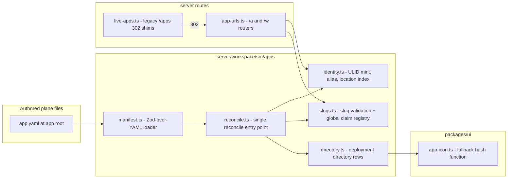

# Tech Plan — iw9-f4-app-identity

_Implements IW-9 decisions D3 (app.yaml + platform record), D4 (slugs), D5 (URLs), D6 (icons). Those product decisions are settled; the decisions below are implementation-level only. Wave-1 `iw9-b-app-model` consumes the **AppYaml schema** and the **reconcile contract** defined under Interfaces & Data as frozen seams._

## Context

- The manifest is a platform record today, not a file: `AppManifest` (`server/workspace/src/apps/store.ts:82-139`) mixes authored fields (title, description, requires, allowedTools) with platform state (`appId`, `createdAt/updatedAt`, `createdBy`, `channels`). There is no `app.yaml`, no YAML anywhere in the apps plane.
- `saveApp` fans out four writes — manifest record, name alias, deployment location index, directory row (`apps/store.ts:371-377`, calling `setAlias`/`indexAppLocation` in `apps/identity.ts:65-79,98-121` and `syncDirectoryEntry` in `apps/directory.ts:59`). This fan-out is the de-facto reconcile; it just has no file input and no identity guards.
- ULID identity already exists: `mintAppId`/`isAppId`/`resolveAppRef` (`apps/identity.ts`), alias scope `svc#apps/alias`, deployment reverse index `svc#apps/byId` under `DEPLOYMENT_TENANT`.
- Slug shape exists as `NAME_RE = /^[a-z0-9][a-z0-9-]{0,63}$/u` (`apps/store.ts:167`); nothing rejects ULID-shaped names, so `resolveAppRef`'s "ULID passthrough else alias" branch is only accidentally unambiguous.
- Public URLs leak workspace ids: `routes/live-apps.ts` serves `/apps/:workspaceId/:name` (mounted at domain root, `server.ts:44`) and bakes `liveBase`/`appBase` = `/apps/<wsId>/<name>` into the page shell (`buildAppShell`, live-apps.ts:416-417). A durable permalink `/apps/id/:appId` exists but is secondary.
- No icon field exists on manifests or directory rows (only service metadata icons, `apps/service.ts:498`).
- No workspace slug concept exists (verified by grep across both repos).
- Off-limits: `apps/releases.ts` (iw9-a), partitions/records (iw9-f2), tree layout / install / promote-out / sharing (iw9-b), capability enforcement (iw9-c).

## Goals / Non-Goals

**Goals:**
- One Zod-over-YAML loader for `app.yaml` with a strict authored-field whitelist and fail-closed rejection of platform-owned fields.
- One reconcile entry point that subsumes today's four-write fan-out and adds identity guards (first-sight mint, duplicate/foreign-id rejection, slug-collision 409) — stated precisely enough that iw9-b can build trees against it without talking to us.
- Slug validation at a single choke point, reusing `isAppId` for ULID-shape rejection.
- New `/a` and `/w` routers; legacy `/apps/*` app addressing becomes 302s; shell config stops embedding workspace ids for public apps.
- Deterministic icon fallback specified normatively (algorithm, palette) with one canonical shared implementation.

**Non-Goals:**
- Migrating existing manifests to files on disk (B owns the tree; the record schema here is forward-compatible).
- Workspace-slug management UI/procedures (resolver interface + storage scope only).
- Any change to release/channel machinery, partition guards, or capability enforcement.

## Architecture



Responsibilities: `manifest.ts` parses+validates only (no IO beyond the given bytes); `reconcile.ts` is the only writer of app identity state; `slugs.ts` owns slug shape rules and the global claim registry; `app-urls.ts` resolves ids/slugs and serves the live surface under canonical/vanity prefixes; `live-apps.ts` retains only redirect shims; `app-icon.ts` is a pure function with no dependencies.

## Decisions

### T1: `yaml` parse piped into a strict Zod schema
- **Choice**: Parse with the `yaml` package (position-carrying errors, comment-preserving round-trip available later), then `AppYamlSchema.strict().safeParse` — unknown keys and platform-owned keys rejected by the schema, with platform-owned keys called out via a superRefine producing "identity is platform-assigned" messages.
- **Alternatives**: `js-yaml` — no comment-preserving document model, weaker error positions; JSON-Schema/ajv — breaks the repo-wide "zod schemas in a shared package" contract style and duplicates type derivation.
- **Revisit if**: agents need programmatic comment-preserving edits at scale and `yaml`'s document API proves insufficient.

### T2: Directory basename is the authoritative slug; `slug` field optional-but-must-match
- **Choice**: The app-root directory basename is the slug (D4: rename = `mv`). `app.yaml` MAY carry `slug` (D3 lists it) purely as self-description; reconcile rejects a mismatch. This resolves the D3/D4 overlap without reopening either.
- **Alternatives**: `slug` field authoritative — breaks rename-as-`mv` (D4) and invites drift between file and tree; forbid the field entirely — makes `app.yaml` non-self-describing when copied out of context, and contradicts D3's field list.
- **Revisit if**: iw9-b's tree layout ends up not encoding the slug in the path (then the field becomes authoritative and this decision flips).

### T3: One `reconcileApp` entry point; record binds identity to `root`
- **Choice**: `reconcile.ts` exports a single `reconcileApp(input)` that performs read→guard→write: resolve existing binding by `root` path, mint via `mintAppId()` only when no binding exists, then execute today's four writes atomically-in-order (record, alias, location index, directory). The platform record gains a `root` field (the app-root path) as the binding key. Guards: foreign/duplicate id → 400 (never re-mint, never adopt); slug held by another app → 409 naming the holder (matching `setAlias` semantics, `identity.ts:65-79`); unchanged input → no writes (idempotence, compared against the stored record).
- **Alternatives**: keep `saveApp` and bolt guards onto callers — the audit showed exactly this pattern producing duplicate implementations; bind identity by content hash of `app.yaml` — renames and edits would re-mint, violating D3's "first sight of a new app **root**".
- **Revisit if**: iw9-b needs multi-root apps (contradicts D7/D8 as planned; would need a new binding key).

### T4: ULID-shape slug rejection delegates to `isAppId`
- **Choice**: `slugs.ts` validates shape as `NAME_RE.test(slug) && !isAppId(slug)` — one source of truth for "what is a ULID" (the `ulid` package's `isValid`, already wrapped by `apps/identity.ts:36-38`), so slug/id disjointness and `resolveAppRef`'s passthrough branch can never drift apart.
- **Alternatives**: a second regex in slug code — two definitions of ULID-shape that drift; rejecting all 26-char slugs — over-broad, bans legitimate names containing non-base32 chars.
- **Revisit if**: identity ever moves off ULIDs (would be a new IW-level decision).

### T5: New `/a` + `/w` routers; legacy `/apps` handlers become 302 shims
- **Choice**: New `routes/app-urls.ts` mounted at domain root beside the existing mounts (`server.ts`), owning resolution (ULID → id path, else slug path via global claims / workspace alias) and the live surface (page, `__project__`, `__sdk__.*`, static) by delegating to the existing handlers' internals. `routes/live-apps.ts` routes are rewritten as resolve-then-302 shims; `buildAppShell` config bases switch to canonical prefixes (`/a/<appId>`, `/w/<wsId>/a/<installId>`), removing the workspace id from public shells.
- **Alternatives**: CloudFront/edge rewrite rules — resolution needs the slug indexes, which live behind svc-records, not at the edge; mutating live-apps.ts in place to speak both grammars — leaves the leaking URL grammar alive and grep-unverifiable.
- **Revisit if**: D21's edge ws→region lookup lands and wants resolution at the edge.

### T6: Global slug claims and workspace-slug resolution as deployment-tenant scopes
- **Choice**: `svc#slugs/<globalSlug>` → `{ appId, workspaceId, claimedAt }` and `svc#wsSlugs/<wsSlug>` → `{ workspaceId }`, both under the existing reserved `DEPLOYMENT_TENANT` (pattern of `svc#apps/byId` and `svc#directory`). Claim/release wired to publish/unpublish/remove; `wsSlugs` gets a resolver only (population is out of F4's scope — vanity `/w/<wsSlug>` 404s until a later change writes entries).
- **Alternatives**: keying the directory itself by slug — rename races could orphan uniqueness, and the directory is a projection, not an authority; a new storage table — needless second substrate beside svc-records.
- **Revisit if**: global claims need contention semantics svc-records cannot give (compare-and-swap across regions).

### T7: Icon fallback = first grapheme + FNV-1a(slug) over a fixed 12-color palette
- **Choice**: `appIconFallback(slug)` → `{ letter, color }`: letter = first grapheme of the slug, uppercased; color = `PALETTE[fnv1a32(utf8(slug)) % 12]` with the palette values fixed in the shared module. Canonical implementation in `packages/ui/src/apps/app-icon.ts` (dependency-free leaf module); the algorithm is normative so any second implementation is test-verifiable against fixtures. Hash input is the **slug** (D6), so rename re-colors — accepted, matches D6's wording.
- **Alternatives**: hash the appId — stable across rename, but D6 says slug and pre-reconcile surfaces (create dialogs) have no appId yet; persist a random color on the record — not pure, breaks "same slug, same color, everywhere".
- **Revisit if**: user feedback shows rename re-coloring is disorienting (would need a D6 amendment).

## Interfaces & Data

These are the frozen seams. `AppYaml` and `reconcileApp` are the contract iw9-b builds trees, promote-out, and install on top of.

### AppYaml (authored file — `server/workspace/src/apps/manifest.ts`, schema exported for reuse)

```ts
const AppYamlSchema = z.object({
  slug: z.string().optional(),        // T2: must equal root basename when present
  title: z.string().min(1).optional(),
  description: z.string().optional(),
  icon: z.string().optional(),        // named icon OR app-root-relative path; traversal rejected
  capabilities: z.array(z.string()).optional(), // ceiling, grammar of allowedTools: "ns.proc" | "ns.*" (enforced by iw9-c)
  requires: z.array(z.object({        // existing AppRequirement shape (store.ts:142-146)
    contract: z.string(),
    profileName: z.string().optional(),
    optional: z.boolean().optional(),
  })).optional(),
  hostModes: z.array(z.enum(["managed", "creator-hosted", "publisher-hosted"]))
    .nonempty().default(["managed"]), // D2 semantics; install-time pick is iw9-b
}).strict();
// superRefine: reject appId/createdAt/updatedAt/createdBy/channels/paths/entry
// with "platform-assigned; never appears in app.yaml".
export type AppYaml = z.infer<typeof AppYamlSchema>;
export function loadAppYaml(content: string):
  { ok: true; value: AppYaml } | { ok: false; issues: { path: string; message: string }[] };
```

### AppRecord (platform-owned `svc#apps/<appId>` — never hand-written)

```ts
interface AppRecord {           // successor shape of AppManifest for identity fields
  appId: AppId;                 // ULID, minted by reconcile only
  slug: string;                 // current binding; alias index stays authoritative for resolution
  root: string;                 // app-root workspace path — the reconcile binding key (T3)
  originAppId?: AppId;
  declared: AppYaml;            // last-reconciled authored snapshot (projection, not authority)
  createdBy: string; createdAt: string; updatedAt: string;
  // existing operational fields (entry/paths/allowedTools/roles/rateLimit/visibility/
  // workflows/channels) remain until iw9-b migrates them; F4 does not delete them.
}
```

### Reconcile contract (`server/workspace/src/apps/reconcile.ts`)

```ts
interface ReconcileInput {
  workspaceId: string;
  root: string;                 // app-root workspace path (basename = slug)
  yaml: AppYaml;                // already loaded/validated
  expectedAppId?: AppId;        // callers that think they know; mismatch = 400, never adopt
  actor: string;                // sub for createdBy/audit
}
interface ReconcileResult { appId: AppId; created: boolean; changed: boolean; }
function reconcileApp(input: ReconcileInput): Promise<ReconcileResult>;
// Guarantees: first-sight (no record with this root) => mint ULID + create record
//   + alias + location index + directory row (one entry point; subsumes
//   saveApp's fan-out at store.ts:371-377).
// Errors: 400 yaml-identity-claim | 400 foreign-or-duplicate id (names root + id)
//   | 400 slug/basename mismatch | 400 ULID-shaped slug | 409 slug held by other
//   appId in workspace (names holder). Idempotent: unchanged input => changed=false, no writes.
```

### Slug + claims (`server/workspace/src/apps/slugs.ts`)

```ts
function assertValidSlug(slug: string): void;         // NAME_RE && !isAppId (T4)
function claimGlobalSlug(slug: string, appId: AppId, workspaceId: string): Promise<void>; // 409 if held
function releaseGlobalSlug(slug: string, appId: AppId): Promise<void>;   // holder-only
function resolveGlobalSlug(slug: string): Promise<{ appId: AppId; workspaceId: string } | undefined>;
function resolveWorkspaceSlug(wsSlug: string): Promise<{ workspaceId: string } | undefined>; // svc#wsSlugs
```

### URL grammar (routes/app-urls.ts; segment is id iff `isAppId(segment)`)

| Path | Meaning | Behavior |
|---|---|---|
| `/a/<appId>` | canonical public app | serve (rename-stable) |
| `/a/<globalSlug>` | vanity public app | resolve claim → serve |
| `/w/<wsId>/a/<installId>` | canonical install | serve, ws/install mismatch = 404 |
| `/w/<wsSlug>/a/<slug>` | vanity install/app | resolve wsSlug + alias → serve |
| `/apps/<slug>`, `/apps/<wsId>/<name>`, `/apps/id/<appId>` | convenience/legacy | **302** to canonical, always |

No region segment anywhere. Public shell config (`buildAppShell`) emits only canonical bases; the API base for public apps becomes appId-keyed (same resolution, gateway side).

### Icon fallback (`packages/ui/src/apps/app-icon.ts`)

```ts
const APP_ICON_PALETTE: readonly string[]; // 12 fixed hex values, normative
function appIconFallback(slug: string): { letter: string; color: string };
// letter = first grapheme uppercased; color = PALETTE[fnv1a32(utf8(slug)) % 12]
```

Directory rows (`DirectoryEntry`, `apps/directory.ts:24-33`) gain `icon?: string` and always carry `slug` (renaming the `name` field is deferred to B; F4 adds fields, removes none).

## Risks / Trade-offs

- [F4 changes `apps/store.ts` while iw9-b will rewrite it in Wave 1] → additive-only changes to the record shape; `reconcileApp` wraps rather than deletes `saveApp` internals; B rebases on landed shapes (serialization rule in IW-9).
- [Legacy `/apps/<wsId>/<name>` links exist in the wild and in the shell's auth-return flow] → 302 shims keep every old link working; auth-return round-trips through canonical URLs after the shim.
- [Rename re-colors the fallback icon] → accepted per D6 (hash of slug); noted in ux.md.
- [`/w/<wsSlug>` vanity dead until wsSlugs populated] → resolver 404s cleanly; population is an explicitly deferred follow-up, not a broken surface.
- [Two icon-fallback implementations could drift if the server ever renders one] → algorithm is normative with shared fixtures; canonical implementation is the only one shipped in F4.

## Rollout

1. Land `manifest.ts`, `slugs.ts`, `reconcile.ts`, record-shape additions (additive; no behavior change for existing callers).
2. Land `/a` + `/w` routers serving beside legacy routes (both grammars valid for one deploy).
3. Flip legacy `/apps/*` handlers to 302 shims; switch shell config bases to canonical. Rollback = revert step 3 only; steps 1-2 are additive.
4. Grep gates (definition of done, MIGRATION-DEBT rule): no route emits `/apps/<workspaceId>/` links; `liveBase`/`appBase` contain no workspace id for public apps.

## Open Questions

None requiring user input — D3-D6 settle the product surface; T1-T7 above are implementation-level with revisit conditions.
