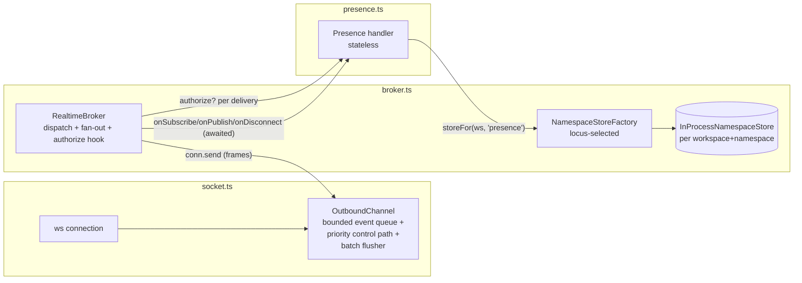

# Tech Plan — iw9-f5-broker-spec

## Context

The realtime stack is four files in `server/workspace/src/realtime/`:
`protocol.ts` (envelopes, topic grammar, reserved namespaces), `broker.ts`
(per-workspace connection/subscription maps, namespace dispatch), `socket.ts`
(ws upgrade, auth, keepalive; the only `attachRealtime` caller is
`server.ts:109`), and `presence.ts` (the single v1 namespace). The base
capability spec lives at
`openspec/changes/presence-realtime/specs/realtime-socket/spec.md` (delta not
yet synced to `openspec/specs/`).

Three contract defects block Wave 2 (Chat flagship rides this broker):

- `NamespaceHandler.onSubscribe` is synchronous — `broker.ts:24` declares
  `onSubscribe(conn, topic): { body?: unknown }`. Chat's subscribe snapshot
  (recent messages) requires a store read; presence only got away with sync
  because its roster is in-process memory.
- Handlers own their state: `presence.ts:71-73` holds `focusByConn`
  (`ConnFocus`, presence.ts:30-33) and `members` (`UserMembership`,
  presence.ts:36-39) in closure maps. The broker cannot see, scope, or swap
  that state; a cloud backend would strand it.
- `conn.send` writes straight to the socket (`socket.ts:210-215`,
  `ws.send` guarded only by `readyState`); a fast publisher fills a slow
  client's kernel buffer without bound and without consequence.

Per IW-9 D16, the in-memory broker stays and sharding is deferred; this
change hardens the spec and does minimal signature work. Invariant 7 (topic
keys route, never authorize) must be codified. The storage layer already
solved backend selection once — `runtime/config.ts` resolves
`WORKSPACE_MODE`/locus via `resolveLocusDispatch` (config.ts:274-277) and
`storeBackendForLocus` (config.ts:284-287) — and the broker store mirrors
that seam.

**This section of the contract is load-bearing for `iw9-chat-flagship`**: the
revised `NamespaceHandler` / `RealtimeBroker` / `NamespaceStore` interfaces in
"Interfaces & Data" below are the shapes Chat builds against. Changing them
after Wave 0 means re-opening Chat's plan.

## Goals / Non-Goals

**Goals:**

- Async handler contract (`onSubscribe` promise-returning; `onPublish`/
  `onDisconnect` promise-tolerant) with rollback-on-reject preserved.
- Broker-owned ephemeral `NamespaceStore` behind a locus-selected factory;
  presence migrated onto it with byte-identical wire behavior.
- Fan-out authorization hook on every delivery path (invariant 7).
- Socket-level backpressure: bounded event queue, priority control channel,
  batch flush, slow-client disconnect (close 1013) after N consecutive
  full-buffer flushes.

**Non-Goals:**

- No distributed store backend (Redis/Valkey/NATS) — interface only (D16).
- No scoped-topic bus, no refcounted dynamic subscribe — Wave-2 target,
  documented in the spec preamble only.
- No changes to upgrade auth, principal resolution, membership checks, the
  wire envelopes in `protocol.ts`, or the client.
- No `doc`/`fs` namespace work.

## Architecture



Single responsibilities: **OutboundChannel** (new, in `socket.ts`) owns every
byte written to a socket — queueing, priority, flushing, slow-client
termination. **RealtimeBroker** owns routing, subscription maps, handler
dispatch, and the per-delivery authorize check. **NamespaceStoreFactory**
(new file `realtime/store.ts`) owns backend selection by locus and store
lifecycle (drop with workspace). **Handlers** own namespace semantics only —
no state, no sockets.

## Decisions

### D1: `onSubscribe` returns a Promise; `onPublish`/`onDisconnect` become promise-tolerant

- **Choice**: `onSubscribe(conn, topic): Promise<{ body?: unknown }>`;
  `onPublish` and `onDisconnect` return `void | Promise<void>`. The broker
  awaits subscribe (rollback + `bad-topic` on reject, exactly the current
  throw path at broker.ts:182-193), awaits publish (reject → `bad-body`),
  and fire-and-forgets disconnect with a swallow (current behavior,
  broker.ts:133-139). `handleClientMessage` becomes `Promise<void>`;
  `socket.ts` invokes it with `void` (that call-site edit lands in Stream 3 —
  the only stream whose Touches include socket.ts; Stream 1 owns only
  broker.ts/store.ts and never opens socket.ts, so it cannot make this edit
  itself).
- **Alternatives**: (a) Async `onSubscribe` only, keep `onPublish` sync —
  rejected: Chat's publish path persists a message before fan-out; freezing a
  sync `onPublish` now guarantees a Wave-2 contract break, violating this
  change's one hard constraint. (b) Make everything strictly
  `Promise`-returning including `onDisconnect` awaited — rejected: disconnect
  runs during cleanup where nothing can consume a failure; awaiting adds
  ordering coupling for zero benefit.
- **Revisit if**: a handler needs publish acknowledgement frames (then the
  protocol, not just the signature, must grow).

### D2: One generic async KV `NamespaceStore`, scoped per (workspace, namespace), reached via `broker.storeFor()`

- **Choice**: a `Map`-shaped async interface (`get`/`set`/`delete`/`list`
  by key prefix) that the broker constructs per (workspaceId, namespace) and
  exposes as `RealtimeBroker.storeFor(workspaceId, namespace)`. Ephemeral by
  contract; dropped when the broker drops the workspace state
  (broker.ts:68-72 `dropEmptyWorkspace` grows a store-drop). Async API even
  though the only backend is in-process, so a distributed backend slots in
  without touching handler code.
- **Alternatives**: (a) Typed per-namespace store interfaces (e.g.
  `PresenceStore`) — rejected: every future backend must implement N bespoke
  interfaces; the swap seam multiplies instead of staying one. (b) Sync store
  API — rejected: it makes the in-process backend the contract; a remote
  backend would force the exact interface break this change exists to
  prevent. (c) Handlers keep state but register a serialize/restore hook —
  rejected: state ownership stays invisible to the broker; violates the spec
  requirement outright.
- **Revisit if**: a namespace needs atomic multi-key updates (then grow a
  `transact` on the interface rather than abandoning it).

### D3: Store backend selected by workspace locus, defaulting cloud to in-process

- **Choice**: `createNamespaceStoreFactory()` in `realtime/store.ts` keys off
  `resolveLocusDispatch` from `runtime/config.ts` (the same seam storage
  uses): `local` → in-process; cloud loci → in-process **with the deferral
  documented at the selection site** (D16: no distributed backend yet). The
  factory is injectable on `createBroker` for tests.
- **Alternatives**: (a) A new `REALTIME_BACKEND` env var — rejected: config.ts
  exists precisely because backend choice re-derived per store caused split
  worlds; adding a parallel knob recreates that bug class. (b) Choose by
  `WORKSPACE_MODE` directly — rejected: locus dispatch already folds mode +
  workspace locus correctly (config.ts:271-287); duplicating the logic drifts.
- **Revisit if**: the Wave-2 scoped-topic bus lands and cloud loci get a real
  distributed backend.
- **Clarification (sync seam, no live async dispatch)**: `resolveLocusDispatch`
  takes an already-known `WorkspaceLocusKind`; turning a `workspaceId` into
  one is an async read (`workspaces.ts`'s `getWorkspace` → `resolveLocus`).
  `NamespaceStoreFactory.storeFor(workspaceId, namespace)` is synchronous by
  contract (D2) and SHALL NOT perform that async lookup. Because every locus
  resolves to the same in-process backend today (D16), the factory
  constructs the in-process store unconditionally — there is nothing to
  branch on yet. The "selection seam" is a documented comment at the site a
  real per-workspace dispatch would go, not a live `if (locus === ...)`
  reading from a workspace record. Do not add an async workspace lookup to
  make `storeFor` "really" locus-aware; that is deferred with the rest of
  D16 and revisited together with it.

### D4: Fan-out authorization = optional sync `authorize` on the handler, evaluated per delivery

- **Choice**: `NamespaceHandler.authorize?(conn, topic): boolean`. The broker
  calls it inside `publishToTopic`'s delivery loop for every candidate
  connection (after the existing workspace scoping, which remains the outer
  boundary). Absent hook = allow (workspace scoping already applied). Sync by
  design: it runs per (event × subscriber).
- **Alternatives**: (a) Check only at subscribe time — rejected: invariant 7
  exists because a stale subscription must never confer access; grants change
  while sockets stay open. (b) Async authorize with per-delivery await —
  rejected: turns every fan-out into a promise storm; handlers that need
  slow-changing auth data cache it in their `NamespaceStore` and answer
  synchronously from `conn` + cached state. (c) Central ACL service in the
  broker — rejected: the broker cannot know namespace semantics (Chat's
  channel membership vs presence's path visibility); it can only enforce
  that *some* check runs on *every* path.
- **Revisit if**: a namespace's authorization cannot be answered from cached
  state (then add an async pre-computed allow-set refreshed on grant events).

### D5: Backpressure lives in an OutboundChannel wrapper inside socket.ts; broker stays queue-blind

- **Choice**: `Conn.send(msg)` keeps its signature; `socket.ts` constructs it
  over a new `OutboundChannel` that routes by frame type: `event` frames →
  bounded drop-oldest queue + interval batch flusher gated on
  `ws.bufferedAmount` vs a high-water mark; `subscribed`/`error` (and any
  future non-event frame) → immediate write path. N consecutive flush
  attempts finding the buffer still full → `ws.close(1013)` → normal cleanup
  (`socket.ts` close handler → `broker.removeConnection`). Defaults (constants
  in socket.ts, each overridable via `AttachRealtimeOptions` like
  `pingIntervalMs` today): queue depth 256 events, flush every 25 ms,
  high-water mark 1 MiB `bufferedAmount`, N = 3.
- **Alternatives**: (a) Backpressure in the broker (`publishToTopic` skips
  slow conns) — rejected: the broker would need socket internals
  (`bufferedAmount`), inverting the layering; also every future delivery path
  would re-implement it. (b) Drop-newest when full — rejected: presence/chat
  freshness means the newest event is the most valuable; drop-oldest +
  resubscribe-snapshot recovery is the buzz lifecycle pattern this adopts.
  (c) Per-topic queues — rejected: speculative; one connection-level queue
  satisfies the spec, and per-topic fairness has no consumer yet.
- **Revisit if**: a namespace needs per-topic fairness or event coalescing
  keyed by topic (then split the queue per topic behind the same channel).

## Interfaces & Data

The contract `iw9-chat-flagship` builds against. Two agents can implement
broker-side and handler-side independently from these shapes.

```ts
// realtime/broker.ts ---------------------------------------------------------

export interface Conn {
  id: string;
  userId: string;
  workspaceId: string;
  /** Frame-type-aware: event frames may queue/drop; control frames may not. */
  send(msg: ServerMessage): void;
}

export interface NamespaceHandler {
  namespace: string;
  /** Awaited; reject → subscription rollback + {code:"bad-topic"}. */
  onSubscribe(conn: Conn, topic: Topic): Promise<{ body?: unknown }>;
  /** Awaited; reject → {code:"bad-body"}. */
  onPublish(conn: Conn, topic: Topic, body: unknown): void | Promise<void>;
  /** Fire-and-forget; errors swallowed. */
  onDisconnect(conn: Conn): void | Promise<void>;
  /**
   * Invariant 7: evaluated per (event, subscriber) inside every fan-out path,
   * after workspace scoping. Absent = allow. Must be answerable synchronously
   * (cache slow auth data in the namespace store).
   */
  authorize?(conn: Conn, topic: Topic): boolean;
}

export interface RealtimeBroker {
  registerNamespace(handler: NamespaceHandler): void;
  addConnection(conn: Conn): void;
  removeConnection(conn: Conn): void;
  handleClientMessage(conn: Conn, msg: ClientMessage): Promise<void>;
  publishToTopic(
    workspaceId: string,
    topic: Topic,
    body: unknown,
    opts?: { except?: Conn },
  ): void;
  /** Broker-owned ephemeral state, scoped (workspaceId, namespace). */
  storeFor(workspaceId: string, namespace: string): NamespaceStore;
}

export function createBroker(opts?: {
  storeFactory?: NamespaceStoreFactory;
}): RealtimeBroker;

// realtime/store.ts (new) ----------------------------------------------------

/** Ephemeral. Never persisted. Dropped with the workspace's broker state. */
export interface NamespaceStore {
  get<T>(key: string): Promise<T | undefined>;
  set<T>(key: string, value: T): Promise<void>;
  delete(key: string): Promise<boolean>;
  /** Entries whose key starts with prefix, unordered. */
  list<T>(prefix: string): Promise<Array<[string, T]>>;
}

export interface NamespaceStoreFactory {
  storeFor(workspaceId: string, namespace: string): NamespaceStore;
  /** Drop all stores for a workspace (broker calls on workspace drop). */
  dropWorkspace(workspaceId: string): void;
}

/**
 * Selection seam only, not a live per-workspace dispatch: always constructs
 * the in-process backend (D16). `resolveLocusDispatch` (runtime/config.ts)
 * needs a `WorkspaceLocusKind`, and turning a `workspaceId` into one is an
 * async `getWorkspace` read — this factory is synchronous and SHALL NOT
 * perform that lookup. Real per-locus dispatch is deferred to whichever
 * change adds a distributed backend (D3).
 */
export function createNamespaceStoreFactory(): NamespaceStoreFactory;

// realtime/socket.ts ---------------------------------------------------------

export interface AttachRealtimeOptions {
  broker?: RealtimeBroker;
  pingIntervalMs?: number;          // existing
  maxMissedPongs?: number;          // existing
  now?: () => number;               // existing
  authenticate?: /* unchanged */;
  // Backpressure (defaults in parentheses):
  outboundQueueLimit?: number;      // (256) event frames per connection
  flushIntervalMs?: number;         // (25) batch flush cadence
  sendHighWaterMark?: number;       // (1 MiB) ws.bufferedAmount gate
  maxFullBufferFlushes?: number;    // (3) consecutive → close 1013
}
```

Presence key layout in its `NamespaceStore` (replaces `focusByConn` /
`members`): `focus:<connId>` → `{ path, lastActive }`;
`member:<path>\0<userId>` → `{ connIds: string[], lastActive }`. Roster =
`list("member:" + path + "\0")`. Wire behavior (join/leave/update deltas,
`subscribed` roster body, exclusive focus) is unchanged.

## Risks / Trade-offs

- [Async subscribe lets same-connection messages interleave] → Acceptable and
  now spec'd: handlers/clients must not assume ordering (realtime-broker
  spec); the `subscribed`-body-as-recovery rule makes interleaving safe.
- [Presence hot path gains promise overhead per focus/blur] → In-process
  store resolves already-settled promises; presence volume (human focus
  changes) is orders below any measurable cost. Verified by existing e2e
  tests staying green.
- [Drop-oldest can starve a topic a slow client cares about] → Recovery is
  resubscribe-snapshot by contract; disconnect-at-N converts persistent
  starvation into an explicit reconnect.
- [Sync `authorize` tempts handlers into stale caches] → Spec scenario
  ("Subscription is not a grant") pins the behavior; cache invalidation
  strategy is per-namespace and lands with the namespace that needs it
  (Chat, Wave 2).
- [Contract churn before Chat lands] → The interfaces above are the frozen
  seam; any change re-opens iw9-chat-flagship's plan by rule.

## Rollout

Single service (`@aprovan/workspace`), no persistence, no wire change: deploy
is an ordinary task replacement; all realtime state is rebuilt by clients
reconnecting. No migration. Rollback = redeploy previous image (clients
resubscribe, same recovery path). Land order inside the change: broker
contract + store → presence migration → backpressure → docs/spec sync
(tasks.md streams 1-4). Stream 1 lands a compile-preserving shim in
`presence.ts` (task 1.7) so it is independently verifiable before Stream 2
starts; Stream 2 replaces it in the same file — the one intentional
sequential file overlap in this plan, safe because Stream 2 depends on
Stream 1 merging first (see tasks.md §2 note).

## Open Questions

None — scope and invariants are settled by IW-9-APP-FIRST.md (D16, invariant
7); numeric backpressure defaults are implementation constants (D5) chosen
here and overridable in tests.
