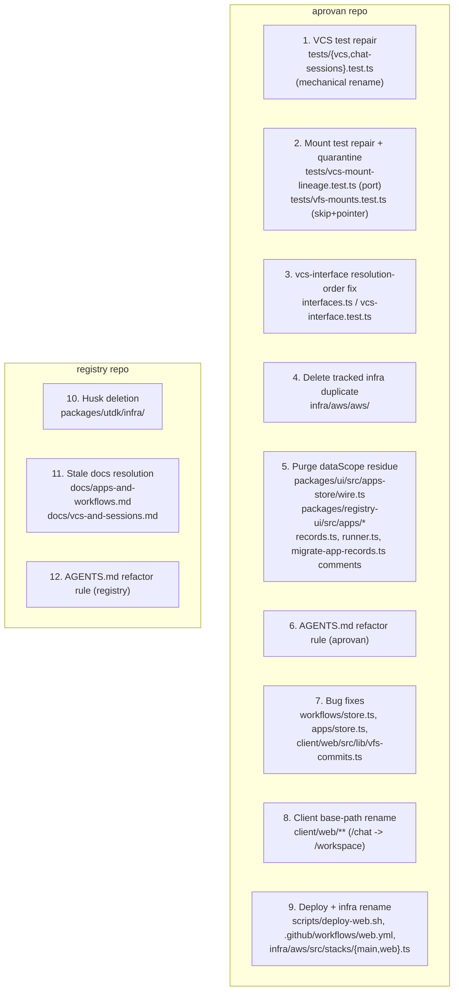

# Tech Plan — iw9-f6-cleanup-rename

## Context

Verified against source 2026-08-09 (every PRD/brief claim re-checked; this
run is the authority for exact evidence, not the brief):

- **Test run** (`pnpm --filter @aprovan/workspace test`): 81 failed / 474
  passed / 57 skipped. Exactly 22 failures live in the five F6-owned files
  (`vcs.test.ts` 7, `vfs-mounts.test.ts` 6, `vcs-mount-lineage.test.ts` 4,
  `vcs-interface.test.ts` 3, `chat-sessions.test.ts` 2); the remaining 59 are
  in suites this change does not touch (Non-Goals).
- `vcs.test.ts` and `chat-sessions.test.ts`'s two failures call
  `POST /tools/vfs/{commit,log,diff,show,restore,branches}` — operations
  that live only under the `vcs` interface namespace
  (`routes/tools.ts:478-488`, `nativeVcsDiscoveryEntries`). `vfs/read` and
  `vfs/list` calls in the same files (with `commit`/`session` args for
  pinned/staged reads) are genuine `vfs` operations and already pass — only
  the six vcs-verb calls need the namespace segment renamed.
- `vcs-mount-lineage.test.ts` sets up its fixtures by calling
  `POST /tools/vfs/mount` (lines 140, 208) before asserting on
  `collectMountLineage`'s output; the actual failure is `Unknown vfs
  procedure: mount` — there is no `mount`/`unmount` operation under either
  the `vfs` or `vcs` tool namespace today. `addMount`/`removeMount`
  (`server/workspace/src/vcs/mounts.ts:98,156`) are real, exported,
  independently callable functions with **zero non-test callers** — the only
  other reference in the repo is a direct import in
  `tests/auth-cache.test.ts` (verified: `grep -rln "addMount\|removeMount"
  server/workspace/tests/*.ts` → exactly that one file). No tool/route wires
  them.
- `vfs-mounts.test.ts` exists specifically to exercise that missing tool-level
  CRUD surface end to end (register/list/reject-overlap/reject-write-under-
  mount/unmount via `POST /tools/vfs/mount|mounts|unmount`) — its failures
  are `Unknown vfs procedure` and status-code mismatches, not a naming drift.
- `vcs-interface.test.ts` failures are **not** about the workspace commit
  store at all. The file (`docs`: "Git hosting for code review") tests a
  *different* thing sharing the `vcs` interface id: the generic
  `resolveInterfaceForWorkspace`/`dispatchInterface` catalog path used by
  third-party providers (github/bitbucket PR review), the same machinery
  `llm`/`telemetry` use. `routes/tools.ts:478-488` already special-cases this
  collision for the *tool-discovery* path (`if (resolved.compat.provider ===
  "aprovan") return nativeVcsDiscoveryEntries(...)`), but
  `resolveInterfaceForWorkspace("local", "vcs")` called directly (as this
  test and `dispatchInterface` do) now resolves to a `credentialless: true`
  `{provider: "aprovan", module: "aprovan", moduleSpecifier: "@aprovan/native"}`
  compat entry unconditionally — added to the `vcs` interface's compat
  catalog by the vfs→vcs split — so the three assertions that expected
  "reject with no credential" / "route to github once credentialed" /
  "refuse bitbucket with a reason" no longer hold: zero-config resolution
  now always wins on the credential-less native entry. This is a genuine
  design collision (two products sharing one interface id), not a rename.
- `packages/ui/src/apps-store/wire.ts` still declares and reads/writes
  `dataScope` at lines 370 (type), 412-413 (field + comment already saying
  "Absent once dataScope is gone"), 519-520 (parse), 859 (required field on
  an internal shape), 953-1051 (derive + round-trip on save). Live readers:
  `packages/registry-ui/src/apps/ui.tsx:249-251`,
  `packages/registry-ui/src/apps/app-detail.tsx:347-370` (both in this repo,
  not the registry repo — verified `packages/registry-ui` ships from
  `aprovan`). Stale comments (not live code): `server/workspace/src/records.ts:20`,
  `server/workspace/src/workflows/runner.ts:73-77`,
  `server/workspace/scripts/migrate-app-records.ts:26-32`.
- `server/workspace/src/workflows/store.ts:207-217`: `workflowVisibleTo`'s
  doc comment claims unbundled workflows are "creator-private," but the
  registration's `scriptPath` is an ordinary workspace path — any member's
  `vfs.read` reaches it regardless of `workflowVisibleTo`'s filtering, which
  only gates the *listing* (`listVisibleRegistrations`).
- `server/workspace/src/apps/store.ts`: `AppPaths` (line 207-211) already
  carries both `id` (durable `appId`) and `name` (mutable alias). `shareAllows`
  (line 493) receives `app.name` from `appFsAllowed`'s sole caller
  (`services.ts:359`) and matches it against `WorkspaceShare.apps` — so a
  rename (`saveApp` line 370-374 already re-points the alias index, D4) does
  not change `app.id`, but does silently invalidate every share keyed by the
  old name.
- `client/web/src/lib/vfs-commits.ts:41-55`: `fetchCommitDetail` types
  `raw.changes` in its intermediate cast (line 47) but the return object
  (lines 49-55) never includes it — the server's `vcs.show` response
  (`native-dispatch.ts` `show`) already computes `changes`; the client just
  drops it.
- `infra/aws/aws/` (aprovan) is a **tracked** (19 files, `git ls-files` count
  19), byte-identical duplicate of `infra/aws/`'s source (`src/`, `scripts/`,
  `templates/`, `Makefile`, `cdk.json`, `package.json`, `tsconfig.json`) —
  not a husk by the MIGRATION-DEBT definition (husks are untracked build
  residue; this is tracked source). Nothing references it: no path in
  `cdk.json`, `Makefile`, `package.json`, or `tsconfig.json` at the
  `infra/aws/` root points into `aws/aws/`. Artifact of the `f00616f`
  `infra/aws-core → infra/aws` rename.
- `registry/packages/utdk/infra/` **is** a true husk: `git ls-files
  packages/utdk/infra | wc -l` → 0; the only contents on disk are
  `cdk.out/bundling-temp-*/node_modules/` directories (build residue). The
  brief's "~6.7GB registry/infra/cdk.out" no longer exists as such — there is
  no `registry/infra/` directory at all; `registry/` totals 1.9G.
- `registry/docs/apps-and-workflows.md` and `registry/docs/vcs-and-sessions.md`
  already carry the 2026-08-09 STALE banners (done outside this change,
  visible in both files' headers). `platform.md:110,114` links both by name
  as "the normative model" — removing the files outright would dangle that
  link. `apps-and-workflows.md`'s entire model (Personal pseudo-app,
  `dataScope`, name-keyed identity, three-namespace `NATIVE_APP_NAMESPACES`)
  is superseded and its replacement content already exists at
  `aprovan/docs/app-data.md` and `aprovan/docs/native-surfaces.md`.
  `vcs-and-sessions.md`'s own banner says only the "Surface" section
  (lines 113-161: `vfs.commit/log/...` verb table, `.services/vcs/mounts.json`
  storage, `vfs.mount/unmount`) is wrong — the rest (snapshots-as-manifests
  model, sessions-as-branches, mounts concept) the banner itself calls "the
  best conceptual description."
- Neither repo's `AGENTS.md` states a refactor rule today (both read in
  full; both cover toolchain/dev-loop notes only).
- `client/web/vite.config.ts:14,32-33,66`, `client/web/index.html:11`,
  `client/web/src/lib/auth.ts:19`, `client/web/src/main.tsx:18`,
  `client/web/src/components/panels/CredentialsPanel.tsx:12`,
  `client/web/src/pages/OAuthCallbackPage.tsx:69,103,119` all hardcode
  `/chat`. `scripts/deploy-web.sh` hardcodes the `chat/` S3 prefix (6 sync/cp
  calls) and `/chat/*` CloudFront invalidation path.
  `.github/workflows/web.yml`'s only `chat` reference is a comment.
  `infra/aws/src/stacks/main.ts:158-193` registers Cognito
  `callbackUrls`/`logoutUrls` including `.../chat/auth/callback` and
  `.../chat`. `infra/aws/src/stacks/web.ts`'s `WebStack` has **no**
  `/chat`-specific CloudFront behavior — the default behavior serves any S3
  key prefix via a generic `StaticRewrite` CloudFront Function
  (extension-less → `/index.html`); `additionalBehaviors` only special-cases
  `api/*`, `.well-known/*`, `apps/*`. SSM parameter names
  (`/aprovan/<env>/web/bucket`, `.../distribution-id`) are prefix-agnostic —
  confirmed no `chat` literal in `web.ts`'s `StringParameter` calls.

## Goals / Non-Goals

**Goals:**

- Land the exact fixes enumerated in the PRD's Goals section, each as an
  independently verifiable, independently landable work stream.
- Resolve the two brief-delegated decisions (mount test disposition; script
  privacy claim) with an argued choice, not a re-punt.
- Leave every deletion grep-clean in both repos.

**Non-Goals:** as PRD "Non-Goals" — no mounts revival, no F1 VCS-scoping
work, no repair of the other 59 failing tests, no new script-privacy
mechanism, no `app.yaml`/ULID work, no marketing-site/non-`/chat` CloudFront
behavior changes, no registry npm publish, no client vocabulary rename
(`ChatPage`, `features/chat/*` stay as-is — URL/deploy surface only).

## Architecture

F6 is ten independent hygiene/bugfix work streams sharing no files with each
other or with F1-F5. Grouped by what they touch:



No stream depends on another (`Depends-on: -` everywhere in tasks.md) — the
whole change is parallelizable to independent agents. The only *soft*
cross-change ordering is external: `iw9-f1-vcs-scoping-params` rebases after
this change's test repair lands (declared in F1's own tasks.md; not an
obligation on F6).

## Decisions

### D1: VCS-verb test repair is a straight namespace-segment rename
- **Choice**: In `vcs.test.ts` and the two `vfs/log` calls in
  `chat-sessions.test.ts`, replace `vfs/{commit,log,diff,show,restore,branches}`
  with `vcs/{commit,log,diff,show,restore,branches}`. Leave every `vfs/read`,
  `vfs/list`, `vfs/write`, `vfs/delete` call untouched — those are real `vfs`
  operations, already passing.
- **Alternatives**: Add back-compat aliasing in `routes/tools.ts` so `vfs/commit`
  etc. also resolve to the vcs handlers — rejected: perpetuates the exact
  ambiguity (two namespaces meaning the same six verbs) MIGRATION-DEBT flags
  as the failure pattern; the tests are the only remaining callers of the old
  paths (grep gate in tasks proves it), so there is nothing to keep
  compatible.
- **Revisit if**: never — this is mechanical.

### D2: Mount-lineage test is ported (bypasses the tool surface); mount-CRUD test is quarantined
- **Choice**: `vcs-mount-lineage.test.ts` tests real, already-wired behavior
  (`collectMountLineage`, snapshot version tokens in `commitTree`) — only its
  *fixture setup* goes through the unwired `vfs/mount` tool call. Rewrite
  that setup to call `addMount(workspaceId, ...)` directly (already exported,
  already used the same way by `tests/auth-cache.test.ts`), leaving the
  assertions on commit/snapshot output unchanged. `vfs-mounts.test.ts` tests
  the tool-level mount CRUD surface *itself* (register/list/reject/unmount
  via `POST /tools/.../mount`) — that surface does not exist and building it
  is explicitly D19/`iw9-b-app-model` scope. Quarantine it: wrap the
  `describe` block in `describe.skip` with a comment naming
  `iw9-b-app-model`'s mounts revival as the un-skip condition; do not delete
  the file (it is a ready-made spec for that stream to un-skip against).
- **Alternatives**: (a) Port both by wiring a minimal `vcs/mount`+`vcs/unmount`
  tool handler here — rejected, that is exactly the "mounts revival" the PRD
  Non-Goals and IW-9's stream boundary (D19 → `iw9-b`) assign elsewhere;
  building it here duplicates work and pre-empts B's UI/procedure design.
  (b) Quarantine both, including mount-lineage — rejected, it throws away
  currently-fixable coverage of a feature (`collectMountLineage`) that has
  nothing to do with the missing CRUD surface; the fixture can be rebuilt
  without it.
- **Revisit if**: `iw9-b-app-model` ships mount procedures before this lands
  — then `vfs-mounts.test.ts` can be ported directly (rename `vfs/mount` →
  whatever verb B lands, likely `vcs/mount`) instead of quarantined.

### D3: vcs-interface resolution collision — resolution order, not the test, changes
- **Choice**: `resolveInterfaceForWorkspace` must stop treating the
  credential-less `aprovan` compat entry as an unconditional zero-config
  winner for the `vcs` interface id. The two products sharing the id
  (workspace commit store vs. third-party git-hosting) need one of: (a) the
  `aprovan` compat entry marked non-participating in the generic
  interface-catalog resolution used by `dispatchInterface`/`vcs-interface.test.ts`
  (since `routes/tools.ts:478-488` already has its own special-cased short
  circuit for the native path — the generic catalog does not also need to
  answer for it), or (b) an explicit precedence rule (credentialed provider
  beats credential-less) for this one interface id. Exact mechanism decided
  at implementation against `interfaces.ts`'s current resolution order — this
  plan fixes the destination (three `vcs-interface.test.ts` assertions pass:
  no-credential rejects, github credential routes to github, bitbucket
  binding refuses with a reason not a loader error) and leaves the "how" to
  the smallest change against that file.
- **Alternatives**: Change `vcs-interface.test.ts`'s expectations to match
  "native always wins" — rejected: that would make the third-party
  git-hosting `vcs` interface (github/bitbucket PR review, a real, documented
  contract commitment per the file's own doc comment) permanently
  unreachable through the generic dispatch path, which is a functional
  regression the brief did not ask for and IW-9 does not mention deprecating.
- **Revisit if**: a future stream gives the two products distinct interface
  ids (removing the collision at its root) — then this fix is superseded,
  not wrong.

### D4: Drop the workflow-script "creator-private" claim; do not build a guarded prefix
- **Choice**: Fix the false claim, not the (nonexistent) enforcement.
  `workflowVisibleTo`'s doc comment and `listVisibleRegistrations`' role are
  rewritten to state plainly: this filters *listing* only, for the caller's
  own declutter; a workspace member's `vfs.read` reaches any workflow's
  `scriptPath` regardless of registration visibility, exactly like any other
  workspace file today.
- **Alternatives**: Route unexported scripts under a guarded prefix
  (`.private/<sub>/workflows/...`) enforced by the same partition logic
  `appFsAllowed` uses — rejected: that is real access-control surface,
  needs a decision about who can *write* into the guarded prefix, how
  existing scripts migrate, and how the workflow *runner* (which reads
  `scriptPath` at execution time, cross-partition) still resolves it; those
  are F2 (partitions) and C (grants) concerns, not a same-file bugfix.
  Building a partial version here risks the exact "duplicate implementation"
  MIGRATION-DEBT warns about once F2/C ship the real thing.
- **Revisit if**: F2's shared-partition work lands and gives workflows a
  natural home for a real private-script partition — then this becomes a
  concrete, scoped follow-up, not a guess.

### D5: `shareAllows` keys on `appId`; existing shares upgrade transparently
- **Choice**: `appFsAllowed` passes `app.id` (not `app.name`) to
  `shareAllows`; `WorkspaceShare.apps` is documented as an appId list (still
  `string[] | "*"`, same shape, different meaning). Existing
  `WorkspaceConfig.shares` entries written under the old (name-keyed) scheme
  are resolved transparently at read time: `shareAllows` resolves each
  `share.apps` entry through the same name→appId alias index `saveApp`
  already maintains before comparing, so an old entry like
  `apps: ["notes-app"]` keeps matching the app currently aliased to
  `"notes-app"` — but critically, this fallback is what breaks on rename
  (identical to the bug), so it is a **one-release bridge**, not the fix
  itself: the moment a share is re-saved (or a migration script runs once
  over `WorkspaceConfig` records rewriting `apps` entries from name to
  `appId` via the alias index), it becomes rename-proof for good.
- **Alternatives**: Hard cutover, no bridge (old shares silently stop working
  until re-saved) — rejected: silently revoking access member workspaces
  already granted is a worse failure mode than the bug being fixed. Runtime
  resolution forever without ever migrating stored records — rejected: keeps
  a name lookup (and its edge cases, e.g. reused names post-delete) on every
  access check indefinitely instead of a one-time cost.
- **Revisit if**: never within F6; the one-time migration script is part of
  this change's own tasks (not deferred).

### D6: Tracked infra duplicate is deleted outright, not husk-scanned
- **Choice**: `git rm -r infra/aws/aws/` — a direct deletion with a normal
  git diff (unlike the untracked husks, this produces a reviewable commit).
  Verified zero references first (`grep -rn "aws/aws" infra/aws` plus reading
  `cdk.json`/`Makefile`/`package.json`/`tsconfig.json`).
- **Alternatives**: Treat it as a husk and let the husk-scan task subsume it
  — rejected: the husk scan (`git ls-files <dir> | wc -l = 0`) would not
  flag it (19 tracked files), so folding it into that task hides a
  qualitatively different fix (tracked deletion, real diff) behind a check
  that doesn't apply to it.
- **Revisit if**: never.

### D7: Stale-doc resolution is per-file — stub one, patch the other
- **Choice**: `apps-and-workflows.md` → replace its body with a short
  pointer stub (keep the file so `platform.md`'s inbound links resolve;
  state plainly that the normative model lives in `aprovan/docs/app-data.md`
  + `aprovan/docs/native-surfaces.md` + `IW-9-APP-FIRST.md`, and this file is
  retained only for `platform.md`'s link). `vcs-and-sessions.md` → rewrite
  only the "Surface" section (lines 113-161) to the current reality (verb
  table under `vcs.*`, not `vfs.*`; storage is the record store, not
  `.services/vcs/*.json`; no `mount`/`unmount`/`mounts` operations exist;
  note the promised `auto`-session `diff(base, main)` and `GET /fs?commit=`
  are still unbuilt, per A's Wave-1 scope) and resolve its banner — the rest
  of the document (nouns, sessions-as-branches, mounts concept) stays,
  matching the banner's own assessment that it "remains the best conceptual
  description."
- **Alternatives**: Stub both — rejected for `vcs-and-sessions.md`: most of
  it is accurate; stubbing would delete real, correct documentation the
  banner itself vouches for, to fix one wrong section. Full rewrite of both
  from scratch — rejected: `apps-and-workflows.md`'s replacement content
  already exists in `aprovan/docs/`; a second full rewrite in `registry/docs/`
  recreates the exact hand-copied-in-two-places pattern MIGRATION-DEBT A6
  flags for wire DTOs, applied to prose this time.
- **Revisit if**: `platform.md` itself is restructured to stop linking
  `apps-and-workflows.md` — then the stub can be deleted outright.

### D8: `/chat` → `/workspace` redirect is a CloudFront Function, added ahead of the existing rewrite
- **Choice**: A new `cloudfront.Function` (JS_2_0, viewer-request — same
  pattern as `WebStack`'s existing `StaticRewrite`/`GatewayForwardHost`)
  that: if `request.uri === "/chat" || request.uri.startsWith("/chat/")`,
  returns a 301 response with `Location` = the same URI with `/chat`
  replaced by `/workspace` (preserving path and query string); otherwise
  passes the request through unchanged. Attach it to `defaultBehavior.functionAssociations`
  **before** `StaticRewrite` in the array (CloudFront runs viewer-request
  functions in array order; the redirect must short-circuit before the
  extension/index.html rewrite runs, and a function that returns a response
  object stops the chain).
- **Alternatives**: Lambda@Edge — rejected: this stack already reserves
  Lambda@Edge for cases CloudFront Functions genuinely cannot do (body
  hashing, header restoration on 4xx/5xx); a static prefix redirect is
  exactly what CloudFront Functions exist for (sub-millisecond, no cold
  start, cheaper) — using Lambda@Edge here would be inconsistent with the
  stack's own established pattern for no benefit. CloudFront's native
  "Function association" URL-rewrite-only approach without an explicit
  redirect (relying on S3 key duplication, serving `/chat/*` and
  `/workspace/*` from the same objects) — rejected: doubles storage/deploy
  cost forever instead of a one-time redirect, and never actually retires
  `/chat`.
- **Revisit if**: never — a permanent redirect is permanent by design (Goal
  7 / spec `workspace-base-path`).

### D9: Cognito callback/logout URLs — additive, never remove `/chat` entries in this change
- **Choice**: Add `.../workspace/auth/callback` to `callbackUrls` and
  `.../workspace` to `logoutUrls` (`infra/aws/src/stacks/main.ts:158-193`)
  alongside the existing `/chat` entries; do not remove the `/chat` entries.
  Cognito validates `redirect_uri` against this allow-list *before* the
  browser ever reaches CloudFront, so any client still holding a stale
  `/chat` redirect URI (an old cached service worker, a slow-to-update
  bookmark used mid-migration) keeps working; new builds request
  `/workspace/auth/callback` because `client/web/src/lib/auth.ts`'s
  `basePath` changes to `/workspace` (stream 8).
- **Alternatives**: Remove `/chat` entries once the new build ships —
  rejected as part of *this* change: it turns a redirect-safe rename into a
  hard cutover with a real (if narrow) breakage window for anyone on a stale
  client, for no benefit this change needs; removal is a trivial follow-up
  once traffic data shows zero `/chat` callback hits.
- **Revisit if**: a future cleanup pass wants to prune the Cognito allow-list
  — track it as a MIGRATION-DEBT-style follow-up then, not blocking this
  change.

### D10: `dataScope` purge collapses the UI to its one live behavior, it does not just delete lines
- **Choice**: `dataScope` is not a handful of dead lines — it is a real,
  rendered feature (`DataScopeBadge` on `app-detail.tsx:195`,
  `DataLocationCallout`'s two-branch explanation, `CapabilityModel.dataScope`,
  `deriveCapabilities`/`mergeCapabilities`'s parsing) built against a manifest
  field the server no longer emits (`grep dataScope server/workspace/src/apps/*.ts`
  → zero matches — confirmed both by direct grep and by the
  `apps-and-workflows.md` banner's own claim). Every live call site therefore
  always evaluates the `"owner"` branch today; nothing currently reachable
  can produce `"workspace"`. The purge SHALL collapse all of it to that one
  live behavior: delete `DataScope`/`CapabilityModel.dataScope`, delete
  `DataScopeBadge` and its render site, and simplify `dataLocationPath`/
  `DataLocationCallout` to the single (formerly-`"owner"`) explanation with
  no scope branch — not merely strip the field and leave a
  `scope === "workspace"` branch that can now never be true.
- **Alternatives**: Strip only the type/parsing (wire.ts:370,412-413,519-520,
  953,1050-1051) and leave `DataScopeBadge`/`DataLocationCallout`'s
  conditional branches reading a now-`undefined`-forever field — rejected:
  produces dead conditionals indistinguishable from live ones to the next
  reader, exactly the "misleads agents and humans" harm the PRD names; it
  would also silently always render the `"owner"` copy while *looking like*
  a two-mode UI, which is worse than either fully removing it or fully
  keeping it. Keep the two-mode UI and just fix the type — rejected: there is
  no server data to ever flip it to `"workspace"`; keeping the branch
  pretends a feature exists that D2's real hosted/managed selection (owned by
  F2 + B, Wave 1/2) hasn't shipped yet.
- **Revisit if**: F2/B ship the real hosted-vs-managed declaration and
  install-time picker (D2) — at that point the UI gets a new, correctly-named
  surface for it (not a resurrected `dataScope`), built against that
  feature's actual wire contract.

## Interfaces & Data

### `shareAllows` / `appFsAllowed` (`server/workspace/src/apps/store.ts`)

```ts
// WorkspaceShare.apps documented meaning changes from "app name" to "appId";
// shape is unchanged.
export interface WorkspaceShare {
  prefix: string;
  /** App ids granted access, or "*" for every published app. */
  apps: string[] | "*";
  mode?: "read" | "readwrite";
}

export function shareAllows(
  config: WorkspaceConfig,
  appId: string,        // was: app name
  path: string,
  write: boolean,
): boolean;

export function appFsAllowed(
  app: AppPaths,          // unchanged signature
  config: WorkspaceConfig,
  path: string,
  write: boolean,
): boolean;              // internally now calls shareAllows(config, app.id, path, write)
```

One-time migration: a script (co-located with the existing
`server/workspace/scripts/migrate-app-records.ts` pattern) that reads every
workspace's `WorkspaceConfig`, resolves each `shares[].apps` entry through
the alias index (name → `appId`), and rewrites the record. Read-time
fallback (name-or-id match) covers the gap between deploy and migration run.

### `CommitDetail` (`client/web/src/lib/vfs-commits.ts`)

```ts
export interface CommitDetail {
  commit: { id: string; message: string; author: string; createdAt: string; provenance?: MountProvenance[] };
  entries: Array<{ path: string }>;
  mounts?: MountLineageEntry[];
  changes?: unknown; // NEW — passed through from vcs.show's `changes`, shape owned by F1/A
}
```

`changes` is typed `unknown` deliberately: its concrete shape
(`added/modified/removed`, string-path today vs. hash-bearing objects once
`iw9-f1-vcs-scoping-params` lands) is F1's published contract, not F6's to
pin. Callers narrow it themselves; this change only stops dropping it.

### CloudFront redirect function contract

```js
// Pseudocode — added as a new cloudfront.Function, first in
// defaultBehavior.functionAssociations (viewer-request), ahead of StaticRewrite.
function handler(event) {
  var request = event.request;
  var uri = request.uri;
  if (uri === "/chat" || uri.startsWith("/chat/")) {
    var newUri = "/workspace" + uri.slice("/chat".length);
    return {
      statusCode: 301,
      statusDescription: "Moved Permanently",
      headers: {
        location: { value: newUri + (request.querystring ? "?" + <serialize querystring> : "") },
      },
    };
  }
  return request;
}
```

### AGENTS.md refactor-rule section (verbatim, both repos)

Both repos' `AGENTS.md` gain the same new `### Refactor rule` section (under
whatever top-level heading fits each file's existing structure), grep-able
by the exact phrase `Refactor rule`, stating:

1. Delete replaced code in the same change that replaces it — no
   "keep the old one just in case."
2. Definition of done for any "delete X" task: `grep X` returns nothing in
   **both** repos, not just the one being edited.
3. Husk test: a workspace-glob directory with zero git-tracked files
   (`git ls-files <dir> | wc -l` = 0) is build residue, not a package —
   delete it, don't deprecate it.

This is prose guidance, not a literal shared file (each `AGENTS.md` has its
own house style); the grep gate in tasks checks for the phrase and the three
concepts, not byte-identical text.

## Risks / Trade-offs

- [`vcs-interface.test.ts`'s fix touches `interfaces.ts`, shared generic
  resolution machinery other interfaces (`llm`, `telemetry`, `agent`) also
  use] → scope the fix to the `vcs`-id collision specifically (e.g. a
  per-entry or per-interface precedence flag), verified by running the full
  `server/workspace` suite after, not just the three targeted assertions —
  a regression in another interface's resolution would show up there.
- [The `shareAllows` migration script mutates every workspace's
  `WorkspaceConfig` record] → dry-run mode first (log intended rewrites
  without writing), then apply; idempotent by construction (re-running finds
  already-appId entries and no-ops, since `apps: string[] | "*"` staying an
  appId list on a second pass matches nothing left to translate).
- [CloudFront Function redirect ships with a bug (e.g. mishandles the query
  string) and 404s or mis-redirects live traffic] → the existing
  `StaticRewrite`/`GatewayForwardHost` functions in the same stack establish
  the review bar; add a unit test at the CDK level if the stack has one
  (verify before writing tasks), and manually curl the deployed distribution
  for `/chat`, `/chat/`, `/chat/deep/path?x=1` before calling the stream
  done.
- [Keeping both `/chat` and `/workspace` in Cognito's allow-list indefinitely
  is scope creep the brief didn't ask for] → explicitly bounded in D9 to
  "this change doesn't remove them," not "they stay forever" — flagged as a
  natural MIGRATION-DEBT-style follow-up, not silently forgotten.
- [`apps-and-workflows.md` stub could itself go stale if `app-data.md`/
  `native-surfaces.md` move] → the stub links by filename, same fragility
  every doc cross-reference in this repo already has; not a new risk class.

## Rollout

Ten independent work streams (nine aprovan, three registry — see tasks.md
`Repo:` lines), each its own commit/PR, landable in any order:

1. Test-repair streams (1-3) and the bug-fix stream (7) are pure
   server/client code changes — deploy normally, no migration.
2. The `shareAllows` migration script (5's sibling, folded into stream 7's
   tasks) runs once per environment after the code deploys (read-time
   fallback covers the gap; see D5).
3. `infra/aws/aws` deletion (stream 4) and the registry husk deletion
   (stream 10) are pure git operations — no deploy step, no runtime effect.
4. Deploy + infra rename (stream 9) is the one stream with real deploy-order
   care: land the CDK changes (redirect function, Cognito URL additions)
   and deploy infra *before or together with* the `scripts/deploy-web.sh`
   prefix change and the client base-path rename (stream 8) — if the client
   rebuild ships to the *old* `chat/` prefix after `vite.config.ts`'s `base`
   already changed to `/workspace/`, the built asset URLs (absolute
   `/workspace/...`) would 404 against a distribution not yet aware of the
   new path. Recommended order: infra (CDK deploy) → deploy script + client
   rebuild (same deploy) — both are aprovan-repo streams with disjoint paths,
   so they're separate commits, but sequence the *deploys*, not the code
   review. Rollback: CDK stack rollback removes the redirect function (old
   `/chat` traffic keeps working since nothing about the existing `chat/`
   S3 objects or Cognito URLs was removed); revert the deploy-web.sh/vite
   commit to redeploy the old build to `chat/` if needed.
5. Docs/AGENTS.md streams (6, 11, 12) are documentation-only, no deploy
   coordination.

## Open Questions

None. The two brief-delegated decisions (mount test disposition, script
privacy) are resolved in D2 and D4 above, each with a cited D19/F2/C
ownership argument for why F6 doesn't build the real mechanism itself.
