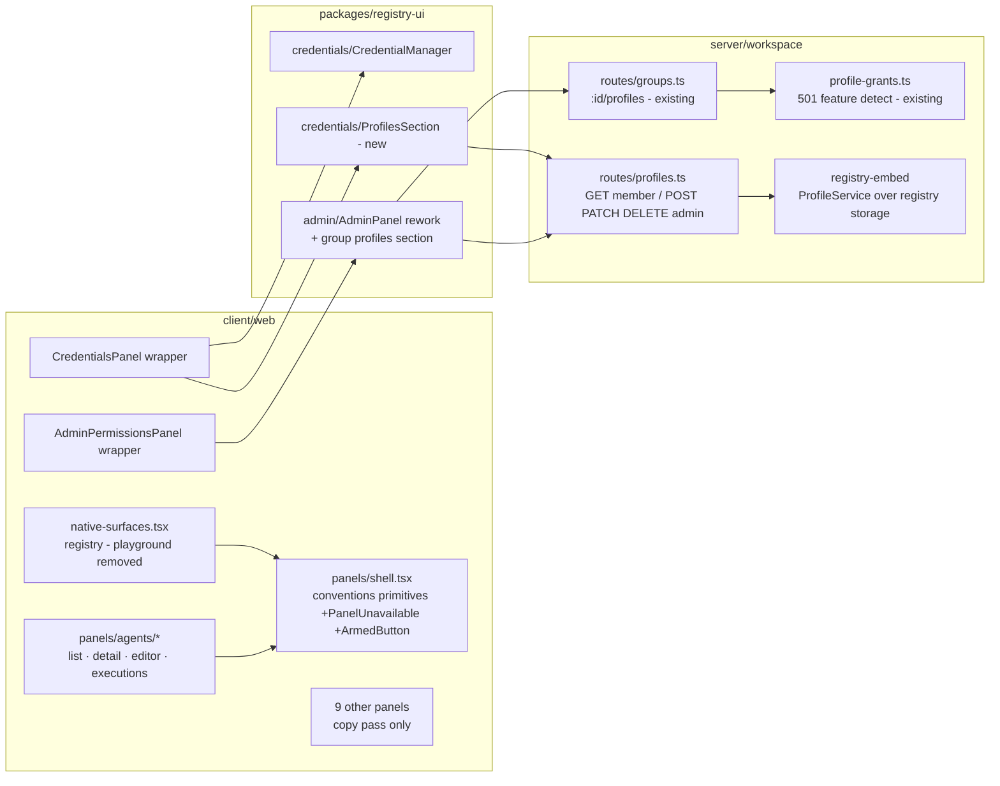

# native-panel-polish — Tech Plan

## Context

Twelve native surfaces register in `client/web/src/lib/native-surfaces.tsx` and render
self-contained panels through the shared shell (`client/web/src/components/panels/shell.tsx`,
`NativePanelProps = { scope?: AppScope }`). Ground truth per surface:

- `playground` — `PlaygroundPanel.tsx` + `client/web/src/lib/playground.ts`, a near-duplicate
  of the registry catalog's `/playground` (`registry/apps/registry/src/pages/playground.astro`,
  which stays). Referenced only via the surface registry.
- `agents` — 1360-LOC `AgentsPanel.tsx`; the dispatch chain (`agents` namespace ops
  `list/create/update/delete/runs/getRun`, `sandboxes.runs`, LLM binding via Interfaces) is
  sound; the presentation is one giant inline editor + chip walls.
- `admin` — 18-LOC wrapper over `@aprovan/registry-ui` `AdminPanel` (540 LOC, card-heavy,
  `window.confirm`, zero profile references) while the server already serves
  `GET/POST/DELETE /groups/:id/profiles` and a read-only `GET /profiles` picker route
  (`server/workspace/src/routes/groups.ts`, `profile-grants.ts`).
- `credentials` — 37-LOC wrapper over registry-ui `CredentialManager`; no profile surface
  anywhere. Full profile CRUD exists in registry-server's own HTTP router but that router is
  NOT mounted by the product; the embed (`server/workspace/src/registry-embed.ts`) exposes
  in-process `dispatch()` plus storage/service objects, and `@aprovan/registry-server` exports
  `ProfileService`, `ProfileCreateInput`, `ProfileUpdateInput`.
- `profileGrantsAvailable()` is false on the interim dynamo backend → profile routes 501.
- The `apps` surface does not exist yet — IW-1 (`app-model-split`) creates it.

## Goals / Non-Goals

**Goals:**

- One conventions layer (shell primitives + ux.md rules) that every panel consumes; additive
  shell exports only.
- Delete the playground surface with graceful stale-tab handling.
- Decompose AgentsPanel into a `panels/agents/` module (list/detail/editor/executions)
  without touching its wire surface.
- Ship group→profile UI and profile CRUD UI in `@aprovan/registry-ui`, backed by a minimal
  workspace `/profiles` CRUD extension over the embedded registry-server profile service.
- Keep all work streams except the apps-pane pass independent of IW-1.

**Non-Goals:**

- No server changes beyond the `/profiles` router extension (agents/admin/credentials routes
  are untouched).
- No registry-repo changes.
- No renderer/editor work (IW-2), no app-model work (IW-1), no legacy-profile-notion
  migration (decision 7's broader migration).

## Architecture



Responsibilities: `shell.tsx` owns conventions primitives; `panels/agents/` owns agents
presentation; registry-ui owns admin/credentials presentation (published, catalog-reusable);
the workspace `/profiles` router owns profile CRUD authorization + 501 gating; the embed
owns actual profile persistence.

## Decisions

### D1: Delete playground; stale tabs render a pointer card

- **Choice**: Remove the `playground` entry, `PlaygroundPanel.tsx`, and `lib/playground.ts`.
  Extend the tab-rendering fallback so any unresolvable `native://<id>` renders a notice
  card; the playground id gets a link to the catalog playground. No redirect table, no
  permanent in-product link elsewhere.
- **Alternatives**: (a) Hide behind a feature flag — keeps dead code and a second playground
  to maintain, which is the exact problem. (b) Silently strip stale tabs from persisted
  state — tab-state surgery in `useTabs` is riskier than a fallback render, and it loses the
  teaching moment. (c) Redirect the tab to Credentials — surprising, and implies the
  surfaces are related.
- **Revisit if**: an in-product script console becomes a real need — then it should be an
  IW-1 app, not a native surface.

### D2: Conventions are code (shell primitives) + prose (ux.md), not a package

- **Choice**: Encode the conventions as two additive shell exports (`PanelUnavailable`,
  `ArmedButton`) plus the existing primitives, with the tone/density rules living in ux.md
  as the review checklist for the per-panel pass. registry-ui components follow the same
  rules using `@aprovan/ui` primitives directly.
- **Alternatives**: (a) A shared `@aprovan/panel-kit` package — two consumers (client,
  registry-ui) with different primitive sets don't justify a third package; speculative
  flexibility. (b) Lint rules for copy — copy quality isn't mechanically checkable; a
  checklist plus review is honest.
- **Revisit if**: a third host (desktop app) needs the primitives — then extract.

### D3: AgentsPanel decomposes in place; data layer untouched

- **Choice**: Split `AgentsPanel.tsx` into `panels/agents/{index,ProfileList,ProfileDetail,
  ProfileEditor,Executions}.tsx`, keeping `usePanelData`, the merge/normalize logic, poll
  discipline, and every `invokeNamespaceTool` call byte-compatible. Master-detail is local
  component state (selected profile name), no router involvement. The Model picker reads the
  same interfaces listing the Interfaces panel uses, with free-text fallback.
- **Alternatives**: (a) Full rewrite on react-query/virtualized lists — new dependency and
  new data-layer risk for a pane whose data layer is explicitly "sound". (b) Keep one file,
  restyle only — 1360 LOC single file is the navigability problem for maintainers; the spec
  demands list/detail separation anyway.
- **Revisit if**: run volumes make the unvirtualized executions list janky (>~500 rows).

### D4: Workspace `/profiles` router grows CRUD over the embedded ProfileService

- **Choice**: Move the profile routes into `server/workspace/src/routes/profiles.ts`:
  `GET /profiles` (any authenticated member; returns full `ProfileRow` wire shapes plus the
  display `credentialLabel`), `POST/PATCH/DELETE` (admin), all delegating to
  `@aprovan/registry-server`'s exported `ProfileService` constructed over
  `getRegistryStorage()`, all gated by the existing `profileGrantsAvailable()` 501. The
  admin attach picker keeps working (its summary fields are a subset). Grant management
  stays on `/groups/:id/profiles` — the credentials surface never writes grants (PRD OQ2).
- **Alternatives**: (a) Mount registry-server's own HTTP router under the gateway — brings a
  second auth/tenancy middleware chain and role mapping (the embed resolves everyone as
  role "admin") into the product edge; the workspace's requireAuth/requireAdmin chain is the
  established boundary. (b) Client calls via `registryDispatch` tools — profiles are not a
  namespace tool surface, and admin HTTP routes are where the existing admin UI already
  lives. (c) Client talks to a standalone registry-server — that's IW-3's standalone story,
  not the product's.
- **Revisit if**: IW-3 lands a configurable session layer that makes the registry-server
  HTTP surface the canonical one for both hosts.

### D5: Profile and group-profile UI live in `@aprovan/registry-ui`

- **Choice**: New `credentials/ProfilesSection` (+ profile form) and the AdminPanel rework
  (including the group Profiles section) are implemented in registry-ui, driven by the
  injected `GatewayClient`, exported additively. Client wrappers stay thin
  (`CredentialsPanel` composes tabs; `AdminPermissionsPanel` unchanged in shape).
- **Alternatives**: (a) Build in `client/web` — forks the surface IW-3 needs for standalone
  hosting; the credential/admin widgets were deliberately moved into registry-ui in
  `registry-admin-and-playground`. (b) New `@aprovan/profiles-ui` package — no second
  consumer distinct from registry-ui's.
- **Revisit if**: registry-ui's bundle weight for the catalog becomes a problem — then split
  entrypoints, not packages.

### D6: 501 handling is one client-side helper, used by every profile feature

- **Choice**: registry-ui exposes a single `isUnavailable(err)` check (parsing the existing
  `parseGatewayStatus` for 501) and both the credentials Profiles tab and the admin Profiles
  section map it to the `PanelUnavailable`-equivalent card. Feature detection is per-fetch,
  no capability-discovery endpoint.
- **Alternatives**: (a) A `/capabilities` discovery endpoint — new server surface for one
  boolean that dies at the dsql cutover anyway. (b) Hide profile UI entirely via config —
  deployment config drift between UI and server; the 501 is already the truth.
- **Revisit if**: more backend-dependent features accumulate — then a discovery endpoint
  pays for itself.

## Interfaces & Data

**Workspace profile CRUD (client ⇄ server seam; D4).** All under the gateway base the
`GatewayClient` already targets; 501 body `{ error: string }` on dynamo.

```
GET    /profiles
  → 200 { profiles: ProfileWire[] }            (member)
POST   /profiles       { name, targetKind: "interface"|"provider", targetId,
                         provider?, credentialId?, options?, limits? }
  → 201 { profile: ProfileWire }               (admin; 400 validation, 404 bad credentialId)
PATCH  /profiles/:id   { name?, provider?, credentialId?|null, options?, limits?|null }
  → 200 { profile: ProfileWire }               (admin; 404 unknown)
DELETE /profiles/:id
  → 200 { ok: true }                           (admin; 404 unknown)

ProfileWire = ProfileRow (id, name, targetKind, targetId, provider?, credentialId?,
              options, limits?, createdBy, createdAt, updatedAt)
              + credentialLabel?   // display only, never a payload
```

**Group profile membership (existing, unchanged; consumed by admin UI):**

```
GET    /groups/:id/profiles                  → { profiles: GroupProfileSummary[] }
POST   /groups/:id/profiles  { profile }     → 201 GroupProfileSummary   (idempotent)
DELETE /groups/:id/profiles  { profile }     → { removed: true } | 404
GroupProfileSummary = { id, name, target: { kind, id, provider? }, credentialLabel? }
```

**registry-ui additive exports (registry-ui ⇄ client seam; D5):**

```ts
// credentials
export function ProfilesSection(props: {
  client: GatewayClient;
  canManage: boolean;          // admin gate decided by caller or first 403
}): ReactElement;
// admin — AdminPanel signature unchanged: { client: GatewayClient }
// shared
export function isUnavailable(err: unknown): boolean;  // 501 detector
// admin/api.ts additions
listWorkspaceProfiles(client): Promise<ProfileWire[]>
listGroupProfiles(client, groupId): Promise<GroupProfileSummary[]>
attachGroupProfile(client, groupId, profileRef): Promise<GroupProfileSummary>
detachGroupProfile(client, groupId, profileRef): Promise<void>
```

**Shell additive exports (shell ⇄ panels seam; D2):**

```ts
export function PanelUnavailable(props: { title: string; children: ReactNode }): ReactNode;
export function ArmedButton(props: {
  label: string; armedLabel: string; onConfirm: () => void;
  size?: "sm" | "icon"; disarmMs?: number;   // default 3000
}): ReactNode;
// NativePanelProps and PanelHostActions are frozen (specs: panel-conventions).
```

**Agents pane internal contract (D3):** `panels/agents/index.tsx` owns data
(`usePanelData` + poll timers) and passes plain props down; child components are
presentation-only. All server calls remain `invokeNamespaceTool("agents"|"sandboxes")` with
today's operation names and payloads.

## Risks / Trade-offs

- [Stale-tab fallback misses a persistence path and a blank pane ships] → Cover
  `parseNativeTabPath` fallback with a unit test for unknown ids and a manual check with a
  seeded persisted tab set (task-level Verify).
- [Agents decomposition silently changes a payload edge case (null-vs-undefined clears on
  update)] → Port `handleSave` normalization verbatim and add a unit test asserting payload
  shapes for create/update/clear-all-grants before restyling.
- [`GET /profiles` opening to members leaks something sensitive] → Wire shape review:
  `ProfileWire` carries ids/labels/options only; credential payloads never leave the
  credential store (existing invariant, restated in spec).
- [registry-ui rework breaks the catalog consumer] → Additive-API spec scenario plus a
  catalog typecheck in the publish flow; AdminPanel props unchanged.
- [Per-panel copy streams drift stylistically] → All streams cite ux.md's conventions
  section as their checklist; conventions stream lands first (dependency ordering).
- [IW-1 timing stalls the apps-pane pass] → It is the only gated stream; everything else is
  Depends-on-free of it by construction.

## Rollout

1. Streams land behind normal CI (typecheck/build/test per stream Verify) — no flags; the
   product deploys as one image.
2. Order: playground removal + conventions first (they touch the shared files), then the
   parallel panel streams, then registry-ui-consuming wrappers, then the gated apps pass.
3. `@aprovan/registry-ui` publishes a minor version after streams 5–6; the catalog picks it
   up on its normal semver range (IW-3 coordinates the standalone hosting).
4. Rollback is git revert per stream — no data migrations; the `/profiles` CRUD extension is
   additive and admin-gated.

## Open Questions

1. **Should `GET /profiles` stay admin-only until IW-3 clarifies member semantics?**
   _Recommendation:_ open it to members now (read-only, no payloads) — the credentials panel
   spec needs it and the wire shape is safe; flip to admin-only later is a one-line change.
2. **`ArmedButton` extraction scope**: retrofit all existing armed patterns (AgentsPanel)
   now, or only new call sites? _Recommendation:_ retrofit during each panel's own stream —
   the primitive lands in the conventions stream, adoption rides the passes.
