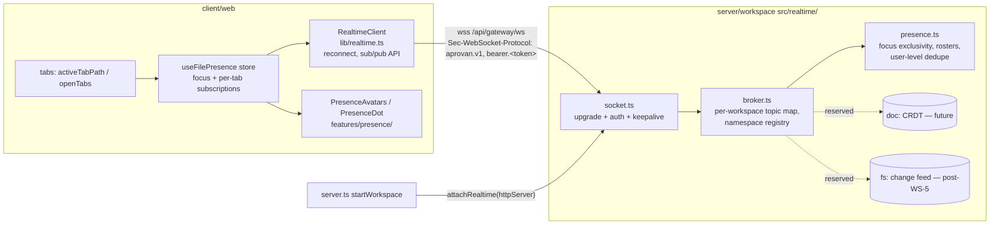

# presence-realtime — Tech Plan

## Context

IW-6 ([findings §6](../../../docs/tasks/improve-findings.md)); settled decision 4:
server-relayed, single topic-multiplexed WebSocket; `presence:<file>` first; no P2P v1;
protocol reserves CRDT doc-sync and change-feed namespaces.

What exists (verified 2026-08-02):

- **Presence today** is a 10s HTTP heartbeat: client loop in
  `client/web/src/features/sessions/useDraftSync.ts:96-120` → `sessions.presence` tool →
  `heartbeatPresence` writing TTL rows (`presence:<user>:<window>`, 30s TTL) into the record
  store (`server/workspace/src/vcs/sessions-service.ts:55-115`). Peer shape is
  `{userId, window, sessionId?, …}` — no file. UI is the SessionBar "Also here" chip +
  drawer (`client/web/src/components/SessionBar.tsx:218-232`), peers state owned by
  `useSessionOrchestration.ts:64` and threaded via `ChatDock.tsx:286`. The service comment
  at `sessions-service.ts:62` already anticipates a transport swap.
- **Zero WebSocket/CRDT code anywhere** in aprovan/registry/core — only comments (e.g.
  `services.ts:239`, the reserved `crdt` mount type in `vcs/mounts.ts`). No `ws` dependency.
- **Server**: Hono app served by `@hono/node-server` — `startWorkspace`
  (`server/workspace/src/server.ts:82`) holds the `http.Server` returned by `serve(...)`,
  which is where an `upgrade` listener can attach. HTTP auth is bearer-token
  (`middleware/auth.ts`: `readBearerToken`, Cognito verifier, principal cache, `none` mode
  for local dev). Embedded hosts (desktop) import only `createWorkspaceApp`/`app.fetch` and
  have no Node server.
- **Deployment**: one Fargate task, no ALB; ingress via `cloudflared` tunnel, aprovan.com
  via CloudFront (`infra/workspace/src/workspace-service.ts` header comment). No cross-node
  fan-out problem exists.
- **Client tab model**: `activeTabPath` + `openTabs` in `client/web/src/features/tabs/`
  (workspace file paths and `native:`/`apps:` pseudo-paths share the map). Token available
  synchronously via `getAccessTokenSync` (`client/web/src/lib/gateway.ts`).
- **In-flight collision**: WS-5 (`metadata-and-cost`) owns `/fs/changes` (ETag/`?since`
  journal; `server/workspace/tests/change-feed.test.ts` already exists). This change must
  not touch that feed — only reserve the `fs` namespace.
- **Dependency**: IW-2 (`editor-direct-edit`) provides the in-tab editor shell whose header
  is a presence surface; its change is not yet authored. This change lands on the tab strip
  and sidebar tree, which exist today.

## Goals / Non-Goals

**Goals:**

- One WS endpoint, one in-process broker, one namespace handler (`presence`), with the
  namespace registry shaped so `doc:` and `fs:` handlers are later additions, not protocol
  changes.
- Upgrade-time auth reusing the existing verifier/principal path — no second auth system.
- Delete the heartbeat path entirely (server op, record rows, client loop, UI) in the same
  change — no dual-running presence systems.
- Server-side presence unit-testable over real sockets (vitest + ephemeral-port server).

**Non-Goals:**

- No CRDT, no cursor sync, no `doc:` handler, no `fs:` handler, no change-feed changes, no
  Redis/SNS pub-sub, no reconnection state resumption (reconnect = fresh subscribe), no
  in-band token refresh, no realtime for fetch-embedded hosts.

## Architecture



Responsibilities: `protocol.ts` — envelope/topic types + zod parsing + reserved-namespace
list (the single protocol source of truth); `socket.ts` — upgrade handling, subprotocol
auth, ping/pong reaping, token-exp close; `broker.ts` — connection/subscription bookkeeping
per workspace, namespace dispatch; `presence.ts` — the only v1 handler. Client mirrors:
`lib/realtime.ts` — transport + protocol client; `features/presence/` — presence semantics
and rendering. The two sides share no code; the contract is the envelope below.

## Decisions

### D1: Transport = one server-relayed, topic-multiplexed WebSocket

- **Choice**: A single WS endpoint on the workspace server; all realtime features are topics
  on it. (Settled decision 4 — recorded here, not reopened.)
- **Alternatives**: P2P/WebRTC mesh (owner-rejected: signaling + TURN complexity for a
  feature the single server can relay trivially); SSE down + HTTP up (rejected: two
  half-channels, no natural publish path, and the deployment's streaming path is already the
  fragile part per `app.ts`'s `/health/stream` commentary); one socket per feature
  (rejected: N× auth/keepalive/reconnect, and CRDT later would mint another).
- **Revisit if**: the service scales past one task (then the broker needs a cross-node
  backplane — the protocol is unchanged, only `broker.ts` grows a fan-out edge).

### D2: Attach via `ws` on the Node server's `upgrade` event, exported as `attachRealtime`

- **Choice**: Add the `ws` package to `server/workspace`; `attachRealtime(httpServer)`
  installs a no-server `WebSocketServer` and an `upgrade` listener matching
  `/api/gateway/ws`; `startWorkspace` calls it right after `serve(...)` and `stop()` closes
  open sockets before drain.
- **Alternatives**: `@hono/node-ws` `upgradeWebSocket` (rejected: routes the upgrade through
  Hono internals for no gain — the gateway's header-based auth middleware can't serve a
  browser WS anyway (D3), and fetch-embedded hosts have no upgrade path, so an explicit
  attach function makes the "realtime requires a Node server" seam honest); a separate
  port/process (rejected: the tunnel exposes one origin; second ingress = new infra, against
  PRD non-goals).
- **Revisit if**: the desktop embedding needs realtime (then export a transport-agnostic
  broker and add a direct in-process client, no WS involved) or the server leaves
  `@hono/node-server`.

### D3: Upgrade auth = bearer token in the `Sec-WebSocket-Protocol` offer

- **Choice**: Client offers `["aprovan.v1", "bearer." + accessToken]`; server validates the
  token with the existing `verifyAccessToken` + principal resolution (same cache as HTTP),
  accepts the upgrade selecting `aprovan.v1`, and binds the connection to the principal.
  Browsers cannot set `Authorization` on a WS handshake, and this keeps the token out of
  URLs.
- **Alternatives**: `?token=` query param (rejected: tokens land in access logs at the
  tunnel/edge); first-message auth after open (rejected: an unauthenticated open state, an
  extra protocol state, and pre-auth frames to police); cookies (rejected: the gateway has
  no cookie session — inventing one for WS is a second auth system).
- **Revisit if**: an intermediary is found to strip or reorder subprotocol offers (then fall
  back to first-message auth with a hard pre-auth timeout).

### D4: Presence state is socket-memory only; the heartbeat path is deleted, not bridged

- **Choice**: Rosters live in `presence.ts` maps keyed off live connections; nothing is
  persisted. `sessions.presence`, `heartbeatPresence`, the `presence:` record rows, the
  client loop, and the SessionBar chip are removed in this change. Degradation is "no
  presence shown" (spec: file-presence).
- **Alternatives**: keep TTL rows as a fallback roster (rejected: resurrects the polling
  and storage churn the change exists to kill, and creates two divergent truths); migrate
  the heartbeat to a workspace presence topic first, file topics later (rejected: ships the
  exact workspace-wide display the owner called poor).
- **Revisit if**: presence history/audit is ever wanted (then it's a consumer of broker
  events, still not the source of truth).

### D5: Topic grammar and reserved namespaces are fixed in `protocol.ts`

- **Choice**: `<namespace>:<rest>`; registry maps namespace → handler; v1 registers
  `presence`. `doc` (future Yjs/Loro doc-sync, path-keyed like `presence`) and `fs` (the
  change feed if/when it migrates off WS-5's poll) are declared reserved constants with
  error code `reserved-namespace`; anything else errors `unknown-namespace`. Loud errors —
  never silent no-ops — so a future half-wired client is diagnosable.
- **Alternatives**: free-form topics with wildcard subscribe (rejected: no per-namespace
  authz/validation story, and reserved names become convention instead of contract);
  versioned topic names like `presence.v1:` (rejected: the subprotocol `aprovan.v1` already
  versions the whole protocol).
- **Revisit if**: a namespace needs finer-than-workspace authorization (e.g. `doc:` on a
  file the user can't read — the registry entry then grows an authorize hook; the grammar
  holds).

### D6: Presence semantics — exclusive focus via publish; subscriptions follow open tabs

- **Choice**: Being present = publishing `{action:"focus"}` on `presence:<path>` (exclusive
  per connection, server-enforced; `blur` or disconnect clears). Watching = subscribing,
  one topic per open tab (bounded, typically <10). Rosters dedupe to user granularity;
  clients filter self. Client focus derives from `activeTabPath` + document visibility.
- **Alternatives**: presence implied by subscription (rejected: conflates "I display chips
  for this tab" with "I am editing here" — every open tab would read as present);
  a workspace-roster topic (`presence:*`) so tree rows can dot any file (rejected: that is
  the workspace-wide surface being killed; also unbounded client interest); client-driven
  blur-then-focus on tab switch (rejected: two racing frames where server-side exclusivity
  is one).
- **Revisit if**: chat-session presence returns as a product need (it becomes
  `presence-session:<id>` or a body field — the handler generalizes).

## Interfaces & Data

**Endpoint**: `GET /api/gateway/ws` (WebSocket upgrade only; normal GET → 426).
Subprotocol offer: `aprovan.v1` and `bearer.<jwt>`; accepted: `aprovan.v1`.

**Envelope** (JSON text frames; authoritative for both sides — server zod-validates in
`protocol.ts`, client mirrors the types):

```ts
type Topic = `${string}:${string}`; // <namespace>:<rest>, namespace [a-z][a-z0-9-]*

type ClientMessage =
  | { type: "subscribe"; topic: Topic }
  | { type: "unsubscribe"; topic: Topic }
  | { type: "publish"; topic: Topic; body: unknown };

type ServerMessage =
  | { type: "subscribed"; topic: Topic; body?: unknown } // ack; presence: roster snapshot
  | { type: "event"; topic: Topic; body: unknown }
  | { type: "error"; code: "bad-message" | "unknown-namespace" | "reserved-namespace"
      | "bad-topic" | "bad-body"; message: string; topic?: Topic };
```

**Presence namespace** (`presence:<workspace-relative-path>`):

```ts
type PresencePeer = { userId: string; path: string; lastActive: string /* ISO */ };
// publish bodies (client→server):
type PresencePublish = { action: "focus" } | { action: "blur" };
// subscribed.body (roster snapshot): { peers: PresencePeer[] }  — includes self
// event.body (deltas):              { kind: "join" | "leave" | "update"; peer: PresencePeer }
```

Server-side handler contract (`broker.ts` ↔ `presence.ts` — the seam between work streams
1 and 2):

```ts
interface NamespaceHandler {
  namespace: string;
  onSubscribe(conn: Conn, topic: Topic): { body?: unknown }; // subscribed.body
  onPublish(conn: Conn, topic: Topic, body: unknown): void;  // throws → error frame
  onDisconnect(conn: Conn): void;
}
interface Conn { id: string; userId: string; workspaceId: string;
  send(msg: ServerMessage): void; }
// broker provides: publishToTopic(workspaceId, topic, body) → fan-out to subscribers
```

**Client library contract** (`lib/realtime.ts` ↔ `features/presence/` — the seam between
work streams 3 and 4):

```ts
interface RealtimeClient {
  subscribe(topic: string, onEvent: (body: unknown) => void,
            onSnapshot?: (body: unknown) => void): () => void; // unsubscribe
  publish(topic: string, body: unknown): void; // no-op while disconnected
  readonly state: "connecting" | "open" | "closed";
  onStateChange(cb: (s: RealtimeClient["state"]) => void): () => void;
}
// Reconnect: exponential backoff 1s→30s cap, jittered, forever; new token each attempt
// via getAccessTokenSync(); resubscribes all live subscriptions on reopen.
```

**Reaping/timing constants**: server ping ≤30s, terminate after 2 missed pongs; close 1008
at token `exp`; client `lastActive` refresh piggybacks on focus publishes (client re-focuses
on visibility regain and tab switch; no periodic timer required for correctness).

**Deleted surface** (spec file-presence "Legacy heartbeat retirement"): `sessions.presence`
tool + `heartbeatPresence` + `PRESENCE_PREFIX`/`PRESENCE_TTL_MS`
(`sessions-service.ts`), presence effect (`useDraftSync.ts:94-120`),
`heartbeatPresence`/`PresencePeer`/`windowId` presence block (`chat-sessions.ts:141-173`;
`windowId` stays only if another caller exists — verify, else delete), peers state
(`useSessionOrchestration.ts`), `peers` prop (`ChatDock.tsx`), peers chip + drawer
(`SessionBar.tsx`), presence test case (`tests/chat-sessions.test.ts:232-248`).

## Risks / Trade-offs

- [Cloudflare tunnel/CloudFront silently failing WS upgrades in prod] → both support WS
  pass-through; ≤30s pings stay under Cloudflare's ~100s idle cutoff; rollout includes a
  deployed-environment `wscat`/node smoke before the client cutover is considered done.
- [IW-2 not landed: no editor header surface yet] → chips land on tab strip + tree (exist
  today); the editor header adopts `PresenceAvatars` inside IW-2. No blocking edge in either
  direction beyond that one component placement.
- [Stale cached client bundles still calling `sessions.presence` after deploy] → they get a
  404 already swallowed by the existing `.catch(() => {})`; repo policy is no backwards
  compatibility. Harmless noise until bundles refresh.
- [Broker/presence memory growth from subscription churn] → all state is per-connection and
  dropped on close by the broker's single cleanup path; topics with zero subscribers and
  zero members are deleted eagerly.
- [Token-exp closes cause visible presence flicker on reconnect] → client reconnect is
  immediate with a fresh token and re-announces focus; peers see leave/join ≥1s apart only
  if refresh fails.
- [Spot reclamation / deploy drops every socket at once] → by design: degradation is "no
  presence"; reconnect backoff restores within seconds of the new task serving.

## Rollout

1. Server first (streams 1–2): endpoint + presence handler + `sessions.presence` removal
   ship together in one image. Additive endpoint; the removed op only 404s old bundles
   (swallowed).
2. Client (streams 3–4): realtime lib + presence UI + heartbeat/chip deletion in the same
   release train (single repo, single deploy — ordering within the change is by task
   dependency, not by deploy).
3. Smoke on the deployed environment: WS upgrade through the tunnel, two-browser presence
   check, record store shows no new `presence:` rows.
4. Rollback = redeploy previous image + bundle (SSM image pin mechanics unchanged). No data
   migration in either direction — presence state is memory-only and the old TTL rows
   expire in 30s on their own.

## Open Questions

1. **Where do the shared protocol types live?** The envelope is small and the repo has no
   client↔server shared contracts package today. _Recommendation:_ duplicate the ~30 lines
   (server `realtime/protocol.ts` zod, client `lib/realtime.ts` types) with this tech plan
   as the contract of record; promote to a shared package only when the `doc:` namespace
   arrives with real payload schemas.
2. **Path canonicalization in topics**: trust the client's tab path verbatim, or normalize
   (leading slash, `.` segments) server-side? _Recommendation:_ server rejects
   (`bad-topic`) paths that aren't already in the VFS's canonical relative form — same
   strings the FS API serves — rather than normalizing; both sides then agree by
   construction.
