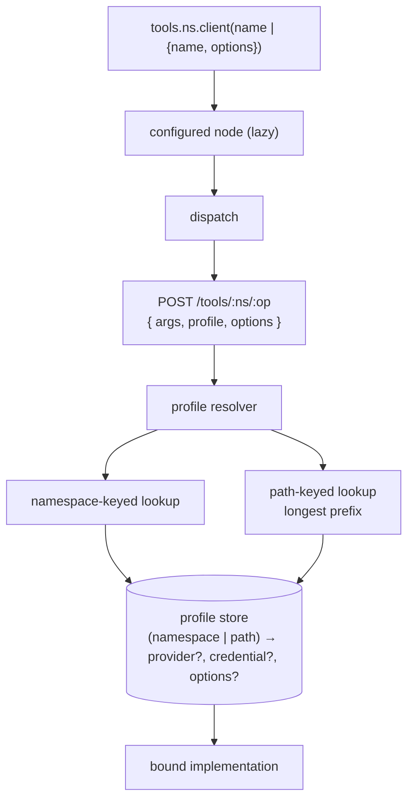

## Context

Three mechanisms, one idea.

**Provider profiles** are credential *labels*. `credentials.ts:807-826` matches `record.label === profile`, fails if none matches, and fails differently if two do. A label is a display name being used as an identifier, so renaming one silently breaks every script that pins it.

**Interface instances** are real config records in `.services/bindings.json`, addressed on the wire as `<interface>:<name>`. `workflows/invoke.ts` already takes `profile` as a first-class out-of-band argument — and then re-serialises it back into the colon form and validates it against an identifier regex:

```ts
target = `${parsed.interfaceId}:${profile}`;
if (!parseInterfaceNamespace(target)) throw new ServiceError(
  `"${profile}" is not a valid ${parsed.interfaceId} instance name — ` +
  `interface profiles are instance names (lowercase letters, digits, hyphens)`);
```

Deleting those lines yields both "any string" and "no colon form" at once.

**Mounts** are a third table. But `vfs.read` already consults them and delegates — session file, mount read, store read — and `vfs.list` splices mounted entries into a listing. Delegation is already the implementation; only the table's management is separate. And a git mount must be honoured by version-control operations too, so the table is not owned by the file namespace at all.

`client()` is async today (`await github.client("work")`), and `getClient({ profile })` — which it replaced — is still documented as the reserved root name.

## Goals / Non-Goals

**Goals:** one word, one store, one call form, lazy resolution, arbitrary names, transport separated from arguments by type.

**Non-Goals:** namespace routing and the core-vs-interface precedence (`interfaces-native-provider`); the `tools` root itself (`tools-global`).

## Architecture



- **configured node** — records the profile and call-site options on the path; performs no I/O.
- **profile resolver** — one lookup, two key kinds. Namespace keys are exact; path keys are longest-prefix.
- **profile store** — replaces credential-label matching and `bindings.json`.

## Decisions

### D1: One store, one word
- **Choice**: a profile is `(key, name) → { provider?, credential?, options? }` where key is a namespace or a path. Credential labels revert to display names.
- **Alternatives**: *Two stores behind one word* — lost because the asymmetry survives unspoken: a provider profile still could not carry options, and labels still could not be renamed safely. *Keep both words* — lost because the runtime already unified them; only the vocabulary is split.
- **Revisit if**: provider and interface profiles need genuinely different shapes.

### D2: Profile travels in the request body
- **Choice**: `POST /tools/:ns/:op` with `{ args, profile, options }`.
- **Alternatives**: *Path segment* — impossible with arbitrary names. *Header* — lost; header values are effectively ASCII-constrained, which reintroduces a naming rule. *Query parameter* — lost; profile names would appear in access logs.
- **Revisit if**: a transport without a request body needs profile pinning.

### D3: Lazy `client()`
- **Choice**: no promise, no round-trip; resolution deferred to the first operation.
- **Alternatives**: *Keep it async* — lost because it forces two statements for one intent and a second round trip. *Validate eagerly* — lost for the same round trip; the error is preserved by making the operation's failure name the profile and list what exists.
- **Revisit if**: eager validation becomes necessary for a UI that configures without calling.

### D4: Call-site options are call arguments only, by type
- **Choice**: two distinct types. Profile options may carry transport configuration; call-site options may not, and `baseUrl` stops being a magic key inside an untyped bag.
- **Alternatives**: *Deny-list at the boundary* — kept as a secondary runtime guard for untyped callers, but rejected as the primary defence: a deny-list is a thing you forget to extend. *Allow-list declared per interface* — lost for now; the existing per-interface declaration names operations, not option keys, so this needs a new declaration.
- **Revisit if**: a legitimate call-site need for transport configuration appears.

### D5: Mounts are path-keyed profiles
- **Choice**: one configuration concept; mount management folds into the profile surface.
- **Alternatives**: *Own `mounts` namespace* — lost because it is a fourth surface for the third instance of one idea, immediately after consolidating the first two. *Leave on the file namespace* — lost because a git mount must also be honoured by version-control operations, so the table is not the file namespace's to own.
- **Revisit if**: path-keyed and namespace-keyed configuration diverge in shape rather than just in key.

## Interfaces & Data

Wire:
```
POST /tools/:namespace/:operation
{ args: object, profile?: string, options?: object }
```

Configuration:
```
profiles.set    { namespace?, path?, name?, provider?, credential?, options? }   // exactly one of namespace|path
profiles.list   { namespace? | path? }
profiles.remove { namespace? | path?, name? }
```
`name` omitted means the default profile for that key.

Call site:
```
client(name: string)
client(config: { name?: string; options?: CallOptions })
```
`CallOptions` is per-namespace and declares no transport keys. `ProfileOptions`, used only by `profiles.set`, is wider.

Resolution order: call-site options > profile options > compat defaults. Namespace keys match exactly; path keys match longest prefix.

## Risks / Trade-offs

- **Deleting the colon form touches 15 source files, 5 test files, 5 planning docs, and the interfaces documentation, which spends 28 lines justifying the colon on grounds that no longer hold** → land the routing change first so the rest is mechanical follow-through.
- **Credential labels stop being identifiers** → a migration must mint profiles from existing labels before the label lookup is removed, or every pinned script breaks silently rather than loudly.
- **Longest-prefix matching runs on every file operation** → the mount table is small and already consulted per operation; measure, do not assume.
- **Lazy resolution moves the failure point** → the operation's error must name the profile and list what exists, or the diagnostic is worse than today's.
- **Agent profiles reference an interface instance by colon name** → they need a `{ interface, profile }` shape; this is the one consumer whose stored data changes meaning, not just spelling.

## Rollout

1. Add the profile store and resolver alongside the existing mechanisms; write to both.
2. Migrate: mint a profile per labelled credential; convert `bindings.json` entries to namespace-keyed profiles; convert mount records to path-keyed profiles.
3. Switch dispatch to read the profile from the request body; stop re-serialising into the colon form.
4. Delete the colon parsing, the instance-name regex, the label lookup, and `getClient`.
5. Make `client()` lazy and non-async; split the option types.
6. Update the interfaces, services, and agent-profile UI surfaces.
7. Delete the old stores.

Rollback before step 4 is a config flip; after step 4 it is a revert plus a restore of the migrated records.

## Open Questions

> Settled 2026-08-03 — accept recommendations.

- **Should `profiles` be its own namespace, or hang off `interfaces`?** Own namespace.
- **Do path-keyed profiles support a `name`, or is a path always singly-bound?** Singly-bound.
