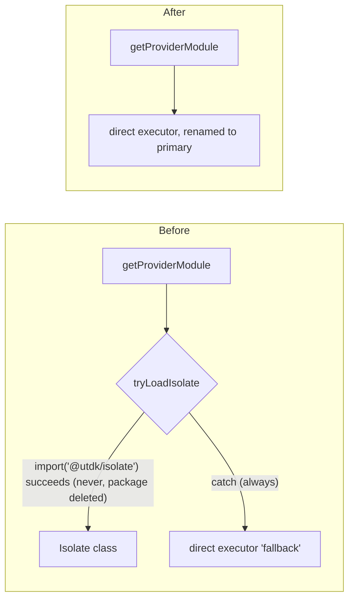

## Context

Three sibling repos (`aprovan`, `registry`, `core`) accumulated dead code during the pre-refactor
period documented in `docs/tasks/refactor-decisions.md`. This change is WS-1: purely mechanical
deletion with zero design surface, gated only on verifying nothing live still imports the targets.
It runs first because every later workstream (WS-2..WS-8) touches the same repos and benefits from
a clean baseline; it has no dependency on any other workstream (`free` in the workstream map).

Investigation (repo-wide grep across all three repos, package-by-package) confirmed every deletion
target in the decision record has zero live consumers, with two exceptions that need explicit
handling beyond a plain `rm -rf` — see D2 and D3 below.

## Goals / Non-Goals

**Goals:**
- Delete every dead file/package named in the decision record, plus the two stray-consumer fixes
  found during investigation (D2, D3), without breaking any surviving build/typecheck/test.
- Rename the isolate.ts "fallback" executor to be the intended primary path and remove the dead
  `@utdk/isolate` dynamic-import branch.
- Deprecate (never unpublish) every deleted package that has a published npm version.

**Non-Goals:**
- No refactor of surviving code beyond the minimum edits needed to drop dead references (e.g. not
  rewriting `CodePreview`'s prop API beyond dropping the dead default value).
- No new contracts, no registry-server work, no storage/auth changes (other workstreams).
- No CI pipeline changes beyond what's needed to keep existing `build`/`typecheck`/`test` scripts
  green.

## Architecture

This change has no new runtime architecture — it is subtractive. The only structural change is to
`isolate.ts`'s internal control flow:

Everything else is deletion of files/packages with no replacement component.

## Decisions

### D1: Delete `packages/patchwork` entirely, not just `types.ts`
- **Choice**: After `packages/mcp-app-server` is deleted, `packages/patchwork`
  (`@aprovan/patchwork`) has zero remaining source consumers — its only real import site was
  `mcp-app-server/src/registry-backend.ts` (`export * from "./mcp.js"` covers `PatchworkMcpClient`,
  the only thing that file used). `client/web/package.json` lists `@aprovan/patchwork` as a
  dependency but has zero source imports of it (stale). Applying decision record #2's literal
  instruction ("shrink to `mcp.ts` if still consumed, else delete package"): nothing consumes it,
  so delete the whole package, not just `types.ts`.
- **Alternatives**: Shrink to `mcp.ts` only, per the decision record's first branch — rejected
  because that branch is conditioned on the package still being consumed, and it is not (confirmed
  by grep for `@aprovan/patchwork"` and `from "@aprovan/patchwork"` across `aprovan/`, excluding
  the package's own directory and `mcp-app-server` which is itself being deleted in this same
  change).
- **Revisit if**: a future workstream wants a standalone MCP client library independent of
  MCP-Apps distribution — re-add `packages/patchwork` from git history at that point.

### D2: Cut `editor/src/lib/vfs.ts` down to what's actually used, make `CodePreview`'s `vfs` prop required
- **Choice**: `packages/editor/src/lib/vfs.ts` imports `VFSStore` and `HttpBackend` from the
  compiler — both being deleted in this change (D2 below is about the compiler side; this is the
  consumer side). Confirmed by grep: no `/vfs` server route exists anywhere in the codebase, so
  `getVFSStore`, `saveProject`, `loadProject`, `listProjects`, `saveFile`, `loadFile`,
  `subscribeToChanges`, `httpWidgetVfs`, `isVFSAvailable`, and `getVFSConfig` are unreachable in
  practice — the one real caller (`client/web`'s `CodePreview` usage in `ChatPage.tsx`) always
  passes its own `workspaceWidgetVfs` implementation, never falling through to the
  `httpWidgetVfs` default. Delete all of the above from `vfs.ts`; keep only the `WidgetVfs`
  interface (it's a real, externally-consumed contract — `client/web/src/lib/workspace-vfs.ts`
  imports the type). Move `WidgetVfs` into `CodePreview.tsx` (or a small local `types.ts`) since
  `vfs.ts` no longer has a reason to exist as a module once the HTTP client is gone. Update
  `CodePreview.tsx` to make `vfs: WidgetVfs` a required prop (drop the `= httpWidgetVfs` default).
  Update `packages/editor/src/index.ts` to drop the now-deleted exports.
- **Alternatives**: Leave `vfs.ts` as dead code that happens to still compile by keeping
  `VFSStore`/`HttpBackend` duplicated locally in `editor` — rejected, defeats the purpose of the
  compiler purge and leaves an orphaned second copy of dead code.
  Delete `CodePreview`'s `vfs` prop default without auditing callers — rejected without the grep
  confirming every real caller supplies `vfs` explicitly (done: `ChatPage.tsx` both call sites
  pass `vfs={workspaceWidgetVfs}`).
- **Revisit if**: a dev-server `/vfs` HTTP surface is intentionally rebuilt later — restore from
  git history (`git log -- packages/compiler/src/vfs/backends/http.ts`).

### D3: `packages/compiler/src/__tests__/vfs-core.test.ts` is trimmed, not deleted
- **Choice**: This test file has `describe` blocks for both the live core VFS (`vfs/core/types`,
  `vfs/core/utils` — describes at lines 22 and 96) and the dead sync engine
  (`vfs/sync/differ` at line 158, `vfs/sync/resolver` at line 180). Remove only the dead
  `describe` blocks and their imports (`hashContent` from `../vfs/sync/differ.js`,
  `resolveConflict`/`ConflictResolutionInput` from `../vfs/sync/resolver.js`); keep the live-VFS
  test coverage.
- **Alternatives**: Delete the whole file — rejected, it would silently drop test coverage for the
  live `vfs/core/types.ts` and `vfs/core/utils.ts` that ship in this same change.
- **Revisit if**: never — this is the correct terminal state, not a placeholder.

### D4: `isolate.ts` rename keeps the public interface stable
- **Choice**: Delete `tryLoadIsolate`, the `@utdk/isolate` dynamic import, and the try/catch
  wrapper. Rename whatever internal identifier denoted the "fallback" executor to be the primary
  (e.g. drop "fallback"/"direct executor for development" framing from names and doc comments —
  it is the production executor now). Keep `getProviderModule`, `IsolateExecuteOptions`,
  `IsolateResult`, `IsolateExecutor`, and the LRU cache functions (`putProviderModule`,
  `setProviderModuleForTesting`, `isProviderCached`, `invalidateProvider`, `resetProviderCache`)
  exactly as-is — these are the live, tested public surface and callers depend on them unchanged.
- **Alternatives**: Also restructure `getProviderModule`'s caching/loading logic while touching
  this file — rejected as scope creep; WS-1 is mechanical, and the LRU/lazy-load behavior is
  explicitly reused as-is by WS-3's registry-server extraction.
- **Revisit if**: WS-3 needs a different executor abstraction when extracting into the standalone
  registry server — that's WS-3's decision to make, not this change's.

### D5: `infra/aws/dist/` deletion is a local no-op for git, done anyway
- **Choice**: Confirmed via `git ls-files infra/aws/dist` (zero results) that this directory is
  already git-ignored and untracked. Task remains in the checklist as a plain `rm -rf` for local
  working-tree hygiene (the decision record names it explicitly, and stale local build output
  should not be quietly left around), but it produces no diff/commit.
- **Alternatives**: Drop the task since it's not tracked — rejected; the decision record names it
  and a clean working tree is part of "done."
- **Revisit if**: never.

## Interfaces & Data

No new interfaces. The one surface that changes shape:

- **`CodePreview` props** (`packages/editor/src/components/CodePreview.tsx`): `vfs?: WidgetVfs =
  httpWidgetVfs` becomes `vfs: WidgetVfs` (required, no default). `WidgetVfs` itself
  (`usePaths(): Promise<boolean>`, `saveProject(project): Promise<void>`, `readFile(path):
  Promise<string>`, `subscribe(callback): () => void`) is unchanged — this is the seam
  `client/web`'s `workspaceWidgetVfs` (in `client/web/src/lib/workspace-vfs.ts`) already
  implements, so no caller-side change is needed beyond the type import path if `WidgetVfs` moves
  out of `lib/vfs.ts`.
- **`isolate.ts` public exports** (`registry/apps/workspace/src/isolate.ts`): unchanged signatures
  for `getProviderModule`, `IsolateExecuteOptions`, `IsolateResult`, `IsolateExecutor`, and the LRU
  cache helpers — see D4. Any internal-only rename does not cross this boundary.

## Risks / Trade-offs

- [Deleting `packages/patchwork` beyond the decision record's literal "shrink `types.ts`"
  instruction turns out to be wrong if some other in-flight branch depends on it] → Mitigation:
  confirmed via grep immediately before authoring this plan (see D1); if a consumer surfaces at
  apply time, the fallback is trivial — the file is git history, `git checkout` it back and adjust
  the WS-4 registry stream's dependency instead of relitigating here.
- [`npm deprecate` requires publish auth the executing agent may not have] → Mitigation: PRD flags
  this explicitly; the npm-deprecations work stream is isolated from the code-deletion streams so
  it can be run later/by a human without blocking the rest of the purge.
- [Making `CodePreview`'s `vfs` prop required could be a breaking change for an undiscovered
  caller] → Mitigation: repo-wide grep found exactly two render sites, both already passing `vfs`
  explicitly (`ChatPage.tsx:553`, `ChatPage.tsx:2906`); typecheck after the change is the objective
  gate.

## Rollout

Mechanical deletion, no runtime deploy implications (nothing here ships independently — it lands
in each repo's normal branch/PR flow). Order within this change: per-repo work streams are
independent and can run in parallel (see tasks.md); the npm-deprecations stream has no code
dependency and can run any time after (or in parallel with) the others. No migration steps, no
rollback beyond `git revert` per repo.

## Open Questions

None. D1–D3 resolve the only ambiguities investigation turned up, each by direct application of an
already-confirmed decision rather than a new cross-cutting call.
