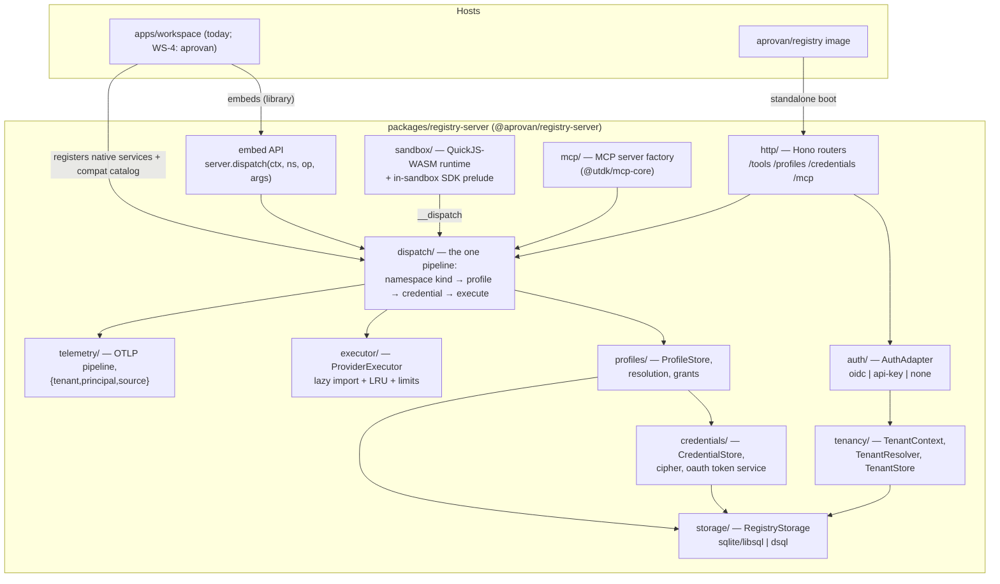

# Tech Plan — registry-server-extraction (WS-3)

## Context

The execution plane lives inside `registry/apps/workspace` today:

- **Dispatch**: `src/routes/tools.ts` (1,084 LOC) — one Hono route handling core
  services, interface resolution, LLM aliases, credential resolution, streaming, audit,
  and telemetry recording.
- **Executor**: `src/isolate.ts` — a "fallback" `DirectExecutor` that is actually the
  intended executor (decision 1); LRU'd `import('utdk/<p>')`; `@utdk/isolate` is a
  dead dynamic-import branch (WS-1 deletes it).
- **Credentials**: `src/credentials.ts` (`ICredentialStore` + Dynamo/SQLite impls,
  `resolveCredentialRecord` with label-as-profile resolution), `src/credentialCipher.ts`
  (KMS/local/none envelope), `src/oauthTokens.ts` (token exchange/refresh).
- **Interfaces**: `src/interfaces.ts` — hardcoded `listInterfaces()` catalog +
  `.services/bindings.json` (a VFS file!) for per-workspace instances.
- **QuickJS**: `src/workflows/sandbox.ts` (513 LOC) — the proven WASM sandbox
  (debug-asyncify), whose only inbound deps are `ServiceError` and quickjs libs, and
  whose host seam is an injected `dispatch(namespace, path, args, profile?)`.
- **MCP**: `src/mcp/server.ts` + `@utdk/mcp-core` — meta-tool surface over the same
  executor and credential store.
- **Auth**: `src/middleware/auth.ts` — Cognito-specific verifier; mode derived from env.
- **Config**: `src/runtime/config.ts` — the local/aws two-world switch (`isAwsMode()`).
- **In-sandbox SDK seed**: `packages/runtime` — namespace proxies, policy
  (retry/backoff/rate-limit — cooperative), pagination, transports.

Constraints: decisions 1, 4, 7, 8, 9 of `docs/tasks/refactor-decisions.md` are final.
No backwards compatibility anywhere. Registry repo must build standalone. Consumes WS-2
outputs (top-level `@utdk/*` contracts, compat catalog as data, shared credential types).

## Goals / Non-Goals

**Goals:**

- One package (`packages/registry-server`) that is simultaneously: an embeddable library
  (in-process API for the WS-4 workspace host), a standalone HTTP server, and the source
  of the `aprovan/registry` Docker image.
- Tenancy, auth, and storage as injection points, not env-derived globals.
- Profiles as the only credential/binding resolution mechanism; delete the two
  half-mechanisms.
- One dispatch pipeline shared by HTTP, embedding, MCP, and the QuickJS guest.
- Attributed OTLP telemetry built in.

**Non-Goals:**

- Moving product-plane services (WS-4). `apps/workspace` remains the host of `vfs`,
  `workflows`, `apps`, etc.; after WS-3 it consumes the extracted package for execution.
- DSQL cutover/migration (WS-5) — the DSQL driver is schema + implementation, not rollout.
- Groups/profiles product UI (WS-6).

## Architecture



Component responsibilities (one each):

- **tenancy/** — owns `TenantContext`; nothing below it ever reads a tenant from env.
- **dispatch/** — classifies a namespace (native service | interface | provider |
  llm-alias), resolves the Profile, resolves the credential, authorizes, executes,
  records audit + telemetry. The only place these steps compose.
- **profiles/** — Profile CRUD, grants, and `resolveProfile()` (the algorithm in
  Interfaces & Data). Owns the reserved name `default`.
- **executor/** — turns `(module, operation, args, injectable credential, baseUrl)` into
  a result. Knows nothing about tenants or profiles.
- **sandbox/** — runs untrusted guest source against an injected dispatch function.
  Knows nothing about HTTP or storage.
- **native-service registry** — hosts register `CoreService`-shaped implementations
  (`registerNativeServices()`); the standalone image registers only the execution-plane
  natives (`registry` catalog metadata, `telemetry` query). Product natives (vfs,
  workflows, …) stay host-registered — this is the seam WS-4 uses.

## Decisions

### D1: Package shape — one library-first package with a thin standalone entrypoint

- **Choice**: `packages/registry-server` exports `createRegistryServer(options)` returning
  `{ router, dispatch, runScript, stores, close }`. `src/standalone.ts` (the Docker
  entrypoint) is ~50 lines: parse env → `createRegistryServer` → serve. `apps/workspace`
  is rewired to consume the package (proving the embed path before WS-4 does it for real).
- **Alternatives**:
  - *Extract `apps/workspace` wholesale and carve the product plane out later* — rejected:
    keeps the 41K-LOC tangle; WS-4 would inherit an app-shaped dependency instead of a
    library; the circular `@aprovan/patchwork-compiler` edge survives.
  - *HTTP-only microservice (workspace calls it over loopback)* — rejected: the embedded
    case is one ECS task serving many workspaces; a loopback hop adds latency, a second
    process to supervise, and serialization of streaming bodies for zero isolation gain
    (same container). Decision 4 says "embeds as library (in-process)".
  - *Multiple small packages (executor, profiles, sandbox as separate npm packages)* —
    rejected: the seams are internal module boundaries, not independent release units;
    separate versioning is coordination cost with no consumer.
- **Revisit if**: a consumer other than aprovan needs the executor without the rest of the
  server; then split `executor/` + `sandbox/` out.

### D2: Tenancy — explicit `TenantContext` threaded through every call; rows carry `tenant_id`

- **Choice**: every store method's first parameter is `tenantId`; every dispatch takes a
  `CallContext { tenantId, principal, source }`. One shared schema, `tenant_id` column on
  every table, composite unique keys include it. Standalone boot auto-provisions tenant
  `"default"`; embedded hosts resolve tenant per call (aprovan: `workspaceId` → tenant
  1:1, same string). All in-memory caches (tool lists, oauth token cache, rate-limit
  buckets) are keyed by tenant.
- **Alternatives**:
  - *Schema-per-tenant / database-per-tenant* — rejected: the embedded case is many small
    tenants in one SQLite file or one DSQL cluster; per-tenant DDL is operational drag and
    makes the auth-time grants join cross-schema.
  - *Implicit tenancy via AsyncLocalStorage* — rejected: invisible data flow is exactly
    how the current codebase ended up with ad-hoc `workspaceId` threading; explicit
    parameters make a missing tenant a compile error.
  - *Keep `workspaceId` as the name* — rejected: the registry server is a product with no
    concept of "workspace"; the embedded mapping (workspace→tenant) belongs at the host
    boundary, once.
- **Revisit if**: a tenant count or noisy-neighbor profile appears that needs physical
  isolation (then a driver-level partitioning scheme, not an API change).

### D3: Profiles are relational rows in the registry store, not a VFS file

- **Choice**: `profiles` + `profile_grants` tables in `RegistryStorage` (schema below).
  `.services/bindings.json`, `interfaces.bind/unbind`, `readBindings`, `listInstances`,
  and label-based `resolveRecordByProfile` are deleted. The `sql:analytics`
  instance-namespace syntax is deleted; profile names are the addressing
  (`sql.client("analytics")` in scripts, `profile` field on the wire).
- **Alternatives**:
  - *Keep bindings.json and layer Profiles over it* — rejected: bindings.json lives on the
    product plane's VFS, which the extracted server must not depend on; it is uncached
    (read per resolution), unindexed, and has no grants dimension. Decision 7 explicitly
    replaces it.
  - *Profiles as labels on credentials (extend the current label mechanism)* — rejected: a
    label cannot carry `target`, `options`, or `grants`; interface routing needs a
    provider choice + option bag, which labels structurally lack.
  - *Keep `sql:analytics` namespace syntax as sugar over profiles* — rejected (recommend):
    two spellings for one concept; discovery/dispatch/tool-list code paid real complexity
    for the colon syntax (length-based namespace stripping, INSTANCE_RE). `client(name)`
    covers scripts; the wire carries `profile`. Flagged in PRD open questions for final
    confirmation.
- **Revisit if**: profile churn becomes interactive-editing-shaped (users hand-editing
  JSON in a repo) — then an import/export representation, not a move back to VFS.

### D4: Profile resolution — default-name fallback, loud named-miss, grants as the allow-list

- **Choice**: the algorithm in Interfaces & Data. Key properties: (a) bare `sql.*` /
  `github.*` resolve the profile literally named `default` for that target; (b) with no
  `default` profile, the default name — and only the default name — falls back to
  zero-config (credentialless compat entry first, else first compat provider with a
  tenant credential; provider targets: first tenant credential); (c) a named profile that
  doesn't exist fails listing the names that do; (d) when auth is enforced, dispatch
  through a profile requires a grant (direct user, group membership, or caller identity
  app/workflow/agent), resolved in one join at auth time; admins pass; auth-none passes.
  An explicit stored `default` profile is also grant-checked; the *synthesized* zero-config
  fallback is not (it exists precisely for ungoverned tenants).
- **Alternatives**:
  - *`isDefault` boolean instead of reserved name* — rejected: two defaults become
    possible; uniqueness on `(tenant, target, name)` gives one default for free and the
    name shows up in error messages naturally.
  - *Grants on credentials rather than profiles* — rejected: decision 7 makes the profile
    the allow-listing unit; a credential grant can't scope options (which database, which
    model) and would recreate the label ambiguity.
  - *Zero-config fallback for named profiles too* — rejected: `sql:analytics` silently
    hitting production is the exact failure mode the design exists to prevent (current
    interfaces.ts comment says the same).
- **Revisit if**: grant checks become the dispatch hot-path bottleneck (then cache the
  auth-time join per token, which WS-5 is doing for the identity triple-read anyway).

### D5: Executor — in-process `ProviderExecutor`, lazy import, LRU; limits enforced in dispatch

- **Choice**: rename `DirectExecutor` → `ProviderExecutor` (it IS the intended executor,
  decision 1; coordinate with WS-1 which owns the deletion of the `@utdk/isolate`
  branch). LRU cache keyed by *import specifier* (not provider name — first-party
  `moduleSpecifier` modules and `utdk/<p>` must not collide), cap via
  `executor.cacheSize` (default 20). Rate limits and budgets are enforced in
  **dispatch/**, server-side, keyed `(tenant, profile-or-provider, principal)` with the
  token-bucket from `packages/runtime/src/policy.ts` as the seed implementation; profile
  `limits` (see schema) override tenant defaults. The in-sandbox policy layer remains
  cooperative-only (nice retries, not enforcement).
- **Alternatives**:
  - *Per-call sandboxing of provider modules (resurrect @utdk/isolate)* — rejected by
    decision 1: generated modules are first-party build artifacts, not untrusted code;
    the isolate was never built and its fallback has been production behavior all along.
  - *Client-object cache (toolCache.ts `getOrBuildClient`) as the primary cache* —
    rejected: clients close over credentials/baseUrl, so a shared client cache is a
    cross-tenant credential hazard; cache modules, construct clients per call (current
    tools.ts behavior). `toolCache.ts`'s client cache is not extracted; its
    `getRegistryProviders()` catalog guard moves into executor/.
  - *Rate limiting at the HTTP middleware layer only* — rejected: MCP, embedding, and the
    QuickJS guest bypass HTTP middleware; limits belong in the one shared pipeline.
- **Revisit if**: a provider module proves unsafe to share across tenants in one process
  (module-level mutable state) — then a per-tenant module instantiation strategy for that
  provider, flagged in the catalog.

### D6: QuickJS extraction seam — the runtime keeps its injected-dispatch contract; `ServiceError` moves into the server kernel

- **Choice**: `workflows/sandbox.ts` moves to `sandbox/quickjs.ts` essentially verbatim
  (debug-asyncify pinned; the `_MaybeAsync` job pump, memory ceiling, and concurrency
  gate all come along). Its two seams stay exactly as they are: the injected
  `dispatch(namespace, path, args, profile?)` host function and the `ServiceError`
  status-carrying error type. `ServiceError` (plus `ServiceContext`/`CoreService` — the
  service-kernel contract) moves INTO `@aprovan/registry-server` and is re-exported;
  `apps/workspace`'s remaining product services import it from the package. The
  `__dispatch` guest contract (JSON strings in, `{ok,data}|{ok:false,error}` envelope
  out, 4th-arg profile pin) is frozen as a documented interface (below). The in-sandbox
  SDK prelude is rebuilt from `packages/runtime` (namespace proxies, `client(name)`
  factory, cooperative retry/pagination helpers) and injected as guest source.
- **Alternatives**:
  - *Copy sandbox.ts and leave the original* — rejected: two copies of a
    memory-boundary-critical file with pinned library internals (0.32 asyncify pump) is
    how the miscompilation class of bug comes back.
  - *Generalize the host contract to structured values (QuickJS handles)* — rejected: the
    JSON-string boundary is a deliberate security/asyncify property ("no handle to a host
    value ever enters the guest"); widening it buys nothing the SDK layer needs.
  - *Leave ServiceError in apps/workspace and have the sandbox take an error factory* —
    rejected: the dispatch pipeline, native-service contract, and sandbox all speak
    ServiceError; the kernel contract's home is the server every host embeds, and the
    workspace's own comment ("this module exists to be a leaf") describes exactly this
    move.
- **Revisit if**: quickjs-emscripten releases a correctly-compiled release-asyncify build
  (re-benchmark; keep debug until a soak test passes the ~2-suspension GC repro).

### D7: Auth adapters — verifier-shaped interface; generic OIDC via issuer discovery

- **Choice**: `AuthAdapter { mode, init(), authenticate(req) → Authn }` with three
  built-ins: `oidc` (ANY issuer: JWKS via OIDC discovery — `jose` `createRemoteJWKSet`;
  Cognito is `{issuer, audience}` config, the `cognito-idp` regex dies), `api-key`
  (tenant-scoped keys, SHA-256 digest at rest, `Authorization: Bearer apr_…`), `none`
  (implicit admin principal, single tenant). Authentication (who) is separate from tenant
  resolution (which tenant, what role/groups): `TenantResolver` maps
  `(authn, requested tenant)` → `TenantContext`, so the embedded host can supply its own
  resolver (aprovan keeps memberships/groups product-side) while standalone uses the
  built-in store. The aws-mode-requires-auth boot guard survives generalized: a
  network-exposed multi-tenant config with `auth: none` refuses to start without
  `allowInsecure`.
- **Alternatives**:
  - *Keep aws-jwt-verify (Cognito-only) and add adapters later* — rejected: "OIDC adapter
    (any issuer)" is decision 4's text; Cognito-specific parsing is the exact coupling
    being removed.
  - *Sessions/API keys unified as one credential-ish store* — rejected: API keys are
    server auth material with different lifecycle (mint/revoke/rotate, hashed at rest);
    conflating them with provider credentials muddies the cipher and the grants model.
  - *Delegated auth only (host always resolves principals)* — rejected: standalone is a
    product; it needs to authenticate callers with no host present.
- **Revisit if**: a host needs non-bearer auth (mTLS, SigV4) — the adapter interface
  already admits it; add an adapter, don't widen the built-ins.

### D8: Storage — per-domain store interfaces behind one `RegistryStorage` facade; drivers sqlite/libsql and dsql

- **Choice**: keep the proven `IXStore` pattern (interface + impls + factory) but bundle
  behind `RegistryStorage { tenants, credentials, profiles, grants, apiKeys, audit }`,
  constructed once from `storage: { driver: "sqlite" | "libsql" | "dsql", … }` (or a
  caller-provided implementation). The schema is relational and identical across drivers
  (the Dynamo single-table design is NOT carried over — its `CRED#<provider>#<id>` +
  pointer-row shape exists to fake the relational queries SQL does natively). SQLite and
  libSQL share one SQL dialect; DSQL gets its own driver (no FK enforcement differences
  papered over at the interface). Credential payload encryption keeps the
  `credentialCipher` envelope (kms/local/none) unchanged.
- **Alternatives**:
  - *Port the Dynamo store as a fourth driver* — rejected: decision 3 moves cloud metadata
    to DSQL; keeping Dynamo means WS-5's nuke-and-reseed has a third live target for zero
    users.
  - *An ORM (drizzle/kysely)* — rejected for the core: three small tables per domain and
    two dialects; hand-written SQL matches the existing codebase and keeps the DSQL
    driver's dialect differences visible rather than abstracted into surprise.
  - *One generic key-value store interface* — rejected: the grants join
    (`groups → profile_grants → profiles`) is the whole point of decision 8; a KV
    interface forces N+1 reads back in.
- **Revisit if**: WS-5's identity/authz schema design lands conventions (naming,
  migration tooling) that differ — align then; the interfaces are the contract, the DDL
  can move.

### D9: Telemetry — OTel SDK, OTLP/HTTP exporter, attribution enforced at the emission choke point

- **Choice**: `telemetry/` owns a `RegistryTelemetry` built on `@opentelemetry/sdk-node`
  with an OTLP/HTTP exporter (endpoint from `telemetry.otlpEndpoint`, default off →
  no-op provider). All spans/logs/metrics are created through `RegistryTelemetry.span()`
  / `.log()` helpers that REQUIRE a `CallContext` — attribution
  (`aprovan.tenant`, `aprovan.principal`, `aprovan.source` ∈
  `tool|workflow|widget|app|chat|mcp|system`) is set by the helper, so an unattributed
  emission is unrepresentable in the package's own code. This is plane 2 of decision 9;
  plane 1 (the `@utdk/telemetry` contract users bind) dispatches through the normal
  pipeline like any interface; plane 3 (operator/PostHog) consumes plane 2's attributed
  stream host-side — the server's only obligation to it is the attribution triple.
  `withSpan` from `@utdk/common/telemetry` is replaced at call sites during extraction.
- **Alternatives**:
  - *Keep the current split (utdk withSpan + workspace telemetry service records)* —
    rejected: two pipelines with different attribution is what decision 9 unifies.
  - *Attribution via OTel Baggage/context propagation* — rejected as the primary
    mechanism: implicit context is easy to drop across the asyncify boundary and the
    embedded host's own async hops; explicit `CallContext` is already threaded (D2).
  - *Vendor exporter (PostHog) built in* — rejected: decision 9 makes the standalone
    default vendor-neutral OTLP; PostHog is the operator plane, host-side.
- **Revisit if**: OTLP log signal maturity in the Node SDK becomes a problem — fall back
  to span events for logs.

### D10: MCP — the MCP surface is a thin adapter over dispatch/, hosted per tenant

- **Choice**: `mcp/server.ts` moves into `mcp/`, still built per request from
  `@utdk/mcp-core` meta-tools (list/search/info/call), but `call_tool` executes through
  `dispatch()` (gaining Profiles, limits, and attribution — today's MCP path
  resolves first-credential directly and skips interface resolution entirely, a drift
  bug this closes). Workspace-FS-backed MCP features (fs_* tools, prompts/, artifacts/
  resources) do NOT extract — they are product-plane; the server exposes a hook
  (`mcp.extensions`) the host uses to re-attach them (WS-4).
- **Alternatives**:
  - *Extract fs-tools/prompts/resources too* — rejected: they read the VFS, which stays
    product-plane; the execution plane growing a file store dependency defeats the split.
  - *Leave MCP in apps/workspace calling the package* — rejected: decision 4 lists the
    MCP surface as part of the extracted plane, and standalone needs it (it is the
    integration surface for external agents).
- **Revisit if**: MCP SDK's server API changes transport model (streamable HTTP is
  already the shape here).

### D11: Docker image — `aprovan/registry` from the registry repo, standalone defaults baked in

- **Choice**: `docker/registry.Dockerfile` (multi-stage: pnpm build → node:22-slim
  runtime) running `standalone.ts`; default env = sqlite at `/data`, auth none,
  telemetry off; one `VOLUME /data`; healthcheck `GET /healthz`. Image publishing wired
  into the registry repo's existing release flow next to npm publish. The `aprovan
  registry run` CLI verb wraps this image but lives in the aprovan repo (WS-4/decision 5).
- **Alternatives**: *image in the aprovan repo* — rejected: decision 5 says the registry
  repo ships artifacts (npm + image); the image must build from the registry repo alone.
- **Revisit if**: bundle size (49-provider utdk catalog) makes the image unwieldy —
  consider an on-demand provider fetch layer, which lazy import already structurally
  supports.

### D12: Group grants — schema and auth-time join live here; product wiring is WS-6

- **Choice**: `profile_grants` carries `subject_kind IN ('user','group','app','workflow',
  'agent')`. The server resolves a caller's granted-profile set in one query at
  auth/dispatch time (`WHERE subject_kind='user' AND subject_id=? OR (subject_kind='group'
  AND subject_id IN (…groupIds))` — groupIds arrive on the `TenantContext`, supplied by
  the host's resolver or the built-in store). `GroupToolGrants`/`GroupPrefixGrants` are
  not extracted (decision 8 deletes/rebases them; the admin/product surface that writes
  grants is WS-6).
- **Alternatives**: *a separate `group_profiles` table apart from user grants* —
  rejected: one subject-typed table keeps "who may use this profile" answerable in one
  query and one admin surface.
- **Revisit if**: WS-6 needs grant conditions (expiry, path scoping) — add columns, the
  key shape holds.

## Interfaces & Data

These are the delegation seams. Types are normative; names may not drift without updating
this plan.

### Core contexts

```ts
/** Who is calling, from where, in which tenant. Threaded through EVERYTHING. */
export interface CallContext {
  tenantId: string;
  principal: string;              // subject id ("local" in auth-none)
  source: TelemetrySource;        // attribution origin
  role: "admin" | "member";
  groupIds: string[];
  /** Non-user caller identity, when dispatch originates from a granted subject. */
  actor?: { kind: "app" | "workflow" | "agent"; id: string };
  traceId?: string;
}
export type TelemetrySource =
  | { type: "tool" } | { type: "mcp" } | { type: "workflow"; runId?: string }
  | { type: "widget"; path?: string } | { type: "app"; app?: string }
  | { type: "chat"; sessionId?: string } | { type: "system" };
```

### Server construction (the embedding contract)

```ts
export interface RegistryServerOptions {
  storage: { driver: "sqlite" | "libsql"; url?: string; dir?: string }
         | { driver: "dsql"; url: string }
         | RegistryStorage;                       // bring your own
  auth: { mode: "oidc"; issuer: string; audience: string }
      | { mode: "api-key" }
      | { mode: "none" }
      | AuthAdapter;
  tenancy:
    | { mode: "single" }                          // standalone: auto-provision "default"
    | { mode: "external"; resolve: TenantResolver }; // embedded: host maps workspace→tenant
  catalog: InterfaceCatalog;                      // WS-2 compat data (interfaces + compat entries)
  nativeServices?: Record<string, CoreService>;   // host-registered natives (vfs, workflows, …)
  telemetry?: { otlpEndpoint?: string; serviceName?: string };
  executor?: { cacheSize?: number };              // default 20
  sandbox?: { memoryLimitMb?: number; concurrency?: number }; // defaults 32 / 2
  limits?: { defaultRps?: number; defaultBurst?: number };    // tenant-level defaults
  allowInsecure?: boolean;                        // gate: networked multi-tenant + auth none
}

export interface RegistryServer {
  /** Hono app: /tools, /profiles, /credentials, /mcp, /healthz. Host mounts or serves it. */
  router: Hono;
  /** In-process dispatch — the embed hot path. Host has already authenticated. */
  dispatch(ctx: CallContext, namespace: string, operation: string,
           args: Record<string, unknown>, opts?: { profile?: string; stream?: boolean }
  ): Promise<DispatchResult>;
  /** Run untrusted guest source in the QuickJS runtime with SDK globals installed. */
  runScript(ctx: CallContext, opts: RunScriptOptions): Promise<unknown>;
  stores: RegistryStorage;
  telemetry: RegistryTelemetry;
  close(): Promise<void>;
}
export type DispatchResult =
  | { kind: "json"; data: unknown; requestId: string; durationMs: number }
  | { kind: "stream"; stream: ReadableStream<Uint8Array>; headers: Record<string, string> };
```

### Auth adapter & tenant resolution

```ts
export interface AuthAdapter {
  readonly mode: "oidc" | "api-key" | "none";
  init(): Promise<void>;                                   // e.g. hydrate JWKS
  authenticate(req: { header(name: string): string | undefined }): Promise<Authn>;
}
export interface Authn { sub: string; claims: Record<string, unknown>; }

/** requestedTenant comes from the X-Registry-Tenant header (or the sole tenant). */
export type TenantResolver = (authn: Authn, requestedTenant?: string) =>
  Promise<{ tenantId: string; role: "admin" | "member"; groupIds: string[] }>;
```

### Storage schema (SQLite dialect; DSQL driver mirrors it)

```sql
CREATE TABLE tenants (
  id           TEXT PRIMARY KEY,          -- "default" | workspaceId (embedded, 1:1)
  display_name TEXT,
  created_at   TEXT NOT NULL
);

CREATE TABLE credentials (
  id          TEXT PRIMARY KEY,
  tenant_id   TEXT NOT NULL,
  provider    TEXT NOT NULL,              -- concrete provider id (github, postgres, …)
  label       TEXT,                       -- display only; NOT a resolution mechanism
  type        TEXT NOT NULL,              -- bearer_token | api_key | oauth2_client | oauth2_authcode
  payload     TEXT NOT NULL,              -- credentialCipher envelope (kms|local|none)
  created_by  TEXT,                       -- NEW user/owner dimension (decision 7); NULL = tenant-shared
  created_at  TEXT NOT NULL,
  updated_at  TEXT NOT NULL
);
CREATE INDEX credentials_tenant_provider ON credentials(tenant_id, provider);

CREATE TABLE profiles (
  id            TEXT PRIMARY KEY,
  tenant_id     TEXT NOT NULL,
  name          TEXT NOT NULL,            -- "default" reserved for bare-namespace dispatch
  target_kind   TEXT NOT NULL CHECK (target_kind IN ('interface','provider')),
  target_id     TEXT NOT NULL,            -- interface id ('sql') or provider id ('github')
  provider      TEXT,                     -- interface targets: executing compat provider
  credential_id TEXT,                     -- NULL allowed (credentialless compat entries)
  options       TEXT NOT NULL DEFAULT '{}',  -- JSON: model, database, baseUrl, …
  limits        TEXT,                     -- JSON: { rps, burst, budget? } server-enforced
  created_by    TEXT NOT NULL,
  created_at    TEXT NOT NULL,
  updated_at    TEXT NOT NULL,
  UNIQUE (tenant_id, target_kind, target_id, name)
);

CREATE TABLE profile_grants (
  tenant_id    TEXT NOT NULL,
  profile_id   TEXT NOT NULL,
  subject_kind TEXT NOT NULL CHECK (subject_kind IN ('user','group','app','workflow','agent')),
  subject_id   TEXT NOT NULL,
  granted_by   TEXT NOT NULL,
  created_at   TEXT NOT NULL,
  PRIMARY KEY (tenant_id, profile_id, subject_kind, subject_id)
);
CREATE INDEX profile_grants_subject ON profile_grants(tenant_id, subject_kind, subject_id);

CREATE TABLE api_keys (
  id          TEXT PRIMARY KEY,
  tenant_id   TEXT NOT NULL,
  digest      TEXT NOT NULL UNIQUE,       -- sha256 of the full key; plaintext shown once
  label       TEXT,
  created_by  TEXT NOT NULL,
  created_at  TEXT NOT NULL,
  revoked_at  TEXT
);

CREATE TABLE audit_log (
  request_id  TEXT NOT NULL,
  tenant_id   TEXT NOT NULL,
  principal   TEXT NOT NULL,
  namespace   TEXT NOT NULL,
  operation   TEXT NOT NULL,
  profile_id  TEXT,
  status      INTEGER NOT NULL,
  duration_ms INTEGER,
  created_at  TEXT NOT NULL
);
CREATE INDEX audit_tenant_time ON audit_log(tenant_id, created_at);
```

### Profile resolution algorithm (normative)

```
resolveProfile(ctx: CallContext, namespace: string, profileName?: string)
  → { target, compat?, provider, credential?, options, limits, profileId? } | throws

1. Classify namespace against the WS-2 catalog + native-service registry:
   native service  → no profile machinery; dispatch to registered CoreService. STOP.
   interface id    → target = { kind: "interface", id: namespace }
   provider id     → target = { kind: "provider", id: namespace }   (LLM aliases included)
   otherwise       → 404 "Unknown tool namespace …" (catalog guard, from executor/)

2. name = profileName ?? "default"

3. row = profiles.get(ctx.tenantId, target.kind, target.id, name)

4. If row exists:
   a. AUTHORIZE (skipped when auth mode is "none"; admins pass):
      granted = profile_grants row for (profile, 'user', ctx.principal)
              ∪ (profile, 'group', any of ctx.groupIds)
              ∪ (profile, ctx.actor.kind, ctx.actor.id) when ctx.actor set
      none → 403 `Profile "<name>" (<target>) is not granted to this caller.`
   b. Interface target: compat = catalog[target.id].compat.find(p => p.provider === row.provider)
      missing        → 400 `<name> is bound to <provider>, which does not implement <target>`
      compat.unavailable → 501 with the unavailable reason (never reach the module loader)
   c. Credential: row.credential_id
        → credentials.byId; deleted/provider-mismatch → 400 loud (never fall back)
      else if compat?.credentialless → none
      else → first tenant credential for the executing provider (creation order)
   d. options = compat.defaults ⊕ row.options   (row wins; baseUrl split out as transport)
      limits  = row.limits ?? tenant defaults

5. If row is absent AND name === "default"  (zero-config fallback; NOT grant-checked):
   Interface target: compat = first credentialless compat entry,
                     else first compat entry with a tenant credential,
                     else 400 listing the compat providers to connect or a profiles.create call.
   Provider target:  credential = first tenant credential for the provider (may be none —
                     ephemeral request-supplied credentials remain legal on the HTTP surface).

6. If row is absent AND name !== "default":
   404 `No <target> profile named "<name>". Profiles for <target>: "a", "b".`  — no fallback, ever.

Post-resolution, dispatch: apply defaultsFor arg-merging (interface defs), resolve OAuth
payloads to injectable bearer tokens (oauthTokens.resolveToInjectable, token cache keyed
tenant:provider:credId), enforce limits (token bucket keyed tenant:profileOrProvider:principal),
execute, audit, emit telemetry.
```

### Executor contract

```ts
export interface ExecuteOptions {
  provider: string;          // decides the client factory name (createGithubClient)
  module?: string;           // import specifier when not utdk/<provider> (first-party)
  operation: string;         // dot path
  args: Record<string, unknown>;
  credentials?: InjectableCredential;   // bearer_token | api_key ONLY (OAuth pre-resolved)
  baseUrl?: string;
  timeout?: number;          // default 30_000
}
export interface ExecuteResult { success: boolean; data?: unknown; error?: string; durationMs: number; }
export interface ProviderExecutor { execute(o: ExecuteOptions): Promise<ExecuteResult>; }
```

### QuickJS host contract (`__dispatch`) — FROZEN

Guest→host: `__dispatch(namespace: string, path: string, argsJson: string, profile?: string)`
returns a JSON string `{ ok: true, data } | { ok: false, error }` (asyncified — appears
synchronous to the guest). `__log(level, partsJson)` for console capture; `__boot` JSON
carries `{ input, namespaces, agent }`. Errors NEVER throw across the boundary. The host
side binds `dispatch` to `server.dispatch(ctx, namespace, pathOrDefault, args, { profile })`.
The in-sandbox SDK prelude installs: namespace proxies per granted namespace,
`ns.client(name)` (replaces `getClient({profile})`; `client` is the reserved root name),
`console`, `input`, and the cooperative helpers (`paginate`, retry wrapper) ported from
`packages/runtime`.

### HTTP surface (standalone + mounted)

```
GET  /healthz
GET  /tools                         discovery (tenant-scoped; ?scope=configured fast path)
GET  /tools/namespaces              namespace classification (kind/label/compat/profiles)
POST /tools/:namespace/:operation   body { args, profile?, stream?, credential? (ephemeral) }
CRUD /profiles                      profiles.list/create/update/delete + grant/revoke
CRUD /credentials                   unchanged shape + created_by
ALL  /mcp                           streamable-HTTP MCP server (per-tenant)
Headers: Authorization: Bearer <jwt|apr_key>; X-Registry-Tenant: <tenantId> (multi-tenant callers)
```

### Telemetry attribution (normative attribute names)

Every span/log/metric: `aprovan.tenant`, `aprovan.principal`, `aprovan.source.type`
(+ optional `aprovan.source.*` detail), `aprovan.request_id`. Dispatch spans additionally:
`namespace`, `operation`, `profile`, `http.status`.

## Risks / Trade-offs

- [QuickJS extraction regresses the asyncify landmines (job pump, disposal, deadline
  race)] → move the file verbatim with its tests; add a soak test (200 sequential runs
  with ≥3 suspensions each) to the package CI before deleting the original.
- [Profile resolution changes silently reroute existing calls (label-profiles and
  bindings had different semantics)] → nuke-and-reseed posture means no live data
  migrates; the spec's scenario suite is the contract, and `apps/workspace`'s existing
  dispatch tests are ported and must pass against the package.
- [WS-2 slippage blocks the catalog-consuming streams] → catalog is injected
  (`options.catalog`); until WS-2 lands, a shim exports today's `listInterfaces()` data
  in the WS-2 shape so only the shim changes later.
- [Shared in-process module cache leaks state across tenants] → executor constructs
  clients per call (never caches client objects); add a cross-tenant isolation test that
  interleaves two tenants' calls through one cached module.
- [Grant checks add a query to the hot path] → single indexed query per dispatch; cache
  per (tenant, principal) with a short TTL only if measured — coordinate with WS-5's auth
  caching.
- [DSQL driver diverges untested] → driver conformance suite: one test file runs the full
  store contract against every driver (DSQL via connection-string env, skipped when
  absent).
- [Deleting `sql:analytics` syntax breaks an unknown caller] → grep both repos for the
  colon syntax before deletion (tasks include this); chat/workflow surfaces are known and
  ported in the same change.

## Rollout

1. Package lands and publishes as `@aprovan/registry-server@0.x` from the registry repo;
   `apps/workspace` is rewired to consume it in the same repo (compile-time proof of the
   embed seam). No deploy topology change in WS-3 — the ECS task still runs
   `apps/workspace`, now importing the package.
2. `aprovan/registry` image builds and publishes on the registry release flow; standalone
   smoke test (boot, create credential, create profile, dispatch, MCP list) runs in CI
   against the image.
3. WS-4 swaps the host: product plane moves to aprovan, embeds the package, ECS cuts over
   to `aprovan/workspace`. Rollback within WS-3 is `git revert` (no data migration
   happens here; stores are new tables, bindings.json simply stops being read).
4. WS-5 later points `storage.driver=dsql` in cloud config; WS-6 wires product UI onto
   profiles/grants.

## Open Questions

- Package name and HTTP wire syntax for profiles — carried in the PRD (recommendations:
  `@aprovan/registry-server`; body `profile` field; delete colon syntax).
- Does the standalone image bundle the full utdk catalog (simple, big) or a curated
  default set with `UTDK_PROVIDERS` filtering (smaller, config surface)? Recommendation:
  full catalog v1; revisit on image-size pain (D11 revisit-if).
- `limits.budget` unit for v1 (calls/day vs cost) — recommendation: calls per rolling
  24h; cost budgets need per-provider pricing metadata that doesn't exist yet.
