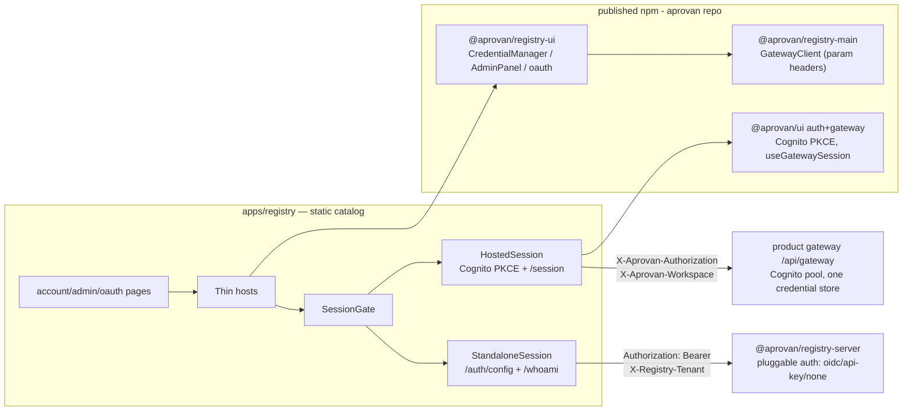

# registry-standalone-credentials — Tech Plan

## Context

- The moved-notice is a **runtime fork, not a stub**: `apps/registry/src/pages/account/
  credentials.astro:12` renders the real `CredentialsHost` when `isLocalAccountHost()`
  (i.e. `PUBLIC_ACCOUNT_HOST=local`, via `gateway-session.ts:86-90`), else `MovedNotice`.
  Same fork on `admin/permissions.astro` and `account/oauth-callback.astro`;
  `auth/callback.astro` is an unconditional stub.
- The UI is already host-agnostic: `@aprovan/registry-ui` `CredentialManager` /
  `AdminPanel` / OAuth helpers take an injected `GatewayClient`
  (`@aprovan/registry-main`). Catalog hosts (`CredentialsHost.tsx`, `AdminHost.tsx`,
  `OAuthCallbackHost.tsx`) are thin wrappers over `SessionGate.tsx`.
- `SessionGate` today only knows the legacy local gateway: sessionStorage token/workspace
  with an auth-none sentinel + `GET /session` workspace picking. Cognito on the catalog was
  deleted (old `lib/auth.ts` wrapped `@aprovan/ui/auth` PKCE; `registry-deploy.yml` still
  passes `PUBLIC_COGNITO_*` vars; `https://aprovan.com/registry/auth/callback` is still a
  registered redirect URI on the shared pool — aprovan `infra/aws/aws/src/stacks/main.ts:171`).
- `@aprovan/registry-server` (registry repo `packages/registry-server`) serves
  `/credentials` CRUD, `/profiles` (+grants), `/api-keys`, `/audit` behind pluggable auth
  adapters (`auth/adapters.ts`: `none` | `oidc` | `api-key`) — but has **no** `/session`,
  no `/members`, no `/groups`, and authenticates every route except `/healthz`. A browser
  cannot currently discover its auth mode.
- Header mismatch: registry-main `GatewayClient` hardcodes `Authorization` +
  `X-Aprovan-Workspace`. The hosted path needs `X-Aprovan-Authorization` (CloudFront OAC
  overwrites `Authorization`); the standalone path needs `Authorization` +
  `X-Registry-Tenant`.
- Registry branch `product-plane-removal` (HEAD c4faba8, worktree
  `/private/tmp/registry-product-plane-split`, marked "DO NOT MERGE until cutover") deletes
  the catalog hosts, SessionGate, and account pages. **This change supersedes that branch.**
- Gate: IW-0 `execution-plane-unfork` — the standalone target is the *published*
  `@aprovan/registry-server`, and aprovan consumes it from npm, not its fork.

## Goals / Non-Goals

**Goals:**

- One session abstraction on the catalog with two build-time modes (hosted/standalone);
  hosts stay mode-agnostic.
- Additive discovery surface on registry-server (`/auth/config`, `/whoami`) published as a
  semver-minor.
- Parameterized transport in `@aprovan/registry-main` so one client serves both header
  regimes.
- Capability-driven `AdminPanel` composition so one admin component serves two backends
  with different endpoint sets.
- Clean disposition of `product-plane-removal`.

**Non-Goals:**

- No credential/profile backend changes; no new storage.
- No product-gateway (workspace server) route changes — hosted mode uses only endpoints
  that exist today (`/session`, `/credentials`, `/members`, `/groups`, `/permissions`).
- No SSR/auth on the catalog server side — the catalog stays a static Astro site; all auth
  is browser-side.

## Architecture



Component responsibilities:

- **SessionGate** (catalog): the single UI gate; owns non-ready states; renders children
  with a ready `GatewayClient`. Selects the session engine from `PUBLIC_SESSION_MODE`.
- **HostedSession** (catalog `lib/session/hosted.ts`): Cognito PKCE via `@aprovan/ui/auth`
  (restored from git history, commit `51e9ab1` shape), workspace resolution via
  `@aprovan/ui/gateway` `useGatewaySession`, widget client with hosted headers.
- **StandaloneSession** (catalog `lib/session/standalone.ts`): fetches `/auth/config`,
  drives none/api-key/oidc sign-in, identity via `/whoami`, widget client with standalone
  headers.
- **registry-server http/router.ts**: two additive routes; `browserClientId` config
  passthrough.
- **registry-main GatewayClient**: transport only; gains optional header overrides.
- **registry-ui AdminPanel**: gains `capabilities` prop; sections render conditionally.

## Decisions

### D1: Build-time mode flag `PUBLIC_SESSION_MODE`, defaulting to standalone

- **Choice**: Replace the tri-state `PUBLIC_ACCOUNT_HOST` (`local`/`chat`/DEV-sniffing)
  with `PUBLIC_SESSION_MODE=hosted|standalone`, default `standalone`. Only the
  aprovan-operated deploy (`registry-deploy.yml`) sets `hosted`. Delete `MovedNotice`,
  `chatNativeUrl`, `account-host.ts`.
- **Alternatives**:
  - *Runtime detection* (probe `/auth/config`, fall back to hosted if 404) — lost: the
    hosted product gateway could plausibly grow the same endpoint via the embedded server,
    making detection ambiguous; and Cognito config is build-time anyway (PUBLIC_ env).
  - *Keep `PUBLIC_ACCOUNT_HOST` with a third value* — lost: its `chat` semantics (stub the
    page) are exactly what this change abolishes; a renamed flag makes the retirement
    grep-able.
- **Revisit if**: the catalog ever needs one build artifact serving both modes (then move
  mode into a runtime config JSON fetched at boot).

### D2: One `SessionGate`, two session engines behind a common state machine

- **Choice**: Keep the existing `SessionGate` component as the single gate; extract a
  `CatalogSession` interface (state machine + `getClient()`) with `HostedSession` and
  `StandaloneSession` implementations. Hosts keep their current one-liner shape.
- **Alternatives**:
  - *Two gates, pages pick per mode* — lost: pushes the fork back into every page, the
    exact pattern being removed.
  - *Move the session layer into `@aprovan/registry-ui`* — lost: hosted sign-in depends on
    `@aprovan/ui/auth` and catalog env resolution; the standalone flow depends on
    registry-server discovery. The gate is host-glue by nature; registry-ui stays
    session-agnostic (it already only takes a client).
- **Revisit if**: a third host (e.g. the desktop app) needs the standalone engine — then
  lift `StandaloneSession` (not the gate UI) into a published package.

### D3: Discovery endpoints on registry-server (`GET /auth/config` public, `GET /whoami` authed)

- **Choice**: Add exactly two routes. `/auth/config` joins `/healthz` in the middleware
  exemption and advertises `{mode, oidc?: {issuer, audience, browserClientId?}}`;
  `/whoami` returns the resolved `CallContext` projection. OIDC config grows optional
  `browserClientId` (advertising only; verification unchanged).
- **Alternatives**:
  - *No discovery; duplicate auth config into catalog env vars* — lost: every standalone
    operator would maintain the same facts twice, and mode drift produces confusing 401s
    instead of a correct sign-in UI.
  - *401-probe heuristics* (infer mode from `WWW-Authenticate`-ish behavior) — lost:
    adapters return uniform JSON 401s; mode is not inferable, and probing can't surface a
    PKCE client id at all.
  - *Full `/session` parity with the product gateway* — lost: registry-server has no
    workspace concept; faking one violates "registry stays app-ignorant".
- **Revisit if**: standalone ever needs server-side sessions (cookies) — then a real
  session resource, not an extension of `/whoami`.

### D4: Parameterize transport headers on `@aprovan/registry-main` `GatewayClient`

- **Choice**: Extend `GatewayClientOptions` with optional `authHeader` (default
  `"Authorization"`, value `Bearer <token>`) and `scopeHeader` (default
  `"X-Aprovan-Workspace"`). Hosted catalog passes
  `{authHeader: "X-Aprovan-Authorization"}`; standalone passes
  `{scopeHeader: "X-Registry-Tenant"}`. Backwards-compatible defaults; semver-minor.
- **Alternatives**:
  - *A second client class for registry-server* — lost: registry-ui components type
    against `GatewayClient`; two clients means a union type or duplication through the
    whole UI package.
  - *Wrap `fetch` at the host and rewrite headers* — lost: invisible magic around a
    documented CloudFront quirk; the quirk deserves a named option (mirrors
    `@aprovan/ui/gateway`'s existing `authHeader` design).
- **Revisit if**: registry-main and `@aprovan/ui/gateway` clients are ever merged (they
  should be — but that consolidation is not this change).

### D5: Capability-driven `AdminPanel`, scoped per backend

- **Choice**: `AdminPanelProps` gains
  `capabilities: ReadonlyArray<"members" | "groups" | "permissions" | "api-keys" |
  "profiles" | "audit">`. Default (absent) = current hosted set
  `["members","groups","permissions"]` so the workspace app is untouched. The catalog's
  `AdminHost` passes the hosted set in hosted mode and
  `["api-keys","profiles","audit"]` in standalone mode. New sections (api-keys mint/revoke,
  profiles + grants, audit log) are added to registry-ui against existing registry-server
  routes.
- **Alternatives**:
  - *Separate `StandaloneAdminPanel`* — lost: violates "one UI everywhere"; the sections
    are shared building blocks either way.
  - *Runtime 404-probing to hide sections* — lost: noisy error requests, indistinguishable
    from real failures, untestable acceptance criteria.
- **Revisit if**: IW-4/WS-6 lands group→profile wiring on the product gateway — then
  `profiles` simply joins the hosted capability list.

### D6: `product-plane-removal` is abandoned, not reworked

- **Choice**: The branch is superseded by this change and dies: close its PR as
  superseded (pointing here), delete the local worktree
  `/private/tmp/registry-product-plane-split`, delete local + remote branch. Salvage
  audit: its only non-deletion content ("consume published UI packages", `llm-compat.ts`,
  `MovedNotice.astro`) is already independently on `main`; nothing to cherry-pick.
- **Alternatives**:
  - *Merge it first, then rebuild surfaces* — lost: deletes and re-adds the same files in
    consecutive changes; churn with zero benefit and a window where standalone is broken.
  - *Rework it into this change's implementation branch* — lost: ~90% of its diff is the
    opposite of this change's direction; starting from `main` is strictly cheaper.
- **Revisit if**: an unmerged commit on it turns out to hold unique fixes (the salvage
  audit task guards this).

### D7: OAuth callback stays catalog-owned at `${base}/account/oauth-callback`

- **Choice**: Both modes initiate provider OAuth with redirect URI
  `${origin}${base}/account/oauth-callback` and complete it by POSTing the
  `oauth2_authcode` payload to the active session's `/credentials`. No server-side
  callback handling.
- **Alternatives**:
  - *Route hosted callbacks through the workspace app's callback page* — lost: cross-app
    redirect loses the pending-flow sessionStorage state (same-origin path but different
    app shell), and the catalog page already exists.
- **Revisit if**: a provider requires a confidential-client token exchange that can't run
  browser-side — that exchange already belongs to registry-server's `credentials/oauth.ts`,
  not the page.

## Interfaces & Data

**1. `GET /auth/config` (registry-server, public):**

```ts
type AuthConfigResponse = {
  mode: "oidc" | "api-key" | "none";
  oidc?: { issuer: string; audience: string; browserClientId?: string };
};
```

**2. `GET /whoami` (registry-server, authenticated):**

```ts
type WhoamiResponse = {
  principal: string;          // Authn.sub ("local" in auth-none)
  tenantId: string;
  role: "admin" | "member";
  groupIds: string[];
  mode: "oidc" | "api-key" | "none";
};
```

Server config delta (`config/types.ts`): the `auth` union's oidc member grows
`browserClientId?: string`.

**3. `@aprovan/registry-main` `GatewayClientOptions` (additive):**

```ts
interface GatewayClientOptions {
  baseUrl: string;
  getToken?: () => string | undefined | Promise<string | undefined>;
  getWorkspaceId?: () => string | undefined;   // value for scopeHeader
  authHeader?: string;   // default "Authorization"; value `Bearer ${token}`
  scopeHeader?: string;  // default "X-Aprovan-Workspace"
}
```

**4. `@aprovan/registry-ui` `AdminPanelProps` (additive):**

```ts
type AdminCapability = "members" | "groups" | "permissions" | "api-keys" | "profiles" | "audit";
interface AdminPanelProps {
  client: GatewayClient;
  capabilities?: ReadonlyArray<AdminCapability>; // default: ["members","groups","permissions"]
}
```

New registry-ui admin API calls (existing registry-server routes): `GET/POST /api-keys`,
`DELETE /api-keys/:id`, `GET/POST/PATCH/DELETE /profiles`, `GET/POST/DELETE
/profiles/:id/grants`, `GET /audit`.

**5. Catalog session contract (`apps/registry/src/lib/session/types.ts`):**

```ts
type SessionMode = "hosted" | "standalone";

type CatalogSessionState =
  | { status: "loading" }
  | { status: "signin"; method: SigninMethod }         // see below
  | { status: "select-scope"; workspaces: WorkspaceSummary[] } // hosted only
  | { status: "ready"; client: GatewayClient;          // widget client, correct headers
      scope: { kind: "workspace" | "tenant"; id: string };
      identity: { principal: string; role: string } }
  | { status: "error"; message: string };

type SigninMethod =
  | { kind: "cognito" }                                  // hosted
  | { kind: "oidc-pkce"; issuer: string; clientId: string } // standalone, advertised client
  | { kind: "token" }                                    // standalone bearer/API-key entry
  | { kind: "none" };                                    // transient; auto-advances

interface CatalogSession {
  state: CatalogSessionState;               // exposed via a React hook
  signIn(input?: { token?: string; tenant?: string }): Promise<void>;
  selectScope(id: string): Promise<void>;
  signOut(): void;
  retry(): void;
}
```

**6. Env contract (catalog build):**

| Var | Modes | Meaning |
|---|---|---|
| `PUBLIC_SESSION_MODE` | both | `hosted` \| `standalone` (default `standalone`) |
| `PUBLIC_GATEWAY_URL` | both | gateway base; fallback: dev `http://localhost:4000`, prod `/api/gateway` |
| `PUBLIC_COGNITO_AUTHORITY` / `PUBLIC_COGNITO_CLIENT_ID` | hosted | shared-pool PKCE |
| `PUBLIC_ACCOUNT_HOST` | — | **deleted** |

sessionStorage keys keep the existing `utdk_gateway_token` / `utdk_gateway_workspace`
names (standalone stores the tenant id in the second slot; sentinel `__local__` retained
for auth-none).

## Risks / Trade-offs

- [CloudFront OAC overwrites `Authorization`, silently breaking hosted calls] → D4 makes
  the header an explicit client option; hosted smoke test asserts a live authenticated
  call through `/api/gateway`.
- [Standalone OIDC PKCE fails in practice (issuer CORS, token-endpoint restrictions)] →
  paste-a-token is always offered as fallback (spec'd); PKCE is advertised-opt-in via
  `browserClientId`.
- [Version skew: catalog needs unpublished registry-ui/registry-main features] → strict
  landing order (Rollout); catalog pins `^0.6.0` / `^0.2.0` minimums and CI builds from
  npm only.
- [AdminPanel default change regresses the workspace app panel] → `capabilities` defaults
  to the exact current set; workspace app passes nothing and is unchanged (registry-ui
  tests cover the default).
- [`/auth/config` leaks operator info] → response is limited to mode + already-public OIDC
  facts (issuer/audience/public client id); spec forbids secrets; unit test asserts shape.
- [Branch deletion loses unmerged work] → salvage audit task diffs `product-plane-removal`
  against `main` before deletion.

## Rollout

1. **Registry repo** — registry-server discovery endpoints (+`browserClientId` config);
   publish `@aprovan/registry-server` minor. (Requires IW-0 complete so the published
   package is the single source.)
2. **Aprovan repo** — registry-main header options (minor), registry-ui admin capabilities
   + new sections (minor); publish both. No workspace-app changes ride along.
3. **Registry repo** — catalog session layer + surface un-forking, consuming the published
   versions; standalone is now live-by-default for any build.
4. **Hosted flip** — set `PUBLIC_SESSION_MODE=hosted` (replacing `PUBLIC_ACCOUNT_HOST`) in
   `registry-deploy.yml` repo vars; deploy; smoke: Cognito SSO + credential round-trip
   against the product gateway. Rollback = redeploy the previous catalog build (static
   site; no server or data migration anywhere in this change).
5. **Branch disposition** — salvage audit, then close PR / delete
   `product-plane-removal` branch + `/private/tmp/registry-product-plane-split` worktree.

## Open Questions

1. **PKCE fallback UX** (mirrors PRD Q1): when `browserClientId` is absent, is
   paste-a-token acceptable as the *only* OIDC path? _Recommendation: yes for this change;
   an `aprovan`-CLI "mint me a token" helper can come later._
2. **Should `/auth/config` also report server version/capabilities** (e.g. whether
   profile grants are available, for the 501-on-dynamo case)? _Recommendation: not now —
   AdminPanel capability lists are host-declared (D5); add a capabilities field only when
   a real consumer needs runtime narrowing._
