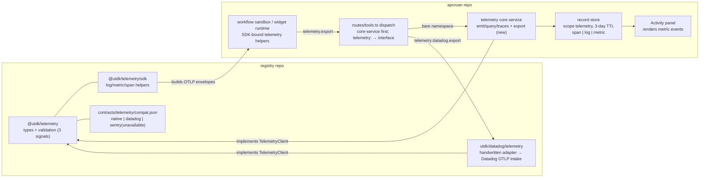

# Tech Plan — telemetry-contract-v2 (IW-5)

## Context

- `registry/packages/contracts/telemetry/index.ts` (285 LOC, `@utdk/telemetry@0.2.0`,
  frozen per `AUDIT.md`): single `export` op over the OTLP/HTTP JSON subset for spans and
  logs. `resourceMetrics` present ⇒ 501 (`validateExportArgs`, :182-184). Attribution
  helpers `withAttribution` + `ATTR_TENANT/PRINCIPAL/SOURCE` (`aprovan.*` resource
  attributes). `telemetryToolEntries` emits the one discovery entry. No `compat.json` —
  zero implementers.
- `aprovan/server/workspace/src/telemetry/service.ts` (445 LOC): the native `telemetry`
  core service — `emit/query/traces` over the record store (scope `telemetry`, 3-day TTL,
  `TelemetryEvent` with `kind: "span" | "log"`), server-stamped `source.app` for app
  sessions, app sessions read only their own stream. `routes/tools.ts` auto-instruments
  every `/tools` dispatch via `recordTelemetry` (server is the single writer of dispatch
  spans; `X-Telemetry-Source` carries client attribution).
- Dispatch order in `routes/tools.ts` `POST /:provider/:operation`: **core services first**
  (`getCoreService`), then interface-namespace resolution (`parseInterfaceNamespace` →
  compat entry → module, with the `agent`/`native` in-process short-circuit precedent).
  Named instances (`sql:analytics`) reach the interface machinery because the colon form is
  never a core-service id.
- `registry/packages/registry-server/src/telemetry/index.ts` is Decision 9 plane 2
  (built-in attributed OTLP instrumentation) — untouched here.
- Adapter precedent: `packages/utdk/github/vcs/` — a handwritten suite module implementing
  `@utdk/vcs` against GitHub; `contracts/agent/compat.json` shows the credentialless
  `native` default entry.
- `@utdk/datadog` and `@utdk/sentry` are generated OpenAPI providers; neither implements
  the telemetry contract. The existing `AUDIT.md` already mapped `export` onto Datadog's
  OTLP intake (adapter = split payload, attach `DD-API-KEY`, POST — zero shape
  translation).
- Boundary status: aprovan still carries a forked byte-copy of `packages/contracts/*`
  (improve-findings §0); `@utdk/*` resolve as `workspace:*` from the fork until IW-0 lands.

## Goals / Non-Goals

**Goals:**

- Three-signal contract surface in `@utdk/telemetry`: add an OTLP metrics subset
  (gauge/sum/histogram), lift the 501, keep the whole payload postable to any OTLP
  collector unmodified; re-audit and freeze at 0.3.0.
- Zero-dependency SDK helper layer in the contract package (`@utdk/telemetry/sdk`) that
  runs in Node, QuickJS, and the browser.
- `compat.json` for the telemetry interface: native credentialless default, `datadog`
  (handwritten `datadog/telemetry` adapter, built here), `sentry` declared unavailable.
- Native service registered as the default implementation: `telemetry.export` accepted by
  the core service, OTLP flattened into activity-store events (incl. new `metric` kind);
  vendor egress via named instances (`telemetry:datadog.export`) with no dispatch changes.
- SDK wired into the workflow sandbox and widget runtime as the ergonomic path to
  `telemetry.export`.

**Non-Goals:**

- No contract-level query/read surface; no changes to `emit/query/traces` shapes beyond
  the metric kind; no dispatch-instrumentation changes; no plane-2/plane-3 (registry-server
  OTLP, PostHog/operator) work; no Activity panel redesign; no retention changes.

## Architecture



One write op (`export`), two destinations: the bare `telemetry` namespace is the native
implementation (workspace activity store); a named instance is a vendor exporter resolved
through the existing interface machinery. Reads (`query`/`traces`) exist only on the native
namespace. The SDK is a pure envelope-builder over one injected `export` function — it
neither knows nor cares which destination it was handed.

## Decisions

### D1: Metrics ride the OTLP JSON subset — gauge, sum, histogram only

- **Choice**: Add `OtlpResourceMetrics`/`OtlpMetric` types accepting exactly three data
  shapes (`gauge`, `sum` with `aggregationTemporality` + `isMonotonic`, `histogram` with
  bounds/bucket counts), number points as OTLP JSON (`asDouble` number / `asInt` string,
  `timeUnixNano` string). Validation mirrors the existing span/log style; the D7 invariant
  (payload posts to any collector unmodified) is preserved and re-audited.
- **Alternatives**: Full OTLP metrics (exponential histogram, summary) — rejected: the SDK
  cannot usefully emit them, validation cost is real, and the reserved-field pattern
  already gives us a forward path. A simplified custom metric shape (`{name, value}`) —
  rejected: breaks D7; the payload would need translation at every egress.
- **Revisit if**: a real provider adapter needs exponential histograms or summaries.

### D2: The SDK is a zero-dependency subpath of the contract package

- **Choice**: `@utdk/telemetry/sdk` — pure functions + a small buffering facade
  (`createTelemetry`) over the OTLP shapes. Only Web-platform APIs
  (`crypto.getRandomValues`, `Date.now`); no `@opentelemetry/*` imports; runs identically
  in Node, the QuickJS workflow sandbox, and the browser widget runtime. One package is the
  single install for contract authors and app authors alike.
- **Alternatives**: The official OpenTelemetry JS SDK — rejected: heavyweight, Node-centric
  exporter/processor machinery, unusable in QuickJS, and its API surface dwarfs the three
  helpers we need. A separate `@utdk/telemetry-sdk` package — rejected: a second publish
  target and version to keep in lockstep, for no isolation benefit (the helpers are pure).
- **Revisit if**: the SDK grows stateful processors/exporters that don't belong in a
  contract package.

### D3: Bare `telemetry` is always native; vendor egress is a named instance

- **Choice**: The default instance is reserved for the native implementation. Core-service
  dispatch precedence already sends `telemetry.*` to the native service, and the
  `credentialless` native compat entry means zero-config interface resolution gives the
  same answer — the two mechanisms agree by construction. Vendor egress is always explicit:
  bind `telemetry:datadog` (interface instance → profile row) and call
  `telemetry:datadog.export`. Named instances never resolve to native. No changes to
  `routes/tools.ts` dispatch are needed — the colon form already bypasses the core-service
  branch and reaches the interface machinery.
- **Alternatives**: Native `export` forwards to a bound vendor when one exists — rejected:
  hidden egress behind an implicit binding; the Activity panel silently goes dark and a
  workspace admin can't see where signals went. Convert `telemetry` into a pure interface
  with an agent-style native short-circuit — rejected: it rewrites working dispatch,
  app-scope (confused-deputy) enforcement, and discovery for zero user-visible gain.
- **Revisit if**: users demand transparent tee/redirect of the default stream — that is a
  sync-pipeline feature, not a binding trick.

### D4: The native implementation flattens OTLP into activity-store events

- **Choice**: `telemetry.export` validates with the contract's `validateExportArgs`, then
  flattens envelopes into the existing `TelemetryEvent` shape (span→`span`,
  logRecord→`log`, metric data point→new `metric` kind), truncating per existing caps and
  server-stamping `source.app` exactly as `emit` does. One storage shape means
  `query`/`traces` and the Activity panel work on exported events with no second read
  path.
- **Alternatives**: Store raw OTLP documents — rejected: every reader (query, traces,
  panel, agents) speaks `TelemetryEvent`; raw storage forces dual-format reads or a
  translation at query time, the expensive side of the seam. Don't accept `export`
  natively (emit stays the only native write) — rejected: then the native service isn't an
  implementation of the contract at all, and the SDK would need a native-vs-vendor switch.
- **Revisit if**: the activity store moves to an OTLP-native backend (e.g. ClickHouse) —
  then flattening inverts.

### D5: Datadog is the exemplar adapter; Sentry is honestly unavailable

- **Choice**: Build handwritten `packages/utdk/datadog/telemetry/` (the `github/vcs`
  pattern): `createDatadogTelemetryClient({ headers, baseUrl?, fetchImpl? })` implementing
  `TelemetryClient` — split args into `/v1/traces`, `/v1/logs`, `/v1/metrics` bodies, POST
  to Datadog's OTLP intake with `DD-API-KEY` taken from the injected credential
  (`secretFromHeaders`), merge partial-success responses. The audit already established
  zero shape translation. `compat.json` lists it available; `sentry` gets an `unavailable`
  entry ("Sentry's OTLP ingestion is trace-focused and DSN-keyed; a logs/metrics mapping
  does not exist") so the catalog stays truthful.
- **Alternatives**: A generic `otlp` collector pseudo-provider — rejected for this change:
  credentials are keyed by concrete provider; a provider that is "any URL" makes the
  credential page and catalog entry unanswerable, and plane 2 already covers
  collector-level export for the deployment. Adapt the generated `@utdk/datadog` OpenAPI
  module — rejected: its surface is Datadog's native intake API, not OTLP; the mapping
  would be shape translation, exactly what D7 exists to avoid.
- **Revisit if**: self-hosted-collector demand shows up in plane 1 — a generic `otlp`
  entry would then need its own credential story (likely `credentialless` + baseUrl
  binding option).

### D6: Attribution is SDK-stamped for egress, server-stamped for truth

- **Choice**: The SDK applies `{tenant?, principal?, source?}` via `withAttribution` to
  every batch it builds — for vendor egress these are best-effort claims carried as
  `aprovan.*` resource attributes. The native implementation continues to treat
  client-supplied attribution as advisory: app sessions get `source.app` server-stamped,
  and dispatch spans remain server-written only.
- **Alternatives**: Gateway rewrites attribution on vendor egress — rejected: dispatch
  does not parse module payloads today, and starting to would couple the executor to one
  contract's body shape. Trusting client attribution natively — rejected: reopens the
  confused-deputy hole the service explicitly closed.
- **Revisit if**: vendor egress needs verifiable attribution (signed claims) — an ADR-level
  change.

### D7: Version and repo choreography — registry-first, fork mirrors verbatim

- **Choice**: All contract work (types, SDK, compat.json, adapter, AUDIT extension) lands
  in the **registry repo**; `@utdk/telemetry` bumps to **0.3.0** when the extended audit
  closes. Aprovan-side work consumes the contract via its existing `workspace:*` resolution
  — pre-IW-0 that is the forked `aprovan/packages/contracts/telemetry`, which MUST be a
  verbatim copy of the registry package (registry is upstream; the fork carries no local
  edits). Post-IW-0 the dependency flips to published npm with no code change.
- **Alternatives**: Wait for IW-0 — rejected: IW-5 is declared free, and verbatim
  mirroring keeps it so. Land contract changes aprovan-side first — rejected: inverts the
  one-way rule and deepens the split-brain called out in improve-findings §0.
- **Revisit if**: IW-0 lands mid-implementation — drop the mirror step and consume npm.

## Interfaces & Data

### Contract additions (`@utdk/telemetry`, registry repo)

```ts
// OTLP JSON metrics subset — field names/casing exactly as OTLP JSON.
export interface OtlpNumberDataPoint {
  timeUnixNano: string;
  startTimeUnixNano?: string;
  asDouble?: number;
  asInt?: string;            // OTLP JSON: 64-bit ints as strings
  attributes?: OtlpKeyValue[];
}
export interface OtlpHistogramDataPoint {
  timeUnixNano: string;
  startTimeUnixNano?: string;
  count: string;
  sum?: number;
  bucketCounts: string[];
  explicitBounds: number[];
  attributes?: OtlpKeyValue[];
}
export interface OtlpMetric {
  name: string;
  description?: string;
  unit?: string;
  // Exactly one of:
  gauge?: { dataPoints: OtlpNumberDataPoint[] };
  sum?: { dataPoints: OtlpNumberDataPoint[]; aggregationTemporality: 1 | 2; isMonotonic?: boolean };
  histogram?: { dataPoints: OtlpHistogramDataPoint[]; aggregationTemporality: 1 | 2 };
}
export interface OtlpResourceMetrics {
  resource?: OtlpResource;
  scopeMetrics: Array<{ scope?: { name: string; version?: string }; metrics: OtlpMetric[] }>;
}

export interface TelemetryExportArgs {
  resourceSpans?: OtlpResourceSpans[];
  resourceLogs?: OtlpResourceLogs[];
  resourceMetrics?: OtlpResourceMetrics[];   // 501 reservation lifted
}
export interface TelemetryExportResult {
  accepted: { spans: number; logs: number; metrics: number };  // metrics = data points
  rejected?: { spans: number; logs: number; metrics: number; message: string };
}
```

`validateExportArgs`: at least one of the three arrays non-empty (else 400); a metric with
zero or ≥2 data shapes is 400; unknown top-level keys other than the three are ignored as
today. `MAX_EXPORT_BYTES` unchanged. `telemetryToolEntries` description/schema mention all
three arrays.

### SDK surface (`@utdk/telemetry/sdk`)

```ts
export interface TelemetrySdkOptions {
  /** The one seam: where batches go (native or a vendor instance's export). */
  export: (args: TelemetryExportArgs) => Promise<TelemetryExportResult>;
  attribution?: { tenant?: string; principal?: string; source?: string };
  resourceAttributes?: OtlpKeyValue[];
  scope?: { name: string; version?: string };
  /** Auto-flush threshold (events) and interval (ms); flush() always available. */
  maxBatch?: number;          // default 100
  flushIntervalMs?: number;   // default 5000; 0 = manual flush only
  onError?: (err: unknown) => void;  // export failures never throw into app code
}
export interface SpanHandle {
  readonly traceId: string;          // 32-hex, generated
  readonly spanId: string;           // 16-hex, generated
  setAttribute(key: string, value: string | number | boolean): void;
  addEvent(name: string, attributes?: Record<string, string | number | boolean>): void;
  end(status?: { error?: string }): void;
}
export interface TelemetrySdk {
  log(level: "debug" | "info" | "warn" | "error", message: string,
      attributes?: Record<string, string | number | boolean>): void;
  counter(name: string, value?: number, attributes?: Record<string, string>): void;   // monotonic sum, delta
  gauge(name: string, value: number, attributes?: Record<string, string>): void;
  histogram(name: string, value: number, attributes?: Record<string, string>): void;  // client-side bucketing, default bounds
  startSpan(name: string, options?: { parent?: SpanHandle; kind?: 1|2|3|4|5 }): SpanHandle;
  withSpan<T>(name: string, fn: (span: SpanHandle) => Promise<T> | T): Promise<T>;
  flush(): Promise<TelemetryExportResult | undefined>;
}
export function createTelemetry(options: TelemetrySdkOptions): TelemetrySdk;
// Also exported standalone: newTraceId(), newSpanId(), nowUnixNano()
```

Helpers assemble valid OTLP envelopes (ids hex, times as nano strings), fold attribution
into the resource via `withAttribution`, and batch. Logs opened inside `withSpan` carry the
active `traceId`/`spanId`.

### Compat data (`contracts/telemetry/compat.json`)

```json
{
  "schemaVersion": 1,
  "interface": {
    "id": "telemetry",
    "label": "Telemetry",
    "description": "Export logs, metrics, and traces in the OTLP/HTTP JSON encoding. The default is the workspace's own activity store (query/traces stay native); vendor backends are bound as named instances (telemetry:datadog).",
    "timeoutMs": 30000,
    "defaultsFor": []
  },
  "compat": [
    { "provider": "native", "label": "Workspace activity store", "module": "native", "credentialless": true },
    { "provider": "datadog", "label": "Datadog (OTLP intake)", "module": "datadog/telemetry" },
    { "provider": "sentry", "label": "Sentry", "module": "sentry/telemetry",
      "unavailable": "Sentry's OTLP ingestion is trace-focused and DSN-keyed; a logs/metrics mapping does not exist yet." }
  ]
}
```

### Native service additions (aprovan, `server/workspace/src/telemetry/service.ts`)

```ts
// TelemetryEvent gains the third kind:
kind: "span" | "log" | "metric";
// metric fields (kind === "metric"):
name: string;            // metric name
metricType?: "counter" | "gauge" | "histogram";
value?: number;          // point value; histogram stores sum
unit?: string;
```

New procedure `export` (tool `telemetry.export`, discovery entry from
`telemetryToolEntries` reused): args = `TelemetryExportArgs`, validated by the contract;
flattening rules — each OTLP span → one `span` event (`traceId`/`spanId` carried through,
duration from the nano timestamps, status code 2 → `status:"error"` with message); each
log record → one `log` event (severityText → level, body string → message); each metric
data point → one `metric` event. Existing caps apply (`BATCH_CAP` counts flattened events;
over-cap ⇒ 400 as `emit` does). Returns the contract's `TelemetryExportResult`. App-session
provenance stamping and read scoping identical to `emit`.

### Dispatch & discovery (aprovan, `routes/tools.ts`)

- Bare `telemetry.*`: unchanged core-service branch — `export` is just a new procedure.
- `telemetry:<name>.*`: existing interface machinery resolves compat → `datadog/telemetry`
  module; only `export` exists there. Discovery lists bound telemetry instances via
  `telemetryToolEntries(namespace)`.
- `INTERFACE_ONLY_PROVIDERS` and namespace description handling updated so `native`
  telemetry compat never appears as a connectable vendor (same handling as `agent`).

### SDK wiring (aprovan)

- Workflow sandbox: the `telemetry` namespace proxy gains an SDK-constructed facade —
  `createTelemetry({ export: (args) => telemetry.export(args) })` pre-bound with the run's
  source attribution; exposed alongside raw ops.
- Widget runtime: same facade over the widget's tool-call bridge.

## Risks / Trade-offs

- [Fork drift: contract edits mirrored into aprovan's forked `packages/contracts/telemetry`
  diverge] → D7: registry-first, verbatim copy, and the tasks carry a diff check
  (`diff -r`) as the Verify step; IW-0 deletes the mirror entirely.
- [OTLP metrics subset too narrow for a real backend] → the audit extension maps the
  subset against the same three intakes before the 0.3.0 freeze; reserved-pattern fallback
  (unknown shapes 400 with a named reason) keeps failure legible.
- [Flattened metrics make the activity store chatty (per-point events)] → SDK batches and
  the 3-day TTL bounds growth; `BATCH_CAP`/`SCAN_CAP` already bound writes and reads;
  metrics from workflows are advisory evidence, not a metrics platform.
- [Datadog adapter has no live credential in CI] → unit tests run against an injected
  `fetchImpl` (the `github/vcs` test pattern); live verification joins the IW/WS e2e bench
  (Decision 10) rather than gating merge.
- [SDK buffering loses events on abrupt sandbox teardown] → `flush()` is awaited by the
  workflow runner at run end; widget runtime flushes on visibility change; loss beyond
  that is accepted (telemetry is evidence, not audit).

## Rollout

1. **Registry repo**: contract types/validation + SDK + tests → `compat.json` →
   `datadog/telemetry` adapter + tests → `AUDIT.md` extension → bump `@utdk/telemetry` to
   0.3.0 (CI publish list already covers it).
2. **Aprovan repo**: mirror the contract package verbatim into the fork (skip if IW-0 has
   landed; then bump the npm dep instead) → native `export` + metric kind → dispatch/
   discovery touches → SDK wiring → Activity panel metric rendering.
3. Rollback: revert aprovan-side commits independently; the contract addition is additive
   (old two-signal payloads remain valid), so registry-side rollback is a version pin.
   Stored `metric` events age out in 3 days by TTL — no migration either direction
   (nuke-and-reseed posture).

## Open Questions

- **Histogram bucketing in the SDK**: default explicit bounds (proposed:
  `[5, 10, 25, 50, 100, 250, 500, 1000, 2500, 5000, 10000]`, ms-oriented) — acceptable, or
  should `histogram()` take caller bounds? Recommendation: default bounds + optional
  per-instrument override at `createTelemetry` time; per-call bounds invite mixed-bucket
  series.
- **Should the workflow runner auto-flush the SDK facade at run end even on error paths?**
  Recommendation: yes — telemetry from failed runs is precisely the telemetry someone
  wants; wrap in try/finally with a 2s flush budget.
- **`sentry/telemetry` module name reserved in compat now?** Recommendation: yes (the
  `unavailable` entry names it), matching the `bitbucket/vcs` precedent — the catalog
  shows the commitment without promising code.
