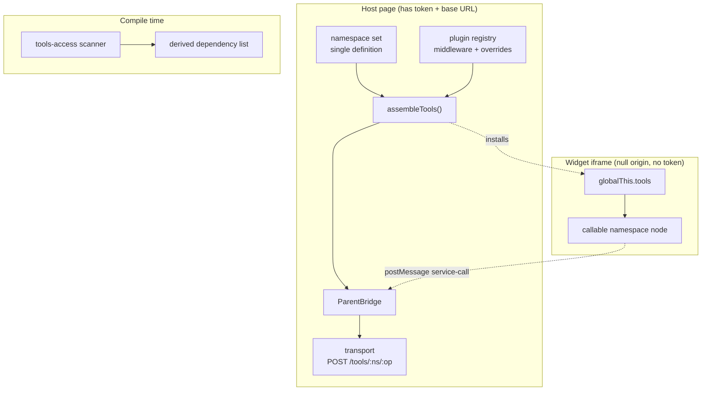

## Context

Service access today has three parallel mechanisms that are supposed to be one thing. The compiler installs ~20 bare globals on the sandbox window (`mount/bridge.ts`), an esbuild plugin claims matching bare import specifiers and rewrites them to read those globals (`transforms/namespaces.ts`), and the workflow sandbox does the same job with a two-regex string rewrite (`registry-server/src/sandbox/quickjs.ts`). The list of names to install is defined in three places with two different values (`packages/compiler/src/namespace-core.ts`, `server/workspace/src/apps/capabilities.ts`, `packages/ui/src/apps-store/wire.ts`).

Four namespace-proxy implementations exist: the host-side field-access proxy, the string-generated iframe proxy, the app SDK shim's proxy, and `@aprovan/runtime`'s `createNamespaceProxy`. All build the same dotted path and POST to the same route.

The gateway already publishes the taxonomy this change needs: `GET /tools/namespaces` returns `kind: "core" | "interface" | "provider" | "llm-alias"`, and `client/web/src/lib/namespaces.ts` already groups by it.

## Goals / Non-Goals

**Goals:**
- One installed global; one definition of the namespace set; one proxy implementation reachable from the compiler.
- Namespace nodes callable for configuration without reserving any operation name.
- Dependency derivation from source, with dynamic access reported rather than hidden.
- Both package renames and all resulting import churn contained in this change, so no other change in the wave touches the same files.

**Non-Goals:**
- Profile/instance addressing, interface routing, typechecking, output schemas — separate changes.
- Any migration path for existing workspace content.

## Architecture



- **namespace set** — the single module naming the namespaces a host installs. Replaces three copies.
- **plugin registry** — host-side table of middleware (transport decorators) and overrides (per-namespace resolvers). Populated before any sandbox exists.
- **assembleTools()** — builds the `tools` object from the namespace set, the plugin registry, and a transport. The only thing that ever constructs a namespace proxy.
- **callable namespace node** — a Proxy that is both invocable (configure → return node) and traversable (property path → operation).
- **tools-access scanner** — static pass over source producing the dependency list, with an `unresolved` flag for dynamic access.

## Decisions

### D1: One global root, imports demoted to opt-in
- **Choice**: `tools` is the single installed global and the documented default. Scoped package imports remain available but are not the primary path.
- **Alternatives**: *Keep N bare globals* — lost because three of the names are live npm packages that resolve on esm.sh, which is the reported bug's root cause. *Imports-first* — lost because the primary author is a model, and imports are the thing models omit; it also keeps the specifier-collision hazard. *Global only, no imports* — lost because a scoped import is the only honest form for tooling outside this runtime.
- **Revisit if**: a second runtime needs to consume widget source without an Aprovan host assembling the root.

### D2: Configuration via the node's call signature
- **Choice**: invoking a namespace root configures it (`tools.github({ name })`); invoking any deeper path dispatches an operation.
- **Alternatives**: *Reserved `client()` method* — lost because it makes a real provider operation named `client` unreachable, defended today only by "no catalogue provider has one," which is luck across 59 providers. *Separate configured root (`toolsWith(...)`)* — lost because it splits one concept across two entry points.
- **Revisit if**: a namespace needs configuration at a depth other than the root.

### D3: `tools` holds everything; enforcement stays server-side
- **Choice**: the host installs every namespace the caller can reach; the gateway authorizes.
- **Alternatives**: *Install only declared namespaces* — lost because client-side gating is unenforceable (the gateway already checks `assertToolGranted`, `assertProviderAllowed`, and app-scope on every path), and a proxy over "everything" costs zero bytes.
- **Revisit if**: the namespace list itself becomes sensitive — i.e. its mere presence leaks workspace configuration.

### D4: Dependencies derived, not declared
- **Choice**: scan `tools.` accesses; delete the `uses=` attribute.
- **Alternatives**: *Keep `uses=`* — lost because it had one authored instance in the entire corpus (the prompt's own example), zero test coverage, and asks the model to restate what the code already says. *No dependency list at all* — lost because the dependency panel and app blast-radius computation both consume it.
- **Revisit if**: dynamic namespace access becomes common enough that the `unresolved` flag fires routinely.

### D5: Plugins are host-registered and wrap with delegate
- **Choice**: middleware chain plus per-namespace overrides; overrides receive the node they shadow; registration is host-only.
- **Alternatives**: *Middleware only* — lost because it cannot express a payload-shaped namespace (`notification`) or a differently-shaped facade (`telemetry`), so the ad-hoc hacks would survive. *Replace without delegate* — lost because the telemetry facade wants to call through rather than reimplement dispatch. *Manifest-declared plugins* — deferred, not rejected: it hands an app author interception over a viewer's call arguments, which is a decision worth taking on its own.
- **Revisit if**: app authors need to ship their own namespace shims.

### D6: Both package renames ride in this change
- **Choice**: `@aprovan/patchwork-compiler` → `@aprovan/patchwork`, `@aprovan/patchwork-editor` → `@aprovan/editor`, done here. `patchwork:*` localStorage keys are left alone.
- **Alternatives**: *Rename in each owning change* — lost because the import churn lands in the same `client/web` files three separate times, creating exactly the conflicts this wave is structured to avoid. *Rename last* — lost because every intervening diff would then be written against a path that is about to move.
- **Revisit if**: a consumer outside these two repositories is found to depend on the old names.

### D7: Hard cutover
- **Choice**: bare namespaces stop resolving; seeded content is regenerated; no shim, no codemod.
- **Alternatives**: *One-release deprecation shim* — lost on the user's explicit instruction and because it is a second code path serving content that is being reseeded regardless. *Workspace codemod* — lost for the same reason; the reference snapshot covers the archival need.
- **Revisit if**: the product leaves trial stage before this ships.

## Interfaces & Data

**Namespace set** — one module, one export. The value flows to the host assembler, the type generator, and the scanner; nothing else declares namespace names.

**Plugin registration** (host-side, pre-sandbox):
```
registerMiddleware(fn: (call, next) => Promise<unknown>): void
registerOverride(namespace: string, factory: (delegate: Node, ctx) => object & { types?: string }): void
```
`registerOverride` throws on a duplicate namespace. `types` is the declaration text the generator incorporates.

**Assembly**:
```
assembleTools({ namespaces, plugins, transport }) => Record<string, Node>
```
The sole constructor of namespace proxies. The iframe bridge script installs the result as `globalThis.tools`.

**Node call semantics** — at depth 0 the call configures and returns a node; at depth ≥ 1 it dispatches `POST /tools/<ns>/<dotted.path>` with `{ args }`. Configuration payload shape is owned by `profiles-unified`; this change only establishes that depth-0 invocation is the configuration seam.

**Scanner output**:
```
{ namespaces: string[], unresolved: boolean }
```

## Risks / Trade-offs

- **Published apps break immediately** (the shell regenerates HTML per request, so there is no coexistence window) → accepted per D7; the reference snapshot is taken and examples are reseeded in the same deploy.
- **The scanner misses dynamic access** → the `unresolved` flag is surfaced rather than swallowed, so a consumer can say "list may be incomplete" instead of implying completeness.
- **Two renames plus a semantic change in one diff** → the renames are mechanical and separable within the change; land them as their own commit so a bisect can distinguish them.
- **A widget can no longer be gated client-side** → it never could; the gateway is the enforcement point and already checks on every path.
- **The prompt rewrite may be invisible in production** if PostHog serves a different copy → reconcile PostHog before landing (see PRD open questions).

## Rollout

1. Land the namespace set consolidation and `assembleTools()` behind the existing mount paths, still installing bare globals — no behavior change.
2. Switch the iframe bridge and the workflow sandbox to install `tools` only. Bare globals stop existing.
3. Delete the bare-specifier esbuild plugin and the workflow module's import rewrite.
4. Delete `uses=` parsing; land the scanner; repoint the dependency panel.
5. Land the plugin registry; convert `notification` and the telemetry facade; delete `NOTIFICATION_IMPORT_RE`.
6. Renames, in their own commit.
7. Rewrite the prompt, delete the registry copy, fix the seeder, reseed examples and the example workflows.
8. Remove the exact-version pin rationale from the app shell (the collision it guarded against no longer exists).

Rollback is a revert; there is no data migration to undo. Workspace content is not modified by this change except for reseeded examples, which the snapshot preserves.

## Open Questions

- **Should `assembleTools()` live in the compiler or in the runtime package that `utdk-remote-package` creates?** Recommendation: define it in the compiler now and move it in `utdk-remote-package`, so this change does not block on that one.
- **Does the workflow sandbox install `tools` via the QuickJS prelude, or does the host pass it in the `__boot` blob?** Recommendation: the prelude, matching how namespace proxies are installed today, so the two runtimes stay structurally similar.
