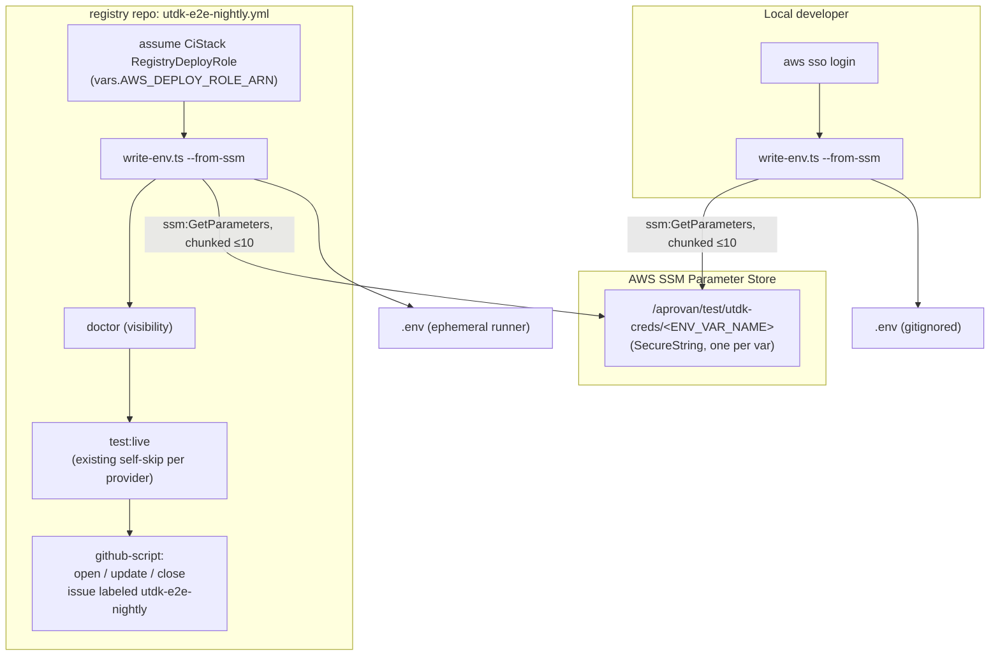

## Context

`@utdk/e2e` (`registry/packages/utdk-e2e`) already has the hard part built: a provider matrix
(`src/matrix.ts`, ~67 credential/fixture env vars across ~50 providers), a credential resolver
(`src/env.ts`), and four flows (`src/flows.ts`: generation / direct / gateway / store) that share
one probe definition per provider. `scripts/write-env.ts` generates `.env.example` from the
matrix so the variable list can never hand-drift; `scripts/doctor.ts` reports readiness without
spending an API call. `tests/generation.test.ts` (280 assertions, zero credentials) is already
the CI merge gate — unchanged by this plan.

What's missing is a credential *source* other than a hand-filled local `.env`, and a scheduler to
run the live flows unattended. `core/infra/aws/src/stacks/ci.ts`'s `CiStack` already provisions a
GitHub OIDC provider and a `RegistryDeployRole` (`vars.AWS_DEPLOY_ROLE_ARN` in the registry repo)
that three existing workflows (`registry-deploy.yml`, `workspace-image.yml`,
aprovan's `web.yml`) already assume via `aws-actions/configure-aws-credentials`. That role's
`ReadDeployParameters` statement already grants `ssm:GetParameter`/`ssm:GetParameters` on
`arn:aws:ssm:*:<account>:parameter/aprovan/*` — a wildcard that already covers a new
`/aprovan/test/utdk-creds/*` path with no CDK change.

`@aprovan/node` (core repo) has a parallel-looking but functionally distinct mechanism:
`getAprovanEnv`/`loadAprovanEnv` reads one blob SecureString (`/aprovan/<env>/env`, dotenv-formatted)
for the *deployed product's* runtime config. This plan deliberately does not reuse it — see D2 and D4.

## Goals / Non-Goals

**Goals:**
- A deterministic, table-driven SSM parameter naming convention requiring no second source of
  truth beyond `src/matrix.ts` (which already drives `.env.example` generation).
- `write-env.ts --from-ssm` usable identically by a human (`aws sso login`) and by CI (OIDC role)
  — one code path, two callers.
- A nightly workflow whose job can fail internally (bad SSM read, live probe failure) without
  ever failing the *workflow trigger's* relationship to a PR — because it isn't wired into PRs at
  all.
- Zero new IAM/CDK surface.

**Non-Goals:**
- Extending the credential model to support two-header auth (Datadog/Plaid — pre-existing gap,
  README finding 5) or path-embedded auth (Telegram) — orthogonal to credential *sourcing*.
- Building the seeded-test-tenant gateway-flow variant — blocked on WS-4.
- Any change to `src/matrix.ts` provider entries, `src/flows.ts` flow logic, or
  `tests/generation.test.ts`.

## Architecture



Components:
- **`src/ssm-env.ts`** (new) — single responsibility: given a list of env-var names, return the
  subset SSM has values for. No knowledge of the matrix, no knowledge of dotenv format.
- **`scripts/write-env.ts`** (extended) — gains `--from-ssm [--force]`; unchanged in every other
  mode. Still the single writer of `.env`/`.env.example`.
- **`.github/workflows/utdk-e2e-nightly.yml`** (new) — orchestration only; all credential and
  test logic stays in the package, not duplicated into workflow YAML.
- **`CiStack`** (core repo, unchanged) — already provides everything this plan needs.

## Decisions

### D1: Flat per-variable parameter naming vs. provider-nested paths
- **Choice**: `/aprovan/test/utdk-creds/<ENV_VAR_NAME>`, flat, name identical to the env var.
- **Alternatives**: `/aprovan/test/utdk-creds/<provider>/<VAR>` — rejected. Env-var-to-provider
  is not 1:1: three Google vars serve twelve providers, two gateway vars serve none. A nested
  scheme needs a second mapping table that duplicates `src/matrix.ts`'s own credential-key
  derivation — recreating exactly the "hand-maintained scaffold drifts" problem
  `env:scaffold` was built to avoid.
- **Revisit if**: the flat namespace (currently ~67 parameters) becomes unwieldy to browse in the
  SSM console — prefer adding SSM resource tags over introducing path nesting.

### D2: One SecureString per variable vs. one blob (mirroring `@aprovan/node`'s pattern)
- **Choice**: one SecureString per variable.
- **Alternatives**: a single blob parameter (dotenv-formatted, parsed like
  `/aprovan/<env>/env`) — rejected. It centralizes ~67 independent third-party secrets behind one
  parameter: any read decrypts all of them (bigger blast radius on a leak), and rotating one
  provider's key means a read-modify-write of the whole blob with no per-secret access
  boundary. The extra API calls from per-variable fetches are cheap at this scale and frequency
  (nightly + occasional local runs).
- **Revisit if**: parameter count grows enough to threaten SSM's default per-account parameter
  limit (10,000 standard-tier — far off) or GetParameters call volume becomes a real rate-limit
  concern.

### D3: `GetParameters` (exact names, chunked) vs. `GetParametersByPath` (recursive)
- **Choice**: `ssm:GetParameters`, chunked to ≤10 names per call (the AWS-imposed cap), using the
  exact name list the matrix already computes.
- **Alternatives**: `GetParametersByPath(Recursive: true)` — rejected solely on IAM grounds:
  it's a distinct action `CiStack`'s deploy role does not currently grant, so using it would
  require a CDK change + stack redeploy before this workstream's code could run in CI at all.
  `GetParameters` is already covered by the role's existing grant against the `/aprovan/*`
  resource wildcard. The script already knows every name it needs (same list `write-env.ts` uses
  today to render `.env.example`), so "recursive discovery" adds no information — it would only
  add the ability to silently pick up a parameter under the prefix that no code var references,
  which is not a capability this design wants.
- **Revisit if**: the credential set becomes ad hoc / dynamically discovered rather than
  matrix-driven — not expected; `src/matrix.ts` is the deliberate single source of truth.

### D4: New minimal SSM call vs. depending on `@aprovan/node`
- **Choice**: `@utdk/e2e` calls `@aws-sdk/client-ssm` directly (in `src/ssm-env.ts`), independent
  of `@aprovan/node`.
- **Alternatives**: import `@aprovan/node` for its existing `SSMClient` usage — rejected.
  `@aprovan/node` lives in the `core` repo, which the same decision record (item 4) says
  *dissolves* into aprovan this refactor pass; the registry repo's stated cross-repo rule is
  "consumption only via published npm, one direction (aprovan → registry)" — pulling a
  core-repo package into the registry repo for one `SSMClient({})` call inverts that direction
  and couples WS-7 to a package mid-dissolution. `@aprovan/node`'s loader also solves a different
  problem (one blob, product runtime config) — see D2.
- **Revisit if**: post-dissolution, a genuinely shared "typed SSM parameter fetch with retry"
  utility emerges as worth factoring into a real shared package; not justified for one call site
  today.

### D5: Failure reporting via `actions/github-script` vs. a third-party issue-management action
- **Choice**: inline JS in `actions/github-script` (GitHub-maintained, `GITHUB_TOKEN`-scoped, no
  new secret) calling Octokit to search/create/comment/close, keyed on the `utdk-e2e-nightly`
  label.
- **Alternatives**: a third-party action (e.g. an "create-issue-if-not-exists" action) —
  rejected to avoid pinning an unreviewed external action for logic this small; `github-script`
  is already trusted infrastructure with no additional supply-chain surface.
- **Revisit if**: issue-management logic grows complex enough (per-provider issues, auto-triage,
  cross-linking) to justify a dedicated, unit-tested script module.

### D6: Doctor as a reporting step vs. a shell-level conditional gate
- **Choice**: `doctor` always runs and its output is captured for context; `test:live` always
  runs afterward and relies on its existing per-provider skip-on-missing-credential behavior
  (`flows.ts` already treats a missing credential/fixture as `skip`, not `fail`).
- **Alternatives**: parse `doctor`'s stdout table to decide whether to invoke `test:live` at
  all — rejected. It's fragile text-parsing of a human-readable table for a saving of a few
  seconds of `vitest run` startup, and it would lose the run's baseline "0 ready" signal from the
  Actions log, which is itself a useful early-warning that SSM provisioning regressed (Task 3 in
  tasks.md not done yet, or values got wiped).
- **Revisit if**: `test:live`'s startup cost becomes material even with everything self-skipping.

## Interfaces & Data

**SSM parameter contract**
- Name: `/aprovan/test/utdk-creds/<ENV_VAR_NAME>` (exact match to the `.env.example` key)
- Type: `SecureString`
- Value: the raw secret string only — no `KEY=VALUE` wrapping (the name already encodes the key)
- KMS key: default `alias/aws/ssm` (assumption, PRD Open Question 3)

**`write-env.ts` CLI contract**
- `pnpm --filter @utdk/e2e env:scaffold` — unchanged, writes `.env.example` from the matrix.
- `pnpm --filter @utdk/e2e env:scaffold -- --env` — unchanged, writes `.env` if absent.
- `pnpm --filter @utdk/e2e env:scaffold -- --from-ssm [--force]` — **new**. Resolves the full
  variable-name list from the matrix (same derivation `render()` already uses), fetches them via
  `src/ssm-env.ts`, writes `.env` (refusing to overwrite unless `--force`, matching `--env`'s
  existing guard).
- Exit codes: `0` on success, including when every parameter comes back empty (valid
  partially-filled state — same contract as today's manual scaffold). Non-zero only on an SSM
  API/auth failure (`AccessDenied`, expired session, throttling exhausted) — this is
  distinguished from "parameter absent" so a broken AWS session doesn't masquerade as "every
  provider unready."

**`src/ssm-env.ts` module contract** (new)
```ts
export interface SsmEnvOptions {
  client?: SSMClient;              // default: new SSMClient({})
  parameterPrefix?: string;        // default: "/aprovan/test/utdk-creds/"
}

/** Fetch whichever of `names` have a value in SSM. Chunks to <=10 names per
 *  GetParameters call. Returns only names that had a value — callers treat
 *  absence as "blank", not as an error. Throws only on an API/auth failure. */
export function fetchFromSsm(
  names: string[],
  options?: SsmEnvOptions,
): Promise<Record<string, string>>;
```

**Nightly workflow ↔ GitHub issue contract**
- Label: `utdk-e2e-nightly` (created if absent on first use).
- Title: stable, not date-stamped (`UTDK nightly E2E — live probe failures`) — the issue is
  reused across runs via comments, not recreated per day.
- Body/comment: run date, workflow-run URL, and a table of `{provider, flow, reason}` for every
  failed test — parsed from vitest's `--reporter=json --outputFile=live-results.json` output
  (`testResults[].assertionResults[]` with `status: "failed"`, `fullName`, `failureMessages`).
- Close comment: `"✅ green again as of <date> — closing."` then `state: closed`.

## Risks / Trade-offs

- [Two-header providers (Datadog, Plaid) still can't be expressed] → Mitigation: pre-existing gap
  (README finding 5), explicitly out of scope; the SSM convention faithfully mirrors the current
  single-var-per-slot model rather than papering over it.
- [~67 vars / 10-per-call cap means ~7 `GetParameters` calls per fetch] → Mitigation: negligible
  latency at nightly + occasional-local frequency; far under SSM's default throttle (40 TPS for
  `GetParameters`).
- [Real secrets land on an ephemeral runner's disk as `.env` during the job] → Mitigation:
  GitHub-hosted runners are fresh, isolated, and destroyed post-job; `.env`/`.env.*` are
  git-ignored (`!.env.example` is the only exception) so accidental commit is structurally
  prevented; `write-env.ts` never logs values, only the write path.
- [KMS decrypt assumption unverified] → Mitigation: PRD Open Question 3; verify with a manual
  `aws ssm get-parameter --with-decryption` as part of Task 3 (owner action) before relying on it
  nightly.
- [New `issues: write` permission on this workflow] → Mitigation: scoped to the job's
  `GITHUB_TOKEN` (run-scoped, not a PAT), requested only in this one workflow file.

## Rollout

1. Land `src/ssm-env.ts` + `write-env.ts --from-ssm` + unit tests (mocked `SSMClient`) — additive,
   doesn't touch the existing `.env.example`/`--env` code paths.
2. Add `.github/workflows/utdk-e2e-nightly.yml` with `workflow_dispatch` only (no `schedule:`
   trigger yet) so the issue open/update/close logic can be exercised manually against a
   controlled failure before it's unattended.
3. Owner action (Task 3, tasks.md): populate `/aprovan/test/utdk-creds/*` for at least a handful
   of providers; confirm `vars.AWS_DEPLOY_ROLE_ARN` is set on the registry repo (already required
   by `registry-deploy.yml`).
4. Manually dispatch the workflow; confirm doctor visibility, live-suite behavior, and the full
   issue lifecycle (open → update → auto-close) end to end.
5. Add the `schedule:` cron trigger once step 4 is verified.
6. Rollback: delete the workflow file or its `schedule:` trigger — nothing else in the repo
   depends on this workflow running.

## Open Questions

Carried from the PRD (technical framing):
- Exact cron expression — proposed `0 8 * * *`, no technical constraint found either way.
- Whether the tracking issue should auto-assign — proposed no, label-only.
- KMS key choice for the SecureStrings — proposed default `alias/aws/ssm`; revisit only if the
  owner wants tighter per-secret IAM boundaries later (would need a `CiStack` change).
