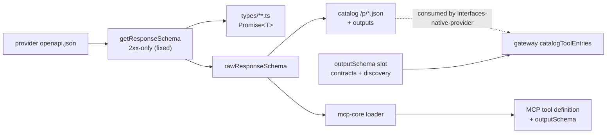

## Context

Everything needed already exists and is disconnected.

**Extraction works but selects wrongly.** `bundler/src/openapi.ts` has two near-identical functions — `getResponseSchema` (dereferenced) and `getRawResponseSchema` (`$ref`s preserved) — that sort responses 2xx-first, `default` last, then return the *first schema found*. A `204` has no `content`, so the walk continues into the 4xx entry and returns its body. Result: 286 operations (github 173, launchdarkly 61, elevenlabs 18, jira 13, …) declare an error type they can never return, because `client.ts:507` throws on any non-OK response.

**Coverage is already high.** 9,581 of 11,495 operations have concrete return types; zero are `any`, `void`, or `never`. Of the 1,914 `unknown`s, 635 are digitalocean alone — an un-bundled spec whose operations are external `$ref`s to `resources/**/*.yml`, so not one of its operations has a `responses` object.

**The richest artifact is built and discarded.** `apps/registry/src/lib/registry.ts:694-709` constructs `outputs: Record<statusCode, { description, schema }>` per operation — full per-status response schemas, errors included — declares it on the type, and no code reads it. The catalog endpoint's `OperationInfo` carries `parameters` and `requestBodyFields` only, which is exactly why the gateway's `catalogToolEntries()` hardcodes `outputSchema: undefined`.

**The slot does not exist.** Every contract's `*ToolEntries` helper declares its return as `Array<{ name; description; inputSchema }>` — there is nowhere to put an output schema even for contracts that know their result types. `registry-server`'s discovery relabelling has the same gap.

**MCP is one line away.** `mcp-core/src/loader.ts` sets `inputSchema` from `tool.inputs` and ignores `tool.outputs`, which is on the same object.

## Goals / Non-Goals

**Goals:** make the slot exist; fix extraction; publish schemas as data; light up MCP; write the envelope contract down once.

**Non-Goals:** the 117 platform operations; contract divergences; error modelling; inventing schemas the upstream spec omits.

## Architecture



- **extraction** — one deduplicated function, 2xx-only, explicit no-content result.
- **catalog endpoint** — gains the already-built `outputs` map.
- **mcp-core loader** — passes `tool.outputs` through.
- **the slot** — added to nine contract helpers and to discovery relabelling; consumed later by `interfaces-native-provider`.

## Decisions

### D1: Serve from the catalog, do not emit a `tools` export
- **Choice**: add `outputs` to the catalog endpoint's `OperationInfo` and serve the map already built in `lib/registry.ts`.
- **Alternatives**: *Emit a `tools` export into each generated package* — lost on cost: it regenerates 38 packages for a large diff, and the gateway's provider path almost always falls back to the catalog anyway. *Read `openapi.json` at runtime* — lost; up to 12 MB per provider, and the client deliberately avoids pinning those documents in the module registry.
- **Revisit if**: a consumer needs output schemas without network access to the catalog.

### D2: Deduplicate the two extractors
- **Choice**: `getResponseSchema` and `getRawResponseSchema` become one function parameterised by whether to dereference.
- **Alternatives**: *Fix both separately* — lost; they already drifted into the same bug twice, which is the argument.
- **Revisit if**: dereferenced and raw extraction need to diverge in selection, not just in resolution.

### D3: No-content is a distinct outcome, not a missing schema
- **Choice**: a 2xx with no content yields an explicit "no value" return type, aligning the type with `client.ts`'s `204`/`205` → `undefined`.
- **Alternatives**: *Leave it `unknown`* — lost because it is not unknown; it is known to be nothing, and conflating them makes coverage unmeasurable.
- **Revisit if**: a provider returns a body on `204` in violation of its spec.

### D4: Streaming gets a marker, not a schema
- **Choice**: mark streaming operations; do not attempt an output schema.
- **Alternatives**: *Schematise the stream's element type* — lost because the gateway bypasses the envelope entirely for streams and the response shape depends on the runtime value, not the operation identity.
- **Revisit if**: streaming responses become uniformly typed.

### D5: The envelope contract is an ADR, not a comment
- **Choice**: record once that an output schema describes the value inside `data`, that errors are out of band, and that two divergent unwrap implementations exist and must converge.
- **Alternatives**: *Document per consumer* — lost; that is the current state, and it produced two different unwrap rules (a two-key guard in the widget bridge, an unconditional `body.data` in the web client).
- **Revisit if**: the envelope changes shape.

## Interfaces & Data

Tool-entry slot, added to nine contract helpers and to discovery relabelling:
```
{ name, description, inputSchema, outputSchema?, streaming? }
```

Catalog operation shape, extended:
```
OperationInfo { …existing…, outputs?: Record<statusCode, { description, schema }>, responseUnknown?: boolean }
```

Extraction result:
```
{ kind: "schema", schema } | { kind: "no-content" } | { kind: "unknown" } | { kind: "streaming" }
```
Making the four outcomes distinct at the type level is what prevents a fifth fall-through bug.

## Risks / Trade-offs

- **Regenerating 38 provider packages changes 286 declared return types** → these are types no runtime path can produce; a diff review filtered to operations whose only 2xx is `204` should be empty of surprises.
- **The catalog gains response schemas and grows** → `outputs` is already computed; measure the served payload delta before and after, and paginate or trim by status code if it regresses.
- **digitalocean depends on an upstream spec being re-bundlable** → sequence it last and independently; the other 88.2% does not wait on it.
- **The `outputSchema` slot lands with no producer in this repo** → intentional; `interfaces-native-provider` is the consumer, and shipping the slot early is what lets the two changes proceed in parallel.

## Rollout

1. Add the slot to the nine contract helpers and to discovery relabelling. No behavior change.
2. Write the envelope ADR.
3. Deduplicate and fix extraction; add the four-outcome result type.
4. Regenerate provider packages; review the 286 changed return types.
5. Extend the catalog endpoint with `outputs`; render a "Returns" section in the catalog UI.
6. Wire `tool.outputs` through the MCP loader and meta-tools.
7. Re-bundle digitalocean, independently.

Each step is independently revertable; none changes runtime behavior of a provider call.

## Open Questions

- **Should the two divergent unwrap implementations converge in this change or in `tools-global`?** Recommendation: document the divergence here in the ADR, converge the code in `tools-global`, which already owns the widget bridge.
- **Does the catalog need per-status-code output, or only the selected 2xx schema?** Recommendation: serve the full map. It is already built, and error shapes become useful the moment error modelling is attempted.
