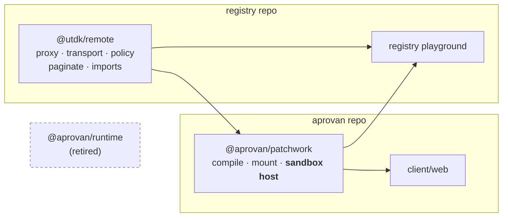

## Context

`@aprovan/runtime` (registry repo, v0.1.0, 1,139 lines across 8 files) splits cleanly along a line its package boundary does not follow:

| module | lines | pure? |
|---|---|---|
| `proxy.ts` | 72 | yes — deep callable Proxy → dotted path |
| `transport.ts` | 141 | yes — `POST {base}/tools/{ns}/{op}`, no credentials in the sandbox |
| `policy.ts` | 195 | yes — timeout / retry / rate-limit, per-call > per-provider > global |
| `paginate.ts` | 87 | yes |
| `imports.ts` | 101 | yes — specifier → provider + path |
| `sandbox.ts` | 298 | **no** — `document.body`, `HTMLElement`, iframe `srcdoc` |

`sandbox.ts`'s own header says it speaks "the same one patchwork's widget iframes speak" as the compiler's `mount/iframe.ts`. Two implementations, one protocol.

It is a declared dependency of `client/web` and imported by nothing there. The registry playground is its only real consumer.

## Goals / Non-Goals

**Goals:** one proxy, one protocol host, a standalone `@utdk/remote`, `@aprovan/runtime` gone.

**Non-Goals:** call syntax (owned by `tools-global`), type delivery, new Aprovan packages.

## Architecture



- **`@utdk/remote`** — the five pure modules. Zero DOM, zero `@aprovan` deps. Sole owner of the namespace proxy.
- **`@aprovan/patchwork`** — absorbs `sandbox.ts`, merging it with `mount/iframe.ts` into one protocol host. Sole owner of sandbox creation.
- **registry playground** — consumes both, replacing its `@aprovan/runtime` import.

## Decisions

### D1: Split rather than absorb wholesale
- **Choice**: five pure modules → `@utdk/remote`; `sandbox.ts` → the widget runtime; retire the package.
- **Alternatives**: *Absorb all six into `@utdk/remote`* — lost because it puts an iframe-creating DOM module inside a package widget code imports, which is both a bundling and a trust problem. *Keep `@aprovan/runtime` as a shared base under both* — lost because the scope inversion is the defect being fixed, and a third layer adds a version to keep in step for no gain.
- **Revisit if**: a non-browser host needs the sandbox protocol without the widget runtime.

### D2: The widget runtime owns sandbox creation
- **Choice**: merge `sandbox.ts` into `mount/iframe.ts`; one host implementation, used by both the product and the playground.
- **Alternatives**: *Leave both* — lost because they already drift; only one of them mirrors console output to the parent. *A third `@aprovan/sandbox-web` package* — lost because the widget runtime is already the only thing that mounts iframes.
- **Revisit if**: the playground's sandbox needs semantics the widget mount must not have.

### D3: Cross-repo landing order
- **Choice**: publish `@utdk/remote` first, then switch consumers, then delete `@aprovan/runtime` in a follow-up commit once nothing resolves it.
- **Alternatives**: *Atomic cross-repo change* — impossible; the repos have separate lockfiles and publish workflows.
- **Revisit if**: the repos merge.

## Interfaces & Data

`@utdk/remote` public surface, carried over unchanged from `@aprovan/runtime` so consumers move by changing a specifier:

```
createNamespaceProxy(namespace, transport, pathPrefix?, options?)
createRuntimeGlobals(dependencies, transport)
createGatewayTransport({ baseUrl, getToken, getWorkspaceId, fetchImpl })
instrument(transport, emit)
withPolicy(transport, policy)
parseScriptDependencies(source)
allPages(...), paginate(...)
types: Transport, RuntimeManifest, RuntimeDependency, RuntimeEvent,
       RuntimeTimeoutError, TransportError
```

`createNamespaceProxy` gains the depth-0 call signature that `tools-global` D2 requires; that is the only behavioral change to the moved code.

Sandbox host contract (in the widget runtime), unchanged on the wire:
```
parent → child : { type: "widget-code", code, origin }
child  → parent: { type: "widget-ready" | "widget-mounted" | "widget-error" | "widget-resize" | "widget-log" }
child  → parent: { type: "service-call",   id, payload: { namespace, procedure, args } }
parent → child : { type: "service-result", id, payload: { result } | { error } }
```

## Risks / Trade-offs

- **Cross-repo sequencing** → publish-then-consume-then-delete, per D3; the intermediate state is a published package nobody imports yet, which is harmless.
- **Merging two sandbox hosts loses a behavior present in only one** (console mirroring is in the compiler's; `runScriptInSandbox` has policy integration the compiler's lacks) → enumerate both feature sets before merging and keep the union.
- **The playground is a public page** → land its switch behind the same lazy import boundary it already uses, so a failure surfaces as a playground error rather than a site-wide one.
- **`@utdk/remote` gains the depth-0 call signature before `tools-global` ships** → additive; a node that was previously non-callable becoming callable breaks nothing.

## Rollout

1. Create `@utdk/remote` in the registry repo with the five modules; add to the publish workflow; publish.
2. Move `sandbox.ts` into the widget runtime and merge with `mount/iframe.ts`, keeping the union of both feature sets.
3. Switch the widget runtime's internal proxy usage to `@utdk/remote`.
4. Switch the registry playground to `@utdk/remote` plus the widget runtime's sandbox host.
5. Delete `packages/runtime` from the registry repo; remove from the publish workflow; drop the dependency from `client/web/package.json`.

Rollback: unpublishing is not required — leaving `@aprovan/runtime@0.1.0` on the registry is harmless once nothing depends on it.

## Open Questions

- **Should `@utdk/remote` be published at `0.1.0` or `1.0.0`?** Recommendation: `0.1.0`. The surface is about to be exercised by three consumers for the first time; a major version implies a stability commitment not yet earned.
- **Does `imports.ts` still belong here once `tools-global` replaces specifier parsing with `tools.`-access scanning?** Recommendation: keep it in this change and let `tools-global` retarget it in place; splitting the move from the retarget makes both diffs readable.
