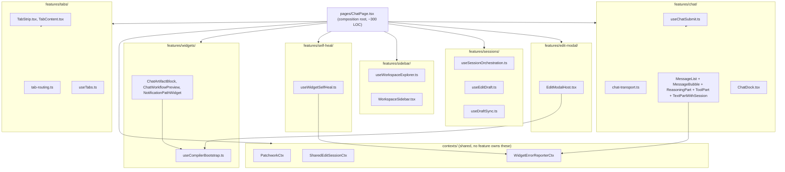

## Context

`client/web/src/pages/ChatPage.tsx` (3,264 lines) is the entire aprovan chat app: one
component with no router, owning tab routing (`native://`/`app://`/`workflow://`), chat
transport + message rendering, the widget-compile pipeline, a self-heal loop that
auto-retries failing widgets, the sidebar/workspace explorer, and session/draft
orchestration. It is imported by nothing and imports from four header/nav components
(`ServicesMenu`, `SidebarApps`, `SessionBar`, `NotificationsBell` — all one-directional,
none import back from ChatPage) plus nine self-contained native panels hosted via
`components/panels/shell.tsx`'s `PanelHostProvider`/`PanelTabs`.

Three component sources exist in `client/web`: vendored shadcn copies at
`components/ui/*.tsx` (8 files), `@aprovan/ui` (published from `core/`, only its subpath
exports — `/auth`, `/gateway`, `/shell`, `/apps-store` — are actually imported; the bare
root specifier with `Button`/`Badge`/`Input`/`Card*`/`Separator` is never imported), and
`@aprovan/registry-ui` (only `/apps-panel`, `/renderers`, `/tailor` subpaths; its
apps-catalog surface is a pass-through re-export of `@aprovan/ui/apps-store`, not an
independent implementation). There is no real name collision in active use — the vendored
`components/ui/*` set is the only primitive source `client/web` actually consumes.

No automated test suite runs against ChatPage; the only mechanical check is `tsc` (baked
into `client/web`'s `build` script: `tsc && vite build`). This plan treats that build plus
manual smoke-testing against `ux.md`'s flows as the verification gate.

## Goals / Non-Goals

**Goals:**
- Decompose ChatPage into a composition root (≤ ~300 LOC) plus feature modules, each with a
  single named responsibility, none exceeding ~500 LOC.
- Zero behavior change — every extraction is a pure move (state/effects/callbacks relocated,
  not rewritten), verified by `tsc` at every step plus the `ux.md` smoke checklist at
  work-stream boundaries.
- One documented, mechanically-checkable rule for which of the three component sources a new
  import comes from.
- Rebrand root package name, README, and workspace globs — scoped to naming/docs.

**Non-Goals:**
- No new features, bug fixes, or UX changes bundled in.
- No renaming of `@aprovan/patchwork-*` sub-packages (deferred to WS-4).
- No deletion of `@aprovan/ui`'s unused root exports (lives in `core/`, dissolves under WS-4).
- No changes to the nine native panels' internals or to `panels/shell.tsx`'s public contract.
- No router library introduction — the existing tab-path scheme remains the in-app router.
- No changes inside WS-1's territory (`packages/bobbin/**`, `packages/mcp-app-server/**`,
  `packages/compiler/src/vfs/**`).

## Architecture



Every subgraph is a directory under `client/web/src/features/<name>/`. `contexts/` holds
only context objects + their hook accessors (`useCompiler`, `useServices`,
`useSharedEditSession`) — kept separate so features can consume a context without importing
the feature that happens to provide its value, avoiding circular imports. `ChatPage.tsx`
becomes the only file that imports from every feature: it wires their hooks together,
provides the contexts, and renders the shell layout (header slot, sidebar, tab strip, chat
dock, edit modal) — no business logic of its own beyond composition.

## Decisions

### D1: Feature-folder decomposition over one flat `hooks/`+`components/` split
- **Choice**: Group by concern (`features/tabs/`, `features/sessions/`, etc.), each folder
  mixing its hooks and components, over either (a) one `ChatPage.tsx` split purely into
  `hooks/useX.ts` files with all JSX staying inline, or (b) a flat `components/chat/*.tsx` +
  `hooks/*.ts` split with no feature grouping.
- **Alternatives**:
  - *(a) Hooks-only extraction, JSX stays in ChatPage*: rejected — the file would still be
    ~1,500+ LOC of JSX (tab strip, chat dock, sidebar, session bar wiring, edit modal) even
    with all logic in hooks; doesn't hit the ≤300 LOC composition-root goal.
  - *(b) Flat `hooks/`+`components/` with no feature grouping*: rejected — with ~9 hooks and
    ~10 components extracted, a flat listing loses the “what talks to what” information the
    section map in the research pass already established (tabs, chat, widgets, self-heal,
    sidebar, sessions are genuinely separable concerns with different state lifetimes).
- **Revisit if**: a feature folder's hook/component pairing turns out tightly coupled to
  another feature's internals in practice (signals the boundary was drawn wrong), or the
  team later adopts a stricter public-API-per-folder convention (e.g. `index.ts` barrel +
  ESLint import boundary) that this plan doesn't mandate.

### D2: Self-heal loop extracted as its own feature, not folded into `features/widgets/`
- **Choice**: `features/self-heal/useWidgetSelfHeal.ts` is a standalone hook consuming
  `messages`/`status`/`sendMessage` from the chat feature and `recentProblemsDigest` from
  `lib/telemetry`, exposing the `WidgetErrorReporterCtx` value.
- **Alternatives**: folding it into `features/widgets/` (it's about widget failures) —
  rejected because its actual behavior (watch chat status, gate on send-window, budget-limited
  auto-retry via `sendMessage`) is a chat-orchestration concern more than a widget-rendering
  concern; it reads `useChat()` output directly and writes back into it. Keeping it separate
  also makes the ≤2-per-message budget and the arm/reset-on-user-send contract independently
  testable/reviewable (this is the one piece of logic in ChatPage with real behavioral
  subtlety — see `ux.md`'s "Self-heal a failing widget" flow).
- **Revisit if**: self-heal logic needs to react to widget-pipeline internals beyond the
  reporter callback (e.g. per-widget-type retry strategies), at which point it may belong
  inside `features/widgets/` after all.

### D3: `contexts/` as a shared top-level directory, not per-feature
- **Choice**: `PatchworkCtx`, `SharedEditSessionCtx`, `WidgetErrorReporterCtx` live in
  `client/web/src/contexts/`, imported by whichever features provide or consume them.
- **Alternatives**: defining each context inside the feature that "owns" it (e.g.
  `WidgetErrorReporterCtx` inside `features/self-heal/`) — rejected because `TextPartWithSession`
  (chat feature) is both the primary consumer and where widgets actually mount, so the
  context would be imported cross-feature either way; centralizing avoids deciding a
  somewhat arbitrary "ownership" question per context and prevents accidental circular
  imports between `features/chat` and `features/self-heal`.
- **Revisit if**: the app grows enough contexts that a flat `contexts/` folder becomes a
  dumping ground — not expected at this scale (3 contexts).

### D4: `@/components/ui/*` is canonical for all app-shell primitives; `@aprovan/ui` root
  export is never imported bare
- **Choice**: Codify (as a spec requirement, checked by code review / a follow-on lint rule)
  that any new primitive UI need (`Button`, `Badge`, `Input`, `Card`, `Separator`, etc.) in
  `client/web` imports from `@/components/ui/*`, never from the bare `@aprovan/ui` specifier.
  Existing subpath imports (`@aprovan/ui/auth`, `/gateway`, `/shell`, `/apps-store`) are
  unaffected — they're not primitive-component imports and have no vendored equivalent.
- **Alternatives**:
  - *Standardize on `@aprovan/ui`'s root export, delete the 8 vendored files*: rejected —
    `@aprovan/ui` lives in `core/`, which is mid-dissolution into `aprovan` under WS-4;
    taking a new hard dependency on it now (today it's dead-but-declared) works against
    that move, and the vendored copies are already what's live and tested.
  - *Do nothing (leave both live, undocumented)*: rejected — this is exactly the ambiguity
    the PRD calls out; leaving it undocumented guarantees the next engineer picks whichever
    autocomplete suggests first, regrowing the duplication WS-8 exists to remove.
- **Revisit if**: WS-4 relocates `@aprovan/ui` into this repo and the team decides to
  collapse the vendored copies into it at that point — natural follow-up, not this change.

### D5: Rebrand scope is root package name + README + workspace glob only
- **Choice**: `package.json`'s root `name` (`@aprovan/patchwork-workspace` →
  `@aprovan/aprovan-monorepo`; `@aprovan/workspace` is ruled out — that npm name belongs to
  the registry's workspace app, which WS-4 relocates into this monorepo, and a duplicate
  package name would break pnpm), `README.md`'s framing (title, opening description —
  package-name references inside it stay accurate to current, unrenamed package names), and
  `pnpm-workspace.yaml`'s dead `apps/**` glob removal. Nothing else.
- **Alternatives**: renaming all `@aprovan/patchwork-*` sub-packages now — rejected per PRD
  Non-Goals (touches every import site across 3 repos, collides with WS-4's move and WS-1's
  deletions of `patchwork-mcp`/parts of `patchwork`).
- **Revisit if**: WS-4 lands and the sub-package names still say "patchwork" with no plan to
  address it — file a follow-up then.

## Interfaces & Data

These are the seams between work streams — two streams can build opposite sides without
talking, as long as they honor the shapes below.

**Context shapes** (`client/web/src/contexts/index.ts` or split files, unchanged from today):
```ts
// PatchworkCtx — compiler + namespace registry, read by every widget-mounting site
interface PatchworkContext {
  compiler: Compiler | null;
  namespaces: /* existing shape from lib/namespaces.ts */;
  services: ServiceInfo[];
}
const useCompiler: () => Compiler | null;
const useServices: () => ServiceInfo[];

// SharedEditSessionCtx — opens the shared EditModal from anywhere in the tree
const useSharedEditSession: () => (path: string) => void;

// WidgetErrorReporterCtx — widgets report failures upward to self-heal
type WidgetErrorReporterCtx = (messageId: string, error: unknown) => void;
```

**`features/tabs/tab-routing.ts`** (pure functions, no React — moved verbatim from
ChatPage L733–797, unchanged signatures):
```ts
const APP_TAB_PREFIX = "app://";
const WORKFLOW_TAB_PREFIX = "workflow://";
function isAppsTabPath(path: string): boolean;
function isVirtualTabPath(path: string): boolean; // apps OR native (imports NATIVE_TAB_PREFIX from lib/native-surfaces)
function appsTabPath(appName: string, workflowName?: string): string;
function parseAppsTabPath(path: string): { app: string; workflow?: string } | null;
function tabLabel(path: string): string;
interface OpenTab { path: string; /* existing shape */ }
```

**`features/tabs/useTabs.ts`** (owns `openTabs`, `activeTabPath`, persistence):
```ts
function useTabs(): {
  openTabs: Map<string, OpenTab>;
  activeTabPath: string | null;
  openAppsTab(appName: string, workflowName?: string): void;
  openNativeTab(surfaceId: string): void;
  retitleAppsTab(oldPath: string, newPath: string): void;
  closeTab(path: string): void;
  setActiveTab(path: string): void;
};
```

**`features/self-heal/useWidgetSelfHeal.ts`** (consumes chat feature's output, exposes the
reporter):
```ts
function useWidgetSelfHeal(args: {
  messages: UIMessage[];
  status: ChatStatus;
  sendMessage: (msg: /* existing shape */) => void;
}): {
  reportWidgetError: WidgetErrorReporterCtx;
  armSendWindow(): void; // called from handleSubmit on a real user send
};
```

**`features/sessions/useSessionOrchestration.ts`** (the largest extraction — CRUD + action
handlers, unchanged external behavior toward `SessionBar`'s existing callback props):
```ts
function useSessionOrchestration(args: {
  activeWorkspaceId: string;
  panelHostActions: /* existing shape */;
}): {
  sessions: ChatSessionInfo[];
  activeSession: ChatSessionInfo | null;
  sessionBusy: boolean;
  sessionNotice: string | null;
  peers: PresencePeer[];
  syncState: WorkspaceSyncState;
  mergeState: /* existing shape */;
  handlers: {
    onNew(): void; onSwitch(id: string): void; onApply(): void; onDiscard(): void;
    onReset(): void; onDelete(): void; onSync(): void; onMergeResolved(): void;
    onSessionModeChange(mode: SessionMode): void; onOpenSessionWindow(): void;
  };
};
```
This shape must satisfy `SessionBar`'s existing prop contract unchanged (`SessionBar.tsx`
is explicitly "pure presentation" per its own doc comment — no prop renaming allowed).

**Component-source rule** (checkable convention, not a runtime interface): any new `.tsx`
file under `client/web/src` importing a primitive (`Button`, `Badge`, `Input`, `Card*`,
`Avatar*`, `Collapsible*`, `ScrollArea`, `Separator`) does so from `@/components/ui/*`. A
grep for `from "@aprovan/ui"` (bare specifier, no subpath) anywhere in `client/web/src`
should return zero results — this is the mechanical check for D4.

## Risks / Trade-offs

- [Pure-move refactor of 2,400+ lines with no automated test coverage risks silent behavior
  drift] → Mitigation: `tsc` at every work-stream boundary (type errors catch prop/shape
  mismatches at extraction seams) plus the `ux.md` smoke checklist run manually before each
  work stream is marked done; keep diffs to literal cut-paste + import-path fixes wherever
  possible, no "while I'm in here" rewrites.
- [Self-heal loop (D2) has the subtlest behavior of anything extracted — budget counting,
  send-window gating, ref-based dedup] → Mitigation: extract it as one atomic work-stream
  task with a dedicated before/after smoke pass against the "Self-heal a failing widget" flow
  in `ux.md`, not folded into a larger tabs/sidebar extraction PR.
- [Nine work streams touching the same file's extraction risks merge conflicts if run
  concurrently] → Mitigation: `tasks.md` sequences extractions with explicit `Depends-on` so
  each stream's Touches globs don't overlap a file mid-extraction; only the final "wire it
  all into ChatPage.tsx" stream touches the file everyone else has been extracting *from*.
- [Rebrand (D5) touching root `package.json` name could break `workspace:*` references or
  CI scripts keyed on the old name] → Mitigation: grep for `@aprovan/patchwork-workspace`
  repo-wide before renaming (turbo/CI/deploy scripts might reference it); root package name
  is rarely referenced by dependents since it's `"private": true`, but verify before cutting.

## Rollout

Structural refactor with no deploy-time behavior change — no feature flag, no migration.
Order: rebrand (D5, fully independent, do first or last, zero coupling to the rest) can run
in parallel with everything else. Extraction work streams run in dependency order per
`tasks.md` (contexts → tab-routing/self-heal/compiler-bootstrap in parallel → sessions/sidebar
in parallel → final ChatPage.tsx composition-root rewrite, which must be last since it's the
only stream touching the file every other stream reads from). No rollback mechanism needed
beyond normal `git revert` — this is a single PR-sequence within one repo, not a service
deploy.

## Open Questions

- Same as PRD: root package rename target (recommend `@aprovan/aprovan-monorepo`; see PRD
  for why `@aprovan/workspace` is ruled out), and whether the
  missing test suite is in scope (recommend no, out of scope, flagged as follow-up).
- Should the mechanical check for D4 (`grep -c 'from "@aprovan/ui"'` returning zero bare-import
  hits) be wired into CI now, or left as a one-time manual verification for this change? This
  plan defaults to a one-time `tasks.md` verification step, not a new permanent CI gate — a
  permanent gate is a reasonable fast-follow but is itself a small feature addition, arguably
  outside a "pure cleanup" change. Recommend deferring the CI gate; flag if the user wants it
  included now.
